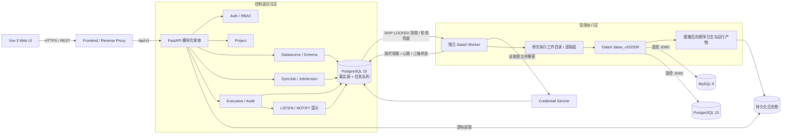
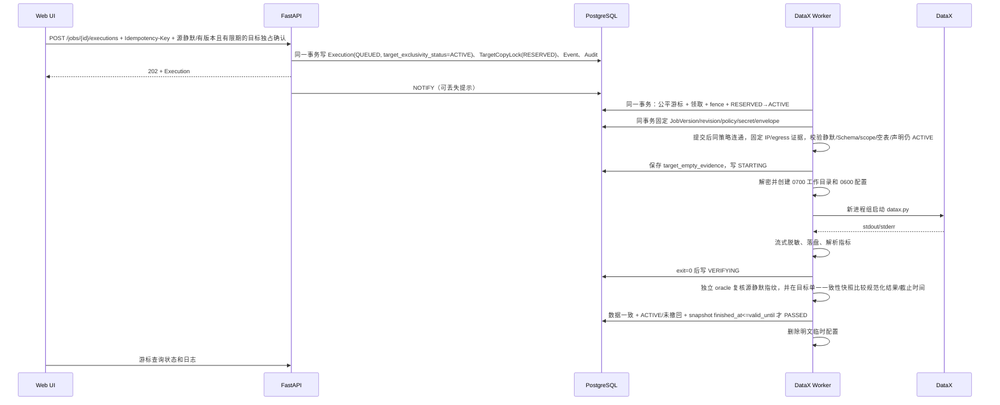
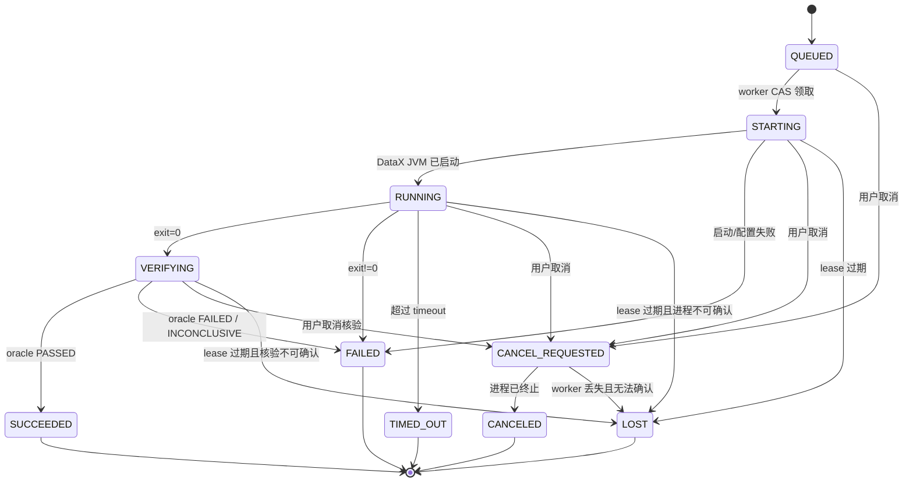

# DataX Enterprise Studio 技术架构设计

> 文档状态：V1.1 实施候选基线；Discovery Gate 未通过，横向开发 `BLOCKED`
>
> 架构版本：1.1
>
> 适用产品版本：V1
> 关联契约：[`04_数据库与领域模型设计.md`](./04_数据库与领域模型设计.md)、[`05_API接口与前后端契约.md`](./05_API接口与前后端契约.md)、[`contracts/openapi.yaml`](./contracts/openapi.yaml)

## 1. 目的与强制范围

本文定义 V1 的组件边界、调用关系、数据流、信任边界、执行隔离、状态机和故障恢复规则。实现若偏离本文，必须先形成 ADR 并同步修改数据、API 和测试契约。

V1 是单组织、多项目的安全一次性离线全量复制控制平台，边界固定如下：

- 支持 MySQL 8 和 PostgreSQL 15，二者均可作为 Reader 或 Writer。
- 支持全量表或选列复制；字段按位置一对一直连映射。
- 源表必须从运行前检查开始到独立 oracle 完成始终静默；平台记录源所有者确认，但不把该确认伪装成数据库快照。
- 目标表必须预先存在且由 Worker 强校验为空；Operator/DBA 必须提交
  `statement_version="1.0"`、`confirmed_at`、`valid_until`、`responsible_party`
  完整的有限期目标外部独占声明，并在知悉窗口被破坏时报告；仅支持 `insert` 写入。
- 人工目标外部独占声明不是技术证明；平台无法检测全部未报告或已经回滚的外部 DML/DDL。
  `TargetCopyLock` 只约束平台内并发。
- 同一不可变 PhysicalEndpointIdentity/TargetNamespace 对应的物理目标表同一时刻只允许
  一个未释放的 `RESERVED/ACTIVE/RECOVERY_REQUIRED` 锁；Datasource 或 revision 别名
  不能绕过目标锁。
- 只支持人工触发；不支持 cron、DAG、补数或事件触发。
- DataX 固定为 `datax_v202309`。
- 单节点、非 HA；控制面和运行面重启后必须正确对账，但不承诺运行中任务跨节点接管。
- 角色固定为 Admin、Developer、Operator、Viewer。
- 禁止自由 SQL、`querySql`、`preSql`、`postSql`、自定义 Transformer、自定义插件和运行时上传 JAR。
- AI、调度、DAG、告警、插件市场、CDC、流式同步不属于 V1。

“实时监控”仅指实时查看正在运行的一次性离线复制，不表示实时数据同步。V1 不提供
增量、覆盖、upsert、断点续传或可重复同步语义。

## 2. 架构原则

1. **控制面与执行面分离**：API 不直接启动 DataX；所有运行请求先持久化，再由独立 worker 执行。
2. **PostgreSQL 是事实源和队列**：Worker 以 `FOR UPDATE SKIP LOCKED` 领取任务，
   `LISTEN/NOTIFY` 只作可丢失提示并由轮询兜底；V1 不依赖 Redis。
3. **版本不可变**：每次 Execution 必须绑定不可变 JobVersion、源/目标
   DatasourceRevision、EndpointPolicyRevision、物理端点/表身份，并在领取事务中固定
   CredentialSecret/Envelope、插件版本和运行时版本。
4. **凭证不进入业务契约**：API、JobSpec、JSON 预览、审计和持久日志不得包含明文密码。
5. **最小执行能力**：V1 仅允许四个内置插件和固定字段映射，不提供任意代码或任意 SQL 执行入口。
6. **结果必须核验**：DataX exit 0 仅进入 `VERIFYING`；独立 oracle 数据比对通过，且
   目标外部独占状态为 `ACTIVE`、未撤回、目标快照在 `valid_until` 前读完后才能
   `SUCCEEDED`。进程状态、数据影响和核验状态分开保存。
7. **失败显式化**：未知进程状态必须收敛为 `LOST`，数据影响不能确定时标为
   `UNKNOWN`，不得把进程退出、日志解析或页面可见伪装成复制成功。
8. **无自动重试**：insert-only 不能保证幂等。Execution 一旦被领取，除
   `SUCCEEDED/CONFIRMED/PASSED` 外任何结果都进入恢复门禁；只有提交处置确认并由独立
   RecoveryProbe 重新证明目标为空，才允许新建 Execution。
9. **权限与网络双重约束**：项目角色不自动授予数据移动权。Admin 管端点、数据源、
   方向授权与精确表/列 scope 的 TransferPolicy，且 Worker 实施 DNS rebinding-safe
   解析和真实出口控制并持久化实际 resolved IP/egress 证据。

## 3. 逻辑架构



### 3.1 V1 部署单元

| 部署单元 | 技术 | 职责 | 禁止承担 |
|---|---|---|---|
| `frontend` | Vue 3、TypeScript、Element Plus、反向代理 | 页面、静态资源、同源 API 转发 | 保存 refresh token、连接数据源 |
| `backend` | FastAPI 模块化单体 | 认证、项目、数据源、Schema、任务版本、执行控制、审计、日志查询 | 直接调用 `datax.py` |
| `postgres` | PostgreSQL 15 | 业务事实源、Execution/RecoveryProbe 队列、持久公平游标、状态机、凭证/Envelope、TargetNamespace 锁、审计元数据 | 保存大体量逐行运行日志 |
| `datax-worker` | Python worker + JDK 8 + Python 3 + DataX `datax_v202309` | 公平领取两类事实、reconciler、预检/恢复探针、临时凭证、DataX 进程树、LogGap、核验、心跳和汇总 | 暴露公网 API、接受任意命令 |
| `log-volume` | 本机持久化卷 | 保存按 Execution/Attempt 分区的脱敏后的原序日志 | 保存明文凭证或未脱敏配置 |

V1 采用模块化单体，不设置独立 API Gateway 微服务。`frontend` 的反向代理承担 TLS 终止与 `/api/v1` 转发。模块间只通过进程内接口交互，模块边界与数据库所有权仍需保持清晰，便于后续拆分。

## 4. 后端模块边界

| 模块 | 所有数据 | 对外能力 |
|---|---|---|
| Auth | User、AuthSession、OrganizationMember、RoleAssignment | 登录、刷新、退出、当前用户、RBAC |
| Project | Organization、Project | 项目创建、归档、成员授权 |
| Datasource | EndpointPolicy/Revision、PhysicalEndpointIdentity、Datasource/Revision、CredentialSecret/Envelope、UsageGrant、精确作用域 TransferPolicy、连接证据 | Admin 管理端点/数据源/授权；受控连通性测试、Schema 探测、密钥轮换/紧急撤销 |
| Plugin | PluginCatalog | 返回四个只读内置插件及能力 |
| Job | SyncJob、JobVersion | 任务元数据、校验、预览、不可变版本 |
| Execution | Execution/Attempt、RecoveryProbe/Attempt、Event、LogArtifact/LogGap、TargetNamespace/CopyLock/RecoveryGate、公平服务游标 | 人工触发、事实队列领取、三轴状态、取消、日志、核验、恢复对账 |
| Audit | AuditEvent、AuditCheckpoint、AnchorPublicKeyring | 安全审计查询、完整性链、公钥轮换和外部签名锚点 |

禁止跨模块直接修改对方表。跨模块写操作通过应用服务完成；Execution 可只读解析 JobVersion 和 Datasource 修订，不能反向修改任务或数据源。

## 5. 核心数据流

### 5.1 登录与项目访问

1. 浏览器通过 HTTPS 提交账号密码。
2. Auth 校验 Argon2id 密码哈希和用户状态。
3. 后端返回短时效 JWT access token，并设置旋转式、`HttpOnly`、`Secure`、`SameSite=Lax` refresh cookie。
4. 每次项目请求校验 RoleAssignment；组织级 Admin 可访问组织内所有项目，其他项目级角色可多选并取权限并集。
5. 登录成功、失败、刷新、退出均写审计事件；审计中不得记录密码或 token。

角色并集不等于数据传输授权。Developer 即使同时拥有 Operator，也只能对显式
DatasourceUsageGrant 和 ACTIVE TransferPolicy 覆盖的方向发布/执行；Admin 管理能力在
服务端独立授权，不能靠隐藏按钮实现。

### 5.2 数据源创建、测试与 Schema 探测

1. 只有 Admin 可以创建或修改 EndpointPolicy、Datasource 及其非秘密连接配置；
   EndpointPolicy 只是显示身份，host/CIDR/port/TLS/TTL/resolver/egress 任何变化都创建
   新的不可变 EndpointPolicyRevision；host、port、database、schema、username、SSL、
   options、policy revision 或物理端点身份变化都创建新的不可变 DatasourceRevision。
2. API 校验引擎、主机、端口、数据库名、用户名、SSL 模式、EndpointPolicy 和组织权限。
3. 连接探针读取引擎原生服务器身份并绑定不可变 PhysicalEndpointIdentity；MySQL 使用
   `server_uuid`，PostgreSQL 使用经批准证明的 `system_identifier`。无法获得可信证明时
   fail closed，不能用 hostname/IP/revision 不同推断为不同物理实例。
4. 密码由 Credential Service 使用版本化 KEK keyring 做信封加密；稳定数据密文位于
   CredentialSecret，DEK 包裹位于可新增的 CredentialSecretEnvelope。数据 AEAD AAD
   不含 KEK 版本；KEK 轮换只重包裹 DEK，轮换密码不改变 DatasourceRevision。
5. Admin 显式向组织成员授予 `SOURCE_USE`、`TARGET_USE`，并批准源 revision 到目标
   revision、精确 catalog/schema/table 和显式允许列的 TransferPolicy scope。
   Developer 只能使用获授权方向/列的数据源，不能新增端点。
6. 连接测试和 Schema 探测由受限 worker 执行，使用只读/最小权限数据库账号并设置
   连接与查询超时。
7. V1 只读取 schema、table、column、ordinal、type、nullable、primary-key、约束、默认
   值、生成列、触发器和外键信息；目标表出现可能改变 insert 结果的未知对象时拒绝发布。
8. JDBC 地址受引擎模板控制，不接受完整自定义 JDBC URL。每个连接阶段固定
   EndpointPolicyRevision，受信 resolver 规范化并校验全部 A/AAAA/CNAME，连接固定到
   已校验 IP 并保持 TLS hostname 校验；Worker 的默认拒绝 egress 规则独立阻断未批准
   地址。连接测试、预检、核验、RecoveryProbe 和正式执行分别保存实际 selected/peer
   IP、DNS TTL、resolver/egress 版本与证据哈希，不能复用过期的一次解析。

### 5.3 任务校验、预览与版本化

1. 前端提交符合 `job-spec.v1.schema.json` 的 JobSpec。
2. 后端执行 JSON Schema 校验和语义校验：
   - source/target 均属于当前项目且未禁用，并解析到明确的不可变 DatasourceRevision；
   - 当前用户拥有相应 `SOURCE_USE`/`TARGET_USE`，且 revision 对应的 TransferPolicy
     为 `ACTIVE`；JobSpec 的两端 catalog/schema/table 与全部 mapping 列均落在 policy
     的精确 `scope_hash` 内；
   - Reader/Writer 与数据源引擎、方向匹配；
   - source 与 target 分别解析到不可变 PhysicalEndpointIdentity 和引擎真实标识符规则；
     `physical_table_identity_hash` 相等即拒绝，不能因 Datasource/revision/hostname
     不同放行；
   - 表存在，目标表预存在且约束画像适合直连 insert；发布时不把“为空”永久冻结为事实；
   - 映射非空，source/target 列分别唯一，类型兼容；
   - 仅 `insert`，无 SQL、Transformer 或未知字段。
3. Preview 生成脱敏后的 DataX JSON；`username` 可脱敏展示，`password` 必须固定显示为 `${SECRET}`，预览不可执行。
4. 创建 JobVersion 时保存规范化 JobSpec、`spec_hash`、源/目标 DatasourceRevision 与
   EndpointPolicyRevision ID、源物理表 hash、目标 TargetNamespace、TransferPolicy
   `scope_hash`、Schema/约束指纹和四个插件/运行时版本，并生成域分离的
   `version_artifact_hash`。版本创建后不可修改或删除。
5. 凭据版本不进入 JobVersion；Worker 在 Execution 领取事务内、任何外部连接前，原子
   固定当时 `ACTIVE` 的 source/target CredentialSecret 及其 ACTIVE Envelope。普通轮换
   不改变连接目的地；紧急 `REVOKED/COMPROMISED` 会禁用对应 Datasource 并终止所有
   引用它的非终态工作。

### 5.4 人工执行



关键一致性规则：

- Execution、`TargetCopyLock=RESERVED`、初始 Event、Audit 和幂等记录必须在一个
  PostgreSQL 事务提交。TargetNamespace 的部分唯一索引在 API 阶段拒绝第二个同目标
  意图。事务提交后可发 `NOTIFY`；通知丢失时 Worker 最多在轮询间隔内发现任务。
- Worker 以持久项目服务游标在 Execution/RecoveryProbe 两类事实间公平选择；Execution
  领取事务创建 Attempt、递增 `fence_epoch`、设置 `active_attempt_id`，把该 Execution
  已有的 TargetNamespace 预留原子转换为 `ACTIVE` 并固定 policy revision、两个 ACTIVE
  secret/envelope。没有匹配 `RESERVED` 预留时不得领取；事务提交前禁止
  DNS/JDBC/DataX 操作。
- Execution 创建接口以 `(actor_id, endpoint_scope, idempotency_key)` 唯一，24 小时内相同请求返回首次结果；同 key 不同请求体返回 `409 IDEMPOTENCY_CONFLICT`。
- 所有 Worker 状态写必须匹配 `active_attempt_id + fence_epoch + lease_token_hash`；0 行
  更新即失租，旧 Worker 必须终止其匹配身份的进程树且不得再写状态。
- Worker 在启动前重新校验源静默确认、TransferPolicy 精确 scope、Schema/约束、
  EndpointPolicyRevision、DNS/egress、`TargetExclusivityConfirmation` 的声明版本/截止
  时间/当前状态和 `COUNT(*)=0`；持久化实际 resolved/peer IP 与出口证据。只有声明为
  `ACTIVE` 且 `revoked_at/reason` 为空才能继续。仅用户勾选“目标为空”不能替代系统
  实测；平台锁也不能证明没有外部 DML/DDL。
- 预检与 oracle 必须使用 JobVersion 固定的 DatasourceRevision 和 Execution 固定的
  CredentialSecret/Envelope 版本，运行中不跟随 current 指针。
- oracle 读取源端规范化结果并比较运行前后静默指纹；目标端必须在一个数据库一致性读
  事务中同时计算 count 与多重集摘要，保存 snapshot mode、事务开始/完成时间和不可逆
  snapshot marker。只有目标声明状态仍为 `ACTIVE`、`revoked_at/reason` 为空且
  `target_result.snapshot_finished_at <= target_exclusivity_confirmation.valid_until` 时才可
  `PASSED`；仅在声明窗口内得到匹配摘要也不能证明未报告或已经回滚的外部 DML/DDL 未曾发生。

### 5.5 一次性复制前提与恢复门禁

一次 Execution 只有满足全部前提才可从 `QUEUED` 进入 `STARTING`：

1. 源所有者确认指定源表从运行前检查开始到独立 oracle 完成停止
   INSERT/UPDATE/DELETE/DDL；请求固定 `confirmed=true`、`confirmed_at` 与可审计备注，
   实际 actor 由认证上下文和审计事件记录。平台明确提示这不是数据库一致性快照；
   核验前后指纹可以发现观测到的变化，但不能证明未报告、瞬时后回滚的源端写入从未发生。
2. 目标所有者提交 `TargetExclusivityConfirmation`，固定包含
   `statement_version="1.0"`、`confirmed_at`、`valid_until`、`responsible_party`，确认
   从 Worker 最后一次空表实测到 oracle 目标一致性快照读完期间没有平台外 DML/DDL。
   平台明确提示 TargetNamespace 锁不能强制外部系统遵守，人工声明不是技术证明。
3. Worker 使用正式运行相同的身份、DNS 和网络策略检查两端 Schema/约束与权限。
4. Worker 对目标表执行安全的 `COUNT(*)` 检查并证明结果为 0；保存时间、revision、
   表指纹、查询结果与证据哈希，并把该时刻作为目标外部独占窗口起点。
5. 源/目标均解析到不可变物理身份，二者 `physical_table_identity_hash` 不相等；本
   Execution 的 TargetNamespace 锁必须已由领取事务从 `RESERVED` 转为匹配当前
   Attempt/fence 的 `ACTIVE`。锁 key 不含 DatasourceRevision，因此换 revision 或端点
   别名不能绕过。
6. JobSpec 的 dirty record count 与 percentage 都必须为 0；任何脏记录立即使进程失败，
   不能依赖随后 oracle 把“容忍丢行”解释为成功。

Execution 创建时目标声明状态为 `ACTIVE`。状态推进前由 Worker/reconciler 按当前事实重新
评估：超过 `valid_until` 写为 `EXPIRED`，原因
`VALIDITY_WINDOW_EXPIRED`；Operator/DBA 知悉声明被撤回、冻结失效或平台外 DML/DDL 时
必须调用 `POST /executions/{execution_id}/target-exclusivity/revoke`，API 原子写
`REVOKED`、`revoked_at/reason` 和审计。未领取执行由 reconciler 取消并释放 `RESERVED`；
已领取执行终止并进入恢复门禁；`VERIFYING` 中的撤回使 oracle
`INCONCLUSIVE/TARGET_EXCLUSIVITY_BROKEN`。终态事实不因时钟继续前进而被改写。

Execution 一旦被 Worker 领取，除 `SUCCEEDED/CONFIRMED/PASSED` 外，任何 `FAILED`、
`TIMED_OUT`、`CANCELED`、`LOST` 或核验不通过都必须根据证据把 `data_effect` 记为
`NONE`、`POSSIBLE`、`CONFIRMED` 或 `UNKNOWN`，并将目标锁统一转为
`RECOVERY_REQUIRED`；若明确未启动 DataX 可记为 `NONE`，但仍不得跳过恢复门禁。
恢复责任人必须在平台外完成必要处置并提交 remediation confirmation；无需清理时如实
记录理由。API 创建独立 `RecoveryProbe(QUEUED)` 事实。Worker 用独立
RecoveryProbeAttempt/lease/fence，在领取事务固定 policy/secret/envelope 后，再按正式
DNS/egress 策略校验同一 TargetNamespace 的 `COUNT(*)=0`。只有 probe
`SUCCEEDED+EMPTY` 能原子关闭门禁；失败、非空、不确定、取消或 LOST 都保持门禁且不自动
重新入队。恢复后再次执行必须创建新 Execution，并提交新的源静默确认以及带新
`confirmed_at/valid_until` 的 `TargetExclusivityConfirmation`。平台不执行
truncate/delete，也不在非空目标上提供“确认风险后继续”入口。

### 5.6 取消

1. API 在同一事务写入 CancelRequest 和审计，并发 PostgreSQL `NOTIFY` 提示；不修改
   Execution 运行态。
2. 内置 reconciler 独立扫描 `QUEUED + PENDING CancelRequest`。若尚无
   `active_attempt_id`，它不领取 Execution、不创建 Attempt，把该 Execution 的
   `RESERVED` 目标预留转为 `RELEASED`，再受控推进
   `CANCEL_REQUESTED → CANCELED/NONE/NOT_STARTED` 并完成请求；Worker 忙于 DataX 时也
   不能让未领取取消永久等待。
3. 已领取执行由当前 fence 所有者确认可取消并原子推进为 `CANCEL_REQUESTED`。
4. worker 向整个 DataX 进程组发送 `SIGTERM`。
5. 10 秒后仍未退出则发送 `SIGKILL`。
6. 进程确认终止并完成日志落盘后，状态进入 `CANCELED`。
7. 已终态执行的取消请求标记为 `REJECTED`，返回 `409 EXECUTION_NOT_CANCELABLE`。
8. 只要 Execution 已领取，无论 DataX 是否启动，取消都进入目标恢复门禁；DataX 已启动
   时 `data_effect` 不得为 `NONE`。
   `CANCELED` 不表示目标端无变化。

## 6. Execution 状态机



| 状态 | 含义 | 唯一写入方 |
|---|---|---|
| `QUEUED` | 已持久化，等待 worker | API |
| `STARTING` | worker 已持 lease，正在准备工作区或启动 JVM | worker |
| `RUNNING` | DataX JVM 已确认运行 | worker |
| `VERIFYING` | DataX exit 0，独立 oracle 正在核验源/目标结果；尚未成功 | worker |
| `CANCEL_REQUESTED` | Worker 已确认取消请求，等待实际终止 | worker |
| `SUCCEEDED` | DataX exit 0 且 oracle 已 `PASSED` | worker |
| `FAILED` | 启动/进程/oracle 失败，或 oracle 无法得出可靠结论 | worker |
| `TIMED_OUT` | 超过 JobSpec 的运行时限并已终止 | worker |
| `CANCELED` | 用户取消且进程已确认终止 | worker |
| `LOST` | lease 过期，无法证明进程仍受控或已正常结束 | reconciler |

终态不可逆。`process_state` 只表达平台工作流，不足以单独描述目标端事实。Execution 同时
保存以下两个正交字段：

| 字段 | 枚举 | 语义 |
|---|---|---|
| `data_effect` | `NONE`、`POSSIBLE`、`CONFIRMED`、`UNKNOWN` | 对目标端影响的可知程度；`CONFIRMED` 表示已测得影响（可为 0 行），不等于内容正确 |
| `verification_state` | `NOT_STARTED`、`VERIFYING`、`PASSED`、`FAILED`、`INCONCLUSIVE` | 独立 oracle 的执行和结论 |

强制关系：

- DataX 未启动且预检失败：`data_effect=NONE`、`verification_state=NOT_STARTED`；若
  Execution 已被领取，恢复后再次执行仍须通过恢复门禁和最新空表复检。
- DataX 启动后异常退出、取消、超时或失联：不得使用 `NONE`；根据证据记录
  `POSSIBLE/CONFIRMED/UNKNOWN`。若独立 oracle 从未启动，
  `verification_state=NOT_STARTED`；只有 oracle 已启动但无法形成可靠结论时才为
  `INCONCLUSIVE`。
- DataX exit 0：`process_state=VERIFYING`、`verification_state=VERIFYING`。
- oracle 数据一致，且目标声明仍为 `ACTIVE`、未撤回，并满足
  `target_result.snapshot_finished_at <= valid_until`：
  `SUCCEEDED + CONFIRMED + PASSED`。
- oracle 发现差异：`FAILED + CONFIRMED + FAILED`。
- oracle 启动前不可用：`FAILED + POSSIBLE/UNKNOWN + NOT_STARTED`；oracle 已启动后自身
  失败、源静默失效、目标声明 `REVOKED/EXPIRED`、快照越过 `valid_until` 或无法形成可靠快照：
  `FAILED + POSSIBLE/UNKNOWN/CONFIRMED + INCONCLUSIVE`。

日志汇总解析状态单独记录为 `summary_parse_status`；它不能替代 oracle，也不能把
Execution 推进到 `SUCCEEDED`。

## 7. DataX 运行与隔离契约

### 7.1 固定运行时

- DataX：`datax_v202309`。
- Java：JDK 8；Python：Python 3。
- 发布清单必须固定基础镜像 digest、JDK/Python 补丁版本、DataX 包 SHA-256 和四个插件 JAR SHA-256。
- 允许插件仅为 `mysqlreader`、`mysqlwriter`、`postgresqlreader`、`postgresqlwriter`。
- `datax-runtime` 目录与镜像必须保留 Apache 2.0 `LICENSE`、`NOTICE` 和第三方许可证清单。

### 7.2 每次执行工作区

路径为 `/var/lib/datax-studio/runs/{execution_id}/{attempt_no}`，要求：

- 目录权限 `0700`，临时 DataX JSON 权限 `0600`。
- 运行用户为不可登录、非 root 的专用 UID。
- 进程使用独立 process group/cgroup；Attempt 记录 host boot ID、PID、PID start time、
  PGID、cgroup/container identity、lease token 哈希和 fence epoch。
- reconciler 只有在 boot ID、PID start time 和 cgroup identity 全部匹配时才可对进程
  发信号，不能只凭可重用的 PID/PGID。
- runtime 与插件目录只读；工作区和日志目录可写。
- 配置文件只通过参数数组传给 `datax.py`，禁止 shell 字符串拼接。
- CPU、内存、打开文件数、进程数、工作区大小和 timeout 由容器/cgroup 限制。
- 明文配置在进程结束或启动失败后立即删除；reconciler 同时清理超过保留窗口的残留工作区。
- lease 续租或任一条件状态写返回 0 行时，Worker 必须停止日志/状态写入、终止身份匹配
  的进程树并记录本机最小故障证据；旧 fence 不能覆盖新 Attempt。

### 7.3 DataX JSON 生成

生成器只接受已校验 JobSpec，不接受原始 DataX JSON。生成结果固定包含：

- 一个 Reader、一个 Writer；
- 显式 source/target column 数组，顺序与 mappings 一致；
- `setting.speed.channel`；
- `setting.errorLimit.record=0` 与 `setting.errorLimit.percentage=0`；
- Writer `writeMode` 为 `insert`；
- 运行时解析出的用户名和密码。

生成器不得输出 `querySql`、`where`、`preSql`、`postSql`、Transformer、自定义 JVM 参数或未知插件参数。

### 7.4 日志与敏感信息

- 对外统一术语为“脱敏后的原序日志”：worker 同时读取 stdout/stderr，在合并读取点分配
  单调递增 sequence；“原序”只承诺平台观察到的合并顺序，不表示未脱敏原始字节。
- 在写磁盘、数据库事件或推送给 API 之前先脱敏。
- 每个流式片段分别累计 `raw_received_bytes`（脱敏前只计数）、
  `redacted_received_bytes`（脱敏后截断前）、`stored_bytes` 和 `dropped_bytes`；满足
  `dropped = redacted_received - stored`。raw 与 redacted 可因占位符长度变化而增减，
  不能用差值推断 secret。
- 脱敏规则至少覆盖密码、token、Authorization、JDBC 用户信息和已解密 secret 的精确值。
- 原始未脱敏流不得落盘。
- DataX 最终统计解析器绑定运行时版本；保存记录数、失败数、字节、速度、开始/结束时间和退出码。
- 日志游标为不透明字符串，只表达 Execution、Attempt 和下一 sequence；客户端不得解析或自行构造。
- 单行超过上限时保存脱敏后的头尾诊断窗口；单 Execution 达到上限后进入尾部环形窗口。
  每次 `LINE_LIMIT/EXECUTION_LIMIT/RING_EVICTION/SOURCE_READ_ERROR/DECODE_ERROR/
  REDACTION_FAILURE/STORAGE_FAILURE/FENCE_LOST` 都追加 LogGap，记录相邻 sequence、四类
  字节计数、原因和证据哈希。
- 任一 LogGap 设置 `log_incomplete=true`；限额类 Gap 同时设置
  `log_truncated=true`、首次截断 sequence。API、UI 和导出必须持续显示“不完整日志”及
  原因，不能把分块数量、游标耗尽或 `has_more=false` 表述为完整；丢弃内容不可恢复。

## 8. 信任边界与威胁控制

| 边界 | 主要风险 | V1 控制 |
|---|---|---|
| 浏览器 → frontend/backend | token 窃取、越权、注入 | HTTPS、CSP、JWT、HttpOnly refresh cookie、RBAC、请求校验 |
| backend → PostgreSQL | 凭证泄漏、越权状态写 | API/Worker 独立账号、私有网络、最小表/函数权限、TLS |
| PostgreSQL → worker | 重复领取、通知丢失、项目饥饿、错误恢复 fence | 两类事实 SKIP LOCKED、持久项目 cursor、TargetNamespace 唯一锁、Execution/Probe 独立 fence；轮询兜底 |
| worker → DataX | 命令注入、残留 JVM、资源耗尽 | 参数数组、进程组/cgroup、进程身份、非 root、timeout、只读 runtime |
| worker → 外部数据库 | SSRF、DNS rebinding、别名绕锁、横向访问、数据外传 | 不可变 policy/物理身份、精确表列 scope、全解析/selected-peer IP 证据与 pinning、真实 egress、固定插件、最小账号 |
| 插件与制品 | 恶意 JAR、供应链漂移 | 固定版本、SHA-256、只读镜像、无上传入口、SBOM |
| 日志与审计 | secret 泄漏、缺口/截断隐瞒、同库篡改/换钥 | 先脱敏、四计数/LogGap、精确 checkpoint 前像、公钥 keyring/双签轮换、外部锚点、保留策略 |

完整资产、攻击者、滥用路径、剩余风险和发布证据见
[`security/THREAT_MODEL.md`](./security/THREAT_MODEL.md)。新增网络、SQL、插件、文件或 AI
执行能力前必须更新该模型。

## 9. 故障恢复与对账

| 故障 | 恢复行为 | 对外结果 |
|---|---|---|
| API 在事务提交前失败 | 整体回滚 | 客户端可用同一幂等键重试 |
| API 提交后、NOTIFY 前失败 | Worker 轮询 PostgreSQL 找到 `QUEUED` | 仍只有一个 Execution |
| PostgreSQL NOTIFY 丢失/Worker 重启 | 有界轮询重新发现任务 | Execution 不丢失，最多增加一个轮询间隔 |
| 未领取 QUEUED 收到取消 | reconciler 独立 CAS 终结，不创建 Attempt，并释放 `RESERVED` 目标预留 | `CANCELED/NONE/NOT_STARTED`，无恢复门禁 |
| worker 领取前失败 | 行锁事务回滚；其他轮询可领取 | 不产生 Attempt |
| worker 领取后失租 | 条件写被 fence 拒绝；按完整进程身份终止；reconciler 对账 | `LOST`，目标进入恢复门禁 |
| DataX 退出非 0 | 保存日志、退出码和数据影响，终止/确认进程树 | `FAILED`，目标进入恢复门禁 |
| DataX exit 0、oracle 失败 | 保存差异或不可判定证据 | `FAILED`，不得标记复制成功 |
| DataX 超时 | 终止进程组并保存日志/数据影响 | `TIMED_OUT`，目标进入恢复门禁 |
| worker/JVM 不可确认 | lease 到期，以 boot ID/PID start/cgroup 验证；只终止匹配进程 | `LOST`，不伪装为成功 |
| 后端重启 | 从 PostgreSQL 恢复状态、队列和幂等记录 | API 状态连续 |
| 日志解析器失败 | 保存脱敏后的原序日志和解析错误 | 不影响 oracle；`summary_parse_status=FAILED` |
| 磁盘空间不足 | 尝试终止执行并写最小事件；ready check 失败 | `FAILED` 或 `LOST`，停止领取新任务 |
| RecoveryProbe 失租/失败/非空 | 独立 probe fence 拒绝旧写，保存连接/空表证据 | gate 保持，绝不借 ExecutionAttempt 关闭 |

V1 不会为 `FAILED`、`TIMED_OUT`、`CANCELED` 或 `LOST` 自动再次执行，也不允许“接受重复风险后继续”。
有权限用户必须完成恢复流程；独立 RecoveryProbe 以自身 fence 复核目标为空并关闭
`RECOVERY_REQUIRED` 后，新的幂等请求才能创建新的 Execution。已 `SUCCEEDED` 的一次性
复制因目标非空，不能对同一 TargetNamespace 再次执行。

## 10. 可观测性

### 10.1 关联标识

从 API 到 worker 和日志必须贯通：

- `request_id`
- `project_id`
- `job_id`
- `job_version_id`
- `execution_id`
- `attempt_id`
- `fence_epoch`
- `worker_id`

### 10.2 指标

后端至少暴露：

- API 请求量、延迟、4xx/5xx。
- Execution 三轴状态数量、项目/全局排队时间、最老 `QUEUED` 年龄和阻断原因。
- Execution/RecoveryProbe 各自的 SKIP LOCKED 领取延迟、空轮询、NOTIFY 提示数/疑似漏
  提示数、持久项目服务序号/欠服务时长、未领取取消收敛时长、锁等待和连接池状态。
- 活动/恢复中 TargetNamespace 锁、RecoveryProbe 结果/失租、目标空表预检失败、oracle
  失败/不确定数量。
- EndpointPolicy/DNS/egress/TransferPolicy 拒绝数。

worker 至少暴露：

- 心跳、正在运行数、领取失败数。
- DataX 启动失败、退出码和取消耗时。
- 记录数、失败记录数、字节数、记录/字节速度。
- Execution/RecoveryProbe lease/fence 拒绝、进程清理、CPU、内存、磁盘余量，日志
  raw/redacted/stored/dropped 字节与 LogGap 原因。
- 审计外部锚点年龄、签名/公钥 keyring 失败，KEK keyring/Envelope 重包裹/secret 紧急
  撤销状态。

V1 不提供用户告警功能，但 readiness 检查失败必须可被部署平台检测。

## 11. 健康检查

- `/health/live`：进程事件循环可响应，不检查外部依赖。
- `/health/ready`：检查 PostgreSQL、数据库迁移、版本化 KEK keyring、审计签名公钥
  keyring、日志卷可写、水位 admission、外部锚点未超过 24 小时和最近 worker 心跳。
  Redis 不属于 V1 检查项。
- worker readiness：检查 DataX 自检配置、JDK/Python、插件校验和、DNS/egress enforcement、
  工作区、日志卷和可执行的围栏探针。
- 任一关键校验失败时停止接收新执行，但不粗暴终止已有运行。

## 12. 单节点部署与非 HA 声明

V1 的 Docker Compose 部署只允许一个 backend 和一个 DataX worker 实例。PostgreSQL、
日志卷与版本化 KEK keyring 必须持久化并分离备份。`LISTEN/NOTIFY` 不需持久化，轮询
始终是正确性路径。

DataX worker 的 `max_parallel_executions` 默认且最低验收值为 1；达到上限时新执行保持 `QUEUED`。部署可以调高到经资源评审的值，但必须重新完成资源、隔离、取消和稳定性验收，不能仅修改配置后沿用原验收结论。

V1 不保证：

- backend、PostgreSQL 或 worker 的自动故障转移；
- 运行中 DataX Job 跨节点恢复；
- 零停机升级；
- 跨机房容灾。

升级时必须停止领取新任务、等待或取消现有运行、备份、执行数据库迁移、升级应用和运行时、完成自检后恢复服务。详细字段、保留与迁移规则见 `04_数据库与领域模型设计.md`。

### 12.1 V1 容量包络与公平性

默认验收包络不是各轴可同时取最大值。推荐主机的 200 GiB 可用 SSD 先按以下预算验收，
备份必须在外部介质，不占此盘：

| 预算 | 大小 |
|---|---:|
| 系统、镜像、固定 Runtime | 30 GiB |
| PostgreSQL（含索引/审计/WAL 水位） | 40 GiB |
| 30 天脱敏日志 | 60 GiB |
| 活动工作区与临时文件 | 20 GiB |
| 不可分配安全保留 | `max(20% × D_total, 40 GiB)`，默认 40 GiB |
| 未分配机动 | 10 GiB |

组合验收分为两档，不能把两档峰值相乘后仍声称在默认主机内：

| 维度 | 轻量控制档 | 大表复制档 |
|---|---:|---:|
| 24 小时 Execution | 最多 200 | 最多 20 |
| 单 Execution 源规模 | 10 万行或 512 MiB | 100 万行或 5 GiB |
| 调度服务时间预留 | 6 分钟 | 60 分钟 |
| 30 天平均 stored log/Execution | 不超过 10 MiB | 硬上限 100 MiB |

两档混合时必须同时满足：

```text
rolling_24h_service_seconds =
  Σ max(profile_reservation_seconds, observed_p95_for_profile) <= 20 hours

retained_log_bytes =
  Σ execution.log_stored_bytes within retention <= 60 GiB

sustainable_executions_per_day <=
  floor(60 GiB / (30 days × observed_average_stored_log_bytes))
```

因此 100 MiB 日志硬上限全部打满时，30 天保留下最多约支持 20 次/天；200 次/天只适用于
平均保存日志不超过 10 MiB 的轻量档。源数据不在平台落盘，不能把 5 GiB 源表直接计入
持久日志预算；工作区仍按每个活动槽 1 GiB 预留。其他固定上限为：20 个活跃项目、1,000
个已发布 JobVersion、200 个普通 `QUEUED` Execution、单行映射后 1 MiB、并发 DataX=1、
轮询 5 秒带抖动。未知/缺失源统计按大表档准入。

准入使用持久化水位，不靠 Worker 进程内猜测：

- `effective_free = filesystem_free - active_log_reservations - active_workspace_reservations`。
- 绿色：日志预算 `<80%` 且 `effective_free >= 40 GiB`，可接收并领取满足组合公式的工作。
- 黄色：日志预算 `80%..90%` 或 `30 GiB <= effective_free < 40 GiB`，停止接收普通新 Execution；
  已排队任务仅在领取后仍不低于 30 GiB 时运行，RecoveryProbe 以 64 MiB 独立预留优先。
- 红色：日志预算 `>90%` 或 `effective_free <30 GiB`，停止一切新领取并使 worker
  readiness 失败；reconciler 仍处理未领取取消、失租和清理，不把水位故障伪装成成功。
- 普通队列达到 200，或按服务时间预留计算的 projected eligible backlog 超过 8 小时，
  新运行请求返回 `503 CAPACITY_ADMISSION_BLOCKED`，安全 details.reason 仅允许
  `QUEUE_LIMIT/BACKLOG_LIMIT/DISK_YELLOW/DISK_RED/LOG_BUDGET`；既有事实不删除、不自动
  降优先级。

公平性通过数据库中的项目服务序号持久化：先选 `last_service_sequence` 最小的 eligible
项目，再按 `class_priority, queue_priority DESC, queued_at ASC, id ASC` 选
Execution/RecoveryProbe；只有成功领取才推进 cursor。阻断任务不消耗序号；同项目同时
有 eligible Execution 时，连续 RecoveryProbe 不得超过 1。

容量档内队列 SLO 为：有空闲槽时事实发现 P99 ≤ 10 秒；eligible Execution 等待
P95 ≤ 2 小时、P99 ≤ 8 小时；eligible RecoveryProbe 等待 P95 ≤ 1 小时、P99 ≤ 2 小时；
未领取取消收敛 P99 ≤ 10 秒。阻断时间不混入 eligible SLO，但必须按 reason 单独展示；
任一 8 小时违约自动停止普通新执行准入，直到 backlog 恢复。提高任一上限前必须重新
完成磁盘、数据库、取消、两类 fence、oracle 和跨项目公平性验收。

## 13. 架构验收门槛

1. API 进程中不存在直接启动 `datax.py` 的代码路径。
2. NOTIFY 丢失、重复提示和轮询并发下，同一 Execution 最多启动一个 DataX 进程。
3. backend、PostgreSQL、worker 分别重启后，状态可收敛且不存在永久 `RUNNING/VERIFYING`
   或未处置的孤儿 JVM。
4. 所有 Execution 均可追溯到 JobVersion、两个 DatasourceRevision/EndpointPolicyRevision、
   PhysicalEndpointIdentity/TargetNamespace、两个 CredentialSecret/Envelope、resolved
   IP/egress 证据、插件校验和、DataX 版本和 oracle 证据。
5. 在数据库、API 响应、预览、脱敏日志和审计中检索不到明文凭证。
6. 任意未在白名单内的插件、SQL、Transformer 或未知 JobSpec 字段均被拒绝。
7. `SIGTERM` 后 10 秒内未退出的进程组会被 `SIGKILL`，最终状态与事件完整。
8. PostgreSQL 提交成功但 NOTIFY 未发送/丢失时，Execution 仍在一个轮询间隔内被发现。
9. DataX exit 0 只能进入 `VERIFYING`；只有数据一致、目标声明为 `ACTIVE`、
   `revoked_at/reason` 为空且 `target_result.snapshot_finished_at <= valid_until` 时，
   oracle 才可形成
   `SUCCEEDED + CONFIRMED + PASSED`。
10. 目标非空、物理源/目标表相同、缺少有效源静默确认、目标声明版本错误/已撤回/已过期、
    存在 TargetNamespace 活动/恢复锁、TransferPolicy 精确 scope 不匹配、secret 非 ACTIVE
    或连接证据失效时均 fail closed，且不启动 DataX。TargetCopyLock 仅验证平台内串行，
    不能作为未报告或已回滚外部 DML/DDL 未发生的证据。
11. lease 丢失后旧 fence 的心跳、事件和终态写入均更新 0 行；PID 重用不会导致误杀。
12. 日志解析失败不影响 oracle；每个日志缺口有 LogGap，raw/redacted/stored/dropped
    计数守恒，截断在 API/UI/下载持续可见且丢弃内容不宣称可恢复。
13. DNS rebinding、混合允许/禁止解析结果和容器级未授权出站均被阻断。
14. 审计 checkpoint 的 `DXAUDITCHECKPOINTv1` 签名前像可逐字节重建，公钥 keyring
    常规轮换连续；旧 KEK/Envelope 可在恢复演练中解密保留期内备份。
15. RecoveryProbe 由独立事实队列/Attempt/fence 关闭门禁，ExecutionAttempt 无法替代；
    领取后的任何非唯一成功结果都保留恢复门禁。
16. 未领取取消由 reconciler 在 SLO 内收敛；重启后持久公平游标不重置，容量包络内跨
    项目任务不会被单一项目永久饥饿。
17. 默认 200 GiB 主机同时满足存储公式、水位 admission、轻量/大表组合档和队列 SLO；
    超水位时 fail closed。
18. 单节点、一次性离线全量复制和非 HA 限制在 README、部署文档和产品界面中一致。
