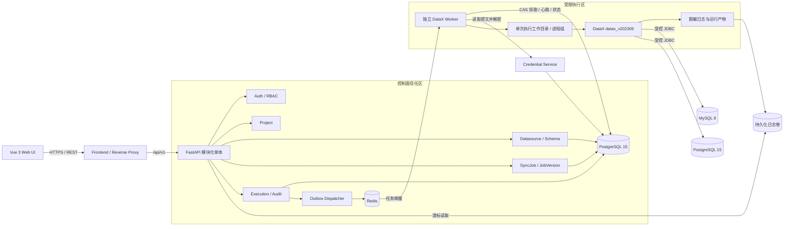
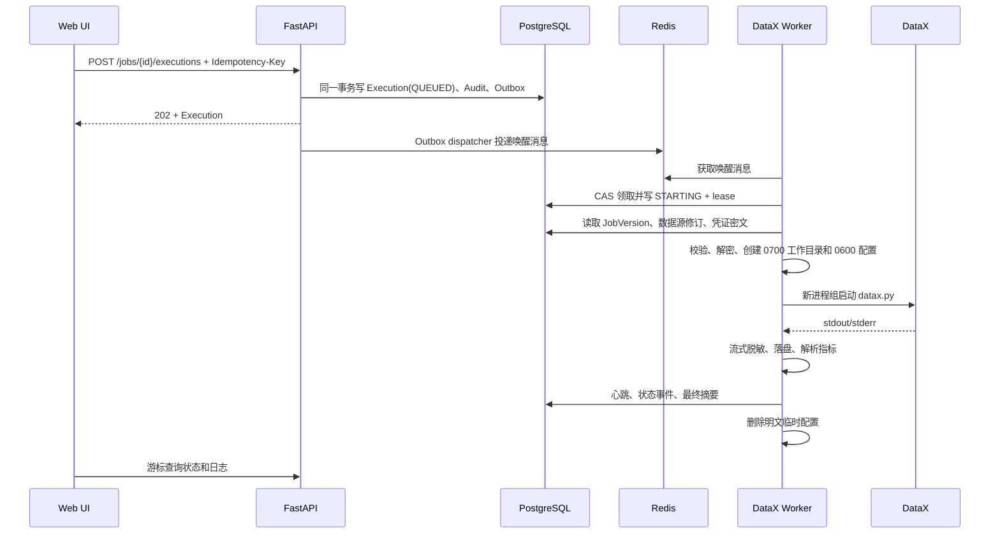
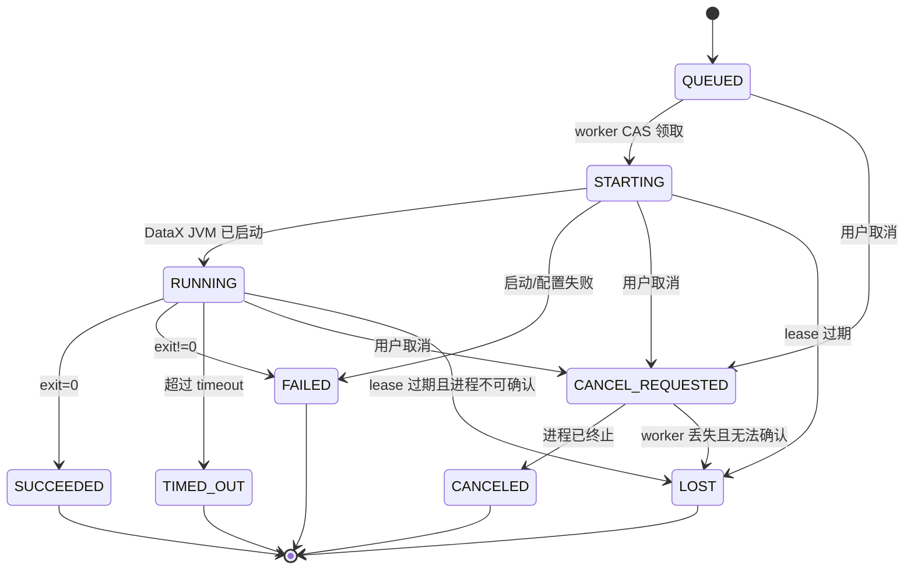

# DataX Enterprise Studio 技术架构设计

> 文档状态：V1 实施基线
>
> 架构版本：1.0
>
> 适用产品版本：V1
> 关联契约：[`04_数据库与领域模型设计.md`](./04_数据库与领域模型设计.md)、[`05_API接口与前后端契约.md`](./05_API接口与前后端契约.md)、[`contracts/openapi.yaml`](./contracts/openapi.yaml)

## 1. 目的与强制范围

本文定义 V1 的组件边界、调用关系、数据流、信任边界、执行隔离、状态机和故障恢复规则。实现若偏离本文，必须先形成 ADR 并同步修改数据、API 和测试契约。

V1 是单组织、多项目的离线批同步控制平台，边界固定如下：

- 支持 MySQL 8 和 PostgreSQL 15，二者均可作为 Reader 或 Writer。
- 支持完整表或选列同步；字段按位置一对一直连映射。
- 目标表必须预先存在，仅支持 `insert` 写入。
- 只支持人工触发；不支持 cron、DAG、补数或事件触发。
- DataX 固定为 `datax_v202309`。
- 单节点、非 HA；控制面和运行面重启后必须正确对账，但不承诺运行中任务跨节点接管。
- 角色固定为 Admin、Developer、Operator、Viewer。
- 禁止自由 SQL、`querySql`、`preSql`、`postSql`、自定义 Transformer、自定义插件和运行时上传 JAR。
- AI、调度、DAG、告警、插件市场、CDC、流式同步不属于 V1。

“实时监控”仅指实时查看正在运行的离线批任务，不表示实时数据同步。

## 2. 架构原则

1. **控制面与执行面分离**：API 不直接启动 DataX；所有运行请求先持久化，再由独立 worker 执行。
2. **PostgreSQL 是事实源**：任务状态、幂等记录、审计和待投递事件以 PostgreSQL 为准；Redis 不是事实源。
3. **版本不可变**：每次 Execution 必须绑定不可变 JobVersion，并记录数据源修订号、插件版本和运行时版本。
4. **凭证不进入业务契约**：API、JobSpec、JSON 预览、审计和持久日志不得包含明文密码。
5. **最小执行能力**：V1 仅允许四个内置插件和固定字段映射，不提供任意代码或任意 SQL 执行入口。
6. **失败显式化**：未知状态必须收敛为 `LOST`，不得长期停留在 `RUNNING`，也不得把日志解析失败伪装成任务失败。
7. **默认不自动重试**：insert-only 不能保证幂等，V1 失败或丢失后由有权限用户创建新的 Execution。

## 3. 逻辑架构

### 3.1 V1 部署单元

| 部署单元 | 技术 | 职责 | 禁止承担 |
|---|---|---|---|
| `frontend` | Vue 3、TypeScript、Element Plus、反向代理 | 页面、静态资源、同源 API 转发 | 保存 refresh token、连接数据源 |
| `backend` | FastAPI 模块化单体 | 认证、项目、数据源、Schema、任务版本、执行控制、审计、日志查询 | 直接调用 `datax.py` |
| `postgres` | PostgreSQL 15 | 业务事实源、状态机、凭证密文、幂等、Outbox、审计元数据 | 保存大体量逐行运行日志 |
| `redis` | Redis | 任务唤醒和短期队列传输 | 作为 Execution 状态事实源 |
| `datax-worker` | Python worker + JDK 8 + Python 3 + DataX `datax_v202309` | 领取 Execution、注入临时凭证、启动/终止进程组、日志脱敏、心跳和汇总 | 暴露公网 API、接受任意命令 |
| `log-volume` | 本机持久化卷 | 保存按 Execution/Attempt 分区的脱敏原始日志 | 保存明文凭证或未脱敏配置 |

V1 采用模块化单体，不设置独立 API Gateway 微服务。`frontend` 的反向代理承担 TLS 终止与 `/api/v1` 转发。模块间只通过进程内接口交互，模块边界与数据库所有权仍需保持清晰，便于后续拆分。

## 4. 后端模块边界

| 模块 | 所有数据 | 对外能力 |
|---|---|---|
| Auth | User、AuthSession、OrganizationMember、RoleAssignment | 登录、刷新、退出、当前用户、RBAC |
| Project | Organization、Project | 项目创建、归档、成员授权 |
| Datasource | Datasource、CredentialSecret | CRUD、连通性测试、Schema 探测 |
| Plugin | PluginCatalog | 返回四个只读内置插件及能力 |
| Job | SyncJob、JobVersion | 任务元数据、校验、预览、不可变版本 |
| Execution | Execution、Attempt、Event、LogArtifact、Outbox | 人工触发、状态、取消、日志、对账 |
| Audit | AuditEvent | 安全审计查询和完整性链 |

禁止跨模块直接修改对方表。跨模块写操作通过应用服务完成；Execution 可只读解析 JobVersion 和 Datasource 修订，不能反向修改任务或数据源。

## 5. 核心数据流

### 5.1 登录与项目访问

1. 浏览器通过 HTTPS 提交账号密码。
2. Auth 校验 Argon2id 密码哈希和用户状态。
3. 后端返回短时效 JWT access token，并设置旋转式、`HttpOnly`、`Secure`、`SameSite=Lax` refresh cookie。
4. 每次项目请求校验 RoleAssignment；组织级 Admin 可访问组织内所有项目，其他项目级角色可多选并取权限并集。
5. 登录成功、失败、刷新、退出均写审计事件；审计中不得记录密码或 token。

### 5.2 数据源创建、测试与 Schema 探测

1. API 校验引擎、主机、端口、数据库名、用户名、SSL 模式和项目权限。
2. 密码由 Credential Service 使用外部注入的主密钥做信封加密；业务表只保存 secret 引用。
3. 数据源响应永不返回密码，更新时空密码表示“不改变原密码”。
4. 连接测试和 Schema 探测由受限 worker 执行，使用只读/最小权限数据库账号并设置连接与查询超时。
5. V1 只读取 schema、table、column、ordinal、type、nullable、primary-key 元数据；不执行用户提供的 SQL。
6. JDBC 地址受引擎模板控制，不接受完整自定义 JDBC URL；生产网络通过出口规则限制可访问网段。

### 5.3 任务校验、预览与版本化

1. 前端提交符合 `job-spec.v1.schema.json` 的 JobSpec。
2. 后端执行 JSON Schema 校验和语义校验：
   - source/target 均属于当前项目且未禁用；
   - Reader/Writer 与数据源引擎、方向匹配；
   - source 与 target 不能是同一 Datasource 下规范化后的同一 schema、同一 table；
   - 表存在、目标表预存在；
   - 映射非空，source/target 列分别唯一，类型兼容；
   - 仅 `insert`，无 SQL、Transformer 或未知字段。
3. Preview 生成脱敏后的 DataX JSON；`username` 可脱敏展示，`password` 必须固定显示为 `${SECRET}`，预览不可执行。
4. 创建 JobVersion 时保存规范化 JobSpec、SHA-256、Schema 指纹和四个插件/运行时版本。版本创建后不可修改或删除。

### 5.4 人工执行

关键一致性规则：

- API 必须先提交 PostgreSQL 事务，再由 Outbox dispatcher 投递 Redis。
- Redis 消息只携带 Execution ID，不携带凭证或完整 JobSpec。
- worker 通过 PostgreSQL compare-and-set 从 `QUEUED` 领取；重复消息不会重复启动任务。
- Execution 创建接口以 `(actor_id, endpoint_scope, idempotency_key)` 唯一，24 小时内相同请求返回首次结果；同 key 不同请求体返回 `409 IDEMPOTENCY_CONFLICT`。
- worker 在启动前重新做一次运行时语义校验，并记录实际使用的数据源修订和 credential secret 版本。

### 5.5 取消

1. API 写入 CancelRequest、Outbox 和审计，但不修改 Execution 运行态。
2. worker 收到请求后确认当前状态可取消，并原子推进为 `CANCEL_REQUESTED`。
3. worker 向整个 DataX 进程组发送 `SIGTERM`。
4. 10 秒后仍未退出则发送 `SIGKILL`。
5. 进程确认终止并完成日志落盘后，状态进入 `CANCELED`。
6. 已终态执行的取消请求标记为 `REJECTED`，返回 `409 EXECUTION_NOT_CANCELABLE`。

## 6. Execution 状态机

| 状态 | 含义 | 唯一写入方 |
|---|---|---|
| `QUEUED` | 已持久化，等待 worker | API |
| `STARTING` | worker 已持 lease，正在准备工作区或启动 JVM | worker |
| `RUNNING` | DataX JVM 已确认运行 | worker |
| `CANCEL_REQUESTED` | Worker 已确认取消请求，等待实际终止 | worker |
| `SUCCEEDED` | 进程退出码为 0 | worker |
| `FAILED` | 进程非 0、配置或启动失败 | worker |
| `TIMED_OUT` | 超过 JobSpec 的运行时限并已终止 | worker |
| `CANCELED` | 用户取消且进程已确认终止 | worker |
| `LOST` | lease 过期，无法证明进程仍受控或已正常结束 | reconciler |

终态不可逆。日志汇总解析结果单独记录为 `summary_parse_status`；解析失败不改变由退出码确定的 `SUCCEEDED`/`FAILED`。

## 7. DataX 运行与隔离契约

### 7.1 固定运行时

- DataX：`datax_v202309`。
- Java：JDK 8；Python：Python 3。
- 发布清单必须固定基础镜像 digest、JDK/Python 补丁版本、DataX 包 SHA-256 和四个插件 JAR SHA-256。
- 允许插件仅为 `mysqlreader`、`mysqlwriter`、`postgresqlreader`、`postgresqlwriter`。
- `datax-runtime` 目录与镜像必须保留 Apache 2.0 `LICENSE`、`NOTICE` 和第三方许可证清单。

### 7.2 每次执行工作区

路径为 `/var/lib/datax-studio/runs/{execution_id}/{attempt_no}`，要求：

- 目录权限 `0700`，临时 DataX JSON 权限 `0600`。
- 运行用户为不可登录、非 root 的专用 UID。
- 进程使用独立 process group；PID、PGID 和 worker lease 写入 Attempt。
- runtime 与插件目录只读；工作区和日志目录可写。
- 配置文件只通过参数数组传给 `datax.py`，禁止 shell 字符串拼接。
- CPU、内存、打开文件数、进程数、工作区大小和 timeout 由容器/cgroup 限制。
- 明文配置在进程结束或启动失败后立即删除；reconciler 同时清理超过保留窗口的残留工作区。

### 7.3 DataX JSON 生成

生成器只接受已校验 JobSpec，不接受原始 DataX JSON。生成结果固定包含：

- 一个 Reader、一个 Writer；
- 显式 source/target column 数组，顺序与 mappings 一致；
- `setting.speed.channel`；
- `setting.errorLimit.record`；
- Writer `writeMode` 为 `insert`；
- 运行时解析出的用户名和密码。

生成器不得输出 `querySql`、`where`、`preSql`、`postSql`、Transformer、自定义 JVM 参数或未知插件参数。

### 7.4 日志与敏感信息

- worker 同时读取 stdout/stderr，分配单调递增 sequence。
- 在写磁盘、数据库事件或推送给 API 之前先脱敏。
- 脱敏规则至少覆盖密码、token、Authorization、JDBC 用户信息和已解密 secret 的精确值。
- 原始未脱敏流不得落盘。
- DataX 最终统计解析器绑定运行时版本；保存记录数、失败数、字节、速度、开始/结束时间和退出码。
- 日志游标为不透明字符串，只表达 Execution、Attempt 和下一 sequence；客户端不得解析或自行构造。

## 8. 信任边界与威胁控制

| 边界 | 主要风险 | V1 控制 |
|---|---|---|
| 浏览器 → frontend/backend | token 窃取、越权、注入 | HTTPS、CSP、JWT、HttpOnly refresh cookie、RBAC、请求校验 |
| backend → PostgreSQL/Redis | 凭证泄漏、队列伪造 | 独立账号、私有网络、最小权限、TLS、Redis 不承载 secret |
| backend → worker | 任意命令、重复运行 | Redis 仅传 Execution ID、DB CAS 领取、固定命令模板 |
| worker → DataX | 命令注入、残留 JVM、资源耗尽 | 参数数组、进程组、非 root、cgroup、timeout、只读 runtime |
| worker → 外部数据库 | SSRF、横向访问、破坏性 SQL | 结构化 JDBC 模板、出口规则、固定插件、禁用自由 SQL、最小数据库账号 |
| 插件与制品 | 恶意 JAR、供应链漂移 | 固定版本、SHA-256、只读镜像、无上传入口、SBOM |
| 日志与审计 | secret 泄漏、篡改 | 先脱敏后持久化、审计哈希链、只读查询、保留策略 |

## 9. 故障恢复与对账

| 故障 | 恢复行为 | 对外结果 |
|---|---|---|
| API 在事务提交前失败 | 整体回滚 | 客户端可用同一幂等键重试 |
| API 提交后、Redis 投递前失败 | Outbox dispatcher 重投 | 仍只有一个 Execution |
| Redis 数据丢失或重启 | 扫描未完成 Outbox 和长期 `QUEUED` 记录重新投递 | Execution 不丢失 |
| worker 领取前失败 | 未发生 CAS 领取时只重投唤醒消息；领取后 lease 过期则由 reconciler 置 `LOST` | 不产生重复 DataX 进程 |
| DataX 退出非 0 | 保存日志、退出码和失败分类 | `FAILED` |
| DataX 超时 | 终止进程组并保存日志 | `TIMED_OUT` |
| worker/JVM 不可确认 | lease 到期，检查本机 PGID；无法证明受控则终止残留并置 `LOST` | 不伪装为成功 |
| 后端重启 | 从 PostgreSQL 恢复状态、Outbox 和幂等记录 | API 状态连续 |
| 日志解析器失败 | 保存脱敏日志和解析错误 | 运行状态按退出码，`summary_parse_status=FAILED` |
| 磁盘空间不足 | 尝试终止执行并写最小事件；ready check 失败 | `FAILED` 或 `LOST`，停止领取新任务 |

V1 不自动重跑 `FAILED`、`TIMED_OUT` 或 `LOST`。有权限用户必须阅读日志并显式创建新 Execution；系统在重跑前提示 insert-only 可能造成重复数据。

## 10. 可观测性

### 10.1 关联标识

从 API 到 worker 和日志必须贯通：

- `request_id`
- `project_id`
- `job_id`
- `job_version_id`
- `execution_id`
- `attempt_id`
- `worker_id`

### 10.2 指标

后端至少暴露：

- API 请求量、延迟、4xx/5xx。
- Outbox 待投递数、投递失败数。
- Execution 各状态数量、排队时间和运行时长。
- Redis 连接状态、PostgreSQL 连接池状态。

worker 至少暴露：

- 心跳、正在运行数、领取失败数。
- DataX 启动失败、退出码和取消耗时。
- 记录数、失败记录数、字节数、记录/字节速度。
- CPU、内存、磁盘余量和日志写入失败。

V1 不提供用户告警功能，但 readiness 检查失败必须可被部署平台检测。

## 11. 健康检查

- `/health/live`：进程事件循环可响应，不检查外部依赖。
- `/health/ready`：检查 PostgreSQL、Redis、日志卷可写、Outbox dispatcher 和最近 worker 心跳。
- worker readiness：检查 DataX 自检配置、JDK/Python、插件校验和、工作区和日志卷。
- 任一关键校验失败时停止接收新执行，但不粗暴终止已有运行。

## 12. 单节点部署与非 HA 声明

V1 的 Docker Compose 部署只允许一个 backend dispatcher 和一个 DataX worker 实例。PostgreSQL、Redis、日志卷与加密主密钥必须使用持久化和独立备份。

DataX worker 的 `max_parallel_executions` 默认且最低验收值为 1；达到上限时新执行保持 `QUEUED`。部署可以调高到经资源评审的值，但必须重新完成资源、隔离、取消和稳定性验收，不能仅修改配置后沿用原验收结论。

V1 不保证：

- backend、PostgreSQL、Redis 或 worker 的自动故障转移；
- 运行中 DataX Job 跨节点恢复；
- 零停机升级；
- 跨机房容灾。

升级时必须停止领取新任务、等待或取消现有运行、备份、执行数据库迁移、升级应用和运行时、完成自检后恢复服务。详细字段、保留与迁移规则见 `04_数据库与领域模型设计.md`。

## 13. 架构验收门槛

1. API 进程中不存在直接启动 `datax.py` 的代码路径。
2. 相同 Execution 的重复 Redis 消息最多启动一个 DataX 进程。
3. backend、Redis、worker 分别重启后，状态可收敛且不存在永久 `RUNNING` 或孤儿 JVM。
4. 所有 Execution 均可追溯到 JobVersion、数据源修订、插件校验和和 DataX 版本。
5. 在数据库、API 响应、预览、脱敏日志和审计中检索不到明文凭证。
6. 任意未在白名单内的插件、SQL、Transformer 或未知 JobSpec 字段均被拒绝。
7. `SIGTERM` 后 10 秒内未退出的进程组会被 `SIGKILL`，最终状态与事件完整。
8. PostgreSQL 提交成功但 Redis 不可用时，Execution 仍可在 Redis 恢复后被投递。
9. 日志解析失败不会改变由退出码确定的运行终态。
10. 单节点和非 HA 限制在 README、部署文档和产品界面中保持一致。
