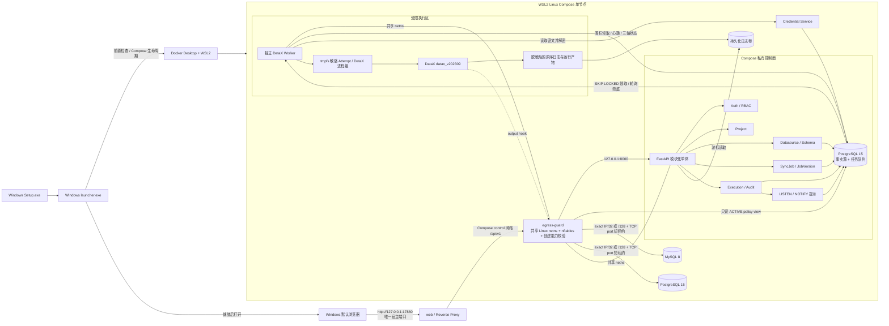
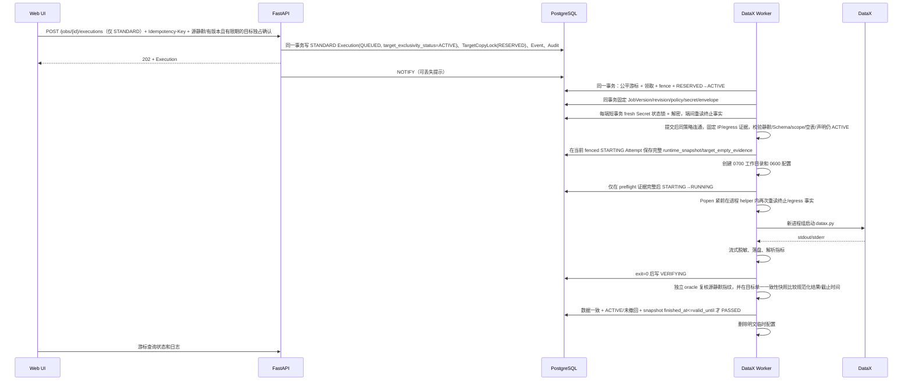
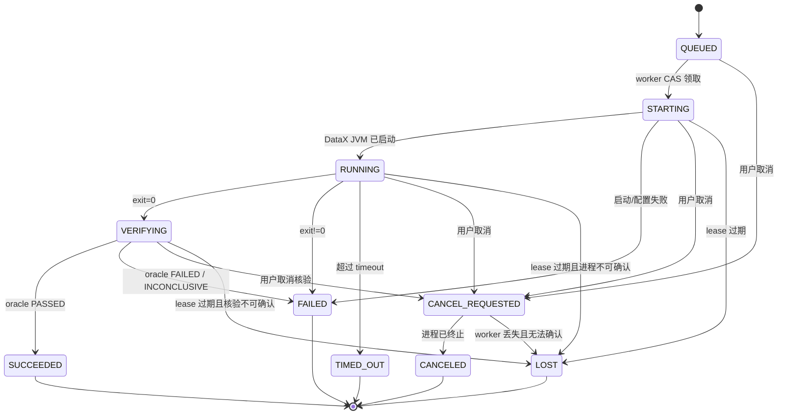

# DataX Enterprise Studio 技术架构设计

> 文档状态：V1.2 Windows 本地工作站工程候选；Discovery Gate 未取证，试点/发布 `BLOCKED`

> 实现口径：本文件描述发布目标架构。仓库已有 nftables `egress-guard`、共享 netns、
> loopback attestation、exact selected-IP 短租约与创建租约能力校验候选实现，但尚未完成后端所有连接阶段
> 接入及 Windows Docker Desktop/WSL2 真实失效关闭验收；数据库外审计
> checkpoint/WORM、签名 Windows 制品和干净 Windows E4 也未完成。DATA/SECRETS 分离
> 加密导出、双包认证 journal 与全新空 staging 已实现并测到 E1；新空 PostgreSQL
> volume、真实 `pg_restore`、证据重算、卷/secret 原子提交、异机恢复和覆盖升级仍保持
> 关闭。所有真实四方向 DataX、Windows 和完整恢复条目必须保持
> `NOT_RUN/BLOCKED`，不能因类、配置项、包文件或流程图存在而视为已验收。
>
> 迁移 `20260802_0020/0021/0022/0023/0024` 与同轮源码新增的 P/QH 解析、私有 payload/runtime/job
> binding、Phase-A nonce/grant 持久化及 PEA 私有数据库授权边界，属于 ADR-0011 的 E1 基础件；0024
> 原子创建另有受限 PostgreSQL E2，不改变产品运行边界。
> 0022 已新增 PEA 表、issuer `des_authorize_phase_a_execution` 与 consumer
> `des_read_active_phase_a_execution_authorization` 两个 `SECURITY DEFINER` 函数，并令普通 API、Worker
> 与 recovery/reconciler 只处理 `STANDARD` Execution。0023 只补入复用标准全局目标锁和 fencing epoch 的
> 未接线 private runner SQL 前置原语；0024 只在 private issuer 的受保护数据库事务中原子创建
> `PHASE_A_HARNESS` Execution、PEA 和 public `TargetCopyLock=RESERVED`，任一失败完整回滚。最终 row 仍是
> `QUEUED/BLOCKED/PHASE_A_PRIVATE_WORKER_NOT_IMPLEMENTED`，lock 仅为 `RESERVED`，不是 claim/start 许可。
> 0024 的真实 PostgreSQL 新测试已在 2026-08-02 取得 `32 passed` 的受限 E2。它不接入普通 API/Worker/Compose/Settings/Launcher，不创建
> runner、不供应凭据、不启动 DataX，且没有私有 rerun、四检查点、受保护 harness account/provisioned QH source、QR reader 或任何真实 E3/E4 证据。
>
> 架构版本：1.2
>
> 适用产品版本：V1
> 关联契约：[`04_数据库与领域模型设计.md`](./04_数据库与领域模型设计.md)、[`05_API接口与前后端契约.md`](./05_API接口与前后端契约.md)、[`contracts/openapi.yaml`](./contracts/openapi.yaml)

## 1. 目的与强制范围

本文定义 V1 的组件边界、调用关系、数据流、信任边界、执行隔离、状态机和故障恢复规则。实现若偏离本文，必须先形成 ADR 并同步修改数据、API 和测试契约。

V1 是单组织、多项目的安全一次性离线全量复制控制平台，边界固定如下：

- 支持 MySQL 8 和 PostgreSQL 15，二者均可作为 Reader 或 Writer。
- 支持全量表或选列复制；字段按位置一对一直连映射。
- 源表必须从运行前检查开始到独立 oracle 完成始终静默；平台记录源所有者确认，但不把该确认伪装成数据库快照。
- 目标表必须预先存在且由 Worker 强校验为空；Operator/DBA 必须提交
  `statement_version="1.0"`、`confirmed_at`、`valid_until`、`responsible_party`
  完整的有限期目标外部独占声明，并在知悉窗口被破坏时报告；仅支持 `insert` 写入。
- 人工目标外部独占声明不是技术证明；平台无法检测全部未报告或已经回滚的外部 DML/DDL。
  `TargetCopyLock` 只约束平台内并发。
- 同一不可变 PhysicalEndpointIdentity/TargetNamespace 对应的物理目标表同一时刻只允许
  一个未释放的 `RESERVED/ACTIVE/RECOVERY_REQUIRED` 锁；Datasource 或 revision 别名
  不能绕过目标锁。
- 只支持人工触发；不支持 cron、DAG、补数或事件触发。
- DataX 固定为 `datax_v202309`。
- 交付形态固定为 Windows 11 x64 本地工作站：`Setup.exe` 安装，原生
  `launcher.exe` 管理启动/就绪/浏览器/停止；业务组件运行在 Docker Desktop 的 WSL2
  Linux 容器中，不要求用户拥有或维护外部 Linux 服务器。
- 当前仓库所在 Mac 只用于开发和自动化层验证；V1 最终运行目标是另一台 Windows 11
  x64 电脑，必须在该目标环境重新取得签名安装、运行、恢复和 E4 证据。
- 单工作站、单节点、非 HA；控制面和运行面重启后必须正确对账，但不承诺运行中任务在
  Windows 睡眠、休眠、关机、Docker Desktop/WSL2 重启后续跑或跨节点接管。
- 角色固定为 Admin、Developer、Operator、Viewer。
- 禁止自由 SQL、`querySql`、`preSql`、`postSql`、自定义 Transformer、自定义插件和运行时上传 JAR。
- AI、调度、DAG、告警、插件市场、CDC、流式同步不属于 V1。

“实时监控”仅指实时查看正在运行的一次性离线复制，不表示实时数据同步。V1 不提供
增量、覆盖、upsert、断点续传或可重复同步语义。

## 2. 架构原则

1. **控制面与执行面分离**：API 不直接启动 DataX；所有运行请求先持久化，再由独立 worker 执行。
2. **PostgreSQL 是事实源和队列**：Worker 以 `FOR UPDATE SKIP LOCKED` 领取任务，
   `LISTEN/NOTIFY` 只作可丢失提示并由轮询兜底；V1 不依赖 Redis。
3. **版本不可变**：每次 Execution 必须绑定不可变 JobVersion、源/目标
   DatasourceRevision、EndpointPolicyRevision、物理端点/表身份，并在领取事务中固定
   CredentialSecret/Envelope、插件版本和运行时版本。
4. **凭证不进入业务契约**：API、JobSpec、JSON 预览、审计和持久日志不得包含明文密码。
5. **最小执行能力**：V1 仅允许四个内置插件和固定字段映射，不提供任意代码或任意 SQL 执行入口。
6. **结果必须核验**：DataX exit 0 仅进入 `VERIFYING`；独立 oracle 数据比对通过，且
   目标外部独占状态为 `ACTIVE`、未撤回、目标快照在 `valid_until` 前读完后才能
   `SUCCEEDED`。进程状态、数据影响和核验状态分开保存。
7. **失败显式化**：未知进程状态必须收敛为 `LOST`，数据影响不能确定时标为
   `UNKNOWN`，不得把进程退出、日志解析或页面可见伪装成复制成功。
8. **无自动重试**：insert-only 不能保证幂等。Execution 一旦被领取，除
   `SUCCEEDED/CONFIRMED/PASSED` 外任何结果都进入恢复门禁；只有提交处置确认并由独立
   RecoveryProbe 重新证明目标为空，才允许新建 Execution。
9. **权限与网络双重约束**：项目角色不自动授予数据移动权。Admin 管端点、数据源、
   方向授权与精确表/列 scope 的 TransferPolicy，且 Worker 实施 DNS rebinding-safe
   解析和真实出口控制并持久化实际 resolved IP/egress 证据。

## 3. 逻辑架构



### 3.1 V1 部署单元

| 部署单元 | 技术 | 职责 | 禁止承担 |
|---|---|---|---|
| `Setup.exe` | Windows x64 安装器 | 安装签名后的 launcher、Compose 清单、卸载入口和开始菜单/桌面快捷方式；登记应用版本 | 静默安装 Docker Desktop/WSL2、写入业务凭据、启动 DataX |
| `launcher.exe` | Windows x64 原生本地生命周期控制器 | 单实例、依赖/端口/磁盘前置检查、创建并校验 ACL 受限的匿名 Docker CLI config、固定本机 Docker Desktop pipe、生成并校验安装实例标识与数据卷标签、本机 PostgreSQL/JWT/HMAC secret、独立凭据 KEK 及 ACL；从 32 个 OS CSPRNG 原始字节生成 64 个 ASCII 小写十六进制字符的 egress 租约创建能力；启动 Compose、调用固定迁移/生命周期/首次管理员/备份/诊断 helper、轮询就绪、打开默认浏览器、安全停止 | 读取或解密业务数据源凭据、直接连接业务数据库、继承用户 Docker context/registry 凭据、代替 API/Worker 推进业务状态、把 secret 放入命令行 |
| `web` | Vue 3、TypeScript、Element Plus、反向代理 | 页面、静态资源、同源 API 转发；唯一映射 `127.0.0.1:17860` | 绑定 `0.0.0.0`/局域网地址、保存 refresh token、连接数据源 |
| `egress-guard` | PostgreSQL `15.18-alpine3.24` 基础镜像 + Python stdlib + nftables + PostgreSQL client | 与 API/Worker 共享 Linux netns；在读取 body、策略或 controller 前校验 `POST /v1/leases` 创建能力；以只读 ACTIVE policy view 审批 selected-IP 租约；原子维护默认拒绝规则并提供 loopback attestation | 保存业务状态、读取数据源凭据、接受宿主/LAN 请求、把 policy CIDR 整段写为外部 allow，记录能力值 |
| `api` | FastAPI 模块化单体；Python 3.12.13 `slim-trixie`（Debian 13）最终运行层 | 认证、项目、数据源、Schema、任务版本、执行控制、审计、日志查询 | 直接调用 `datax.py` |
| `postgres` | PostgreSQL `15.18-alpine3.24` | 业务事实源、Execution/RecoveryProbe 队列、持久公平游标、状态机、凭证/Envelope、TargetNamespace 锁、审计元数据；迁移 owner 与 API/Worker 使用独立登录 | 保存大体量逐行运行日志；让 API/Worker 运行账号持有 DDL/TEMP 权限 |
| `worker` | Python 3.12.13 `slim-trixie`（Debian 13）+ JDK 8 + DataX `datax_v202309` | 公平领取两类事实、reconciler、预检/恢复探针、临时凭证、DataX 进程树、LogGap、核验、心跳和汇总；整个进程共享一个 `pool_size=4`、无 overflow、5 秒获取超时的 PostgreSQL Engine | 暴露公网 API、接受任意命令、为控制/凭据/心跳分别创建无限或默认连接池 |
| Docker named volumes | 活动 `RuntimeGeneration` 指定的 PostgreSQL、脱敏日志和 workspace 三卷（`LEGACY` 为 `des-postgres-data`、`des-log-data`、`des-workspace-data`；未来 FRESH/RESTORE 为随机名） | 保存 PostgreSQL、脱敏日志和不含秘密的有界 oracle 工作区；三卷必须同时存在并携带当前安装实例和各自 role 标签；由 Docker Desktop 管理，升级/重启不丢失 | 保存 Job JSON、未脱敏 Runtime 日志或 DataX 进程工作目录；直接映射任意用户目录；卷部分丢失后自动创建空卷 |

V1 采用模块化单体，不设置独立 API Gateway 微服务。`web` 反向代理承担
`/api/v1` 同源转发；它是唯一发布宿主端口的 Compose 服务，端口必须精确绑定
`127.0.0.1:17860`。`api`、`worker`、`egress-guard`、`postgres` 不得配置宿主 `ports`，只能
通过内部 Compose 网络互访。Windows 防火墙不是把 `0.0.0.0` 绑定变安全的替代品。

`launcher.exe` 不属于业务控制面，也不拥有业务数据库写权限。它通过固定绝对路径和参数
数组调用已校验的 Docker Compose 清单；不得接收用户提供的 compose 文件、镜像名、端口
或 shell 片段。模块间仍保持既有边界和数据库所有权。

迁移 `20260731_0013` 创建了迁移 owner、`datax_api` 和 `datax_worker` 的独立登录和独立
密码；owner secret 不挂载给 API/Worker，两个运行角色均无 DDL、TEMP、CREATEDB、
CREATEROLE 或继承 owner 的能力。当前 schema head `20260802_0024` 保留 Worker 角色上限
12（`0016`），并为该角色设置 30 秒 `idle_session_timeout` 与 15 秒
`idle_in_transaction_session_timeout`（`0017`）；`0018` 增加审计链 watermark，`0019` 为
`DatasourceUsageGrant` 增加单调 `row_version`，使撤销后重新授权不能重用旧的 A/B/C 快照。正常退出显式释放共享 pool；异常终止遗留的
空闲会话由 PostgreSQL 有界回收。连接预算耗尽时 Worker 必须保持存活、停止 admission 并按
心跳重试，不能以 Compose crash-loop 伪装恢复。这些限制不是无限重试或高可用承诺。
两类运行角色仍被授予相同的全表 `SELECT/INSERT/UPDATE/DELETE` 与 sequence 使用权，细粒度
的状态写入职责主要由应用层执行。`20260802_0022` 是一个有界例外：它已为
`datax_api/datax_worker/datax_egress_guard` 在 private execution 及其后代事实启用 parent-linked RLS，
因此这些 runtime DB role 不能通过直接 SQL 读取或修改 `PHASE_A_HARNESS`。这不代表一般 API/Worker
职责隔离已完成；ADR-0013 与 `contracts/runtime-db-write-matrix.v1.json` 的按表/列授权、受约束函数/
触发器及 PostgreSQL 集成证据仍未实施。0022 的这项窄 RLS 已在本轮真实 PostgreSQL 15 E2 以
`datax_api/datax_worker` 直接连接验证 private row 不可读、后代写入被拒绝（脚本退出 `0`，PostgreSQL
pytest `32 passed`）；它不扩展为一般运行角色职责隔离，更不是 E3/E4。
迁移 `20260802_0020` 在 closed-default 私有 schema `des_phase_a_qualification` 中创建仅供未来
Phase-A 私有资格路径使用的 `phase_a_qualification_nonces` 与
`phase_a_qualification_grants`。`20260802_0021` 要求 PostgreSQL superuser 将 schema/table/guard
function ownership 移给无登录 ledger owner，创建无登录 issuer/consumer，撤销标准运行角色和
issuer/consumer 的直接 DML，并只为 issuer/consumer 各自授权最小 `SECURITY DEFINER` 函数；函数
固定 `search_path=pg_catalog,pg_temp`，以 `session_user` 复核调用者。任一私有角色名或成员关系
若预先存在，迁移失败关闭；ledger owner 后续新建函数默认撤销 `PUBLIC EXECUTE`。`20260802_0022`
新增第三张私有表 `phase_a_execution_authorizations`，对 `grant_id` 和 `execution_id` 均唯一且
append-only；issuer authorize 函数在锁定 PAG/Execution 后从当前 JobVersion、revision、policy、
namespace 和 P/runtime/harness/QH 事实（仅 nonce SHA-256、无 raw nonce）快照插入它，consumer read 函数只在全部联结仍相等、PAG
`ACTIVE` 且 QH 时间窗有效时返回它。PEA 不存自己的 `state`。0022 还给 `executions` 增加
`authorization_mode`，普通 API 创建的为 `STANDARD`，普通 Worker claim 和 recovery/reconciler 明确排除
`PHASE_A_HARNESS`。0022 还对 runtime DB roles 启用 parent-linked RLS，覆盖 `executions` 和 attempt/lock/
event/cancel/log/recovery/evidence/work-termination descendants，使 direct SQL 同样不能读取或修改 private row；
该边界已在本轮真实 PostgreSQL 15 E2 由 runtime-role direct-DB 负向验证（脚本退出 `0`，pytest `32 passed`）。
这一窄 E1 实现加数据库 E2 证据不等于已实现 protected harness、私有 rerun/重跑入口、
私有四检查点或运行通道：标准 API/Worker 没有角色凭据、读取/写入接线，不能据此运行 qualification
或解除普通执行 deny-all。

PEA consumer read 的 current-fact 重验不是一次快照比较：它还要求 Project `ACTIVE`、Job `PUBLISHED`、
两侧 Datasource/EndpointPolicy 均在同一 Project/Organization 内 `ACTIVE` 且 current revision 未漂移、
physical identity/TargetNamespace 的 Organization+engine+目标 identity 一致、TransferPolicy 仍 `ACTIVE`
且 project/revision/physical scope/hash/row version 不变、目标独占未撤回，并校验 Reader/Writer 与两侧
engine 配对。任一条件不成立即无结果。普通 API/Worker/Recovery/日志路径只处理 `STANDARD`，不能查看、
更改、领取、reconcile 或暴露 `PHASE_A_HARNESS`。

`20260802_0023` 已作为未接线前置原语增加 NOLOGIN runner 和六个 private `SECURITY DEFINER`
global lock/fence 函数。它复用 standard `TargetCopyLock`、`ExecutionAttempt` 和 `fence_epoch`，所以
private/standard 对同一 TargetNamespace 互斥；它没有登录 provisioning、产品接线或 DataX 启动。
`20260802_0024` 只向专用 private issuer 提供一个受保护的数据库 create→PEA→reserve 原子切片：它在一个
事务中创建 `PHASE_A_HARNESS` Execution、调用既有 PEA binding，并向**同一 public**
`target_copy_locks` 写入 `RESERVED`；任一事实、确认或 partial-unique 锁冲突时整个事务回滚。提交后的
Execution 必须是 `QUEUED/BLOCKED/PHASE_A_PRIVATE_WORKER_NOT_IMPLEMENTED`、`attempt_count=0`、无
active attempt/fence，锁只是 `RESERVED`。它的内部 append-only checkpoint 不是公开交换或命令契约，
外部 lifecycle receipt 只表达最终 `LOCK_RESERVED`。该 E1 开发基础的真实 PostgreSQL migration/atomicity/
lifecycle 测试已在 2026-08-02 随 `32 passed` 完成；它仍只是数据库 E2，不能外推为 runner、E3 或 E4。
函数在读取任何 business current fact **前**先以 `SELECT ... FOR UPDATE` 锁定
`public.system_control(singleton_id=1)`，与 Launcher/Worker 的本地 stop/drain 更新使用同一线性化点；drain
已提交或并发发生时，私有创建必须失败而不能在旧 admission 观察后提交。为满足 PostgreSQL 行锁要求，只有
无登录 ledger owner 获得窄至 `UPDATE(singleton_id)` 的权限；issuer 与普通/runtime 角色无此直接权限，issuer
只能调用固定 `SECURITY DEFINER` 函数。
这不是仅靠 migration 文本的推断：真实两连接 PostgreSQL E2 中，owner connection 持行锁，issuer connection 记录
`pg_backend_pid()` 并调用 create；owner 从 `pg_locks` 观察该 PID 的 `NOT granted` 等待，先提交
`draining=true` 后释放锁，issuer 以 `P0001` 失败且四类创建残留均为零。它仍不启动 Worker 或 DataX。
0024 downgrade 在任何检查前以 `ACCESS EXCLUSIVE` 锁住 public `executions`、`execution_attempts`、
`target_copy_locks` 和私有 grant、PEA、create-checkpoint 表；任一 protected `PHASE_A_HARNESS` Execution、
PEA 或 checkpoint 存在即失败关闭，不能为回退静默丢弃 private authority 事实。
当前没有 protected private disposition workflow；普通 API/Worker/维护、标准 backup/restore 或 migration rollback
都不能处置这些对象。任一 private Execution 继续阻断标准 backup，私有 backup/restore 为 `BLOCKED`。标准产品没有
issuer login 凭据或普通 API 调用，protected disposition、runner 和 backup/restore 均仍是未来门槛。
当前仍没有私有 Phase-A Worker/runner，`PHASE_A_HARNESS` 在标准部署内保持硬禁用，不能由 Settings、
环境变量、标准 Compose、Launcher 或普通维护接口打开。未来受保护 runner 启用前，必须先落地 ADR-0011 §3.1 的
完整 PEA/current-fact、源静默/目标独占 confirmation、受保护 audit checkpoint，以及独立凭据、日志、进程树、崩溃对账、维护和
backup 隔离；这些是开始 E3 取证的前置条件，不是 E3/E4 证据。

J0c-1 仅增加了一个不接线的内部 P/QH 文件读取边界：未来受保护基础设施必须显式注入可信私有
filesystem root、P/QH 相对路径与各自 SHA-256、独立 P root 及固定 harness identity；loader 再以
不跟随链接的 descriptor-relative 打开和严格 P/QH parser 验证输入。它不从 Settings、环境变量、
API 请求、标准 Compose 或 Launcher 取值，也没有 API/Worker 导入或运行时入口；输出不含 raw QH/raw
nonce、不可序列化，且不消费 nonce、不写 PAG/PEA、不创建/领取 Execution、不启动进程或 DataX。
故它只是**E1、`NOT_E3_OR_E4`** 输入约束，不能被称作 private source/override、受保护 harness 或
执行通道，也不改变标准 production deny-all。

登录入口在路由依赖之前以单 API 进程内的全局 admission guard 限制认证成本：它不按邮箱、
IP 或 User-Agent 分桶，也不保存这些值；被拒绝的请求不得创建数据库会话、运行 Argon2、
改变账户状态或写审计。429 为固定、账号无关的
`AUTH_LOGIN_ADMISSION_LIMITED` + `Retry-After: 60`，前端只能在用户重新输入密码后人工提交。
该控制与 readiness 的进程内 singleflight 都依赖 V1 只有一个 API/Uvicorn 进程；不得配置
`--workers`、`compose --scale api`、额外 API 容器或旁路入站，未来扩展前必须先新建 ADR。

### 3.2 Windows 本地安装与生命周期

1. `Setup.exe` 只安装 DataX Enterprise Studio 自身；Docker Desktop、WSL2、虚拟化能力
   是显式前置依赖。缺失时安装器/launcher 给出官方安装指引并停止，不伪装成功，也不得
   未经用户许可修改 BIOS、Windows 可选功能或 Docker Desktop 许可设置。
2. launcher 使用进程级 Windows named mutex 保证每个登录会话只有一个控制实例；已有
   控制实例仍在执行时，第二次启动返回稳定提示并退出，不重复执行 `compose up`。已有
   Compose 服务则由启动检查幂等复用；V1 不声明未实现的窗口焦点转交 IPC。
3. 启动前必须检查 Windows 11 x64、WSL2/Docker Engine/Compose 版本、Docker Linux
   container 模式、虚拟化、`127.0.0.1:17860` 占用、镜像/Runtime 摘要、可用内存和磁盘、
   三个 named volume 同存同失及 installation-id/role 标签一致性，以及
   `%LOCALAPPDATA%\DataXEnterpriseStudio` 受限目录 ACL。Docker 重置、卷部分丢失、
   已有卷缺少安装实例标识或标签不符时必须失败关闭。
   当前 FRESH 初始化以 ACL 受控的 `initialization-incomplete` journal 为恢复依据，journal
   先固定随机 generation、installation identity、generation secret 目录和三卷名；随后只从
   同一 journal 创建/核验 secret 和卷，最后不可覆盖提交活动 pointer。进入 FRESH 后不得读取或
   写 root `installation-id`、root secret 或固定 LEGACY 卷；半套 secret、卷/指针不一致或旧式
   残留都失败关闭，只能继续同一 journal。完整固定 root 对象集合仍可一次性迁移为 LEGACY
   pointer，不能被当作 FRESH 的第二当前来源。不得自动删除卷，也不得把缺 secret 的既有卷当成
   全新安装。该 FRESH slice 目前只有源码/E1 单元证据，尚无 Windows Docker Desktop/E4。
   `%LOCALAPPDATA%` 的 40 GiB 检查只保护 Launcher 配置、secret 与本地备份元数据，不能
   代表 Docker Desktop/WSL VHD 或 named volume 的实际余量。`start` 和 `backup` 先确认五个
   release-locked Linux/amd64 镜像已在本地；缺失时才以 Launcher-owned 空 Docker config 按
   immutable digest 拉取，已缓存镜像不请求 registry。预取完成后所有产品 `docker run` helper 和
   `compose up` 都显式 `--pull=never`；若并发 Docker 操作删掉缓存镜像，后续操作必须失败关闭，
   不得在容量 admission 后重新下载。`start` 随后完成当前 `RuntimeGeneration`
   与三卷 identity 认证，再于 `compose up` 前；`backup` 则于 staging 前，以参数数组运行有
   opaque name/双标签的受限 Worker `docker run` 探针：仅把三个已认证的 **local、无 options**
   volume 只读挂到固定 `/probe/*` 路径，`network=none`、无 secret、只读根、`0:0`、
   `cap_drop=ALL` 后仅加 `DAC_READ_SEARCH` 以穿越 PostgreSQL 的 `0700` 卷根、64 MiB/16 PID/
   0.25 CPU。它只执行固定 `statvfs` 脚本并读取严格固定行协议；但 Linux 的
   `DAC_READ_SEARCH` 也能绕过普通文件读取及目录搜索权限，故该 capability 不是卷内容保密
   边界。只读挂载、无网络/secret、固定 `-c` 脚本和精确 Worker digest 共同构成可信前提，不能
   把“脚本只输出容量”描述为内核已禁止读取卷内容。任一 Docker/协议异常或任一卷低于 200 GiB
   都失败关闭。探针用 `--pull=never`，错误/超时/输出无效时只按重新认证的 immutable ID 删除
   同名 probe 容器。容量失败不代表“无任何副作用”：受控初始化或镜像缓存可能已经存在，但
   Compose/业务数据库尚未启动。此源码控制和单元测试只构成 E1；不同 Docker 数据盘、临界值、
   运行中耗尽、`0700` 权限、超时残留与 cleanup 竞争仍须由签名候选的 Windows E4 验证。
4. 前置检查通过后，launcher 以固定 project name 执行 `docker compose up --pull never -d`，轮询
   `http://127.0.0.1:17860/api/v1/health/ready`。`200/UP` 表示管理平面与执行能力均
   就绪；`200/DEGRADED` 只表示本机管理平面可用，允许首次引导、登录、配置和查看诊断，
   新执行仍按组件状态失败关闭；`503/DOWN` 才阻断打开页面。超时必须显示稳定诊断码和
   日志位置，不得仅因容器为 running 就宣告成功。
   对已有同 project label 的容器，任何 `up`、`exec`、`stop`、`down` 或启动失败后的
   cleanup 前都必须逐 ID 重新认证：标签必须精确声明当前 project，service 只能是预期集合且
   不得重复或越界，`Config.Image` 必须等于当前发布镜像锁，且实际 named-volume
   source/target 必须等于已认证活动 `RuntimeGeneration` 所引用的 volume 集合；这些 volume
   的 installation-id/role 标签也必须与本机身份一致。任一枚举、inspect、镜像、标签、卷或
   活动代际核验失败统一返回 `COMPOSE_PROJECT_OWNERSHIP_UNVERIFIED`，不触碰已有容器。
   `exec` 和启动后的安全核验还要求完整的预期 service 集；受认证的部分集合仅可由 `up`/`down`
   用于失败恢复，不能作为业务 lifecycle 的目标。
   `compose down` 不得使用 `--remove-orphans`；cleanup 在实际 down 前再次认证，不能把同名
   标签视为所有权证明。
5. 全新空库由 launcher GUI 显示一次性 Admin 首次引导；内部只以固定参数数组调用
   `api` 容器的 `bootstrap-admin` helper，临时密码经子进程标准输入传入。用户不需要打开
   PowerShell/容器终端；密码不得进入命令行、环境、浏览器、持久配置或 launcher/容器
   日志。已有任一用户时 helper 必须拒绝重复引导，并写既定审计事件。
6. readiness 通过且首次引导已完成或不适用后，launcher 才用 Windows 默认浏览器打开
   `http://127.0.0.1:17860`。
7. 关闭 launcher 窗口不等于停止服务。显式“停止服务”先进入 drain，禁止新领取；无活动
   Attempt 后才执行有界 graceful stop。若仍有 `STARTING/RUNNING/VERIFYING/
   CANCEL_REQUESTED`，默认拒绝直接停机并提示等待或先取消；用户明确执行强制停止时必须
   警告该操作会在下次启动由 reconciler 收敛为 `LOST` 并触发恢复门禁。
8. Windows 睡眠、休眠、关机、Docker Desktop 退出或 WSL2 被终止不视为正常停止。恢复
   后 launcher 重新启动 Compose，Worker/reconciler 以 PostgreSQL lease、Linux
   `host_boot_id`、PID start time 和 container/cgroup identity 对账；任何已领取且不能
   证明仍受当前 fence 控制的工作收敛为 `LOST`，绝不从中断位置继续 DataX。
9. 卸载默认不删除 named volumes、备份和密钥。删除本地数据必须是独立、二次确认且明确
   列出目标的操作；活动执行或未完成备份时拒绝删除。

### 3.3 本地数据、配置与秘密

- PostgreSQL、脱敏日志和不含秘密的有界 oracle 工作区只使用 Docker named volumes。
  含密 Job JSON、DataX 进程工作目录、未脱敏 Runtime 日志和性能临时文件只进入 Worker
  的 256 MiB `/tmp` tmpfs。DataX Runtime 和插件固化在只读 Linux 镜像中；不把 DataX、
  JDK 或 Python 安装到 Windows PATH，也不把 DataX 移植为原生 Windows 进程。
- 非秘密部署配置、Compose 清单和 secret 源文件只能位于
  `%LOCALAPPDATA%\DataXEnterpriseStudio` 下由当前 Windows 用户和 `SYSTEM` 可读的
  ACL 受限目录，或以 Docker secret 只读挂载。密码、KEK、token、数据库 DSN 不得进入
  `.env`、注册表普通值、桌面快捷方式、进程命令行或诊断包。
- `egress_lease_creation_capability` 由 Launcher 以 32 个 OS CSPRNG 原始字节生成并编码为
  恰好 64 个 ASCII 小写十六进制字符，且必须与四个数据库角色密码不同。它只以 Docker
  secret 只读挂载给 `egress-guard`、API 和 Worker；`migrate`、`postgres`、`web` 不得获得
  该文件。API/Worker 环境变量只能保存固定路径
  `DES_EGRESS_LEASE_CREATION_CAPABILITY_FILE=/run/secrets/egress_lease_creation_capability`，
  不能保存其值；值不得进入响应、数据库、Job JSON、DataX 子进程环境、日志或诊断。
- 数据源凭据 KEK 必须由 OS CSPRNG 独立生成，不能与 refresh-token 或 idempotency HMAC
  key 复用；API 与 Worker 只读挂载同一版本化 KEK 文件，其他服务不得获得该 secret。
- 本地系统备份由 launcher 在安全停写后调用固定 Worker helper；它先复核 ACL/no-reparse 的
  活动 `RuntimeGeneration` pointer 并冻结单一快照，所有备份期 Compose 命令和 DATA/SECRETS
  helper 均使用该快照，pointer 变化或明文 staging 清理失败时不得 `resume`。成功时原子生成两个
  分离的加密包：`.dxdata` 只包含 custom-format PostgreSQL 逻辑 dump、脱敏日志和三个固定发布
  元数据；`.dxkeys` 单独包含四类数据库角色密码、`egress_lease_creation_capability`、JWT/HMAC
  与受支持 KEK。两包使用不同
  恢复秘密并通过 backup ID 配对；物理 PostgreSQL volume、WAL、workspace、`job.json`
  和未脱敏日志不得进入 DATA 包。
- `des_phase_a_qualification` 不属于可恢复的普通产品事实。自 `20260802_0020` 起，标准系统
  备份和诊断包必须以固定 `--exclude-schema=des_phase_a_qualification` 排除完整私有 schema：四张 ledger/checkpoint 表、
  nonce hash、P/harness/plugin binding、grant lifecycle、PEA binding、schema 内触发器、私有 ledger
  guard 函数和私有 0021/0022/0023/0024 `SECURITY DEFINER` issuer/consumer/lock-fence/private-create entrypoints。不得因 PostgreSQL
  全库逻辑 dump、诊断 SQL 或恢复 staging 间接携带它们。保护 public `executions` trigger 的
  `public.des_phase_a_execution_mode_guard()` 故意不在被排除的 schema 中，必须随标准 dump/restore 保留；
  它仍是无登录 ledger owner 持有、向 `PUBLIC`/runtime/issuer/consumer 撤销执行权的
  `SECURITY DEFINER` 函数。当前真实 PostgreSQL 15 E2 已验证 schema exclusion 的 TOC 与空库
  `pg_restore` 探针；这最多证明 dump 边界，绝不是完整 restore、DataX E3 或 Windows E4 证据。
- schema 排除本身不足以保护 0022 的 public execution/log 残留：当前 Launcher 在 `pg_dump` 前后（PostgreSQL
  停止前）固定重验 `public.executions` 中没有 `authorization_mode=PHASE_A_HARNESS`；存在/非 `t` 输出时
  `BACKUP_PHASE_A_PRIVATE_EXECUTION_PRESENT`、psql 完成但非零时 `BACKUP_PHASE_A_PRIVATE_EXECUTION_CHECK_FAILED`，其他命令错误也失败关闭。
  不得通过筛选 schema、表数据或日志路径继续导出。受保护 Phase-A backup/restore 是未来独立能力，当前未实现。
- 标准 restore 不得恢复、复制或重新激活任何 QH/PAG/PEA authority。因为升级到当前 schema head 的 dump 会恢复
  `alembic_version=20260802_0024` 却不含私有 schema、其 private issuer/consumer/runner/create entrypoints 或无登录 ledger roles（而
  `public.des_phase_a_execution_mode_guard()` 会随 public trigger 保留），当前真实 `pg_restore`、应用启动与
  ledger bootstrap 全部保持 `BLOCKED`。未来 protected restore bootstrap 必须创建空 schema、
  生成并强制校验不随备份恢复的 post-restore issuance epoch，且只接受该 epoch 内重新签发、
  重新消费的资格；必须以 restore→bootstrap→migrate/start→旧 authority 拒绝 E2 证明。不得把
  journal/staging 或上述候选检查称为已验证的 authority-revocation/restore 闭环。
- Launcher 要求用户提供两个彼此独立、父目录已存在但叶子目录尚不存在的本地输出路径；
  当前没有固定 `%LOCALAPPDATA%\DataXEnterpriseStudio\backups` 默认输出。导出代码和
  自检之外，内部 helper 已能完整认证/配对双包，以两把恢复秘密认证 journal，并只解包
  到全新空 staging；成功仍返回 `RESTORE_STAGED_COMMIT_BLOCKED`。该能力只达到 E1。
  新空 PostgreSQL volume、真实 `pg_restore`、数据库/审计链/日志/密钥证据重算、
  卷/secret/installation-id 原子提交、异机 Windows 恢复和覆盖升级仍失败关闭。
- 本机导出通常仍与 Docker 虚拟磁盘位于同一台电脑，只能防部分误操作，不能证明抗整机
  或磁盘故障。用户必须把通过校验的 DATA/SECRETS 包和两把恢复秘密按分离保管规则复制
  到另一受控介质；在干净 Windows 11 x64 上完成真实恢复演练前不得声明可恢复。

## 4. 后端模块边界

| 模块 | 所有数据 | 对外能力 |
|---|---|---|
| Auth | User、AuthSession、OrganizationMember、RoleAssignment | 登录、刷新、退出、当前用户、RBAC |
| Project | Organization、Project | 项目创建、归档、成员授权 |
| Datasource | EndpointPolicy/Revision、PhysicalEndpointIdentity、Datasource/Revision、CredentialSecret/Envelope、UsageGrant、精确作用域 TransferPolicy、连接证据 | Admin 管理端点/数据源/授权；受控连通性测试、Schema 探测、密钥轮换/紧急撤销 |
| Plugin | PluginCatalog | 返回四个只读内置插件及能力 |
| Job | SyncJob、JobVersion | 任务元数据、校验、预览、不可变版本 |
| Execution | Execution/Attempt、RecoveryProbe/Attempt、Event、LogArtifact/LogGap、TargetNamespace/CopyLock/RecoveryGate、公平服务游标 | 人工触发、事实队列领取、三轴状态、取消、日志、核验、恢复对账 |
| Audit | AuditEvent、AuditCheckpoint、AnchorPublicKeyring | 安全审计查询、完整性链、公钥轮换和外部签名锚点 |

禁止跨模块直接修改对方表。跨模块写操作通过应用服务完成；Execution 可只读解析 JobVersion 和 Datasource 修订，不能反向修改任务或数据源。

## 5. 核心数据流

### 5.1 登录与项目访问

1. 浏览器只通过 `http://127.0.0.1:17860` 的同源页面提交账号密码；`web` 必须拒绝
   非 loopback Host、非同源 Origin、CORS 跨源请求和公网/局域网转发头。
2. Auth 校验 Argon2id 密码哈希和用户状态。
3. 后端返回短时效 JWT access token，并设置旋转式、`HttpOnly`、`SameSite=Strict`、
   `Path=/api/v1/auth` refresh cookie。V1 loopback HTTP 不能虚假声明 `Secure`；如果后续
   改为受信本地 HTTPS，必须启用 `Secure`，且不得因此放宽 loopback 绑定。
4. 每次项目请求校验 RoleAssignment；组织级 Admin 可访问组织内所有项目，其他项目级角色可多选并取权限并集。
5. 登录成功、失败、刷新、退出均写审计事件；审计中不得记录密码或 token。

角色并集不等于数据传输授权。Developer 即使同时拥有 Operator，也只能对显式
DatasourceUsageGrant 和 ACTIVE TransferPolicy 覆盖的方向发布/执行；Admin 管理能力在
服务端独立授权，不能靠隐藏按钮实现。

### 5.2 数据源创建、测试与 Schema 探测

1. 只有 Admin 可以创建或修改 EndpointPolicy、Datasource 及其非秘密连接配置；
   EndpointPolicy 只是显示身份，host/CIDR/port/TLS/TTL/resolver/egress 任何变化都创建
   新的不可变 EndpointPolicyRevision；host、port、database、schema、username、SSL、
   options、policy revision 或物理端点身份变化都创建新的不可变 DatasourceRevision。
2. API 校验引擎、主机、端口、数据库名、用户名、SSL 模式、EndpointPolicy 和组织权限。
3. 连接探针读取引擎原生服务器身份并绑定不可变 PhysicalEndpointIdentity；MySQL 使用
   `server_uuid`，PostgreSQL 使用经批准证明的 `system_identifier`。无法获得可信证明时
   fail closed，不能用 hostname/IP/revision 不同推断为不同物理实例。
4. 密码由 Credential Service 使用版本化 KEK keyring 做信封加密；稳定数据密文位于
   CredentialSecret，DEK 包裹位于可新增的 CredentialSecretEnvelope。数据 AEAD AAD
   不含 KEK 版本；KEK 轮换只重包裹 DEK，轮换密码不改变 DatasourceRevision。
5. Admin 显式向组织成员授予 `SOURCE_USE`、`TARGET_USE`，并批准源 revision 到目标
   revision、精确 catalog/schema/table 和显式允许列的 TransferPolicy scope。
   Developer 只能使用获授权方向/列的数据源，不能新增端点。
6. 数据源创建/更新的连接探针、连接测试、Schema 探测和任务校验由 API 的 Credential
   Service 编排受限 connector；传输策略创建及任何会重算 scope 的 PATCH 也委托同一受限
   Schema 探测，但不是 Worker 的 DataX 执行路径。外部数据库账号必须是
   对该操作所需的最小权限账号；Schema/metadata 读取必须只读，并设置连接、查询和单次
   操作总时限。该配置不是同步 PostgreSQL 网络黑洞下“请求必在该时限内返回”的证明；见 ADR-0014
   的发布阻塞说明。
7. **外部操作边界（ADR-0014；候选源码 E1 已实现，`ASR-013=IN_PROGRESS`）**：五个直接的
   Credential Service 入口，以及委托它们的传输策略创建/范围变更 PATCH，采用 A（短事务授权/不可变绑定快照）→ B（已有凭据先经极短 strict-current credential barrier
   锁定/复制/提交，随后无产品 DB 锁的 DNS/egress/解密/connector；创建使用候选请求凭据）→
   C（短事务复核/写 evidence 或响应）三阶段。A/C 复核 Organization 与调用者 User 的
   `status/row_version`、AuthSession、项目/Job 状态、数据源/修订/policy/secret/envelope/grant、
   cursor、TargetNamespace、TransferPolicy 与 runtime binding；PUBLISHED/ARCHIVED Job 在外部 I/O
   前拒绝。不得在持有
   Organization/Project/Datasource/Job 锁时进行 DNS、egress、probe 或 Schema I/O；任何绑定漂移
   必须 409 stale，deadline 只能在 C 仍有效时 503 且不得持久化 B 结果。全部 egress attestation
   失败保留稳定平台错误码并返回 503，只有明确的可用性集合可人工重试；deadline 优先于晚到的
   attestation 错误。准入固定在单 API 进程内
   的 global=4、organization/datasource=1、TEST cooldown=60 秒，不能以 Uvicorn workers 或 Compose
   scale 绕过。任务校验及传输策略的两端 Schema probe 都须先原子取得 source/target permit，并在两个
   probe 间复用同一总 deadline；这仍不是网络黑洞下端到端硬 30 秒承诺。本轮隔离 PostgreSQL E2 已以受控阻塞 probe + `FOR UPDATE NOWAIT` 证明 B 阶段不持有
   同一 Organization 行锁；取消/撤回/revoke/更新的完整竞态矩阵及真 MySQL/PostgreSQL DataX E3
   尚未取证，不能把连接测试称为已限速或漏洞已关闭；具体合同以 ADR-0014 与 OpenAPI 为准。
8. V1 只读取 schema、table、column、ordinal、type、nullable、primary-key、约束、默认
   值、生成列、触发器和外键信息；目标表出现可能改变 insert 结果的未知对象时拒绝发布。
9. JDBC 地址受引擎模板控制，不接受完整自定义 JDBC URL。每个连接阶段固定
   EndpointPolicyRevision，受信 resolver 规范化并校验全部 A/AAAA/CNAME。每个连接阶段
   必须先向同 netns 的 `egress-guard` 申请由守卫生成 ID/token 的 selected-IP 租约；
   `POST /v1/leases` 还必须恰好携带一个
   `X-DataX-Egress-Lease-Capability: <64 ASCII lowercase hex characters>` 请求头。守卫先
   对该头做常量时间验证；缺失、重复、格式错误或不匹配统一为
   `401 LEASE_CREATION_AUTH_INVALID`，不读取 body/策略且不透露原因或能力值。续租/释放
   仍只使用各 lease 的 bearer token。
   守卫重新读取当前 ACTIVE view，只把精确 `/32` 或 `/128` + TCP port 写入 nftables，
   policy CIDR 只能用于准入；落入运行时 `control` 子网的 selected IP 即使匹配 policy
   也必须拒绝。逻辑租约 30 秒、客户端每 5 秒续租、内核元素最多 15 秒；
   连接结束立即释放。JDBC 若对 FQDN 二次解析到其他地址必须由内核拒绝，同时继续保持
   TLS hostname 与实际 peer IP 核对。连接测试、预检、核验、RecoveryProbe 和正式执行
   分别保存实际 selected/peer IP、DNS TTL、resolver/egress/lease 证据，不能复用过期
   解析或租约。内部接口见
   [`contracts/egress-guard.v1.md`](./contracts/egress-guard.v1.md)。
   MySQL DataX 路径固定 Connector/J `9.7.0` 和新驱动类名；`VERIFY_CA` 必须生成
   `sslMode=VERIFY_CA`，`VERIFY_FULL` 必须生成 `sslMode=VERIFY_IDENTITY`。旧版
   `verifyServerCertificate=true` 只能表达 CA 校验，不能表达 hostname identity，
   因此禁止用于 `VERIFY_FULL`。驱动 JAR、版本路径和许可文件均进入 Runtime manifest
   校验；任何旧驱动或重复驱动路径都不能解除 readiness 门禁。

### 5.3 任务校验、预览与版本化

1. 前端提交符合 `job-spec.v1.schema.json` 的 JobSpec。
2. 后端执行 JSON Schema 校验和语义校验：
   - source/target 均属于当前项目且未禁用，并解析到明确的不可变 DatasourceRevision；
   - 当前用户拥有相应 `SOURCE_USE`/`TARGET_USE`，且 revision 对应的 TransferPolicy
     为 `ACTIVE`；JobSpec 的两端 catalog/schema/table 与全部 mapping 列均落在 policy
     的精确 `scope_hash` 内；
   - Reader/Writer 与数据源引擎、方向匹配；
   - source 与 target 分别解析到不可变 PhysicalEndpointIdentity 和引擎真实标识符规则；
     `physical_table_identity_hash` 相等即拒绝，不能因 Datasource/revision/hostname
     不同放行；
   - 表存在，目标表预存在且约束画像适合直连 insert；发布时不把“为空”永久冻结为事实；
   - 映射非空，source/target 列分别唯一，类型兼容；
   - 仅 `insert`，无 SQL、Transformer 或未知字段。
3. Preview 生成脱敏后的 DataX JSON；`username` 可脱敏展示，`password` 必须固定显示为 `${SECRET}`，预览不可执行。
4. 创建 JobVersion 时保存规范化 JobSpec、`spec_hash`、源/目标 DatasourceRevision 与
   EndpointPolicyRevision ID、源物理表 hash、目标 TargetNamespace、TransferPolicy
   `scope_hash`、Schema/约束指纹和四个插件/运行时版本，并生成域分离的
   `version_artifact_hash`。版本创建后不可修改或删除。
5. 凭据版本不进入 JobVersion；Worker 在 Execution 领取事务内、任何外部连接前，原子
   固定当时 `ACTIVE` 的 source/target CredentialSecret 及其 ACTIVE Envelope。普通轮换
   不改变连接目的地；紧急 `REVOKED/COMPROMISED` 会禁用对应 Datasource，并终止已绑定
   的非终态工作；如果该 secret 仍是 current secret，还终止尚未绑定 secret、但不可变引用
   该 DatasourceRevision 的排队工作。提交后 Worker 对每一端分别以全新短事务、`FOR UPDATE`
   和强制刷新的 Secret 状态读取完成“允许解密”的决定与解密；事务在明文交给后续阶段前
   释放，对可变 `bytearray` 在 Attempt 退出时尽力清零。Python、驱动、JVM 或子进程可能
   已有的不可控副本不能据此宣称被完整内存擦除。两端解密之间必须重读终止事实，不能因
   Session identity map 复用旧状态；该短锁只序列化解密决定，绝不跨越 DNS/JDBC/DataX
   生命周期。

### 5.3.1 插件/Runtime 资格与发布晋级边界

ADR-0011 的发布资格链严格是 `P → QH → PAG → QR → F → PR`；J0b 的 PEA 是 PAG 到每个
私有 Phase-A Execution 的内部、一对一授权边，不改变该公开发布链，各对象的结论不能互换：

1. 构建先固定不可变发布 payload P，P 绑定 API/Worker/Web/egress/PostgreSQL 五镜像、
   Worker Runtime、插件 JAR、依赖/许可证、SBOM、commit 和 payload root；QH、PAG、QR、
   最终 manifest 与最终安装包不进入 P。
2. HQA 只可在受保护环境为精确 P 与固定 harness 签发短期、一次性 QH。受保护私有
   Phase-A 控制面先独立核验 P/QH，原子消费 nonce，才可创建只绑定该 P、harness 和一个
   Reader/Writer pair 的 PAG。0022 的 protected issuer 已可用独立、不可变、对 `grant_id` 和
   `execution_id` 均唯一的 PEA 把既有 ACTIVE PAG 绑定到一个**已存在**的 `PHASE_A_HARNESS`
   Execution，并快照 JobVersion、Datasource/Policy、TargetNamespace 和 P/runtime/harness/QH 摘要；
   consumer read 只在当前事实仍相等时返回它。0024 仅补齐 protected issuer 的**原子数据库创建**：
   create Execution→PEA→同一 public `TargetCopyLock=RESERVED` 要么共同提交、要么共同回滚，且提交后
   Execution 仍为 `QUEUED/BLOCKED/PHASE_A_PRIVATE_WORKER_NOT_IMPLEMENTED`。它不是普通/API/UI 创建，
   也没有 rerun、Worker claim、Worker start 四检查点；其真实 PostgreSQL E2 已在 2026-08-02 取得 `32 passed`，
   因此这个数据库 record 仍不能启动 DataX。QH/PAG/PEA 只允许真实 E3/私有 Windows harness/payload qualification，
   明确不是 E4、Plugin Manifest 状态或普通用户许可。
3. 独立 RQA 复核真实 Phase-A 证据后，才可为同一 P 签发 detached QR。未来私有 Phase-B
   reader 必须用 P 内固定公钥、签名、purpose、有效期以及 commit/image/runtime/JAR/依赖/
   许可证逐项校验 QR；缺失或任何错配时四个普通执行检查点都保持 deny-all。
4. QR 只作为私有最终候选的正常模式资格。最终 Setup/Launcher/release manifest 在 QR
   之后生成并绑定 QR 文件哈希，却不得被 QR 反向绑定；随后在无 QH/PAG/PEA 的标准 Compose 上
   对精确最终 F 执行 Phase B Windows E4，才可派生 `WINDOWS_E4_CERTIFIED`。该状态不等于
   公开分发，只有 ADR-0010 的同一 F hosted 候选根证明、完整发布 validator 和有效 PR 都
   通过，才可公开分发。

当前落地的是 E1 基础件和受限数据库 E2：P/QH/PAG/PEA Schema、失败关闭 P/QH parser、私有 payload/runtime/job
binding primitives，以及 PostgreSQL nonce/grant/PEA 账本。账本只保留 nonce 哈希和不可变 binding；
`20260802_0021` 将私有 schema、前两张表和 guard functions 的 owner 交给无登录 ledger owner，
并精确授权 nonce+PAG 签发、撤回与 current-grant 读取；`20260802_0022` 增加 PEA 的 issuer
authorize 和 consumer read；其保护 public `executions` trigger 的 mode guard 位于 `public`，以保证标准
dump/restore 不产生悬挂 trigger，但同样由无登录 ledger owner 持有并撤销调用者执行权。标准
API/Worker/egress 以及 issuer/consumer 都没有直接表 DML 权限；
`qualification.execution_authorization` private issuer/consumer adapter 只能接收未来受保护 harness
显式注入的 Engine；它只调用 authorize/read 并重建 binding，不创建/claim/reconcile Execution、
不解密凭据也不启动 DataX。

它仍不是一个可运行的 qualification 通道：标准 API/UI、Settings、环境变量、Compose、Launcher 和
公开 Plugin Manifest 没有角色凭据、QH/PAG/PEA source/override 或 adapter 接线，也没有私有
`rerun` 入口。0024 的 issuer-only DB 原子创建不属于这些普通路径，最终仍 BLOCKED；其 lifecycle schema
也不构成 DataX 启动授权。J0b.1 的 PEA JSON Schema 描述 0022 的 private read record；读取
binding 不会启动 DataX，也不能改变生产 deny-all。private API/Worker 四检查点、
受保护 harness、QR reader 和真实 E3/E4 仍未实现。

产品运行时不访问 GitHub、gh CLI 或在线证明服务。Windows 当前用户/管理员能完全替换
本地安装资源仍是既定宿主信任边界，不能被 QR 的本机校验包装成对已攻陷宿主的防护。

### 5.4 人工执行



关键一致性规则：

- **STANDARD API** 的 Execution、`TargetCopyLock=RESERVED`、初始 Event、Audit 和幂等记录必须在一个
  PostgreSQL 事务提交。TargetNamespace 的部分唯一索引在该 API 阶段拒绝第二个同目标
  意图。事务提交后可发 `NOTIFY`；通知丢失时 Worker 最多在轮询间隔内发现任务。
  0024 的 private issuer create→PEA→`RESERVED` 是另一个不接 HTTP/API 的受保护事务，提交后仍
  `BLOCKED`，不得由此图泛化为普通路径权限。
- Worker 以持久项目服务游标在 Execution/RecoveryProbe 两类事实间公平选择；Execution
  领取事务创建 Attempt、递增 `fence_epoch`、设置 `active_attempt_id`，把该 Execution
  已有的 TargetNamespace 预留原子转换为 `ACTIVE` 并固定 policy revision、两个 ACTIVE
  secret/envelope。没有匹配 `RESERVED` 预留时不得领取；事务提交前禁止
  DNS/JDBC/DataX 操作。
- Execution 创建接口以 `(actor_id, endpoint_scope, idempotency_key)` 唯一，24 小时内相同请求只在
  durable resource、保存 response 与本次 Job/Execution 路径关系均一致时返回首次结果；同 key 不同
  请求体或跨资源 replay 返回 `409 IDEMPOTENCY_CONFLICT`。
- 所有 Worker 状态写必须匹配 `active_attempt_id + fence_epoch + lease_token_hash`；0 行
  更新即失租，旧 Worker 必须终止其匹配身份的进程树且不得再写状态。
- Worker 在启动前重新校验源静默确认、TransferPolicy 精确 scope、Schema/约束、
  EndpointPolicyRevision、DNS/egress、`TargetExclusivityConfirmation` 的声明版本/截止
  时间/当前状态和 `COUNT(*)=0`；持久化实际 resolved/peer IP 与出口证据。只有声明为
  `ACTIVE` 且 `revoked_at/reason` 为空才能继续。仅用户勾选“目标为空”不能替代系统
  实测；平台锁也不能证明没有外部 DML/DDL。
- 预检与 oracle 必须使用 JobVersion 固定的 DatasourceRevision 和 Execution 固定的
  CredentialSecret/Envelope 版本，运行中不跟随 current 指针。
- oracle 读取源端规范化结果并比较运行前后静默指纹；目标端必须在一个数据库一致性读
  事务中同时计算 count 与多重集摘要，保存 snapshot mode、事务开始/完成时间和不可逆
  snapshot marker。只有目标声明状态仍为 `ACTIVE`、`revoked_at/reason` 为空且
  `target_result.snapshot_finished_at <= target_exclusivity_confirmation.valid_until` 时才可
  `PASSED`；仅在声明窗口内得到匹配摘要也不能证明未报告或已经回滚的外部 DML/DDL 未曾发生。

### 5.5 一次性复制前提与恢复门禁

`QUEUED → STARTING` 只表示纯数据库领取事务已经固定 Attempt/fence、不可变版本、当前
ACTIVE secret/envelope 并激活目标锁；该事务提交前禁止任何 DNS/JDBC 外部连接。
Execution 还必须满足以下真实 preflight 前提，才可从 `STARTING` 进入 `RUNNING`：

1. 源所有者确认指定源表从运行前检查开始到独立 oracle 完成停止
   INSERT/UPDATE/DELETE/DDL；请求固定 `confirmed=true`、`confirmed_at` 与可审计备注，
   实际 actor 由认证上下文和审计事件记录。平台明确提示这不是数据库一致性快照；
   核验前后指纹可以发现观测到的变化，但不能证明未报告、瞬时后回滚的源端写入从未发生。
2. 目标所有者提交 `TargetExclusivityConfirmation`，固定包含
   `statement_version="1.0"`、`confirmed_at`、`valid_until`、`responsible_party`，确认
   从 Worker 最后一次空表实测到 oracle 目标一致性快照读完期间没有平台外 DML/DDL。
   平台明确提示 TargetNamespace 锁不能强制外部系统遵守，人工声明不是技术证明。
3. Worker 使用正式运行相同的身份、DNS 和网络策略检查两端 Schema/约束与权限。
4. Worker 对目标表执行安全的 `COUNT(*)` 检查并证明结果为 0；保存时间、revision、
   表指纹、查询结果与证据哈希，并把该时刻作为目标外部独占窗口起点。
5. 源/目标均解析到不可变物理身份，二者 `physical_table_identity_hash` 不相等；本
   Execution 的 TargetNamespace 锁必须已由领取事务从 `RESERVED` 转为匹配当前
   Attempt/fence 的 `ACTIVE`。锁 key 不含 DatasourceRevision，因此换 revision 或端点
   别名不能绕过。
6. JobSpec 的 dirty record count 与 percentage 都必须为 0；任何脏记录立即使进程失败，
   不能依赖随后 oracle 把“容忍丢行”解释为成功。

Execution 创建时目标声明状态为 `ACTIVE`。状态推进前由 Worker/reconciler 按当前事实重新
评估：超过 `valid_until` 写为 `EXPIRED`，原因
`VALIDITY_WINDOW_EXPIRED`；Operator/DBA 知悉声明被撤回、冻结失效或平台外 DML/DDL 时
必须调用 `POST /executions/{execution_id}/target-exclusivity/revoke`，API 原子写
`REVOKED`、`revoked_at/reason`、审计和 `WorkTerminationRequest`；到期由当前 fence
Worker/reconciler 以数据库时钟原子写 `EXPIRED` 与同类请求。reconciler 每轮先扫描未终态
`ACTIVE` 声明，所以空闲队列也会到期收敛，不依赖下一次 claim。Execution 的解密端间、预检
每次 DNS/connector/schema/count/fingerprint 有界外部 I/O 前后、`STARTING→RUNNING` 后、
egress 建租/证据写入后、进程 helper 的 `Popen` 紧前、Worker process tick、oracle 控制
回调和 heartbeat 都先消费该事实；heartbeat 只 ACK、不会在安全终止待处理时续租。未领取执行由 reconciler 取消并释放 `RESERVED`；已领取执行走独立
于人工取消的进程组终止分支并进入恢复门禁；`VERIFYING` 中的撤回使 oracle
`INCONCLUSIVE/TARGET_EXCLUSIVITY_BROKEN`。安全终止与人工取消竞态时，安全原因胜出，
CancelRequest 写 `REJECTED`；终态事实不因时钟继续前进而被改写。阻塞调用若不能在控制
边界返回，只能等待 lease 到期后保守收敛为 `LOST`，不能声称已即时终止。

`CredentialSecret=REVOKED/COMPROMISED` 也在同一提交中为已绑定的非终态 Execution
和 RecoveryProbe 写 `WorkTerminationRequest`；如果该 secret 仍是 Datasource 的 current
secret，还必须为尚未绑定 secret、但不可变引用该 DatasourceRevision 的排队 Execution/
RecoveryProbe 写同类请求，不能让它们继续占用 `RESERVED`/恢复门禁后等待领取。直接退役
current secret 会返回 `CREDENTIAL_STATUS_CONFLICT`；只有已被新 current secret 替代的历史
`RETIRED` secret 不影响无绑定的排队工作。已固定工作仍可在发现泄露后由
`RETIRED→REVOKED/COMPROMISED` 建立终止事实，且不能重新激活。状态变更先按全局 work
行顺序锁定已绑定和潜在排队工作，再按 Organization→Project→Datasource→Secret 取得控制
面锁；终态写入在同一 work 行复检事实，以避免撤销提交后再写成功。状态提交与短事务解密决定
以 Secret 行锁排序：状态先提交则新解密拒绝；解密先完成也必须在下一控制边界观察终止事实后
停止，不能再开启下一条外部连接。
Execution 停止后以 `FAILED` 加恢复门禁收敛；RecoveryProbe 在
heartbeat 和每个有界 DNS/连接/schema/count 查询边界检查，终止或 lease-LOST 后只能是
`FAILED/INCONCLUSIVE` 或 `LOST/INCONCLUSIVE`，且 Gate=`REJECTED`，绝不能发布
`EMPTY/VERIFIED`。阻塞中的 JDBC 调用无法被平台凭空抢占，只能依赖连接/查询超时或 lease
到期后的保守回退，不能将此限制表述为“已即时停止”。数据库撤销与 OS `Popen` 不可成为
单一原子事务；helper 内最后一次检查只保证“已观察到的终止不创建新进程组”，真实 E3 仍须
测量提交到外部连接/进程停止的边界。

Execution 一旦被 Worker 领取，除 `SUCCEEDED/CONFIRMED/PASSED` 外，任何 `FAILED`、
`TIMED_OUT`、`CANCELED`、`LOST` 或核验不通过都必须根据证据把 `data_effect` 记为
`NONE`、`POSSIBLE`、`CONFIRMED` 或 `UNKNOWN`，并将目标锁统一转为
`RECOVERY_REQUIRED`；若明确未启动 DataX 可记为 `NONE`，但仍不得跳过恢复门禁。
恢复责任人必须在平台外完成必要处置并提交 remediation confirmation；无需清理时如实
记录理由。API 创建独立 `RecoveryProbe(QUEUED)` 事实。Worker 用独立
RecoveryProbeAttempt/lease/fence，在领取事务固定 policy/secret/envelope 后，再按正式
DNS/egress 策略校验同一 TargetNamespace 的 `COUNT(*)=0`。只有 probe
`SUCCEEDED+EMPTY` 能原子关闭门禁；失败、非空、不确定、取消或 LOST 都保持门禁且不自动
重新入队。恢复后再次执行必须创建新 Execution，并提交新的源静默确认以及带新
`confirmed_at/valid_until` 的 `TargetExclusivityConfirmation`。平台不执行
truncate/delete，也不在非空目标上提供“确认风险后继续”入口。

### 5.6 取消

1. API 在同一事务写入 CancelRequest 和审计，并发 PostgreSQL `NOTIFY` 提示；不修改
   Execution 运行态。
2. 内置 reconciler 独立扫描 `QUEUED + PENDING CancelRequest`。若尚无
   `active_attempt_id`，它不领取 Execution、不创建 Attempt，把该 Execution 的
   `RESERVED` 目标预留转为 `RELEASED`，再受控推进
   `CANCEL_REQUESTED → CANCELED/NONE/NOT_STARTED` 并完成请求；Worker 忙于 DataX 时也
   不能让未领取取消永久等待。
3. 已领取执行由当前 fence 所有者确认可取消并原子推进为 `CANCEL_REQUESTED`。
4. worker 向整个 DataX 进程组发送 `SIGTERM`。
5. 10 秒后仍未退出则发送 `SIGKILL`。
6. 进程确认终止并完成日志落盘后，状态进入 `CANCELED`。
7. 已终态执行的取消请求标记为 `REJECTED`，返回 `409 EXECUTION_NOT_CANCELABLE`。
8. 只要 Execution 已领取，无论 DataX 是否启动，取消都进入目标恢复门禁；DataX 已启动
   时 `data_effect` 不得为 `NONE`。
   `CANCELED` 不表示目标端无变化。

## 6. Execution 状态机



| 状态 | 含义 | 唯一写入方 |
|---|---|---|
| `QUEUED` | 已持久化，等待 worker | API |
| `STARTING` | worker 已持 lease，正在准备工作区或启动 JVM | worker |
| `RUNNING` | DataX JVM 已确认运行 | worker |
| `VERIFYING` | DataX exit 0，独立 oracle 正在核验源/目标结果；尚未成功 | worker |
| `CANCEL_REQUESTED` | Worker 已确认取消请求，等待实际终止 | worker |
| `SUCCEEDED` | DataX exit 0 且 oracle 已 `PASSED` | worker |
| `FAILED` | 启动/进程/oracle 失败，或 oracle 无法得出可靠结论 | worker |
| `TIMED_OUT` | 超过 JobSpec 的运行时限并已终止 | worker |
| `CANCELED` | 用户取消且进程已确认终止 | worker |
| `LOST` | lease 过期，无法证明进程仍受控或已正常结束 | reconciler |

终态不可逆。`process_state` 只表达平台工作流，不足以单独描述目标端事实。Execution 同时
保存以下两个正交字段：

| 字段 | 枚举 | 语义 |
|---|---|---|
| `data_effect` | `NONE`、`POSSIBLE`、`CONFIRMED`、`UNKNOWN` | 对目标端影响的可知程度；`CONFIRMED` 表示已测得影响（可为 0 行），不等于内容正确 |
| `verification_state` | `NOT_STARTED`、`VERIFYING`、`PASSED`、`FAILED`、`INCONCLUSIVE` | 独立 oracle 的执行和结论 |

强制关系：

- DataX 未启动且预检失败：`data_effect=NONE`、`verification_state=NOT_STARTED`；若
  Execution 已被领取，恢复后再次执行仍须通过恢复门禁和最新空表复检。
- DataX 启动后异常退出、取消、超时或失联：不得使用 `NONE`；根据证据记录
  `POSSIBLE/CONFIRMED/UNKNOWN`。若独立 oracle 从未启动，
  `verification_state=NOT_STARTED`；只有 oracle 已启动但无法形成可靠结论时才为
  `INCONCLUSIVE`。
- DataX exit 0：`process_state=VERIFYING`、`verification_state=VERIFYING`。
- oracle 数据一致，且目标声明仍为 `ACTIVE`、未撤回，并满足
  `target_result.snapshot_finished_at <= valid_until`：
  `SUCCEEDED + CONFIRMED + PASSED`。
- oracle 发现差异：`FAILED + CONFIRMED + FAILED`。
- oracle 启动前不可用：`FAILED + POSSIBLE/UNKNOWN + NOT_STARTED`；oracle 已启动后自身
  失败、源静默失效、目标声明 `REVOKED/EXPIRED`、快照越过 `valid_until` 或无法形成可靠快照：
  `FAILED + POSSIBLE/UNKNOWN/CONFIRMED + INCONCLUSIVE`。

日志汇总解析状态单独记录为 `summary_parse_status`；它不能替代 oracle，也不能把
Execution 推进到 `SUCCEEDED`。

## 7. DataX 运行与隔离契约

### 7.1 固定运行时

- DataX：`datax_v202309`。
- Java：JDK 8；Python：Python 3。
- Runtime 只构建和运行在 WSL2 的 Linux worker 镜像中；V1 不提供 Windows 原生
  `datax.py`、JDK/Python 安装或兼容性兜底，launcher 也不得直接启动 DataX。
- 发布清单必须固定基础镜像 digest、JDK/Python 补丁版本、DataX 包 SHA-256 和四个插件 JAR SHA-256。
- Windows 候选生成前，五个最终镜像 digest 必须在全新空 `DOCKER_CONFIG`、无 registry
  凭据环境中逐项匿名 pull；证据与最终镜像锁逐项一致。Launcher 不承担 registry 登录，
  已登录发布 runner 能拉取不能替代独立电脑的公开读取能力。
- 允许插件仅为 `mysqlreader`、`mysqlwriter`、`postgresqlreader`、`postgresqlwriter`。
- `datax-runtime` 目录与镜像必须保留 Apache 2.0 `LICENSE`、`NOTICE` 和第三方许可证清单。

### 7.2 每次执行工作区

Linux worker 把每次执行拆成两类目录：

- `/var/lib/datax-studio/runs/...` 位于 `des-workspace-data`，只保存不含凭据、Job JSON
  或未脱敏日志的有界 oracle 工作产物。
- `/tmp/datax-studio-sensitive/{execution_id}--{attempt_id}` 位于 256 MiB tmpfs，保存
  含密 Job JSON、DataX 进程工作目录、未脱敏 Runtime 日志和性能临时文件。该根目录与
  Attempt 目录为 `0700`，文件为 `0600`，并用 `O_EXCL|O_NOFOLLOW` 原子创建。

两类路径都不是 Windows 可配置路径，也不得接受用户输入。其他要求：

- 运行用户为不可登录、非 root 的专用 UID。
- DataX 是 Worker 的子进程，因而与 Worker 共享 UID、文件系统和只读 Docker secret
  挂载。Worker 为子进程设置净化环境，确保租约创建能力值不经环境传递；但若发生任意
  同 UID Worker/DataX RCE，攻击代码仍可读取 Worker 已挂载的能力文件。该能力只阻断
  不能读取该文件的普通同 netns 调用者，并非恶意进程隔离边界。V1 的固定可信镜像、固定
  内置插件和禁止上传/自定义插件缩小执行面，却不消除该残余风险。
- 进程使用独立 process group/cgroup；Attempt 记录 host boot ID、PID、PID start time、
  PGID、cgroup/container identity、lease token 哈希和 fence epoch。
- reconciler 只有在 boot ID、PID start time 和 cgroup identity 全部匹配时才可对进程
  发信号，不能只凭可重用的 PID/PGID。
- runtime 与插件目录只读；只有明确的持久 oracle 目录、脱敏日志目录和 tmpfs 敏感
  Attempt 可写。
- 配置文件只通过参数数组传给 `datax.py`，禁止 shell 字符串拼接。
- Worker 固定 2 GiB 内存、2 CPU、256 PID、`nofile=4096/8192` 和 256 MiB tmpfs；
  timeout 与持久 workspace 预算另受 admission 控制，耗尽时失败关闭。
- Worker 启动和每轮领取前只清理由规范 Execution/Attempt UUID、正确 owner/mode 与固定
  产品标记共同证明归属的过期 tmpfs Attempt；未知条目、符号链接、跨挂载或清理错误都
  阻断新领取，不删除无法证明属于产品的内容。
- 明文配置在进程结束或启动失败后立即删除。Launcher/Setup、Windows 命令行、环境变量、
  持久 named volume、诊断包和 DATA 备份不得获得其内容。
- lease 续租或任一条件状态写返回 0 行时，Worker 必须停止日志/状态写入、终止身份匹配
  的进程树并记录本机最小故障证据；旧 fence 不能覆盖新 Attempt。

### 7.3 DataX JSON 生成

生成器只接受已校验 JobSpec，不接受原始 DataX JSON。生成结果固定包含：

- 一个 Reader、一个 Writer；
- 显式 source/target column 数组，顺序与 mappings 一致；
- `setting.speed.channel`；
- `setting.errorLimit.record=0` 与 `setting.errorLimit.percentage=0`；
- MySQLWriter 显式输出 `writeMode=insert`；固定的 PostgresqlWriter 上游版本不支持
  `writeMode` 参数，因此 PostgreSQL 目标不得输出该未知字段，而是依赖该固定插件的
  `INSERT` 默认语义，并继续由目标空表预检、`insert-only` JobSpec、无
  `preSql/postSql` 和独立 oracle 共同证明；
- 运行时解析出的用户名和密码。

生成器不得输出 `querySql`、`where`、`preSql`、`postSql`、Transformer、自定义 JVM 参数或未知插件参数。

### 7.4 日志与敏感信息

- 对外统一术语为“脱敏后的原序日志”：worker 同时读取 stdout/stderr，在合并读取点分配
  单调递增 sequence；“原序”只承诺平台观察到的合并顺序，不表示未脱敏原始字节。
- 在写磁盘、数据库事件或推送给 API 之前先脱敏。
- 每个流式片段分别累计 `raw_received_bytes`（脱敏前只计数）、
  `redacted_received_bytes`（脱敏后截断前）、`stored_bytes` 和 `dropped_bytes`；满足
  `dropped = redacted_received - stored`。raw 与 redacted 可因占位符长度变化而增减，
  不能用差值推断 secret。
- 脱敏规则至少覆盖密码、token、Authorization、JDBC 用户信息和已解密 secret 的精确值。
- 原始未脱敏流不得落盘。
- DataX 最终统计解析器绑定运行时版本；保存记录数、失败数、字节、速度、开始/结束时间和退出码。
- 日志游标为不透明字符串，只表达 Execution、Attempt 和下一 sequence；客户端不得解析或自行构造。
- 单行超过上限时保存脱敏后的头尾诊断窗口；单 Execution 达到上限后进入尾部环形窗口。
  每次 `LINE_LIMIT/EXECUTION_LIMIT/RING_EVICTION/SOURCE_READ_ERROR/DECODE_ERROR/
  REDACTION_FAILURE/STORAGE_FAILURE/FENCE_LOST` 都追加 LogGap，记录相邻 sequence、四类
  字节计数、原因和证据哈希。
- 任一 LogGap 设置 `log_incomplete=true`；限额类 Gap 同时设置
  `log_truncated=true`、首次截断 sequence。API、UI 和导出必须持续显示“不完整日志”及
  原因，不能把分块数量、游标耗尽或 `has_more=false` 表述为完整；丢弃内容不可恢复。

## 8. 信任边界与威胁控制

| 边界 | 主要风险 | V1 控制 |
|---|---|---|
| Windows 浏览器 → `web` loopback | DNS rebinding、恶意网页跨源调用、token 窃取、越权、注入 | 仅绑定 `127.0.0.1:17860`、固定 Host/Origin allowlist、默认拒绝 CORS、CSP/frame-ancestors、短时 JWT、HttpOnly/SameSite=Strict refresh cookie、RBAC、请求校验 |
| `launcher.exe` → Docker Desktop/WSL2 | Compose/镜像篡改、命令注入、用户 Docker context/credential helper 越权、secret 出现在参数或诊断中 | 安装包签名、固定绝对路径/参数数组/project name、清单与镜像摘要校验、Windows named mutex、ACL 受限的精确空 Docker CLI config、仅固定 local named pipe、Docker secret、诊断脱敏 |
| backend → PostgreSQL | 凭证泄漏、越权状态写 | API/Worker 独立账号、私有网络、最小表/函数权限、TLS |
| PostgreSQL → worker | 重复领取、通知丢失、项目饥饿、错误恢复 fence | 两类事实 SKIP LOCKED、持久项目 cursor、TargetNamespace 唯一锁、Execution/Probe 独立 fence；轮询兜底 |
| worker → DataX | 命令注入、残留 JVM、资源耗尽、同 UID RCE 读取 Worker 挂载的租约创建能力 | 参数数组、进程组/cgroup、进程身份、非 root、timeout、只读 runtime、固定镜像/内置插件/无上传；能力验证只阻断普通同 netns 调用者，不伪装成同 UID 恶意代码隔离 |
| worker → 外部数据库 | SSRF、DNS rebinding、别名绕锁、横向访问、数据外传 | 不可变 policy/物理身份、精确表列 scope、全解析/selected-peer IP 证据与 pinning、真实 egress、固定插件、最小账号 |
| 插件与制品 | 恶意 JAR、供应链漂移 | 固定版本、SHA-256、只读镜像、无上传入口、SBOM |
| 日志与审计 | secret 泄漏、缺口/截断隐瞒、同库篡改/换钥 | 先脱敏、四计数/LogGap、精确 checkpoint 前像、公钥 keyring/双签轮换、外部锚点、保留策略 |
| Windows/WSL2 生命周期 | 睡眠、关机或 Docker 重启造成 JVM 实际状态不明 | lease 到期、Linux boot/container/cgroup 身份、旧 fence 拒写、重启后 reconciler 收敛 `LOST`、目标恢复门禁；绝不自动续跑 |

完整资产、攻击者、滥用路径、剩余风险和发布证据见
[`security/THREAT_MODEL.md`](./security/THREAT_MODEL.md)。新增网络、SQL、插件、文件或 AI
执行能力前必须更新该模型。

候选源码 SBOM 必须从 release context 绑定的精确 Git commit archive 生成，不扫描可能
带未提交文件的工作区；运行时还为 PostgreSQL、API、egress-guard、Worker、Web 五个
固定 digest 镜像分别生成 SPDX SBOM。OSV 应用依赖策略与 Grype 发行版包策略属于候选
发布门禁，但在真实 GitHub release 运行证据存在前不能声明该门禁已在线通过。

## 9. 故障恢复与对账

| 故障 | 恢复行为 | 对外结果 |
|---|---|---|
| API 在事务提交前失败 | 整体回滚 | 客户端可用同一幂等键重试 |
| API 提交后、NOTIFY 前失败 | Worker 轮询 PostgreSQL 找到 `QUEUED` | 仍只有一个 Execution |
| PostgreSQL NOTIFY 丢失/Worker 重启 | 有界轮询重新发现任务 | Execution 不丢失，最多增加一个轮询间隔 |
| launcher 崩溃或窗口被关闭 | Compose 服务继续运行；重新打开后通过 mutex/Compose 状态接管显示 | 不改变任何 Execution 状态 |
| Windows 睡眠/休眠或 Docker Desktop/WSL2 被暂停 | 恢复后不得复用旧进程假定；lease 过期的已领取工作由 reconciler 结合 Linux boot/container identity 对账 | 无法证明安全受控时为 `LOST`，目标进入恢复门禁 |
| Windows 关机/强制停止 | 下次启动恢复 PostgreSQL 后对所有已领取非终态工作执行相同对账 | 不续跑 DataX；收敛 `LOST` 或保留已有可信终态 |
| `127.0.0.1:17860` 被占用 | launcher 不启动 Compose，不自动改用随机端口 | 前置检查失败并返回安全诊断码 |
| 未领取 QUEUED 收到取消 | reconciler 独立 CAS 终结，不创建 Attempt，并释放 `RESERVED` 目标预留 | `CANCELED/NONE/NOT_STARTED`，无恢复门禁 |
| worker 领取前失败 | 行锁事务回滚；其他轮询可领取 | 不产生 Attempt |
| worker 领取后失租 | 条件写被 fence 拒绝；按完整进程身份终止；reconciler 对账 | `LOST`，目标进入恢复门禁 |
| DataX 退出非 0 | 保存日志、退出码和数据影响，终止/确认进程树 | `FAILED`，目标进入恢复门禁 |
| DataX exit 0、oracle 失败 | 保存差异或不可判定证据 | `FAILED`，不得标记复制成功 |
| DataX 超时 | 终止进程组并保存日志/数据影响 | `TIMED_OUT`，目标进入恢复门禁 |
| worker/JVM 不可确认 | lease 到期，以 boot ID/PID start/cgroup 验证；只终止匹配进程 | `LOST`，不伪装为成功 |
| 后端重启 | 从 PostgreSQL 恢复状态、队列和幂等记录 | API 状态连续 |
| 日志解析器失败 | 保存脱敏后的原序日志和解析错误 | 不影响 oracle；`summary_parse_status=FAILED` |
| 磁盘空间不足 | 尝试终止执行并写最小事件；ready check 失败 | `FAILED` 或 `LOST`，停止领取新任务 |
| RecoveryProbe 失租/失败/非空 | 独立 probe fence 拒绝旧写，保存连接/空表证据 | gate 保持，绝不借 ExecutionAttempt 关闭 |

V1 不会为 `FAILED`、`TIMED_OUT`、`CANCELED` 或 `LOST` 自动再次执行，也不允许“接受重复风险后继续”。
有权限用户必须完成恢复流程；独立 RecoveryProbe 以自身 fence 复核目标为空并关闭
`RECOVERY_REQUIRED` 后，新的幂等请求才能创建新的 Execution。已 `SUCCEEDED` 的一次性
复制因目标非空，不能对同一 TargetNamespace 再次执行。

## 10. 可观测性

### 10.1 关联标识

从 API 到 worker 和日志必须贯通：

- `request_id`
- `project_id`
- `job_id`
- `job_version_id`
- `execution_id`
- `attempt_id`
- `fence_epoch`
- `worker_id`

### 10.2 指标

后端至少暴露：

- API 请求量、延迟、4xx/5xx。
- Execution 三轴状态数量、项目/全局排队时间、最老 `QUEUED` 年龄和阻断原因。
- Execution/RecoveryProbe 各自的 SKIP LOCKED 领取延迟、空轮询、NOTIFY 提示数/疑似漏
  提示数、持久项目服务序号/欠服务时长、未领取取消收敛时长、锁等待和连接池状态。
- 活动/恢复中 TargetNamespace 锁、RecoveryProbe 结果/失租、目标空表预检失败、oracle
  失败/不确定数量。
- EndpointPolicy/DNS/egress/TransferPolicy 拒绝数。

worker 至少暴露：

- 心跳、正在运行数、领取失败数。
- DataX 启动失败、退出码和取消耗时。
- 记录数、失败记录数、字节数、记录/字节速度。
- Execution/RecoveryProbe lease/fence 拒绝、进程清理、CPU、内存、磁盘余量，日志
  raw/redacted/stored/dropped 字节与 LogGap 原因。
- 审计外部锚点年龄、签名/公钥 keyring 失败，KEK keyring/Envelope 重包裹/secret 紧急
  撤销状态。

V1 不提供用户告警功能，但 readiness 检查失败必须可被部署平台检测。

## 11. 健康检查

- launcher 前置检查：在 Compose 启动前检查 Windows/WSL2/Docker/Compose、Linux
  container 模式、虚拟化、端口、ACL、镜像摘要、named volume、内存与磁盘；同时只允许
  ACL 受限且字节精确的空 Docker CLI config，并只探测固定 Docker Desktop local pipe，
  不继承用户 context/认证配置。它不是 HTTP API，也不能被容器健康状态替代。
- `http://127.0.0.1:17860/api/v1/health/live`：经唯一 loopback 反向代理检查 backend
  事件循环可响应，不检查外部依赖。
- `http://127.0.0.1:17860/api/v1/health/ready`：管理平面关键门检查 PostgreSQL、数据库
  迁移、API 日志卷与追加式审计哈希链；审计正常路径只核对每组织 watermark 与索引 tail，
  而非读取所有 `event_json`。完整重放最多每 60 秒一次、单次最多 30 秒；状态缺失、尾部
  漂移、过期证明、重放超时或 CAS 竞争都返回 `503/DOWN`；失败或超时的完整 replay 也会保留
  下一次尝试时间，窗口内返回 `AUDIT_CHAIN_FULL_REPLAY_THROTTLED/DOWN`。readiness 结果最多
  缓存 1 秒，同时计算时不排队而返回 `READINESS_CHECK_IN_PROGRESS/DOWN`。watermark 只能证明同库
  一致性，不是数据库管理员篡改防护或外部锚点。能力状态另列最近 Worker 心跳、本次 Linux
  boot/reconcile epoch、固定 Runtime/插件/oracle、工作区和 egress enforcement。V1
  没有外部审计锚点或审计签名公钥服务，不得把未实现能力写成 readiness 事实；Redis
  不属于 V1 检查项。
- worker readiness：检查 DataX 自检配置、JDK/Python、插件校验和、DNS/egress enforcement、
  工作区、日志卷和可执行的围栏探针。
- egress-guard health：只在 ACTIVE policy view 可读、原子 nft apply/readback 成功、
  attestation 小于 15 秒且规则未漂移时为 healthy；API/Worker 还必须核对证明中的
  `network_namespace_id` 与自身 `/proc/self/ns/net`。守卫死亡、撤策或数据库失败不能靠
  容器 running 状态冒充可用。
- Health 路由虽然无需登录，但只能从本机 loopback 到达；响应不得包含 Windows 用户名、
  `%LOCALAPPDATA%` 绝对路径、容器 IP、数据库 DSN、环境变量或 secret。
- 任一执行能力校验失败时停止接收新执行，但不粗暴终止已有运行。管理平面关键门失败
  返回 `503/DOWN`；只有非关键执行能力被阻断时返回 `200/DEGRADED`，launcher 可打开
  管理页面，但页面不得显示“任务可运行”。

## 12. Windows 本地单工作站部署与非 HA 声明

V1 只支持一台 Windows 11 x64 工作站上的一个固定 Compose project，并且只允许一个
`web`、一个 `egress-guard`、一个 `api`、一个 `postgres` 和一个 `worker` 实例。
PostgreSQL、脱敏日志
和工作区使用 Docker named volumes；版本化 KEK keyring 位于 ACL 受限目录并以 Docker
secret/只读挂载提供。`LISTEN/NOTIFY` 不需持久化，轮询始终是正确性路径。

DataX worker 的 `max_parallel_executions` 默认且最低验收值为 1；达到上限时新执行保持 `QUEUED`。部署可以调高到经资源评审的值，但必须重新完成资源、隔离、取消和稳定性验收，不能仅修改配置后沿用原验收结论。

V1 不保证：

- backend、PostgreSQL 或 worker 的自动故障转移；
- Windows 睡眠、休眠、关机或 Docker Desktop/WSL2 重启期间继续执行；
- 运行中 DataX Job 跨节点恢复；
- 零停机升级；
- 跨机房容灾。

当前 launcher 拒绝已有安装的覆盖升级。双包认证 journal 与空 staging 已实现到 E1；
只有新空 PostgreSQL volume、真实 `pg_restore`、证据重算、卷/secret 原子提交、兼容
回滚和干净 Windows 11 x64 异机恢复门禁闭合后，未来升级流程
才可停止领取新任务、等待或取消现有运行、把配对 DATA/SECRETS 包导出到用户选择的分离
位置、执行数据库迁移并升级固定 Linux Runtime。回滚不得删除 named volumes。详细字段、
保留与迁移规则见 `04_数据库与领域模型设计.md`。

### 12.1 V1 容量包络与公平性

默认验收包络不是各轴可同时取最大值。推荐 Windows 工作站必须在 Docker Desktop 虚拟
磁盘所在卷至少提供 200 GiB 可用 SSD，先按以下 named-volume/镜像预算验收：

| 预算 | 大小 |
|---|---:|
| 系统、镜像、固定 Runtime | 30 GiB |
| PostgreSQL（含索引/审计/WAL 水位） | 40 GiB |
| 30 天脱敏日志 | 60 GiB |
| 活动工作区与临时文件 | 20 GiB |
| 不可分配安全保留 | `max(20% × D_total, 40 GiB)`，默认 40 GiB |
| 未分配机动 | 10 GiB |

`%LOCALAPPDATA%\DataXEnterpriseStudio\backups` 的本地导出不包含在上述 200 GiB 分配中，
但通常仍占用同一物理磁盘。launcher 在导出前必须按预估导出大小重新检查 Windows 卷与
Docker 虚拟磁盘的实际可用空间；空间不足时 fail closed。只有复制到另一受控介质并完成
恢复校验的副本才可计作整机故障恢复证据。

组合验收分为两档，不能把两档峰值相乘后仍声称在默认主机内：

| 维度 | 轻量控制档 | 大表复制档 |
|---|---:|---:|
| 24 小时 Execution | 最多 200 | 最多 20 |
| 单 Execution 源规模 | 10 万行或 512 MiB | 100 万行或 5 GiB |
| 调度服务时间预留 | 6 分钟 | 60 分钟 |
| 30 天平均 stored log/Execution | 不超过 10 MiB | 硬上限 100 MiB |

两档混合时必须同时满足：

```text
rolling_24h_service_seconds =
  Σ max(profile_reservation_seconds, observed_p95_for_profile) <= 20 hours

retained_log_bytes =
  Σ execution.log_stored_bytes within retention <= 60 GiB

sustainable_executions_per_day <=
  floor(60 GiB / (30 days × observed_average_stored_log_bytes))
```

因此 100 MiB 日志硬上限全部打满时，30 天保留下最多约支持 20 次/天；200 次/天只适用于
平均保存日志不超过 10 MiB 的轻量档。源数据不在平台落盘，不能把 5 GiB 源表直接计入
持久日志预算；工作区仍按每个活动槽 1 GiB 预留。其他固定上限为：20 个活跃项目、1,000
个已发布 JobVersion、200 个普通 `QUEUED` Execution、单行映射后 1 MiB、并发 DataX=1、
轮询 5 秒带抖动。未知/缺失源统计按大表档准入。

准入使用持久化水位，不靠 Worker 进程内猜测：

- `effective_free = filesystem_free - active_log_reservations - active_workspace_reservations`。
- 绿色：日志预算 `<80%` 且 `effective_free >= 40 GiB`，可接收并领取满足组合公式的工作。
- 黄色：日志预算 `80%..90%` 或 `30 GiB <= effective_free < 40 GiB`，停止接收普通新 Execution；
  已排队任务仅在领取后仍不低于 30 GiB 时运行，RecoveryProbe 以 64 MiB 独立预留优先。
- 红色：日志预算 `>90%` 或 `effective_free <30 GiB`，停止一切新领取并使 worker
  readiness 失败；reconciler 仍处理未领取取消、失租和清理，不把水位故障伪装成成功。
- 普通队列达到 200，或按服务时间预留计算的 projected eligible backlog 超过 8 小时，
  新运行请求返回 `503 CAPACITY_ADMISSION_BLOCKED`，安全 details.reason 仅允许
  `QUEUE_LIMIT/BACKLOG_LIMIT/DISK_YELLOW/DISK_RED/LOG_BUDGET`；既有事实不删除、不自动
  降优先级。

公平性通过数据库中的项目服务序号持久化：先选 `last_service_sequence` 最小的 eligible
项目，再按 `class_priority, queue_priority DESC, queued_at ASC, id ASC` 选
Execution/RecoveryProbe；只有成功领取才推进 cursor。阻断任务不消耗序号；同项目同时
有 eligible Execution 时，连续 RecoveryProbe 不得超过 1。

容量档内队列 SLO 为：有空闲槽时事实发现 P99 ≤ 10 秒；eligible Execution 等待
P95 ≤ 2 小时、P99 ≤ 8 小时；eligible RecoveryProbe 等待 P95 ≤ 1 小时、P99 ≤ 2 小时；
未领取取消收敛 P99 ≤ 10 秒。阻断时间不混入 eligible SLO，但必须按 reason 单独展示；
任一 8 小时违约自动停止普通新执行准入，直到 backlog 恢复。提高任一上限前必须重新
完成磁盘、数据库、取消、两类 fence、oracle 和跨项目公平性验收。

## 13. 架构验收门槛

1. API 进程中不存在直接启动 `datax.py` 的代码路径。
2. NOTIFY 丢失、重复提示和轮询并发下，同一 Execution 最多启动一个 DataX 进程。
3. backend、PostgreSQL、worker 分别重启后，状态可收敛且不存在永久 `RUNNING/VERIFYING`
   或未处置的孤儿 JVM。
4. 所有 Execution 均可追溯到 JobVersion、两个 DatasourceRevision/EndpointPolicyRevision、
   PhysicalEndpointIdentity/TargetNamespace、两个 CredentialSecret/Envelope、resolved
   IP/egress 证据、插件校验和、DataX 版本和 oracle 证据。
5. 在数据库、API 响应、预览、脱敏日志和审计中检索不到明文凭证。
6. 任意未在白名单内的插件、SQL、Transformer 或未知 JobSpec 字段均被拒绝。
7. `SIGTERM` 后 10 秒内未退出的进程组会被 `SIGKILL`，最终状态与事件完整。
8. PostgreSQL 提交成功但 NOTIFY 未发送/丢失时，Execution 仍在一个轮询间隔内被发现。
9. DataX exit 0 只能进入 `VERIFYING`；只有数据一致、目标声明为 `ACTIVE`、
   `revoked_at/reason` 为空且 `target_result.snapshot_finished_at <= valid_until` 时，
   oracle 才可形成
   `SUCCEEDED + CONFIRMED + PASSED`。
10. 目标非空、物理源/目标表相同、缺少有效源静默确认、目标声明版本错误/已撤回/已过期、
    存在 TargetNamespace 活动/恢复锁、TransferPolicy 精确 scope 不匹配、secret 非 ACTIVE
    或连接证据失效时均 fail closed，且不启动 DataX。TargetCopyLock 仅验证平台内串行，
    不能作为未报告或已回滚外部 DML/DDL 未发生的证据。
11. lease 丢失后旧 fence 的心跳、事件和终态写入均更新 0 行；PID 重用不会导致误杀。
12. 日志解析失败不影响 oracle；每个日志缺口有 LogGap，raw/redacted/stored/dropped
    计数守恒，截断在 API/UI/下载持续可见且丢弃内容不宣称可恢复。
13. DNS rebinding、混合允许/禁止解析结果和容器级未授权出站均被阻断。
14. 审计 checkpoint 的 `DXAUDITCHECKPOINTv1` 签名前像可逐字节重建，公钥 keyring
    常规轮换连续；旧 KEK/Envelope 可在恢复演练中解密保留期内备份。
15. RecoveryProbe 由独立事实队列/Attempt/fence 关闭门禁，ExecutionAttempt 无法替代；
    领取后的任何非唯一成功结果都保留恢复门禁。
16. 未领取取消由 reconciler 在 SLO 内收敛；重启后持久公平游标不重置，容量包络内跨
    项目任务不会被单一项目永久饥饿。
17. 默认 200 GiB 主机同时满足存储公式、水位 admission、轻量/大表组合档和队列 SLO；
    超水位时 fail closed。
18. `Setup.exe` 在 Windows 11 x64 完成安装/卸载，launcher 单实例、前置检查、受控 Docker
    CLI config/固定 local pipe、Compose 启动、ready 轮询、首次 Admin GUI 引导、打开浏览器和
    安全停止均有真实 Windows 验收；`up` 后任一安全检查失败必须不删卷地收敛停止并保留双错误
    原因，临时密码只经标准输入且不留痕；缺失 Docker/WSL2、端口冲突或摘要错误不能显示成功。
19. `docker compose config` 和宿主监听检查证明只有 `web` 映射
    `127.0.0.1:17860`；api、worker、PostgreSQL 没有宿主端口，非 loopback Host/
    Origin 请求被拒绝。
20. Windows 睡眠、休眠、关机、强制停止、Docker Desktop/WSL2 重启后，已领取非终态
    Attempt 不会自动续跑；无法证明受当前 fence 控制时收敛为 `LOST` 并保留恢复门禁。
21. named volumes 跨 launcher/Compose 重启保持；Launcher 可向用户指定的两个独立本地
    目录原子导出配对 `.dxdata/.dxkeys`，DATA 包不含明文 KEK/密码。空白工作站恢复、
    覆盖升级和 RPO/RTO 属于 E4 发布门禁，当前为 `NOT_RUN/BLOCKED`。
22. 安装清单、Compose 配置、诊断输出和 Windows 进程命令行中检索不到 secret；DataX、
    JDK、Python 只存在于固定 Linux Runtime 镜像，不依赖 Windows PATH。
23. Windows 本地单工作站、一次性离线全量复制和非 HA 限制在 README、部署文档和产品
    界面中一致。
24. `POST /v1/leases` 只接受恰好一个 64 字符小写十六进制
    `X-DataX-Egress-Lease-Capability`；Launcher 生成并 ACL 校验该 secret，Compose 只挂载给
    guard/API/Worker，缺失/错误/重复时在 body/策略读取前统一失败关闭且不会记录其值。
    当前自动化只能作为 E1 实现证据；仍须在干净 Windows 11 x64 + Docker Desktop/WSL2
    环境完成 E4 验收，且不能把同 UID RCE 残余风险表述为已消除。
25. 在任何 Phase-A E3 运行之前，受保护部署必须证明 QH 只由固定 P/harness 的私有
    source/override 使用，PAG nonce 原子消费且 binding 不可变，并且每条私有 Execution 的 PEA
    `UNIQUE(execution_id)`、冻结 grant/Execution/JobVersion/revision/policy/namespace facts；标准
    Compose/API/Worker 无 QH/PAG/PEA 入口；之后还须真实 MySQL/PostgreSQL、独立 oracle 与受保护 harness 证据。
    当前 0020/0021/0022/0023/0024 迁移已实现账本基础约束、PEA issuer-authorize/consumer-read、未接线 global lock/fence 边界，
    以及 issuer-only create→PEA→public lock `RESERVED` 的 E1/E2 原子基础和普通
    API/Worker/Recovery/日志的 `STANDARD`-only 限制；本轮临时真实 PG15 的
    `scripts/test-postgres-e2.sh` 退出 `0`、PostgreSQL pytest `32 passed`，已覆盖 0022
    authorization/RLS/普通路径、0023 global lock/fence、0024 atomic create/lifecycle/checkpoint direct-DML role
    boundary，以及私有 schema exclusion 与空库 `pg_restore` 探针。仍缺少 protected QH/PAG/PEA source/override、私有重跑、私有 API/Worker
    四检查点、Compose credentials、受保护 harness 与真实外部链路，故本项仍为 `NOT_RUN/BLOCKED`，
    不得称为 E3 或 E4。
