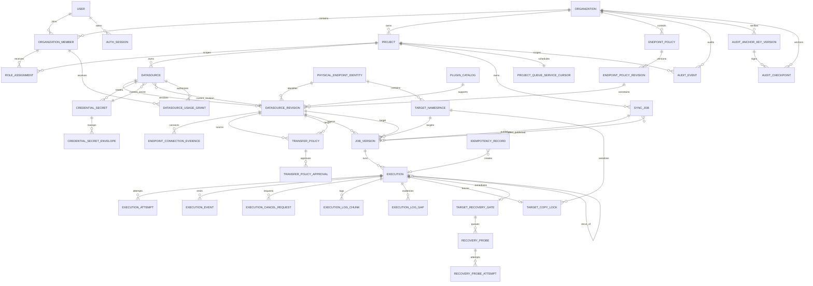

# DataX Enterprise Studio 数据库与领域模型设计

> 文档状态：V1.2 Windows 本地工作站工程候选；Discovery Gate 未取证，试点/发布 `BLOCKED`
>
> 模型版本：1.2
>
> 数据库：PostgreSQL 15
> 机器契约：[`contracts/job-spec.v1.schema.json`](./contracts/job-spec.v1.schema.json)、[`contracts/plugin-manifest.v2.schema.json`](./contracts/plugin-manifest.v2.schema.json)、[`contracts/audit-event.v1.schema.json`](./contracts/audit-event.v1.schema.json)。Plugin Manifest v1 仅保留为历史契约。

> 实现边界：当前迁移已包含数据库内追加式 AuditEvent 哈希链、由 `20260802_0018`
> 迁移建立的每组织 `audit_chain_watermarks`，`20260802_0019` 建立的
> `DatasourceUsageGrant.row_version`，以及 `20260802_0020` 建立、由 `20260802_0021/0022` 加固角色、
> 函数与 PEA 边界的私有 Phase-A qualification nonce/grant/execution-authorization 账本；所有应用审计 writer 在同一事务推进链头，
> readiness 只在水位线过期或变脏时重放。它们仍不能替代数据库外 WORM/签名锚点。
>
> `retention_holds` 保全登记，内部 `datax-studio-retention-maintenance` helper 可清理
> 到期日志正文、无引用的安全终态 Execution 组与幂等记录。由于
> `audit_anchor_key_versions`、`audit_checkpoints` 和数据库外 WORM 尚未实现，730 天到期
> AuditEvent 只会登记 `AUDIT_WORM_ANCHOR_UNAVAILABLE` 并阻断删除，绝不修改当前哈希链。
> DATA/SECRETS 分离加密导出、双包认证 journal 与全新空 staging 已实现并测到 E1；
> 新空 PostgreSQL volume、真实 `pg_restore`、证据重算、卷/secret 原子提交、异机恢复
> 和覆盖升级仍关闭。数据库外锚定与完整可恢复备份仍是发布前目标，不能把保留、导出、
> journal 或 staging helper 存在当作 WORM、完整恢复或 Windows E4 证据。迁移 0013 已
> 分离 owner/API/Worker 登录并禁止运行
> 角色 DDL/TEMP，但两个运行角色当前仍有相同的全表 DML；细粒度状态权限未由数据库强制。
> Phase-A ledger 是明确例外：`20260802_0020` 在 closed-default 私有 schema
> `des_phase_a_qualification` 建表，`20260802_0021` 把 schema/table/guard-function ownership 移给
> 无登录的专用 ledger owner，并撤销 `PUBLIC`、`datax_api`、`datax_worker`、`datax_egress_guard` 及
> issuer/consumer 的直接 schema/table/sequence/function 权限。只有无登录的 issuer/consumer 角色各自
> 获得最小 `SECURITY DEFINER` 函数执行权；函数以 `session_user` 再检 caller 且固定
> `search_path=pg_catalog,pg_temp`。0021 遇到任一私有角色名或成员关系预先存在时直接失败，不会
> 就地“规范化”未知 principal；它还为 ledger owner 撤销未来新建函数的全局 `PUBLIC EXECUTE` 默认权。
> 它仍不能被表述为完整职责隔离、可运行的资格通道或 HQA/RQA
> 信任根：标准产品没有这些角色的登录凭据或接线。
> ADR-0013 与 `contracts/runtime-db-write-matrix.v1.json` 已确定最小写权限目标和实现前
> blocker，但当前为 `ACCEPTED_BASELINE_NOT_GRANT_READY`，不得把该矩阵表述成已生效 grant
> 或可直接执行的 grant 脚本。

## 1. 设计目标

本模型保证以下事实可以被稳定追溯：

- 哪个用户在什么项目中，以哪些角色完成了什么操作；
- 一个任务当前草稿、校验状态和每个已发布版本的区别；
- 一次执行精确绑定的 JobVersion、Datasource 修订、Credential 版本、插件和 DataX Runtime；
- 一次执行精确绑定的 EndpointPolicyRevision、物理端点/表身份、解析 IP、出口策略证据和
  CredentialSecretEnvelope；
- 一次性复制的源静默确认、目标空表证据、目标活动锁、数据影响、独立核验结论和
  RecoveryProbe 事实；
- Worker/reconciler 如何公平领取、推进、取消和终结 Execution 或 RecoveryProbe；
- 日志、LogGap、状态事件、幂等结果、审计事件与外部 checkpoint 如何关联；
- 任何历史执行都不因后续编辑任务或轮换凭证而被改写。

SQLite 不属于 V1 支持路径。开发、测试和 Windows 本地工作站交付均以 WSL2 Linux
Compose 内 PostgreSQL 15 的约束与事务语义为准；Windows 文件或注册表不能成为业务事实
源，也不能在 PostgreSQL 不可用时提供降级状态。

## 2. 全局数据约定

| 主题 | 约定 |
|---|---|
| 主键 | UUID v4，数据库类型 `uuid` |
| 时间 | `timestamptz`，持久化 UTC，API 输出 RFC 3339 |
| 命名 | 表和字段使用 `snake_case`，枚举值使用大写 |
| 文本 | 业务名称先去首尾空格；空字符串不等于 `NULL` |
| 版本 | 可变聚合使用 `row_version bigint` 乐观锁；不可变版本使用单调 `version_no` |
| JSON | 仅在结构由 JSON Schema 或字段字典明确约束时使用 `jsonb` |
| 删除 | 项目、数据源、任务优先软删除；存在历史引用时禁止物理删除 |
| 金额/精度 | 不以 `float` 保存需要精确比较的数值 |
| 凭证 | 明文永不持久化；稳定 AEAD 密文与可重包裹 DEK Envelope 分表，KEK 版本不进入数据 AAD |
| 审计 | 当前：追加写、同库哈希链、不提供更新和删除业务接口；发布目标：链头周期性签名并锚定到数据库外 |

所有业务表都包含 `created_at`；可变业务表另含 `updated_at` 和 `row_version`。所有外键必须显式定义删除策略，不使用隐式级联删除历史事实。

### 2.1 Windows 本地工作站的物理持久化边界

领域模型不因桌面交付而改为嵌入式数据库。V1 的物理存储固定为：

| 数据类别 | 权威存储 | Windows 宿主可见位置 |
|---|---|---|
| PostgreSQL 数据/WAL | Docker named volume `des-postgres-data` | 不直接暴露路径；只由 Docker Desktop 管理 |
| 脱敏后的原序日志 | Docker named volume `des-log-data` | 不直接暴露路径；通过受控 API/备份导出 |
| 不含秘密的有界 oracle 工作区 | Docker named volume `des-workspace-data` | 不直接暴露路径；终态后按规则清理 |
| 含密 Job、DataX 进程工作目录、未脱敏 Runtime 临时文件 | Worker `/tmp/datax-studio-sensitive`，256 MiB tmpfs | 不持久化到 Windows 或 named volume；按 Attempt 清理 |
| DataX/JDK/Python/插件 | 固定摘要的只读 Linux worker 镜像 | 不安装到 Windows PATH |
| 非秘密部署配置与 secret 源文件 | ACL 受限目录或 Docker secret | `%LOCALAPPDATA%\DataXEnterpriseStudio\config`、`secrets` 子目录 |
| 系统备份导出（工程候选） | 配对、分离加密的 `.dxdata/.dxkeys` | 用户指定的两个彼此独立、本地且尚不存在的新叶子目录；无固定默认目录 |

Compose 清单可以引用 ACL 受限的非秘密配置文件和 Docker secret 名称，但密码、KEK、
token、完整数据库 DSN、明文 DataX 配置不得写入 `.env`、Windows 注册表普通值、快捷方式、
命令行或诊断包。Docker secret 在本地 Compose 中仍必须以 ACL 受限源文件为根，不得把
“使用了 secret 语法”当成宿主侧访问控制已经自动成立。

系统备份不是新的业务事实表。当前导出候选在安全停写后生成两个不同恢复秘密保护的包：
DATA 只含 custom-format PostgreSQL 逻辑 dump、脱敏日志和三个固定发布元数据；SECRETS
单独含四类数据库角色密码、JWT/HMAC 和受支持 KEK，并通过 backup ID 与 DATA 配对。
物理 PostgreSQL volume/WAL、workspace、`job.json`、未脱敏日志和审计签名私钥不得进入
DATA。导出先写受限临时位置，完成 allowlist、secret scan、清单、逐文件 SHA-256 和全包
自检后才以不覆盖方式发布；失败产物不得呈现为备份。内部 helper 还会完整认证与配对
双包，以两把恢复秘密认证 journal，并只解包到全新空 staging；成功状态固定为
`RESTORE_STAGED_COMMIT_BLOCKED`，只构成 E1 证据。新空 PostgreSQL volume、真实
`pg_restore`、数据库/审计链/日志/密钥证据重算、卷/secret/installation-id 原子提交和
异机 Windows 恢复尚未实现，所以导出包、journal 或 staging 存在不能证明系统可恢复。

私有 schema `des_phase_a_qualification`（其中的 `phase_a_qualification_nonces`、
`phase_a_qualification_grants` 与 `phase_a_execution_authorizations`）不是可携带的应用业务状态。标准 system backup 与 diagnostics
必须以固定 `--exclude-schema=des_phase_a_qualification` 从逻辑 dump、归档、导出清单、诊断 SQL
输出和支持包中排除整个 schema，不能把 nonce SHA-256、P/harness/plugin binding、grant/PEA 事实、
schema 内触发器、私有 ledger guard functions 或私有 0021/0022 `SECURITY DEFINER`
issuer/consumer entrypoints 复制到恢复目标。`public.des_phase_a_execution_mode_guard()` 不属于该
私有 schema：它必须与 public `executions` trigger 一起进入标准 dump/restore，仍由无登录 ledger owner
持有且向普通调用者撤销执行权。候选 launcher 的 schema exclusion、TOC 与临时库 restore probe 已在本轮
真实 PostgreSQL 15 E2 跑通，但至多是 dump 边界 E2，不是完整 restore、DataX E3 或 Windows E4。完整 restore 当前仍
`BLOCKED`：恢复库会带 `alembic_version=20260802_0023` 而没有私有 schema。未来 restore bootstrap 必须
创建空 ledger、轮换并强制当前 post-restore issuance epoch，要求重新签发与重新消费资格，不能从
备份、诊断包或旧 ledger 重放 grant。

0022 额外引入 public `Execution.authorization_mode`，所以只排除 private schema 仍不充分：任何
`PHASE_A_HARNESS` Execution 及其按 execution ID 关联的日志都可能落在标准 DATA 输入中。当前 Launcher 在
`pg_dump` 前后（PostgreSQL 停止前）以固定 query 重验不存在这类 public Execution；存在返回
`BACKUP_PHASE_A_PRIVATE_EXECUTION_PRESENT`，`psql` 完成但非零返回
`BACKUP_PHASE_A_PRIVATE_EXECUTION_CHECK_FAILED`，子进程错误同样失败关闭。当前没有受保护 Phase-A backup/restore，不能通过 table/log
过滤把标准包改称为 private backup。

## 3. 聚合与关系



### 3.1 聚合边界

- **Identity 聚合**：Organization、User、OrganizationMember、RoleAssignment、AuthSession。
- **Project 聚合**：Project 及项目级授权范围。
- **Datasource 聚合**：EndpointPolicy 身份及不可变 EndpointPolicyRevision、
  PhysicalEndpointIdentity、Datasource 身份、不可变 DatasourceRevision、CredentialSecret
  及其可重包裹 Envelope、DatasourceUsageGrant 和精确作用域 TransferPolicy；密码/KEK
  轮换不改写历史修订或业务密文。
- **Job 聚合**：SyncJob 的可变草稿和不可变 JobVersion。
- **Execution 聚合**：Execution、Attempt、Event、CancelRequest、LogChunk、TargetCopyLock
  和 TargetRecoveryGate；TargetNamespace 是跨 JobVersion 的不可变物理表锁命名空间。
- **Recovery 聚合**：RecoveryProbe、RecoveryProbeAttempt 及独立 lease/fence；不得复用
  ExecutionAttempt 假装恢复探针已被围栏。
- **Queue 聚合**：项目级持久公平服务游标，统一服务 Execution 与 RecoveryProbe 事实。
- **Audit 聚合**：追加式 AuditEvent 哈希链与每组织 AuditChainWatermark；审计公钥 keyring
  及数据库外签名锚点元数据是未实现的发布目标。
- **Phase-A Qualification Ledger（私有发布辅助聚合）**：`P → QH → PAG → QR` 链中，
  当前记录已验证 QH 的 nonce 重放事实、精确 payload/harness/Reader-Writer binding，以及一条 PAG
  到一条已有 `PHASE_A_HARNESS` Execution 的不可变 PEA 快照。它不属于普通插件目录、普通
  Execution、审计或公开发布事实；PEA 无跨 public `executions` 的表级外键和独立 state，而由受限
  issuer/read functions 锁定并联结核验。任何标准 API/Worker 可访问路径仍不存在。

跨聚合引用使用 UUID；跨聚合状态变更必须经应用服务和事务完成。

## 4. 身份、组织与项目

### 4.1 `organizations`

V1 只能存在一个 `ACTIVE` 组织。

| 字段 | 类型 | 必填 | 说明 |
|---|---|---:|---|
| `id` | uuid | 是 | 主键 |
| `name` | varchar(128) | 是 | 组织显示名 |
| `status` | enum | 是 | `ACTIVE`、`SUSPENDED` |
| `created_at` | timestamptz | 是 | 创建时间 |
| `updated_at` | timestamptz | 是 | 修改时间 |
| `row_version` | bigint | 是 | 初始 1 |

约束：部分唯一索引保证最多一个 `status='ACTIVE'` 的组织。

### 4.2 `users`

| 字段 | 类型 | 必填 | 说明 |
|---|---|---:|---|
| `id` | uuid | 是 | 主键 |
| `email` | citext | 是 | 登录名，组织内唯一 |
| `display_name` | varchar(128) | 是 | 显示名 |
| `password_hash` | text | 是 | Argon2id 哈希 |
| `must_change_password` | boolean | 是 | 初始/重置密码后为 true |
| `password_changed_at` | timestamptz | 是 | 最近改密时间 |
| `status` | enum | 是 | `ACTIVE`、`LOCKED`、`DISABLED` |
| `failed_login_count` | integer | 是 | 默认 0，不小于 0 |
| `locked_until` | timestamptz | 否 | 临时锁定截止时间 |
| `last_login_at` | timestamptz | 否 | 最近成功登录 |
| `created_at` | timestamptz | 是 | 创建时间 |
| `updated_at` | timestamptz | 是 | 修改时间 |
| `row_version` | bigint | 是 | 乐观锁 |

禁止保存可逆密码、密码提示或 refresh token 明文。

本人改密、Admin 重置密码或停用用户时必须撤销该用户的其他 AuthSession；Admin 解锁时原子清零 `failed_login_count` 并清空 `locked_until`。Admin 设置的临时密码只出现在 write-only 请求体，响应不回显。

会修改认证会话的 refresh、logout、停用用户、重置密码、本人改密和本机 Admin 恢复统一
按 `Organization → User（UUID 升序）→ OrganizationMember → AuthSession（UUID 升序）`
取得行锁。允许在锁前只读定位候选身份，但取得规范锁后必须重新校验 token hash、
session/user/organization 绑定和撤销状态；不得根据锁前快照推进会话状态。

所有有效 Admin 均被锁定时，本机离线恢复 CLI 可在组织行锁保护下恢复一名
`LOCKED` Admin：设置新的 Argon2id 临时密码、置 `must_change_password=true`、撤销全部
旧 AuthSession，并与 `SYSTEM_RECOVER_ADMIN` 审计事件同事务提交。仍有有效 Admin 或目标
不是具有活动组织成员关系的组织级 Admin 时必须拒绝；不得恢复 `DISABLED` 用户。

唯一约束：`lower(email)` 全局唯一；V1 只有一个 Organization，因此它同时满足组织内唯一语义。

### 4.3 `organization_members`

| 字段 | 类型 | 必填 | 说明 |
|---|---|---:|---|
| `id` | uuid | 是 | 主键 |
| `organization_id` | uuid | 是 | FK → organizations |
| `user_id` | uuid | 是 | FK → users |
| `status` | enum | 是 | `ACTIVE`、`SUSPENDED` |
| `joined_at` | timestamptz | 是 | 加入时间 |

唯一约束：`(organization_id, user_id)`。

### 4.4 `role_assignments`

一个用户可以同时拥有多个角色，授权结果取并集。

| 字段 | 类型 | 必填 | 说明 |
|---|---|---:|---|
| `id` | uuid | 是 | 主键 |
| `organization_member_id` | uuid | 是 | FK → organization_members |
| `scope_type` | enum | 是 | `ORGANIZATION`、`PROJECT` |
| `scope_id` | uuid | 是 | 对应 Organization 或 Project ID |
| `role` | enum | 是 | `ADMIN`、`DEVELOPER`、`OPERATOR`、`VIEWER` |
| `granted_by` | uuid | 是 | FK → users |
| `created_at` | timestamptz | 是 | 授权时间 |

约束：

- `(organization_member_id, scope_type, scope_id, role)` 唯一。
- `ORGANIZATION` 作用域在 V1 仅允许 `ADMIN`。
- `DEVELOPER`、`OPERATOR`、`VIEWER` 必须为 `PROJECT` 作用域。
- 项目必须属于成员所在组织。
- 用户在项目中的有效权限为组织级 Admin 与项目级角色的并集。
- 角色并集只决定产品操作能力，不自动授予数据移动权。Developer 使用数据源还必须有
  `DatasourceUsageGrant`；发布和执行还必须匹配 `ACTIVE TransferPolicy`。
- 只有组织级 Admin 可管理 EndpointPolicy、Datasource、使用授权和 TransferPolicy。
  `SENSITIVE` TransferPolicy 需要两个不同 Admin 的批准，不能通过给同一用户叠加角色绕过。

### 4.5 `auth_sessions`

| 字段 | 类型 | 必填 | 说明 |
|---|---|---:|---|
| `id` | uuid | 是 | refresh session ID |
| `user_id` | uuid | 是 | FK → users |
| `token_hash` | bytea | 是 | refresh token 的 HMAC/SHA-256，不保存 token |
| `family_id` | uuid | 是 | 旋转 token 家族 |
| `rotated_from_id` | uuid | 否 | FK → auth_sessions |
| `issued_at` | timestamptz | 是 | 签发时间 |
| `expires_at` | timestamptz | 是 | 到期时间 |
| `last_used_at` | timestamptz | 否 | 最近使用 |
| `revoked_at` | timestamptz | 否 | 撤销时间 |
| `revoke_reason` | varchar(64) | 否 | 撤销原因代码 |
| `ip_hash` | bytea | 否 | 可选隐私化来源标识 |

同一家族出现已轮换 token 重放时，撤销整个 family。

### 4.6 `projects`

| 字段 | 类型 | 必填 | 说明 |
|---|---|---:|---|
| `id` | uuid | 是 | 主键 |
| `organization_id` | uuid | 是 | FK → organizations |
| `name` | varchar(128) | 是 | 项目名 |
| `slug` | varchar(64) | 是 | URL/检索稳定标识 |
| `description` | varchar(1000) | 否 | 描述 |
| `status` | enum | 是 | `ACTIVE`、`ARCHIVED` |
| `created_by` | uuid | 是 | FK → users |
| `archived_by` | uuid | 否 | FK → users |
| `archived_at` | timestamptz | 否 | 归档时间 |
| `created_at` | timestamptz | 是 | 创建时间 |
| `updated_at` | timestamptz | 是 | 修改时间 |
| `row_version` | bigint | 是 | 乐观锁 |

唯一约束：`(organization_id, lower(slug))`、`(organization_id, lower(name))`。归档项目禁止创建或修改数据源、任务和执行，但保留只读历史。

`slug` 创建后不可修改，格式为 `^[a-z][a-z0-9-]{2,63}$`。

## 5. 数据源、凭证与插件

### 5.1 `kek_key_versions`

此表只保存外部 KEK keyring 的非秘密注册信息，不保存 KEK 字节。Windows 本地工作站的
keyring 源文件只能位于 `%LOCALAPPDATA%\DataXEnterpriseStudio\secrets` 的 ACL 受限目录，
并以 Docker secret/只读挂载交给 backend/worker；Setup、launcher 命令行、`.env`、
诊断导出和普通数据库备份不得包含 KEK 字节。

| 字段 | 类型 | 必填 | 说明 |
|---|---|---:|---|
| `key_version` | varchar(64) | 是 | 主键；必须能解析到外部 keyring 唯一文件/槽位 |
| `purpose` | enum | 是 | V1 固定 `CREDENTIAL_DEK_WRAP` |
| `wrapping_algorithm` | varchar(32) | 是 | V1 固定 `AES-256-KWP` |
| `status` | enum | 是 | `ACTIVE`、`DECRYPT_ONLY`、`RETIRED`、`DESTROYED` |
| `fingerprint_sha256` | char(64) | 是 | 公共指纹，不是密钥 |
| `activated_at` | timestamptz | 是 | 启用时间 |
| `decrypt_until` | timestamptz | 否 | 计划停止解密时间 |
| `retired_at` | timestamptz | 否 | 退役时间 |
| `destroyed_at` | timestamptz | 否 | 经审批销毁时间 |
| `created_at` | timestamptz | 是 | 登记时间 |

同一时刻只允许一个 `ACTIVE` 写入 KEK；`DECRYPT_ONLY` 可解包历史 DEK 但不用于新密文。
任何仍被活动 `credential_secret_envelopes`、活动运行或保留期内备份引用的版本不得进入
`DESTROYED`。服务 readiness 必须证明所有 `ACTIVE/DECRYPT_ONLY` 版本在容器内只读
keyring 中可用且指纹匹配，同时 launcher 前置检查必须证明宿主源目录没有向其他本机用户
或普通用户组开放读取。

### 5.2 `credential_secrets` 与 `credential_secret_envelopes`

`credential_secrets` 保存稳定的业务密文和生命周期；重包裹 DEK 不更新此表：

| 字段 | 类型 | 必填 | 说明 |
|---|---|---:|---|
| `id` | uuid | 是 | Secret 版本 ID |
| `datasource_id` | uuid | 是 | FK → datasources |
| `secret_version` | integer | 是 | 从 1 单调增加 |
| `ciphertext` | bytea | 是 | AEAD 密文 |
| `nonce` | bytea | 是 | 唯一 nonce |
| `data_algorithm` | varchar(32) | 是 | V1 固定 `AES-256-GCM` |
| `aad_schema_version` | varchar(16) | 是 | V1 固定 `1.0` |
| `status` | enum | 是 | `ACTIVE`、`RETIRED`、`REVOKED`、`COMPROMISED` |
| `status_reason_code` | varchar(64) | 否 | 脱敏稳定原因码 |
| `created_by` | uuid | 是 | FK → users |
| `created_at` | timestamptz | 是 | 创建时间 |
| `status_changed_at` | timestamptz | 是 | 最近生命周期变更 |
| `retired_at` | timestamptz | 否 | 不再允许新 Execution 领取 |
| `revoked_at` | timestamptz | 否 | 紧急撤销时间 |
| `compromised_at` | timestamptz | 否 | 确认或疑似泄露时间 |

唯一约束：`(datasource_id, secret_version)`。数据 AEAD 的 AAD 必须稳定且与 KEK 轮换
解耦，V1 精确定义为以下 UTF-8 字节；UUID 使用小写连字符形式，末尾不追加换行：

```text
aad = UTF8(
  "DXCREDENTIALv1\n" ||
  organization_id_lowercase_uuid || "\n" ||
  project_id_lowercase_uuid || "\n" ||
  datasource_id_lowercase_uuid || "\n" ||
  credential_secret_id_lowercase_uuid || "\n" ||
  secret_version_base10_without_leading_zero || "\n" ||
  aad_schema_version || "\n" ||
  data_algorithm
)
```

`kek_version`、Envelope ID/版本和包裹算法严禁进入数据 AEAD AAD，否则只重包裹 DEK 会
破坏已有业务密文的认证。`credential_secret_envelopes` 单独保存 DEK 的包裹版本：

| 字段 | 类型 | 必填 | 说明 |
|---|---|---:|---|
| `id` | uuid | 是 | Envelope ID |
| `credential_secret_id` | uuid | 是 | FK → credential_secrets |
| `envelope_version` | integer | 是 | 每个 secret 从 1 单调增加 |
| `encrypted_dek` | bytea | 是 | 由指定 KEK 包裹的数据密钥 |
| `kek_version` | varchar(64) | 是 | FK → kek_key_versions |
| `wrapping_algorithm` | varchar(32) | 是 | V1 固定 `AES-256-KWP` |
| `status` | enum | 是 | `ACTIVE`、`SUPERSEDED` |
| `wrapped_dek_sha256` | char(64) | 是 | 包裹结果完整性/审计指纹，不是 DEK |
| `created_by` | uuid | 是 | FK → users/系统轮换主体 |
| `created_at` | timestamptz | 是 | 创建时间 |
| `superseded_at` | timestamptz | 否 | 被新 Envelope 替代时间 |

唯一约束：`(credential_secret_id, envelope_version)`；部分唯一索引保证每个 secret 最多一个
`ACTIVE` Envelope。重包裹事务插入新 Envelope、切换 ACTIVE/SUPERSEDED 并写审计，
`credential_secrets.ciphertext/nonce/AAD` 保持逐字节不变。活动运行已经固定的旧 Envelope
在其结束前不得删除；保留期内数据库备份仍要求相应旧 KEK 可用。

状态迁移是单向的：只有 Datasource 已在同一轮换流程切换到另一枚 `ACTIVE` current secret 后，
旧 `ACTIVE` secret 才可 `→ RETIRED/REVOKED/COMPROMISED`；直接退役 current secret 必须以
`CREDENTIAL_STATUS_CONFLICT` 拒绝，避免 `RESERVED` Execution 或恢复 Probe 等待一个不能再
领取的凭据。轮换后才发现泄露时允许 `RETIRED → REVOKED/COMPROMISED`；
`REVOKED/COMPROMISED` 是终态，任何版本都不能重新 `ACTIVE` 或降级。只有 `ACTIVE` secret
可被新的 Execution/RecoveryProbe 领取；`RETIRED` 仅允许已在领取事务中固定它的活动工作继续，
不能被新工作采用。其后若升级为
`REVOKED/COMPROMISED`，必须立即禁止解密与新连接，并原子产生所有已绑定该 secret 的
非终态工作之紧急终止事实；若该 secret 仍是 current secret，还必须覆盖尚未绑定 secret、
但不可变引用该 DatasourceRevision 的排队 Execution/RecoveryProbe。密文、nonce、Envelope
和 DEK 不进入普通业务日志、API 或审计变化详情。

### 5.3 `plugin_catalog`

V1 为只读种子表，仅四条记录。

| 字段 | 类型 | 必填 | 说明 |
|---|---|---:|---|
| `id` | uuid | 是 | 主键 |
| `manifest_name` | varchar(64) | 是 | 平台 manifest 名 |
| `manifest_version` | varchar(32) | 是 | V1 固定 `1.0` |
| `engine` | enum | 是 | `MYSQL_8`、`POSTGRESQL_15` |
| `direction` | enum | 是 | `READER`、`WRITER` |
| `datax_plugin_name` | varchar(64) | 是 | 四个白名单插件之一 |
| `datax_release` | varchar(32) | 是 | `datax_v202309` |
| `artifact_sha256` | char(64) | 是 | 插件制品哈希 |
| `manifest_json` | jsonb | 是 | 符合 plugin manifest schema |
| `enabled` | boolean | 是 | 默认 true |
| `created_at` | timestamptz | 是 | 安装镜像构建时间 |

唯一约束：`(datax_plugin_name, datax_release)`。生产运行时启动自检必须比较 manifest 和实际 JAR SHA-256。

### 5.3.1 私有 schema `des_phase_a_qualification` 中的 nonce/grant ledger

> **状态：E1 持久化和 PostgreSQL 角色/函数基础件，且本轮真实 PostgreSQL 15 E2 已覆盖 0021/0022/0023 数据库边界（脚本退出 `0`，pytest `30 passed`）。** 前两张 PostgreSQL
> ledger 表位于 closed-default `des_phase_a_qualification` schema，由 `20260802_0020` 创建；
> `20260802_0021` 将对象 ownership 转给无登录 ledger owner，并创建只供未来私有 harness 使用的
> issuer/consumer `SECURITY DEFINER` entrypoints；`20260802_0022` 再增加第三张 append-only PEA 表及其
> issuer authorize/consumer read 边界；`20260802_0023` 只增加复用 public global lock 的 NOLOGIN runner
> SQL primitive，不增加私有 lock 表或产品 runner。它们服务于 ADR-0011 未来
> `P → QH → PAG → QR` 的 Phase-A 私有 qualification，不写入 `plugin_catalog`、公开 Plugin
> Manifest 或普通 Execution，不能
> 派生 `E3_CERTIFIED`、`WINDOWS_E4_CERTIFIED`、`ordinary_user_executable`、QR、最终 F
> 或公开发布结论。

`phase_a_qualification_nonces` 是一次性 QH nonce 的追加式重放账本：

| 字段 | 类型 | 必填 | 说明 |
|---|---|---:|---|
| `id` | uuid | 是 | 内部 nonce record ID |
| `issuer_key_id` / `qualification_id` | varchar(128) | 是 | 已验证 QH 的 issuer 与资格标识；各自与 issuer 的组合唯一 |
| `nonce_sha256` | char(64) | 是 | 原始 QH nonce 的 SHA-256；**原始 nonce 永不持久化** |
| `payload_root_sha256` | char(64) | 是 | 被消费 QH 绑定的 P root |
| `valid_until` / `consumed_at` / `created_at` | timestamptz | 是 | QH 有效期与消费边界；消费必须在有效期内 |

约束为 `(issuer_key_id, nonce_sha256)` 与 `(issuer_key_id, qualification_id)` 全局唯一，
行只允许 INSERT，禁止 UPDATE、DELETE、TRUNCATE。该表不存 QH 原文、签名、公钥、凭据、
命令或测试结果。

`phase_a_qualification_grants` 是与一个已消费 nonce 一对一的 PAG 事实：

| 字段组 | 必填 | 说明 |
|---|---:|---|
| `id` / `nonce_id` | 是 | PAG 主键及 `RESTRICT` 外键；一个 nonce 最多一个 grant |
| P binding | 是 | `payload_binding_sha256`、`payload_root_sha256`、`candidate_commit`、`worker_image_digest`、`datax_release`、`runtime_sha256` |
| 选择的插件对 | 是 | `reader_plugin_name/sha256`、`writer_plugin_name/sha256`；仅当前四个 V1 Reader/Writer 名称 |
| harness binding | 是 | `harness_identity`、environment ID/manifest SHA-256、harness version |
| QH binding | 是 | QH document SHA-256、issuer/qualification ID、`issued_at/not_before/valid_until`；不保存原始 nonce |
| 生命周期 | 是 | `ACTIVE`、`REVOKED`、`EXPIRED` 与创建、撤回/到期时间和受限撤回原因 |

grant 的 P、harness、QH 和插件 binding 均不可修改；触发器只允许
`ACTIVE → REVOKED | EXPIRED` 的单调终态转换，并校验它与 nonce ledger 的 issuer、
qualification、payload root、有效期与消费顺序一致。`20260802_0021` 的 issuer entrypoint 必须在
同一个数据库事务中插入 nonce 消费行和 grant，consumer entrypoint 只在 grant 仍 `ACTIVE`、当前
有效时读取它，并在过期时先把它转为 `EXPIRED`。grant 本身刻意没有 `execution_id`：`20260802_0022`
以独立、不可变的 `phase_a_execution_authorizations`（PEA）完成该一对一 binding；其 `grant_id` 和
`execution_id` 各自 `UNIQUE`，不是把 grant 改为可变。PEA issuer 从锁定的 existing
`PHASE_A_HARNESS` Execution/JobVersion/当前 revision/policy/namespace/PAG 快照插入；PEA consumer
只有在 PAG 仍 `ACTIVE`、QH 时间窗有效且所有当前事实逐项相等时才返回记录。PEA JSON Schema 描述
这个 read record，不能用可变的事后关联或 JSON 自报绕过 binding。

迁移以 closed-default schema、`REVOKE ALL ON SCHEMA/TABLE/FUNCTION` 使 `PUBLIC`、标准运行角色
（`datax_api`、`datax_worker`、`datax_egress_guard`）和 issuer/consumer 都不能直接读写表或序列。
只有专用无登录 issuer 可执行 nonce/PAG 签发、撤回和 PEA authorize 函数，专用无登录 consumer
可执行 current-grant 与 PEA read 函数；0023 的专用无登录 runner 仅可执行精确的 lock/fence
函数，不能直接查询/写入 public lock/attempt 表；三个函数集合均不能互相替代。`qualification.execution_authorization`
的 private adapter 只能使用由未来受保护 harness 显式注入的专用 Engine，并不得接受请求体、Settings
或环境变量的 grant/role/DSN；它只 authorize/read/reconstruct binding，不创建/claim/reconcile Execution、
不解密凭据也不启动 DataX。
它仍不是 protected issuer 的完整调用链：虽有 PEA ledger/issuer/consumer，但没有私有
Execution 创建/`rerun`、私有 API/Worker/Compose override、QH/PEA source、受保护 harness、四检查点
或真实跨进程运行路径；migration owner/数据库管理员也不是 HQA/RQA 信任根。标准启动与普通产品路径继续
production deny-all。

该 ledger 还必须与标准 backup/diagnostics 隔离：逻辑 dump 与诊断输出不得包含完整
`des_phase_a_qualification` schema，restore 不得把它带到新实例。当前 restore 仍不能启动：
dump 会保留 `alembic_version=20260802_0023` 却排除该 schema。未来 protected restore bootstrap 才能创建
空 ledger 与新的 post-restore issuance epoch；这条规则尚未由当前 E1 代码实现，不能将 schema
存在、触发器或候选 schema-exclusion/TOC/临时库检查包装为恢复后的 authority 安全证明。
当前标准 backup 还在 `pg_dump` 前后（PostgreSQL 停止前）阻断任何 public
`PHASE_A_HARNESS` Execution；未来若有 diagnostics/export 会读取 public execution 或日志，同样必须接入该
gate，否则不得导出这些对象。

### 5.3.2 J0b.1 私有 `phase_a_execution_authorizations`

> **状态：E1 数据库授权基础已实现；本轮真实 PostgreSQL 15 E2 已验证 0022 的授权、普通路径拒绝和 runtime-role RLS，以及 0023 global lock/fence（脚本退出 `0`，pytest `30 passed`）。**
> `phase-a-execution-authorization.v1.schema.json` 精确描述受限 consumer 函数
> `des_read_active_phase_a_execution_authorization(uuid)` 的私有读取记录形状。它不是 HTTP/OpenAPI
> 契约，不代表私有 Worker 路径已经接线，也不构成任何真实 DataX/Windows 验收。

`20260802_0022` 在 `des_phase_a_qualification` 新增该表；其不可退化约束为：

| 字段组 | 当前数据库约束/读取语义 | 目的 |
|---|---|---|
| `id` / `grant_id` / `execution_id` | PEA 主键；`grant_id` 对私有 PAG 使用 `RESTRICT` 外键；`UNIQUE(grant_id)` 和 `UNIQUE(execution_id)`；`execution_id` 的 public 事实由 authorize/read 函数锁定和联结，而非表级 FK | 一个既有 PAG 只能经独立 PEA 绑定一个精确 Execution；同一 Execution 绝不能有第二条或可替换授权 |
| JobVersion | `project_id`、`job_id/job_version_id`、`job_spec_hash`、`job_version_artifact_hash`、source physical-table hash、选定 pair/runtime | 绑定不可变 JobVersion，而不是可编辑 Job 或调用方输入 |
| 两侧 Datasource/Policy | 每端 `DatasourceRevision` ID+`config_hash`、`EndpointPolicyRevision` ID+`policy_hash`、PhysicalEndpointIdentity ID+server hash | 防止同一资源 ID 后续改配置、改网络边界或换物理服务器 |
| Transfer/Target | `transfer_policy_id`、`scope_hash`、`row_version`；`target_namespace_id`、目标 physical table identity hash、normalization version | 固定精确授权列范围和跨 revision 的真实目标锁命名空间 |
| PAG/QH 交叉摘要 | 只保存已消费 `nonce_sha256`（绝不保存原始 nonce）、P root/binding、candidate commit、Worker image/runtime、harness manifest、QH document、selected Reader/Writer JAR 与 QH 时间窗 | reader 必须同时验证 PEA、PAG 与 JobVersion 仍为同一候选，且不保存 raw nonce、凭据、连接信息或表名 |
| 生命周期 | PEA 是 append-only record，**不存独立 `state`**；`ACTIVE`/有效性只由 PAG 的当前 state、QH 时间窗和 read 函数的全量一致性联结派生 | PAG 撤回/过期、时间失效或任一事实错配都让读取失败关闭；不得伪造 PEA lifecycle |

issuer 的 `des_authorize_phase_a_execution` 只能由专用 issuer session user 调用；它锁定 PAG 和一条
已存在、`authorization_mode=PHASE_A_HARNESS`、尚未领取、且因为
`PHASE_A_AUTHORIZATION_PENDING` 阻塞的 Execution，验证仍有效的 PAG/QH 及全部 immutable facts，再从
当前 public facts 插入 PEA，并原子保持该 private Execution 为 `BLOCKED`，将原因改为
`PHASE_A_PRIVATE_WORKER_NOT_IMPLEMENTED`；它**不会**使其 queue-eligible。它不接收普通 API 请求体、
Settings、环境变量、进程内 dataclass 或调用方提供的 JSON 作为绑定事实。

consumer 的 `des_read_active_phase_a_execution_authorization` 只能由专用 consumer session user 调用；
它锁定并重读 PAG、Execution、JobVersion、两个 revision/policy/physical identity、TargetNamespace 和
TransferPolicy，只有所有摘要、ID、状态和时窗仍相等才返回 PEA。这个函数也不会创建 Execution、启动
DataX 或使标准 Worker 领取它。普通 API 创建的 Execution 固定为 `STANDARD`，普通 Worker 的 claim
以及 normal recovery/reconciler 明确只处理 `STANDARD`，所以不能把 PEA record 当作标准产品 bypass。

读取函数还必须把“引用仍存在”收紧为“当前仍可用”：Project 必须 `ACTIVE`、Job 必须 `PUBLISHED`；
源/目标 Datasource 必须属于该 Project、`ACTIVE` 且 current revision 仍是快照 revision；两个
EndpointPolicy 必须属于同一 Organization、`ACTIVE` 且 current revision 仍是快照 revision；PhysicalEndpointIdentity
必须同 Organization/engine 作用域一致；TargetNamespace 必须仍指向目标 physical identity/engine；
TransferPolicy 必须仍属该 Project、绑定同一 source/target revision 与 physical identities、`ACTIVE`、scope hash
和 row version 不变；目标外部独占必须仍 `ACTIVE` 且无撤回事实；Reader/Writer 名称还必须与两端 engine
相配。任一 parent/current/scope/engine/pair 漂移都使 read 返回空而不是沿用旧 PEA。

普通 API 的创建、查询、取消、重跑与目标独占操作，普通 Worker 的 claim/start/reconcile，以及
Recovery 和日志读取路径均限定为 `STANDARD`；它们不可见、不可变、不可 claim、不可 reconcile，
也不可读取 `PHASE_A_HARNESS` 的私有 Execution/PEA。私有 consumer adapter 仅为未来受保护
harness 的四检查点提供失败关闭的 read/reconstruct，不是对普通接口的例外。

`20260802_0022` 进一步把这条普通路径隔离下沉到 PostgreSQL：对 `datax_api`、`datax_worker`、
`datax_egress_guard` 启用 parent-linked RLS。除 `executions` 外，`execution_attempts`、
`target_copy_locks`、`execution_events`、`execution_cancel_requests`、`execution_log_chunks`、
`execution_log_gaps`、`recovery_gates`、`recovery_probes`、`recovery_probe_attempts`、
`endpoint_connection_evidences` 和 `work_termination_requests` 均只允许其标准父链可见/可写；直接 DB
连接也不能通过子表恢复或修改 private row。仅无登录 ledger owner 的 `SECURITY DEFINER` 函数为其受限
授权/read 工作看见 private parent，运行角色没有此例外。这一 migration/RLS 边界已在本切片真实 PostgreSQL E2
中验证；它仍不是 private runner、E3 或 E4 证据。

仍缺少私有 Execution 创建/`rerun` 入口、私有 Worker 领取/启动四检查点、Compose credential
provisioning、QH/PAG/PEA private source/override、受保护 harness、真实 DataX E3 和 QR。每个未来
private rerun 必须产生新的 Execution 与新的 PEA；PEA 也不替代普通授权、CredentialSecret 状态、源静默、
目标独占、TargetCopyLock、egress 或独立 oracle。标准路径继续 production deny-all。
当前没有私有 Phase-A Worker/runner，private row 在标准运行面保持硬禁用。0023 已实现的 global
lock/fence SQL primitive 复用而非替代标准 `TargetCopyLock`：私有 reservation 和 standard reservation
对同一 TargetNamespace 互斥，且普通 runtime RLS 隐藏 private row 后 standard path 仍以通用冲突失败。
启用前仍须以独立纵向切片实现完整 PEA/current-fact/源静默与目标外部独占 confirmation、可关联
execution/fence 的受保护 audit checkpoint，以及专用凭据、私有日志、进程树与崩溃对账维护路径；0023 的
function 不能替代这些门禁。

该表已位于完整私有 schema，因此标准 backup、diagnostics 和 restore 输入必须与 nonce/grant 一同
排除；标准 backup 还必须在 `pg_dump` 前后阻断任一 `PHASE_A_HARNESS` public Execution，恢复后的 issuer
也不得复活任何旧 PEA。当前 schema exclusion 与 backup gate 均不等于已经实现 restore bootstrap、
post-restore issuance epoch 或 PEA 的真实 E2 恢复演练。

### 5.3.3 J0b.1 私有 global `TargetCopyLock` / fencing 前置原语

> **状态：0023 的 E1 数据库原语与 PostgreSQL 15 E2 已完成；不是 private runner。**
> `phase-a-execution-lock.v1.schema.json` 仅描述 protected reader 返回的非秘密 lifecycle/fence
> 形状；不是 HTTP/OpenAPI，也不构成 DataX E3、Windows E4 或私有 harness 验收。

`20260802_0023` **不创建** `phase_a_execution_locks` 或第二个 namespace unique index。私有
`PHASE_A_HARNESS` 必须复用既有 public `target_copy_locks`、`execution_attempts` 和
`executions.fence_epoch`，所以同一 `target_namespace_id` 在任一时刻只可有一个未释放
`RESERVED/ACTIVE/RECOVERY_REQUIRED` lock，不因 authorization mode 分裂：

| 事实 | 0023 受限语义 | 不能误读为 |
|---|---|---|
| `TargetCopyLock` | runner reserve 写 public global `RESERVED`；standard/API 即使因 RLS 看不到 private row，也会在同一 partial unique index 得到冲突，服务层只映射通用 `TARGET_ACTIVE_EXECUTION` | private 与 standard 可以并发写同一物理目标，或普通调用者可看到 private identity |
| `Execution.fence_epoch` / `ExecutionAttempt` | claim 在一个事务中创建 attempt、单调加 fence、写 `STARTING` 和 global lock `ACTIVE`；同一 execution 第二次 claim 与旧 fence heartbeat 均失败 | 已有 DataX 进程、Popen、私有 queue 或自动 retry |
| lease / process identity | attempt 仅记录受限 `worker_id`、`host_boot_id`、`cgroup_identity` 和 lease-token SHA-256；reader 永不返回 token/hash | 已对真实 host/process tree 建立可信取证或崩溃对账 |
| `RECOVERY_REQUIRED` | fenced holder 可失败关闭进入 `LOST/UNKNOWN/INCONCLUSIVE`，lock 不释放；只有相同 token/fence 的受限 release 在 terminal 状态可转 `RELEASED` | 自动清理、重新领取、自动再次执行或普通 recovery 可处理 private work |
| PAG / PEA 检查 | reserve/claim/heartbeat 需要 PEA 存在及 PAG/QH active window；PAG revoke/expiry 使 heartbeat 失败关闭 | 已完成 consumer read 的全量 current-fact、确认、审计或凭据检查点 |

角色边界同样是事实的一部分：`datax_phase_a_runner` 由 migration 创建为 `NOLOGIN`、无成员关系，标准
Settings、Compose、Launcher、API、Worker 都没有其凭据。它只有 private schema usage 和六个
`SECURITY DEFINER` function execute 权；没有 public lock/attempt 的直接 DML。ledger owner 通过额外
RLS policy 仅在这些 functions 内看到 private parent；`datax_api`、`datax_worker`、
`datax_egress_guard` 仍对 private execution、lock 和 attempt 不可见。临时 PostgreSQL 15 E2 已验证
migration downgrade/upgrade、global unique-conflict、RLS、double claim、stale fence 与 PAG revoke heartbeat
fail-closed；这仍是数据库 E2，未启动任何实际 runner 或 DataX。

### 5.4 `endpoint_policies`、`endpoint_policy_revisions` 与连接证据

`endpoint_policies` 只是可变显示身份；真正被 DatasourceRevision、发布和运行绑定的是
不可变 `EndpointPolicyRevision`，不能用修改同一 policy 行改变历史执行的网络边界。

`endpoint_policies`：

| 字段 | 类型 | 必填 | 说明 |
|---|---|---:|---|
| `id` | uuid | 是 | 主键 |
| `organization_id` | uuid | 是 | FK → organizations |
| `name` | varchar(128) | 是 | 组织内唯一 |
| `current_revision_id` | uuid | 是 | FK → endpoint_policy_revisions |
| `status` | enum | 是 | `ACTIVE`、`DISABLED` |
| `created_by` | uuid | 是 | FK → users，必须为 Admin |
| `created_at` | timestamptz | 是 | 创建时间 |
| `updated_at` | timestamptz | 是 | 修改时间 |
| `row_version` | bigint | 是 | 乐观锁 |

`endpoint_policy_revisions`：

| 字段 | 类型 | 必填 | 说明 |
|---|---|---:|---|
| `id` | uuid | 是 | 不可变 revision ID |
| `endpoint_policy_id` | uuid | 是 | FK → endpoint_policies |
| `revision_no` | integer | 是 | 从 1 单调增加 |
| `engine` | enum | 是 | `MYSQL_8`、`POSTGRESQL_15` |
| `host_kind` | enum | 是 | `EXACT_FQDN`、`EXACT_IP` |
| `host_value` | varchar(253) | 是 | 规范化精确主机；不接受通配 hostname |
| `allowed_cidrs` | jsonb | 是 | 排序、去重的 IPv4/IPv6 CIDR 数组 |
| `allowed_ports` | jsonb | 是 | 排序、去重的端口整数数组 |
| `tls_required` | boolean | 是 | 试点默认 true |
| `dns_ttl_ceiling_seconds` | integer | 是 | `1..3600` |
| `resolver_policy_version` | varchar(64) | 是 | 受信 resolver 配置版本 |
| `egress_policy_version` | varchar(64) | 是 | 主机/容器出口规则版本 |
| `policy_hash` | char(64) | 是 | 域分离规范化策略 SHA-256 |
| `created_by` | uuid | 是 | FK → users，必须为 Admin |
| `created_at` | timestamptz | 是 | 创建时间 |

唯一约束：`(endpoint_policy_id, revision_no)`、`(endpoint_policy_id, policy_hash)`；该表禁止
UPDATE/DELETE。修改 host/CIDR/port/TLS/TTL/resolver/egress 任一规则必须新建 revision，
原子切换 policy 的 current pointer，并使采用旧 revision 的新发布/新领取 fail closed。
`policy_hash = SHA-256(UTF8("DXENDPOINTPOLICYv1\n") || RFC8785(上述规则字段))`，不包含
显示名、创建人和时间。

每次跨网络连接保存不可变 `endpoint_connection_evidences`，至少包含：

| 字段 | 类型 | 必填 | 说明 |
|---|---|---:|---|
| `id` | uuid | 是 | 证据 ID |
| `operation_kind` | enum | 是 | `TEST`、`METADATA`、`PREFLIGHT`、`DATAX`、`ORACLE`、`RECOVERY_PROBE` |
| `datasource_revision_id` | uuid | 是 | 固定连接修订 |
| `endpoint_policy_revision_id` | uuid | 是 | 实际执行的不可变策略 |
| `execution_id` | uuid | 否 | PREFLIGHT/DATAX/ORACLE 时 FK → executions |
| `recovery_probe_id` | uuid | 否 | RECOVERY_PROBE 时 FK → recovery_probes |
| `attempt_id` | uuid | 否 | 对应 ExecutionAttempt/ProbeAttempt 的不透明 ID |
| `fence_epoch` | bigint | 否 | 工作类连接必须匹配的当前独立 fence |
| `resolver_policy_version` | varchar(64) | 是 | 必须与策略 revision 一致 |
| `cname_chain` | jsonb | 是 | 规范化完整 CNAME 链 |
| `resolved_ips` | jsonb | 是 | 排序、去重的全部 A/AAAA |
| `selected_ip` | inet | 是 | 本次固定连接的地址 |
| `dns_valid_until` | timestamptz | 是 | TTL 与策略上限的较早者 |
| `egress_policy_version` | varchar(64) | 是 | 实际执行的出口规则版本 |
| `egress_evidence_hash` | char(64) | 是 | enforcement point/规则摘要的域分离哈希 |
| `peer_observation_status` | enum | 是 | `OBSERVED` 或 `ENFORCED_NOT_OBSERVED`；后者仅允许用于独立 Java/JDBC DataX 阶段 |
| `peer_ip` | inet | 条件 | 平台直接持有 socket 时为实际观测的远端地址且必须等于 selected_ip；`ENFORCED_NOT_OBSERVED` 时必须为空 |
| `tls_peer_spki_sha256` | char(64) | 否 | TLS 开启时保存公钥指纹 |
| `decision` | enum | 是 | `ALLOWED`、`DENIED` |
| `evidence_hash` | char(64) | 是 | 上述规范化证据哈希 |
| `observed_at` | timestamptz | 是 | 观测时间 |

精确 FQDN 必须经受信 resolver 校验全部 A/AAAA/CNAME；任一结果不在 allowed CIDR 即拒绝。
平台直接持有 socket 的连接固定到 `selected_ip`，TLS 仍验证原 hostname，建连后校验
`peer_ip`。DataX 由独立 Java/JDBC 进程持有 socket；V1 当前不能可靠回传该进程的实际
peer，因此在进程启动前、两端精确 IP 内核租约均有效时写
`peer_observation_status=ENFORCED_NOT_OBSERVED`、`peer_ip=null`。这只证明当时唯一允许的
目的地址为 `selected_ip`，不证明 Java 已经建连，也不得把 selected_ip 复制到 peer_ip。
DataX 仍使用原 hostname 形成 JDBC/TLS 身份合同；若 JVM 解析到其他地址，内核出口规则
必须拒绝而不是放宽租约。TTL 到期、策略 revision/egress 版本变化或证据不完整时不得复用
证据；各连接阶段都生成自己的证据，不能把创建数据源时的一次解析永久当成运行事实。
运行类证据必须且只能关联 Execution 或 RecoveryProbe 之一，并匹配该类当前
attempt/fence；失租后不得补写“允许”证据。

#### 5.4.1 `physical_endpoint_identities`

同一数据库实例可以被多个 Datasource、hostname、IP 或 revision 引用，因此物理身份不能
由 `datasource_revision_id` 代替。`physical_endpoint_identities` 是不可变的、组织级
受管身份：

| 字段 | 类型 | 必填 | 说明 |
|---|---|---:|---|
| `id` | uuid | 是 | 物理端点身份 ID |
| `organization_id` | uuid | 是 | FK → organizations |
| `engine` | enum | 是 | `MYSQL_8`、`POSTGRESQL_15` |
| `identity_scheme` | enum | 是 | `MYSQL_SERVER_UUID`、`POSTGRES_SYSTEM_IDENTIFIER` |
| `server_identity_hash` | char(64) | 是 | 引擎原生实例标识的域分离哈希 |
| `verification_evidence` | jsonb | 是 | 获取方式、责任人、端点/TLS/引擎证据；不含 secret |
| `verification_evidence_hash` | char(64) | 是 | 规范化证据 SHA-256 |
| `created_by` | uuid | 是 | FK → users，必须为 Admin |
| `created_at` | timestamptz | 是 | 创建时间 |

唯一约束：`(organization_id, engine, identity_scheme, server_identity_hash)`。该表禁止
UPDATE/DELETE；发现身份错误时创建纠正记录并撤销受影响 Datasource/Policy，不能原地
改成另一台服务器。MySQL 使用受控读取的 `server_uuid`；PostgreSQL 使用经批准的集群
`system_identifier` 证明。若最小权限账号不能取得可验证的引擎原生实例标识，Admin 必须
通过受控离线登记和双人复核提供证明；在身份未验证前该 Datasource 不能用于发布或运行。
仅比较 hostname、解析 IP、TLS 证书或 DatasourceRevision 不足以声明两个端点不同。
`server_identity_hash` 固定为
`SHA-256(UTF8("DXPHYSICALENDPOINTv1\n" || organization_id || "\n" || engine || "\n" ||
identity_scheme || "\n" || normalized_engine_identity))`；规范化规则版本进入
`verification_evidence`，变化时新建身份记录。

### 5.5 `datasources`

| 字段 | 类型 | 必填 | 说明 |
|---|---|---:|---|
| `id` | uuid | 是 | 主键 |
| `project_id` | uuid | 是 | FK → projects |
| `name` | varchar(128) | 是 | 项目内显示名 |
| `description` | varchar(1000) | 否 | 用途说明 |
| `current_revision_id` | uuid | 是 | FK → datasource_revisions；当前非秘密配置 |
| `current_secret_id` | uuid | 是 | FK → credential_secrets |
| `status` | enum | 是 | `ACTIVE`、`DISABLED`、`DELETED` |
| `last_test_status` | enum | 否 | `SUCCEEDED`、`FAILED` |
| `last_tested_at` | timestamptz | 否 | 最近测试时间 |
| `last_test_error_code` | varchar(64) | 否 | 脱敏稳定错误码 |
| `created_by` | uuid | 是 | FK → users |
| `deleted_at` | timestamptz | 否 | 软删除时间 |
| `created_at` | timestamptz | 是 | 创建时间 |
| `updated_at` | timestamptz | 是 | 修改时间 |
| `row_version` | bigint | 是 | Datasource 聚合乐观锁，不是连接修订号 |

约束：

- 活跃记录中 `(project_id, lower(name))` 唯一。
- 只有 Admin 可以创建、更新、测试、禁用或删除。
- 修改任何非秘密连接字段时先插入新的 DatasourceRevision，再原子切换
  `current_revision_id`；旧修订不变。
- 更新密码时新增 CredentialSecret 并原子切换 `current_secret_id`，不覆盖旧密文。
- `status='ACTIVE'` 时，`current_secret_id` 必须指向 `ACTIVE` secret 且存在一个 ACTIVE
  Envelope。紧急撤销事务保留指向被撤销版本的历史指针但同时把 Datasource 置
  `DISABLED`；直到 Admin 配置新凭据并显式重新启用前均 fail closed，不能自动回退到
  RETIRED 版本。
- 被 DatasourceRevision、JobVersion 或 Execution 引用的数据源不得物理删除。

### 5.6 `datasource_revisions`

| 字段 | 类型 | 必填 | 说明 |
|---|---|---:|---|
| `id` | uuid | 是 | 不可变 revision ID |
| `datasource_id` | uuid | 是 | FK → datasources |
| `revision_no` | integer | 是 | 从 1 单调增加 |
| `endpoint_policy_revision_id` | uuid | 是 | FK → endpoint_policy_revisions；固定网络规则 |
| `physical_endpoint_identity_id` | uuid | 是 | FK → physical_endpoint_identities |
| `engine` | enum | 是 | `MYSQL_8`、`POSTGRESQL_15` |
| `host` | varchar(253) | 是 | 与 EndpointPolicy 精确匹配的 FQDN/IP |
| `port` | integer | 是 | 1..65535 且在 allowed_ports |
| `database_name` | varchar(128) | 是 | 数据库名 |
| `default_schema` | varchar(128) | 是 | PostgreSQL 默认 `public`；MySQL 归一为 database_name |
| `username` | varchar(128) | 是 | 非秘密数据库用户名 |
| `ssl_mode` | enum | 是 | `DISABLE`、`REQUIRE`、`VERIFY_CA`、`VERIFY_FULL` |
| `connection_options` | jsonb | 是 | 仅 manifest 允许的非敏感键 |
| `config_hash` | char(64) | 是 | RFC 8785 规范化非秘密配置 SHA-256 |
| `created_by` | uuid | 是 | FK → users，必须为 Admin |
| `created_at` | timestamptz | 是 | 创建时间 |

唯一约束：`(datasource_id, revision_no)`、`(datasource_id, config_hash)`。`config_hash`
必须覆盖 `endpoint_policy_revision_id` 与 `physical_endpoint_identity_id`。该表禁止
UPDATE/DELETE。host/database/username 不允许控制字符、路径分隔或 URL scheme；
connection_options 不允许 password、完整 JDBC URL、SQL、文件路径或 JVM 参数。
DatasourceRevision 创建前必须以对应不可变策略连接并验证物理身份；修改 EndpointPolicy
或改指另一 PhysicalEndpointIdentity 都必须创建新 revision。

### 5.7 `datasource_usage_grants`

| 字段 | 类型 | 必填 | 说明 |
|---|---|---:|---|
| `id` | uuid | 是 | 主键 |
| `datasource_id` | uuid | 是 | FK → datasources |
| `organization_member_id` | uuid | 是 | FK → organization_members |
| `usage` | enum | 是 | `SOURCE_USE`、`TARGET_USE`；每种用途一行 |
| `status` | enum | 是 | `ACTIVE`、`REVOKED` |
| `granted_by` | uuid | 是 | FK → users，必须为 Admin |
| `granted_at` | timestamptz | 是 | 授权时间 |
| `revoked_by` | uuid | 否 | FK → users |
| `revoked_at` | timestamptz | 否 | 撤销时间 |
| `row_version` | bigint | 是 | `20260802_0019` 引入的单调授权代际；每次撤销或重新授权递增，A/B/C 在 C 阶段必须精确复核，`REVOKED→ACTIVE` 也绝不能复用旧版本 |

唯一约束：`(datasource_id, organization_member_id, usage)`。授权方向必须在发布和执行前
再次校验；撤销不删除历史执行，但阻止新发布和新 Execution。

### 5.8 `transfer_policies` 与 `transfer_policy_approvals`

TransferPolicy 对固定 revision 对和精确物理表/列作用域批准数据流向，而不是只对可变
Datasource ID、整库或模糊 schema 批准。

`transfer_policies`：

| 字段 | 类型 | 必填 | 说明 |
|---|---|---:|---|
| `id` | uuid | 是 | 主键 |
| `project_id` | uuid | 是 | FK → projects |
| `source_datasource_revision_id` | uuid | 是 | FK → datasource_revisions |
| `target_datasource_revision_id` | uuid | 是 | FK → datasource_revisions |
| `source_physical_endpoint_identity_id` | uuid | 是 | 与源 revision 固定物理身份一致 |
| `target_physical_endpoint_identity_id` | uuid | 是 | 与目标 revision 固定物理身份一致 |
| `scope_json` | jsonb | 是 | 精确表与显式允许列的规范化授权对象 |
| `scope_hash` | char(64) | 是 | `DXTRANSFERPOLICYv1` 域分离的 RFC 8785 SHA-256 |
| `classification` | enum | 是 | `STANDARD`、`SENSITIVE` |
| `status` | enum | 是 | `DRAFT`、`PENDING_APPROVAL`、`ACTIVE`、`REJECTED`、`REVOKED` |
| `requested_by` | uuid | 是 | FK → users，必须为 Admin |
| `activated_at` | timestamptz | 否 | 达到审批阈值的时间 |
| `revoked_by` | uuid | 否 | FK → users |
| `revoked_at` | timestamptz | 否 | 撤销时间 |
| `created_at` | timestamptz | 是 | 创建时间 |
| `updated_at` | timestamptz | 是 | 修改时间 |
| `row_version` | bigint | 是 | 乐观锁 |

`transfer_policy_approvals`：

| 字段 | 类型 | 必填 | 说明 |
|---|---|---:|---|
| `id` | uuid | 是 | 主键 |
| `transfer_policy_id` | uuid | 是 | FK → transfer_policies |
| `approved_by` | uuid | 是 | FK → users，必须为 Admin |
| `decision` | enum | 是 | `APPROVED`、`REJECTED` |
| `comment` | varchar(500) | 否 | 已脱敏说明 |
| `decided_at` | timestamptz | 是 | 决策时间 |

`scope_json` 必须具有以下逻辑形状；标识符来自实际元数据并按引擎规则规范化，允许列
为排序、去重后的非空显式数组，V1 不接受 `*`、空数组代表全部列或正则：

```json
{
  "schema_version": "1.0",
  "source": {
    "physical_endpoint_identity_id": "<uuid>",
    "catalog": "<normalized-database>",
    "schema": "<normalized-schema-or-empty-sentinel>",
    "table": "<normalized-table>",
    "allowed_columns": ["<normalized-column>"]
  },
  "target": {
    "physical_endpoint_identity_id": "<uuid>",
    "catalog": "<normalized-database>",
    "schema": "<normalized-schema-or-empty-sentinel>",
    "table": "<normalized-table>",
    "allowed_columns": ["<normalized-column>"]
  }
}
```

`scope_hash = SHA-256(UTF8("DXTRANSFERPOLICYv1\n") || RFC8785(scope_json))`。JobVersion
的源/目标表和每个 mapping 必须是该 scope 的相同表与允许列子集，并固定同一
`scope_hash`。`selection_mode=ALL_COLUMNS` 也必须先解析成显式列后再申请/审批。

同一 policy 每个 Admin 只有一个当前决定。`STANDARD` 至少一个 Admin `APPROVED`，
`SENSITIVE` 至少两个不同 Admin `APPROVED` 才能 `ACTIVE`；任何 `REJECTED` 立即使 policy
进入 `REJECTED`。修改 revision、物理身份、scope 或 classification 必须回到 `DRAFT`、
生成新 `scope_hash` 并使旧审批失效。每个
`(source_revision, target_revision, scope_hash)` 同时最多一个 `ACTIVE` policy。

### 5.9 `target_namespaces`

`TargetNamespace` 是跨 Datasource、revision、JobVersion 的不可变物理表身份，也是自复制
判断、活动锁与恢复门禁的唯一 key：

| 字段 | 类型 | 必填 | 说明 |
|---|---|---:|---|
| `id` | uuid | 是 | 命名空间 ID |
| `physical_endpoint_identity_id` | uuid | 是 | FK → physical_endpoint_identities |
| `engine` | enum | 是 | 与物理端点一致 |
| `normalized_catalog_name` | varchar(128) | 是 | PostgreSQL database / MySQL database |
| `normalized_schema_name` | varchar(128) | 是 | PostgreSQL schema；MySQL 使用固定空哨兵 |
| `normalized_table_name` | varchar(128) | 是 | 按服务器实际标识符规则规范化 |
| `normalization_version` | varchar(16) | 是 | V1 固定 `1.0` |
| `physical_table_identity_hash` | char(64) | 是 | 域分离规范化物理表 SHA-256 |
| `created_at` | timestamptz | 是 | 首次解析时间 |

唯一约束：`physical_table_identity_hash` 以及
`(physical_endpoint_identity_id, normalized_catalog_name, normalized_schema_name,
normalized_table_name, normalization_version)`。该表禁止 UPDATE/DELETE。哈希定义为：

```text
SHA-256(UTF8("DXPHYSICALTABLEv1\n") ||
           physical_endpoint_identity_id(小写 UUID) || 0x0a ||
           RFC8785([engine, catalog, schema, table, normalization_version]))
```

标识符必须由服务器元数据解析后按引擎实际规则规范化；不能简单对用户输入做 `lower()`。
MySQL 必须考虑服务器 `lower_case_table_names`，PostgreSQL 必须区分未加引号折叠名与带
引号标识符。任务校验分别解析源和目标的 `physical_table_identity_hash`：相等即拒绝
自复制；目标活动锁只引用 `target_namespace_id`。因此新建 DatasourceRevision、换 hostname
或给同一实例起别名都不能绕过判断和锁。

## 6. 复制任务与版本（内部 SyncJob）

### 6.1 `sync_jobs`

SyncJob 是可编辑任务身份，不直接执行。

| 字段 | 类型 | 必填 | 说明 |
|---|---|---:|---|
| `id` | uuid | 是 | 主键 |
| `project_id` | uuid | 是 | FK → projects |
| `name` | varchar(128) | 是 | 项目内唯一 |
| `description` | varchar(1000) | 否 | 描述 |
| `status` | enum | 是 | `DRAFT`、`VALID`、`PUBLISHED`、`ARCHIVED` |
| `draft_spec_json` | jsonb | 是 | 当前可编辑 JobSpec |
| `draft_spec_hash` | char(64) | 是 | 规范化草稿 SHA-256 |
| `validated_spec_hash` | char(64) | 否 | 最近通过校验的草稿哈希 |
| `validation_report` | jsonb | 否 | 稳定错误码/警告，不含凭证 |
| `latest_published_version_id` | uuid | 否 | FK → job_versions |
| `created_by` | uuid | 是 | FK → users |
| `archived_by` | uuid | 否 | FK → users |
| `archived_at` | timestamptz | 否 | 归档时间 |
| `created_at` | timestamptz | 是 | 创建时间 |
| `updated_at` | timestamptz | 是 | 修改时间 |
| `row_version` | bigint | 是 | 草稿乐观锁 |

状态规则：

- 新建或修改草稿后为 `DRAFT`，并清空 `validated_spec_hash`。
- 当前草稿通过结构、权限、Schema 和类型兼容校验后为 `VALID`。
- 仅 `VALID` 且 `validated_spec_hash=draft_spec_hash` 时可发布。
- 发布创建不可变 JobVersion 并进入 `PUBLISHED`。
- 已发布任务再次编辑后回到 `DRAFT`，旧 JobVersion 仍保留；只有显式指定的已发布版本可运行。
- `ARCHIVED` 禁止创建新 Execution。

### 6.2 `job_versions`

| 字段 | 类型 | 必填 | 说明 |
|---|---|---:|---|
| `id` | uuid | 是 | 主键 |
| `job_id` | uuid | 是 | FK → sync_jobs |
| `version_no` | integer | 是 | 从 1 单调增加 |
| `job_spec_schema_version` | varchar(16) | 是 | V1 固定 `1.0` |
| `spec_json` | jsonb | 是 | 规范化、符合 JobSpec schema |
| `spec_hash` | char(64) | 是 | 规范化 JSON SHA-256 |
| `source_datasource_revision_id` | uuid | 是 | FK → datasource_revisions；固定源非秘密连接配置 |
| `target_datasource_revision_id` | uuid | 是 | FK → datasource_revisions；固定目标非秘密连接配置 |
| `source_endpoint_policy_revision_id` | uuid | 是 | 从源 revision 固定的网络策略版本 |
| `target_endpoint_policy_revision_id` | uuid | 是 | 从目标 revision 固定的网络策略版本 |
| `source_physical_table_identity_hash` | char(64) | 是 | 规范化源物理表身份 |
| `target_namespace_id` | uuid | 是 | FK → target_namespaces |
| `transfer_policy_id` | uuid | 是 | 发布时 `ACTIVE` policy 引用；运行前仍需复核 |
| `transfer_policy_scope_hash` | char(64) | 是 | JobSpec 表/列必须为该授权 scope 的子集 |
| `source_schema_snapshot` | jsonb | 是 | 发布时表/列/类型/顺序指纹 |
| `target_schema_snapshot` | jsonb | 是 | 发布时表/列/类型/顺序指纹 |
| `source_schema_hash` | char(64) | 是 | 规范化 Schema SHA-256 |
| `target_schema_hash` | char(64) | 是 | 规范化 Schema SHA-256 |
| `reader_plugin_id` | uuid | 是 | FK → plugin_catalog |
| `writer_plugin_id` | uuid | 是 | FK → plugin_catalog |
| `datax_release` | varchar(32) | 是 | `datax_v202309` |
| `version_artifact_hash` | char(64) | 是 | 规范化 spec、两个 revision/policy revision、物理表身份、scope、Schema/约束快照和制品摘要的域分离 SHA-256 |
| `published_by` | uuid | 是 | FK → users |
| `published_at` | timestamptz | 是 | 发布时间 |

唯一约束：`(job_id, version_no)`、`(job_id, version_artifact_hash)`。JobSpec 中可保留
Datasource 资源 ID 供用户理解，但发布事务必须解析并固定两个 revision ID，且校验
revision 与 JobSpec 资源一致。只用 `spec_hash` 不能判重，因为同一草稿采用新
DatasourceRevision 时必须允许发布新版本。该表禁止 UPDATE 和 DELETE；数据库触发器
需拒绝变更。`source_physical_table_identity_hash=target_namespace.physical_table_identity_hash`
时禁止插入；只比较两个 DatasourceRevision ID 不构成自复制防护。

## 7. JobSpec 语义和字段兼容

任务机器格式以 `contracts/job-spec.v1.schema.json` 为准；发布校验与 Worker preflight
读取的表结构统一使用 `contracts/schema-snapshot.v1.schema.json`。快照不含观测时间和
自身哈希，规范哈希固定为
`SHA-256(UTF8("DXSCHEMASNAPSHOTv1\n") || RFC8785(snapshot))`。列必须按连续
`ordinal_position` 排序且名称唯一；constraints/triggers 按规范对象稳定排序。原生默认
表达式、约束和触发器定义只保存 SHA-256，不保存可能包含环境细节的原始 SQL。
数据库层还必须执行 JSON Schema 无法表达的语义校验：

1. 单源、单目标、单表。
2. source/target 数据源属于同一项目且为 `ACTIVE`；发布解析到不可变 revision。
3. Developer 对源、目标分别有 `SOURCE_USE`、`TARGET_USE`；revision 对之间存在
   `ACTIVE TransferPolicy`，且源/目标 catalog/schema/table 与全部 mapping 列落在该
   policy 的 `scope_hash` 内；运行前再次检查授权、scope 和 policy 未撤销。
4. source 与 target 必须解析到不可变 PhysicalEndpointIdentity 与引擎真实标识符规则；
   两端 `physical_table_identity_hash` 相等即拒绝。Datasource/revision/hostname 不同也
   不能放行 insert-only 自复制。
5. `selection_mode=ALL_COLUMNS` 时，发布前仍需解析成显式 mappings，避免运行时 Schema 漂移。
6. source/target 列在 mappings 中分别唯一，映射顺序即 DataX column 顺序。每个 mapping
   还必须固定 `oracle_logical_type`；该值由服务端对两端 SchemaSnapshot 的
   `logical_type`、精度/长度与 EXACT/WIDENING 关系证明，浏览器不得自行猜测。整数扩大到
   decimal 时共同 oracle 类型为 `DECIMAL`；无法无损映射到同一 V1 oracle 类型时拒绝。
7. Writer 模式固定 `INSERT`；`target_precondition=EMPTY_AND_VERIFIABLE`、
   `write_semantics=INSERT_ONLY_ONCE`、`target_table_must_exist=true`、
   `target_table_must_be_empty=true`、`duplicate_policy=REJECT_NONEMPTY_TARGET`、
   `partial_write_policy=MANUAL_REMEDIATE`。
8. `source_consistency_mode=OPERATOR_QUIESCED`；确认是运行请求证据，不是数据库快照。
9. `channel` 默认 1，范围 1..16。
10. V1 脏数据条数与比例均固定为 0；任何非零 JobSpec 被拒绝，运行中出现任一脏记录即
    失败且不能成为 oracle PASSED。
11. 不允许未知字段，以结构缺失的方式拒绝 SQL、Transformer、调度和插件扩展。
12. 当前元数据必须由同一引擎适配器重新生成完整 SchemaSnapshot 并重算哈希；不能接受
    浏览器或调用方自报的快照/hash。发布时保存的源/目标快照与运行前任一字段不一致时
    固定返回 `SCHEMA_DRIFT_DETECTED`，缺少契约适配器时返回
    `SCHEMA_ATTESTATION_UNAVAILABLE` 并保持 fail closed。

### 7.1 V1 类型兼容策略

校验结果分为 `EXACT`、`WIDENING`、`REJECTED`。只有前两者可发布；平台不做隐式截断、时区猜测或字符串脚本转换。

| Source 类型族 | 可接受 Target | 附加条件 |
|---|---|---|
| small integer | 相同或更宽的有符号整数、足够精度 numeric | 无符号 MySQL 类型必须证明目标上界足够 |
| integer / bigint | 相同或更宽整数、足够精度 numeric/decimal | PostgreSQL bigint → MySQL bigint 仅限有符号范围 |
| decimal / numeric | numeric/decimal | 目标 precision、scale 均不得缩窄 |
| real / float / double | `REJECTED`（V1） | 二进制浮点的跨库容差、NaN、Infinity 与负零语义尚未形成可执行 oracle 契约；不得声称“按误差验收”后放行 |
| char / varchar | char/varchar/text | 固定长度目标不得更短 |
| text 系列 | text 或足够长度的 MySQL text 系列 | 禁止映射到更小容量 |
| boolean / MySQL tinyint(1) | boolean 或 MySQL tinyint(1) | 仅接受 0/1/true/false 语义 |
| date | date | 精确 |
| time without time zone | 同语义 time | 精度不得缩窄 |
| MySQL datetime / PostgreSQL timestamp without time zone | 同语义 timestamp/datetime | 两端会话时区固定 UTC，精度不得缩窄 |
| binary / varbinary / blob / bytea | 足够容量的二进制类型 | 目标容量不得缩窄 |

V1 拒绝：

- PostgreSQL `timestamp with time zone`、`time with time zone`；
- MySQL/PostgreSQL `real`、`float`、`double precision` 等二进制浮点；未来版本必须先以
  ADR 固定跨库容差、NaN、Infinity 与负零规范并扩展独立 oracle，才能开放；
- JSON/JSONB、array、range、composite、domain、geometry/geography；
- MySQL `enum`、`set`、geometry；
- UUID 与字符串之间的隐式转换；
- bit 串、interval、money、网络地址及驱动专有类型；
- source 可为 NULL 而 target 为 NOT NULL；
- 任何需要截断、舍入、时区推断、表达式或脚本的映射。

发布后若实时 Schema/目标约束画像与快照哈希不同，执行在启动前进入 `FAILED`，错误码为
`SCHEMA_DRIFT_DETECTED`；V1 不自动适配 Schema 漂移。目标实时行数不属于发布快照：
Worker 每次执行启动前必须在目标活动锁内实测 `COUNT(*)=0`。

## 8. 执行、尝试与日志

### 8.1 `executions`

| 字段 | 类型 | 必填 | 说明 |
|---|---|---:|---|
| `id` | uuid | 是 | 主键 |
| `project_id` | uuid | 是 | FK → projects |
| `job_id` | uuid | 是 | FK → sync_jobs |
| `job_version_id` | uuid | 是 | FK → job_versions |
| `rerun_of_execution_id` | uuid | 否 | FK → executions；仅恢复门禁已关闭后可引用失败执行 |
| `trigger_type` | enum | 是 | V1 仅 `MANUAL` |
| `requested_by` | uuid | 是 | FK → users |
| `process_state` | enum | 是 | 平台流程状态机枚举 |
| `data_effect` | enum | 是 | `NONE`、`POSSIBLE`、`CONFIRMED`、`UNKNOWN` |
| `verification_state` | enum | 是 | `NOT_STARTED`、`VERIFYING`、`PASSED`、`FAILED`、`INCONCLUSIVE` |
| `state_version` | bigint | 是 | Worker CAS 乐观锁 |
| `fence_epoch` | bigint | 是 | 初始 0，每次实际领取单调加 1 |
| `active_attempt_id` | uuid | 否 | FK → execution_attempts；活动围栏所有者 |
| `queue_priority` | smallint | 是 | V1 默认 0；仅系统策略可设 |
| `capacity_profile` | enum | 是 | `LIGHTWEIGHT`、`LARGE`；未知统计按 LARGE |
| `service_reservation_seconds` | integer | 是 | 默认 360/3600，参与 24h 公式 |
| `log_reservation_bytes` | bigint | 是 | 活动领取时占用的日志预算 |
| `workspace_reservation_bytes` | bigint | 是 | 活动工作区预算 |
| `queue_eligibility_state` | enum | 是 | `ELIGIBLE`、`BLOCKED` |
| `queue_block_reason` | varchar(64) | 否 | 静默确认/目标锁/policy 等阻断原因 |
| `queue_state_changed_at` | timestamptz | 是 | eligibility 最近切换时间 |
| `eligible_wait_milliseconds` | bigint | 是 | 只累计 eligible 等待，用于 SLO |
| `queued_at` | timestamptz | 是 | 创建时间 |
| `started_at` | timestamptz | 否 | 首个进程启动时间 |
| `datax_finished_at` | timestamptz | 否 | DataX 进程退出时间，不等于复制完成 |
| `finished_at` | timestamptz | 否 | 终态时间 |
| `timeout_seconds` | integer | 是 | 从 JobSpec 快照 |
| `source_datasource_revision_id` | uuid | 是 | 与 JobVersion 固定 revision 一致 |
| `target_datasource_revision_id` | uuid | 是 | 与 JobVersion 固定 revision 一致 |
| `source_endpoint_policy_revision_id` | uuid | 是 | 创建时从 JobVersion 固定 |
| `target_endpoint_policy_revision_id` | uuid | 是 | 创建时从 JobVersion 固定 |
| `target_namespace_id` | uuid | 是 | FK → target_namespaces；跨 revision 目标锁 key |
| `source_secret_id` | uuid | 否 | Worker 领取时固定，FK → credential_secrets |
| `target_secret_id` | uuid | 否 | Worker 领取时固定，FK → credential_secrets |
| `source_secret_envelope_id` | uuid | 否 | 领取时固定的 ACTIVE Envelope |
| `target_secret_envelope_id` | uuid | 否 | 领取时固定的 ACTIVE Envelope |
| `source_secret_version` | integer | 否 | 实际使用版本，不含密文 |
| `target_secret_version` | integer | 否 | 实际使用版本 |
| `source_connection_evidence_id` | uuid | 否 | DataX 建连阶段实际解析 IP/egress 证据 |
| `target_connection_evidence_id` | uuid | 否 | DataX 建连阶段实际解析 IP/egress 证据 |
| `source_quiescence_confirmation` | jsonb | 是 | `confirmed=true`、`confirmed_at`、可审计备注；actor 在认证上下文/审计中固定，无虚构的过期或撤回字段 |
| `target_exclusivity_confirmation` | jsonb | 是 | 固定含 `statement_version="1.0"`、`confirmed_at`、`valid_until`、`responsible_party` 的人工声明 |
| `target_exclusivity_status` | enum | 是 | `ACTIVE`、`REVOKED`、`EXPIRED`；创建时为 `ACTIVE` |
| `target_exclusivity_revoked_at` | timestamptz | 否 | 撤回/窗口破坏报告被服务端接受的时间；仅 `REVOKED` 必填 |
| `target_exclusivity_revocation_reason` | enum | 否 | `OPERATOR_REVOKED`、`DBA_REVOKED`、`EXTERNAL_DML_DDL_REPORTED`、`CHANGE_FREEZE_BROKEN`；`EXPIRED` 固定为 `VALIDITY_WINDOW_EXPIRED` |
| `target_empty_evidence` | jsonb | 否 | Worker 的 revision、表指纹、COUNT、时间和证据哈希；`evidence_hash = SHA-256(UTF8("DXTARGETEMPTYv1\n") || RFC8785(evidence_without_evidence_hash))`，服务端必须重算且不能信任调用方自报 |
| `runtime_snapshot` | jsonb | 否 | 领取事务提交后由当前 fenced STARTING Attempt 在真实 preflight 完成时一次性写入；包含 DataX/JDK/Python/插件哈希、连接/空表证据和本次接受的目标独占声明身份/有效期快照；领取后但 preflight 未完成时允许为 null |
| `resolved_config_hash` | char(64) | 否 | 不含 secret 的规范化配置哈希 |
| `attempt_count` | integer | 是 | 默认 0 |
| `exit_code` | integer | 否 | DataX 进程退出码 |
| `failure_code` | varchar(64) | 否 | 稳定错误码 |
| `failure_message` | varchar(2000) | 否 | 已脱敏摘要 |
| `summary_parse_status` | enum | 是 | `PENDING`、`SUCCEEDED`、`FAILED` |
| `run_summary` | jsonb | 否 | 记录数、失败数、字节、速度等 |
| `verification_report` | jsonb | 否 | oracle 版本、源静默前后指纹、目标单一一致性快照边界/marker、规范化规则、计数/摘要/差异和错误 |
| `verification_evidence_hash` | char(64) | 否 | 规范化 verification_report 哈希 |
| `log_truncated` | boolean | 是 | 默认 false；任一日志级别发生截断即 true |
| `log_incomplete` | boolean | 是 | 默认 false；存在任一 LogGap 即 true |
| `log_raw_received_bytes` | bigint | 是 | 脱敏前仅计数的原始输入字节；原文不落盘 |
| `log_redacted_received_bytes` | bigint | 是 | 脱敏后、保留/截断前字节总数 |
| `log_stored_bytes` | bigint | 是 | 实际持久化字节总数 |
| `log_dropped_bytes` | bigint | 是 | 脱敏后因截断/故障未保存的字节总数 |
| `first_truncated_sequence` | bigint | 否 | 首次截断行/位置 |
| `created_at` | timestamptz | 是 | 创建时间 |

`process_state` 枚举：

`QUEUED`、`STARTING`、`RUNNING`、`VERIFYING`、`CANCEL_REQUESTED`、`SUCCEEDED`、`FAILED`、
`TIMED_OUT`、`CANCELED`、`LOST`。

产品职责目标是只有 Worker 及其内置 reconciler 推进三组状态；API 应只创建初始
`QUEUED/NONE/NOT_STARTED` Execution、CancelRequest，或记录目标声明撤回及审计。当前
迁移 0013 只完成迁移 owner、`datax_api`、`datax_worker` 的独立登录/密码和 no-DDL/TEMP
边界；迁移 0016/0017 另为 `datax_worker` 设置 12 条连接上限及 30 秒空闲/15 秒空闲事务
回收，作为异常重启会话残留的有界 backstop。两个运行角色仍有相同的全表 DML。上述状态
写入限制目前主要由应用层执行，不得表述为数据库角色已经阻止 API 更新三组状态。
`SUCCEEDED` 的检查约束固定为 `CONFIRMED/PASSED`；`VERIFYING` 固定
`verification_state=VERIFYING`。DataX 已启动后的异常终态不得为 `data_effect=NONE`。
`CONFIRMED` 表示 oracle/预检已测得目标影响（允许确认值为 0 行），不单独表示内容正确；
内容正确只由 `verification_state=PASSED` 表达。

`target_exclusivity_confirmation` 是人工前提，不是技术锁或外部写入未发生的技术证明；
平台无法检测全部未报告或已经回滚的外部 DML/DDL。状态与撤回字段满足：

- `ACTIVE`：`target_exclusivity_revoked_at` 和 `target_exclusivity_revocation_reason`
  均为 null；
- `REVOKED`：二者均非 null，reason 只能取四个报告/撤回枚举；
- `EXPIRED`：`revoked_at` 为 null，reason 固定为 `VALIDITY_WINDOW_EXPIRED`。

Worker/reconciler 在领取、状态推进和 oracle 结论事务中重新评估当前状态；若当前时间已经
超过 `valid_until`，必须先写 `EXPIRED`，不能继续使用过期声明。终态历史不因查询时墙上
时钟流逝而更新。

Worker 的领取事务只固定数据库内可证明的版本、凭据/Envelope、Attempt/fence 与目标锁，
不得在事务提交前伪造连接或空表证据。领取提交后，当前 fenced `STARTING` Attempt 完成
真实 DNS/JDBC/Schema/空表 preflight 时一次性生成不可变 `runtime_snapshot`，其中必须固定
`target_exclusivity_confirmed_by`、`target_exclusivity_responsible_party`、
`target_exclusivity_accepted_at`、`target_exclusivity_statement_version="1.0"`、
`target_exclusivity_valid_until` 和 `target_exclusivity_confirmation_sha256`。声明后续
撤回或过期不改写该不可变快照，而由 Execution 生命周期字段和追加式审计表达。

领取事务必须先锁定两个 Datasource 的 current secret，要求其为 `ACTIVE` 且各自存在一个
`ACTIVE` Envelope，再把 secret/envelope/policy revision/target namespace 一次性写入
Execution，随后才能提交并进行任何 DNS、JDBC 或 DataX 连接。不能“先测试连接、再记录
用了哪个 secret”。`STARTING → RUNNING` 必须要求完整 `runtime_snapshot`、
`target_empty_evidence` 和两端连接证据均已由匹配 fence 写入。领取后 secret 转
`RETIRED` 不影响已固定工作；转
`REVOKED/COMPROMISED` 则强制终止。Worker 每次解密均使用全新短事务，对固定的
`CredentialSecret` 强制刷新并 `FOR UPDATE`，只把“状态仍允许解密”和实际解密串在这一个
短锁内；事务释放后才交出明文，并对可变 `bytearray` 在 Attempt 退出时尽力清零。Python、
驱动、JVM 或子进程可能已有的不可控副本不能据此宣称被完整内存擦除。两端解密不得共用可能
缓存旧状态的 Session，且端间必须复检 WorkTerminationRequest；因此状态先提交会拒绝新解密，
解密先完成也不能越过下一控制边界建立新的外部连接。日志计数满足：
`log_dropped_bytes = log_redacted_received_bytes - log_stored_bytes` 且均不小于 0；
`raw_received` 与 `redacted_received` 因占位符替换可能增减，不得用二者差值推断秘密长度。

### 8.2 `execution_attempts`

V1 不自动重试，正常每个 Execution 只有一个 Attempt；该模型用于区分“投递唤醒”和“实际进程启动”，并为未来恢复保留明确边界。

| 字段 | 类型 | 必填 | 说明 |
|---|---|---:|---|
| `id` | uuid | 是 | 主键 |
| `execution_id` | uuid | 是 | FK → executions |
| `attempt_no` | integer | 是 | 从 1 开始 |
| `worker_id` | varchar(128) | 是 | 每次 Linux worker 进程启动生成的新实例标识；不能用 Windows 用户名或容器名充当 |
| `lease_token_hash` | char(64) | 是 | lease token 哈希 |
| `fence_epoch` | bigint | 是 | 与领取事务递增后的 executions.fence_epoch 相同 |
| `lease_expires_at` | timestamptz | 是 | 心跳续租截止 |
| `heartbeat_at` | timestamptz | 是 | 最近心跳 |
| `host_boot_id` | varchar(128) | 是 | WSL2 Linux kernel boot 标识；不是 Windows 机器名 |
| `pid` | integer | 否 | Python/DataX launcher PID |
| `pid_start_time` | bigint | 否 | OS 进程启动 tick/等价不可重用标识 |
| `process_group_id` | integer | 否 | 用于终止进程树 |
| `cgroup_identity` | varchar(256) | 否 | cgroup/container 不透明身份 |
| `workspace_path_hash` | char(64) | 否 | 不持久化用户可控路径 |
| `started_at` | timestamptz | 否 | Attempt 开始 |
| `finished_at` | timestamptz | 否 | Attempt 结束 |
| `exit_code` | integer | 否 | 退出码 |
| `termination_reason` | varchar(64) | 否 | `EXITED`、`CANCELED`、`TIMED_OUT`、`LEASE_LOST` 等 |
| `workspace_deleted_at` | timestamptz | 否 | 临时明文配置清理证据 |

唯一约束：`(execution_id, attempt_no)`、`(execution_id, fence_epoch)`。同一 Execution
同时最多一个 `active_attempt_id`。任何心跳、事件、日志索引和三轴状态写入都必须通过
数据库函数校验 `active_attempt_id + fence_epoch + lease_token_hash`；返回 0 行即失租。
reconciler 只有在 `host_boot_id + pid_start_time + cgroup_identity` 全部匹配时才能向
PID/PGID 发信号。

Windows 睡眠/休眠、关机、Docker Desktop 退出或 WSL2 暂停不能被解释为 Worker 正常
重启。心跳续租事务必须使用 PostgreSQL 当前时间，并拒绝跨越已过期 lease 或检测到的
runtime continuity gap 后补写“连续心跳”；Worker 恢复时先对比数据库中的
`heartbeat_at/lease_expires_at` 和当前 Linux boot/container identity，再尝试任何外部
连接。对已领取非终态 Attempt，只要无法证明进程在整个间隔持续受当前 fence 控制，
reconciler 就写 `LOST`、使旧 fence 永久失效并保留 `RECOVERY_REQUIRED`，不能让恢复后的
JVM 从暂停点继续写目标库。

### 8.3 `target_copy_locks` 与 `target_recovery_gates`

`target_copy_locks` 对不可变 TargetNamespace 提供跨 Datasource/revision/任务唯一活动锁：

| 字段 | 类型 | 必填 | 说明 |
|---|---|---:|---|
| `id` | uuid | 是 | 主键 |
| `target_namespace_id` | uuid | 是 | FK → target_namespaces |
| `physical_table_identity_hash` | char(64) | 是 | 与 TargetNamespace 一致的冗余防篡改值 |
| `execution_id` | uuid | 是 | FK → executions |
| `attempt_id` | uuid | 否 | FK → execution_attempts |
| `fence_epoch` | bigint | 否 | 与活动 Attempt 一致 |
| `state` | enum | 是 | `RESERVED`、`ACTIVE`、`RECOVERY_REQUIRED`、`RELEASED` |
| `reserved_at` | timestamptz | 是 | API 创建 QUEUED Execution 时的预留时间 |
| `acquired_at` | timestamptz | 否 | Worker 领取并转为 ACTIVE 的时间 |
| `released_at` | timestamptz | 否 | 正常释放或恢复关闭时间 |

部分唯一索引保证同一 `target_namespace_id` 最多一条
`RESERVED/ACTIVE/RECOVERY_REQUIRED`。API 在创建 Execution、初始 Event/Audit、幂等
结果的同一事务创建 `RESERVED`；冲突时拒绝第二个运行意图。Worker 领取时锁定该行，
校验 `execution_id` 后原子写入 Attempt/fence 并转 `ACTIVE`，不得另建目标锁。锁保持到
oracle 结束。Execution 一旦有 Attempt（即已被领取），只有
`SUCCEEDED/CONFIRMED/PASSED` 可以 `RELEASED`；其余任何终态或失租——包括 DataX 尚未
启动的预检失败、取消和 `data_effect=NONE`——都统一转 `RECOVERY_REQUIRED`，不能简单
删除或按 revision 换锁。未领取的 `QUEUED` 取消不创建 Attempt，由 reconciler 原子把
预留转 `RELEASED`，因此不进入门禁。

`target_copy_locks` 只串行平台内 Execution/RecoveryProbe，不能阻止第三方用户、触发器
或其他系统执行 DML/DDL，也不能证明未报告或已经回滚的外部写入没有发生。

`target_recovery_gates`：

| 字段 | 类型 | 必填 | 说明 |
|---|---|---:|---|
| `id` | uuid | 是 | 主键 |
| `target_copy_lock_id` | uuid | 是 | FK → target_copy_locks，唯一 |
| `execution_id` | uuid | 是 | 造成门禁的 Execution |
| `status` | enum | 是 | `OPEN`、`REMEDIATION_SUBMITTED`、`VERIFIED`、`REJECTED` |
| `data_effect_at_open` | enum | 是 | `NONE`、`POSSIBLE`、`CONFIRMED`、`UNKNOWN` |
| `opened_at` | timestamptz | 是 | 打开时间 |
| `remediation_confirmation` | jsonb | 否 | 责任人、外部处置说明（含是否清理及理由）、确认时间 |
| `submitted_by` | uuid | 否 | FK → users |
| `submitted_at` | timestamptz | 否 | 提交时间 |
| `target_empty_evidence` | jsonb | 否 | Worker 重新实测 COUNT=0 的证据 |
| `verified_by_recovery_probe_id` | uuid | 否 | FK → recovery_probes |
| `verified_by_probe_attempt_id` | uuid | 否 | FK → recovery_probe_attempts |
| `verified_at` | timestamptz | 否 | 门禁关闭时间 |
| `reason_code` | varchar(64) | 否 | 打开、非空、policy/DNS 拒绝等稳定代码 |

平台不执行 truncate/delete。任何已领取 Execution 失败后，如需恢复后再次执行，即使
`data_effect=NONE`，也必须提交处置确认，并由独立 RecoveryProbe 的 Worker 路径空表
复检；不得用状态推断代替目标当前事实。只有 `REMEDIATION_SUBMITTED` 且独立
RecoveryProbe 使用门禁固定的
TargetNamespace、DatasourceRevision、EndpointPolicyRevision、正式 DNS/egress 策略复核
空表后才能 `VERIFIED` 并释放锁。创建 `rerun_of_execution_id` 前必须存在该原执行的
`VERIFIED` gate；`SUCCEEDED` Execution 不能以 rerun 路径再次写同一目标。

### 8.4 `recovery_probes` 与 `recovery_probe_attempts`

RecoveryProbe 是 PostgreSQL 中的独立事实队列，不是一次 Execution，也不启动 DataX。
每次提交 remediation confirmation 都创建一条新的 probe；旧 probe 只追加保留。
产品职责目标是 API 只创建初始 `QUEUED/NOT_STARTED` Probe，Worker/reconciler 推进
状态、结果、Attempt 和 gate；当前由服务代码执行该边界。迁移 0013 尚未把两类运行角色
细分到不同表或状态操作，不能把独立登录误写成数据库 DML 权限隔离。

`recovery_probes`：

| 字段 | 类型 | 必填 | 说明 |
|---|---|---:|---|
| `id` | uuid | 是 | Probe ID |
| `project_id` | uuid | 是 | 公平队列作用域 |
| `recovery_gate_id` | uuid | 是 | FK → target_recovery_gates |
| `target_namespace_id` | uuid | 是 | 必须与 gate/lock 一致 |
| `target_datasource_revision_id` | uuid | 是 | 固定目标连接修订 |
| `target_endpoint_policy_revision_id` | uuid | 否 | 领取事务固定 |
| `target_secret_id` | uuid | 否 | 领取事务固定 ACTIVE secret |
| `target_secret_envelope_id` | uuid | 否 | 领取事务固定 ACTIVE Envelope |
| `process_state` | enum | 是 | `QUEUED`、`STARTING`、`RUNNING`、`SUCCEEDED`、`FAILED`、`CANCELED`、`LOST` |
| `result` | enum | 是 | `NOT_STARTED`、`EMPTY`、`NONEMPTY`、`INCONCLUSIVE` |
| `state_version` | bigint | 是 | CAS 版本 |
| `fence_epoch` | bigint | 是 | 独立于 Execution，从 0 单调增加 |
| `active_attempt_id` | uuid | 否 | FK → recovery_probe_attempts |
| `queue_priority` | smallint | 是 | 默认高于普通 Execution，但受公平游标约束 |
| `service_reservation_seconds` | integer | 是 | 恢复探针固定预留 |
| `log_reservation_bytes` | bigint | 是 | 默认 64 MiB 上限内的安全预留 |
| `queue_eligibility_state` | enum | 是 | `ELIGIBLE`、`BLOCKED` |
| `queue_block_reason` | varchar(64) | 否 | secret/policy/水位等稳定原因 |
| `queue_state_changed_at` | timestamptz | 是 | eligibility 最近切换 |
| `eligible_wait_milliseconds` | bigint | 是 | 只累计 eligible 等待 |
| `queued_at` | timestamptz | 是 | 入队时间 |
| `finished_at` | timestamptz | 否 | 终态时间 |
| `target_connection_evidence_id` | uuid | 否 | RECOVERY_PROBE 连接证据 |
| `target_empty_evidence` | jsonb | 否 | 当前物理表 COUNT 证据 |
| `failure_code` | varchar(64) | 否 | 稳定错误码 |

`recovery_probe_attempts`：

| 字段 | 类型 | 必填 | 说明 |
|---|---|---:|---|
| `id` | uuid | 是 | Attempt ID |
| `recovery_probe_id` | uuid | 是 | FK → recovery_probes |
| `attempt_no` | integer | 是 | 从 1 开始；V1 不自动重试 |
| `worker_id` | varchar(128) | 是 | Worker 身份 |
| `lease_token_hash` | char(64) | 是 | Probe 专用 lease |
| `fence_epoch` | bigint | 是 | 与 probe 当前 epoch 一致 |
| `lease_expires_at` | timestamptz | 是 | 租约截止 |
| `heartbeat_at` | timestamptz | 是 | 最近心跳 |
| `host_boot_id` | varchar(128) | 是 | 进程身份 |
| `pid` | integer | 否 | Probe 执行进程 |
| `pid_start_time` | bigint | 否 | 防 PID 重用 |
| `cgroup_identity` | varchar(256) | 否 | 进程隔离身份 |
| `started_at` | timestamptz | 否 | 开始时间 |
| `finished_at` | timestamptz | 否 | 结束时间 |
| `termination_reason` | varchar(64) | 否 | 终止原因 |

Probe 领取在一个短事务内固定 policy/secret/envelope、创建 ProbeAttempt、递增自身 fence
并设置 lease；提交后才可连接。所有结果和 gate 关闭写入必须匹配
`recovery_probe.active_attempt_id + fence_epoch + lease_token_hash`，绝不接受
ExecutionAttempt 的 fence。只有 `SUCCEEDED + EMPTY` 能在同一事务把 gate 置
`VERIFIED`、lock 置 `RELEASED` 并写审计；`FAILED/CANCELED/LOST/NONEMPTY/INCONCLUSIVE`
均保持门禁，不自动重新入队。

### 8.5 `execution_events`

| 字段 | 类型 | 必填 | 说明 |
|---|---|---:|---|
| `id` | uuid | 是 | 主键 |
| `execution_id` | uuid | 是 | FK → executions |
| `sequence_no` | bigint | 是 | 每个 Execution 单调递增 |
| `event_type` | varchar(64) | 是 | 稳定事件类型 |
| `from_state` | enum | 否 | 原状态 |
| `to_state` | enum | 否 | 新状态 |
| `attempt_id` | uuid | 否 | FK → execution_attempts |
| `payload` | jsonb | 是 | 已脱敏结构化信息 |
| `occurred_at` | timestamptz | 是 | 事件时间 |

唯一约束：`(execution_id, sequence_no)`。只追加，不更新。

### 8.6 `execution_cancel_requests` 与 `work_termination_requests`

API 创建取消请求，但不直接推进 Execution 状态。

| 字段 | 类型 | 必填 | 说明 |
|---|---|---:|---|
| `id` | uuid | 是 | 主键 |
| `execution_id` | uuid | 是 | FK → executions |
| `requested_by` | uuid | 是 | FK → users |
| `reason` | varchar(500) | 否 | 已脱敏用户原因 |
| `status` | enum | 是 | `PENDING`、`ACKNOWLEDGED`、`COMPLETED`、`REJECTED` |
| `requested_at` | timestamptz | 是 | 请求时间 |
| `acknowledged_at` | timestamptz | 否 | Worker 接收时间 |
| `completed_at` | timestamptz | 否 | 终止完成时间 |

同一 Execution 只允许一个活动的 `PENDING/ACKNOWLEDGED` 请求。

`work_termination_requests` 是系统级 fail-closed 终止事实，仅用于目标独占撤回/到期和
secret 紧急撤销，不伪装成用户 CancelRequest：

| 字段 | 类型 | 必填 | 说明 |
|---|---|---:|---|
| `id` | uuid | 是 | 请求 ID |
| `work_kind` | enum | 是 | `EXECUTION`、`RECOVERY_PROBE` |
| `work_id` | uuid | 是 | 对应工作 ID |
| `credential_secret_id` | uuid | 否 | FK → `credential_secrets`；仅 `SECRET_REVOKED/SECRET_COMPROMISED` 时必填；目标独占原因必须为 null 且只允许 `work_kind=EXECUTION` |
| `reason_code` | varchar(64) | 是 | `TARGET_EXCLUSIVITY_REVOKED`、`TARGET_EXCLUSIVITY_EXPIRED`、`SECRET_REVOKED`、`SECRET_COMPROMISED` |
| `status` | enum | 是 | `PENDING`、`ACKNOWLEDGED`、`COMPLETED` |
| `requested_at` | timestamptz | 是 | 与触发它的控制事实同事务写入，并采用该事务在完成锁序后读取的数据库 UTC 时钟；避免等待锁期间使用过期的应用时间造成审计倒序 |
| `acknowledged_at` | timestamptz | 否 | 当前 fence 所有者确认 |
| `completed_at` | timestamptz | 否 | 工作安全收敛时间 |

`PENDING` 必须 `acknowledged_at/completed_at` 都为 null；`ACKNOWLEDGED` 必须有
`acknowledged_at` 且 `completed_at` 为 null；`COMPLETED` 必须同时有两个时间。两个部分唯一索引分别保证：目标独占原因在
`credential_secret_id IS NULL` 时同一 `(work_kind, work_id, reason_code)` 最多一个活动
请求；secret 原因在 `credential_secret_id IS NOT NULL` 时同一
`(work_kind, work_id, reason_code, credential_secret_id)` 最多一个活动请求。因而同一工作
被两个不同 secret 紧急撤销时保留两个可审计事实，而不会把第二个 secret 静默合并掉；另有
`(status, requested_at, id)` 扫描索引。

Worker/reconciler 必须独立轮询该事实，不能依赖可丢失 NOTIFY：

1. 目标独占的撤回或到期为 Execution 写入相应请求。reconciler 的每轮扫描以数据库时钟
   检查 `ACTIVE` 的未终态 Execution，因此空闲队列无需等待下一次领取也会把过期声明固化为
   `EXPIRED`。未领取 Execution 原子释放
   `RESERVED` 并写 `CANCELED/NONE/NOT_STARTED`；已领取 Execution 在当前 fence 下终止
   DataX 进程组并写 `FAILED`、`STARTING→NONE` 或已运行后的 `UNKNOWN`，已启动 oracle
   必为 `INCONCLUSIVE`，同时进入 `RECOVERY_REQUIRED + RecoveryGate`。安全终止优先于
   用户 CancelRequest，后者写 `REJECTED`，不得伪装成 `OPERATOR_CANCELED`。发现活动请求的
   Execution heartbeat 只能 ACK，不能续租。终止事实必须在每次预检 DNS/connector/schema/
   fingerprint/count 有界 I/O 前后、状态推进、DataX egress 证据后、process helper 的 Popen
   紧前、process tick 和 oracle 回调复检；阻塞调用未返回时 lease 到期后才可保守写 LOST。
2. `REVOKED/COMPROMISED` 与状态变更/禁用 current Datasource 同一事务，为所有已绑定该
   secret 的非终态 Execution 和 RecoveryProbe 写请求；若该 secret 是 current secret，还为
   尚未绑定 secret、但不可变引用该 DatasourceRevision 的排队 Execution/Probe 写请求，由
   reconciler 释放 Execution 预留或把 Probe fail-closed 收敛。已完成 current 切换的历史
   `RETIRED` secret 本身不写请求、已固定工作可继续；直接退役 current secret 被拒绝。非 current
   的历史 secret 不取消无绑定排队工作，但之后升级为
   `REVOKED/COMPROMISED` 时仍必须为已绑定工作写请求。状态变更与终态写入在相同 work row
   上序列化，终态提交必须复检请求，不能让已提交撤销之后的成功/VERIFIED 覆盖它。
   secret 行短锁排序 Worker 的解密决定：状态先提交即拒绝解密；解密先完成必须在端间/外部 I/O
   边界观察终止事实后停止，短锁不跨越 DataX 或 Probe 的网络生命周期。
   RecoveryProbe 只消费 secret 原因；它终结为 `FAILED/INCONCLUSIVE`、Gate `REJECTED`，不得
   把已撤销凭据后的晚到 `EMPTY` 写成 `VERIFIED`。
3. 当前 fence 不能确认安全停止而 lease 已过期时，reconciler 只能写 `LOST/INCONCLUSIVE`
   的保守回退并完成请求。Probe 的该回退同事务把 Gate 置 `REJECTED`、清空空表证据，使
   Operator 可提交新的独立 Probe；不得声称已经即时停止外部 JDBC 调用。目标独占请求不会
   取消 RecoveryProbe，因为 Probe 是失败后针对目标为空的独立恢复合同。数据库撤销与 OS
   进程创建没有单一原子提交；Popen 紧前检查只保证已观察到终止不会再创建进程组，真实 E3
   必须测量剩余时间边界。

### 8.7 `execution_log_chunks` 与 `execution_log_gaps`

日志正文保存在 `des-log-data` Docker named volume；PostgreSQL 保存可验证索引。该 named
volume 不直接映射 Windows 用户目录，只有 backend 的受控读取和版本化备份容器可以访问。

| 字段 | 类型 | 必填 | 说明 |
|---|---|---:|---|
| `id` | uuid | 是 | 主键 |
| `execution_id` | uuid | 是 | FK → executions |
| `attempt_id` | uuid | 是 | FK → execution_attempts |
| `chunk_no` | integer | 是 | 从 1 递增 |
| `first_sequence` | bigint | 是 | 首行 sequence |
| `last_sequence` | bigint | 是 | 末行 sequence |
| `storage_key` | varchar(500) | 是 | 服务端生成的相对对象键 |
| `byte_size` | bigint | 是 | 脱敏后字节数 |
| `sha256` | char(64) | 是 | 脱敏正文哈希 |
| `redaction_rules_version` | varchar(32) | 是 | 脱敏规则版本 |
| `contains_truncated_line` | boolean | 是 | 本块是否含行级截断 |
| `raw_received_bytes` | bigint | 是 | 脱敏前输入字节计数；不保存原文 |
| `redacted_received_bytes` | bigint | 是 | 脱敏后、截断/保留前字节数 |
| `stored_bytes` | bigint | 是 | 实际保存字节数，应等于 byte_size |
| `dropped_bytes` | bigint | 是 | `redacted_received_bytes - stored_bytes` |
| `created_at` | timestamptz | 是 | 完成写入时间 |
| `expires_at` | timestamptz | 是 | 计划删除时间 |

唯一约束：`(execution_id, attempt_id, chunk_no)`；sequence 区间不得重叠。`storage_key`
必须由服务端生成并在固定根目录内解析，禁止路径穿越。

`execution_log_gaps` 为任何缺失或不连续建立显式 `LogGap`：

| 字段 | 类型 | 必填 | 说明 |
|---|---|---:|---|
| `id` | uuid | 是 | Gap ID |
| `execution_id` | uuid | 是 | FK → executions |
| `attempt_id` | uuid | 是 | FK → execution_attempts |
| `gap_no` | integer | 是 | Attempt 内单调递增 |
| `reason` | enum | 是 | `LINE_LIMIT`、`EXECUTION_LIMIT`、`RING_EVICTION`、`SOURCE_READ_ERROR`、`DECODE_ERROR`、`REDACTION_FAILURE`、`STORAGE_FAILURE`、`FENCE_LOST` |
| `after_sequence` | bigint | 否 | 缺口前最后可见 sequence |
| `before_sequence` | bigint | 否 | 缺口后首个可见 sequence |
| `raw_received_bytes` | bigint | 是 | 该缺口已观察原始字节计数 |
| `redacted_received_bytes` | bigint | 是 | 可安全脱敏后计数字节；无法脱敏时为 0 |
| `stored_bytes` | bigint | 是 | 通常为 0；若保留头尾窗口则为实际值 |
| `dropped_bytes` | bigint | 是 | 脱敏后已知未保存字节 |
| `detected_at` | timestamptz | 是 | 发现时间 |
| `evidence_hash` | char(64) | 是 | 脱敏结构化缺口证据哈希 |

唯一约束：`(execution_id, attempt_id, gap_no)`。每个输入字节计数只能计入一次；Execution
上的四个累计计数由流式接收事务权威维护，不通过 Chunk 与 Gap 重复求和。
`log_dropped_bytes = log_redacted_received_bytes - log_stored_bytes`。任何 LogGap 都设置
`log_incomplete=true`；因上限/截断/环形淘汰产生的 Gap 同时设置 `log_truncated=true` 和
首次截断 sequence。已经丢弃或脱敏失败的内容没有下载路径，API 不得用游标耗尽或
`has_more=false` 暗示完整。

## 9. 审计、幂等与事实队列

### 9.1 `audit_events`

| 字段 | 类型 | 必填 | 说明 |
|---|---|---:|---|
| `id` | uuid | 是 | 事件 ID |
| `organization_id` | uuid | 是 | FK → organizations |
| `organization_sequence` | bigint | 是 | 组织内单调递增 |
| `project_id` | uuid | 否 | 项目作用域 |
| `event_json` | jsonb | 是 | 符合 audit event schema；哈希时移除 `integrity.event_hash` |
| `canonicalization_version` | varchar(16) | 是 | V1 固定 `RFC8785-v1` |
| `previous_hash` | char(64) | 否 | 前一事件哈希 |
| `event_hash` | char(64) | 是 | 规范化事件与 previous_hash 的 SHA-256 |
| `occurred_at` | timestamptz | 是 | 事件时间 |
| `expires_at` | timestamptz | 是 | 默认 730 天后 |

唯一约束：`(organization_id, organization_sequence)`、`event_hash`。插入时以组织级序列锁
串行生成哈希链。V1 preimage 固定为：

```text
event_for_hash = deep_copy(event_json)
delete event_for_hash.integrity.event_hash
preimage =
  UTF8(
    "DXAUDITv1\n" ||
    organization_id_lowercase_uuid || "\n" ||
    organization_sequence_base10_without_leading_zero || "\n" ||
    lowercase_previous_hash_or_64_zeroes || "\n"
  ) ||
  RFC8785(event_for_hash)
event_hash = SHA-256(preimage)
```

`event_for_hash.integrity.previous_hash` 必须与前像中的 previous hash 相同；末尾不追加
LF。不得对包含 `integrity.event_hash` 的对象求哈希，也不得依赖 PostgreSQL `jsonb`
私有序列化顺序。

业务接口不提供更新或删除。仅同库哈希链不能防御数据库管理员离线重写，必须配合外部
签名锚点。

### 9.1.1 `audit_chain_watermarks`

该表不是另一份审计日志，也不改变 `AuditEvent` 的前像规则；它是由同一事务维护的、供
readiness 做有界判断的每组织水位线。首次迁移只回填实际尾部为 `head_*` 并标记
`PENDING`，不得把历史事件静默标成已验证。

| 字段 | 类型 | 必填 | 说明 |
|---|---|---:|---|
| `organization_id` | uuid | 是 | PK/FK → organizations，一组织一行 |
| `head_sequence` / `head_hash` | bigint / char(64) | 是/否 | 与已提交 AuditEvent 实际尾部完全一致 |
| `verified_sequence` / `verified_hash` | bigint / char(64) | 是/否 | 已完成 suffix 或 full replay 的边界 |
| `full_replay_sequence` / `full_replay_hash` | bigint / char(64) | 是/否 | 最近从 sequence=1 完整重放的边界 |
| `full_replay_finished_at` | timestamptz | 否 | 完整重放完成时间；过期则 `/health/ready` 必须 DOWN 并重新验证 |
| `integrity_status` | enum | 是 | `PENDING`、`PASSED`、`FAILED`；FAILED sticky，追加新事件不能清除历史失败 |
| `failure_code` / `failure_sequence` | varchar(64) / bigint | 否 | 仅内部定位最近稳定验证失败，不向公共 health 暴露组织身份 |
| `mutation_epoch` | bigint | 是 | 每次 append 单调递增，扫描结果以 head+epoch CAS 发布 |
| `updated_at` | timestamptz | 是 | 最近 head、验证或失败状态变更时间 |

约束：三个 sequence/hash 对均满足 `0 ⇔ NULL`，且
`0 ≤ full_replay_sequence ≤ verified_sequence ≤ head_sequence`；`failure_sequence` 若存在则为
`1..head_sequence`。所有 writer 固定锁序为 `Organization FOR UPDATE → AuditChainWatermark
FOR UPDATE → 索引 tail`：实际 tail 与旧 `head_*` 不一致、状态缺失或 CAS=0 行时整个业务
事务回滚。AuditEvent 与 head 的提交原子性是必要条件，但不把数据库管理员同时改写两者的
能力包装成外部不可篡改证明。

一次性的 `bootstrap-admin` 初始化必须写 `SYSTEM_BOOTSTRAP_ADMIN`，其 `actor.kind=SYSTEM`、`actor.user_id=null`，target 指向创建出的 User；普通用户操作使用 `actor.kind=USER`。初始化事件同样进入组织哈希链，不得绕过审计。

本机离线恢复最后一名已锁定 Admin 必须写 `SYSTEM_RECOVER_ADMIN`，同样使用 SYSTEM actor；
审计只保存恢复方式、目标 User 和变更字段，不保存密码、原始 User-Agent 或 refresh token。

RBAC/强制改密门禁拒绝写 `AUTHORIZATION_DENIED`；本人旧密码错误使用
`USER_PASSWORD_CHANGED + DENIED`；重复邮箱使用 `USER_CREATED + DENIED`。这些失败事件在
原业务事务回滚后以独立事务追加，User-Agent 仅保存域分离 HMAC 指纹。失败审计自身异常
只能写安全内部日志，不能掩盖、替换或泄漏原业务错误。

### 9.2 `audit_anchor_key_versions`

> **状态：`BLOCKED_NOT_IMPLEMENTED`。** 当前迁移中不存在本表。以下是未来实现的发布
> 合同；签名私钥、公钥 keyring、ACTIVE signer 或外部信任根目前均不存在。

实现后数据库只保存 Ed25519 公钥 keyring；签名私钥位于独立 Secret/HSM，数据库写账号不可读。

| 字段 | 类型 | 必填 | 说明 |
|---|---|---:|---|
| `key_version` | varchar(64) | 是 | 主键 |
| `algorithm` | varchar(16) | 是 | V1 固定 `ED25519` |
| `public_key` | bytea | 是 | 32 字节原始 Ed25519 公钥 |
| `public_key_sha256` | char(64) | 是 | 公钥指纹 |
| `status` | enum | 是 | `ACTIVE`、`VERIFY_ONLY`、`REVOKED`、`COMPROMISED` |
| `activated_at` | timestamptz | 是 | 生效时间 |
| `verify_until` | timestamptz | 否 | 常规退役校验期限；保全可延长 |
| `revoked_at` | timestamptz | 否 | 撤销时间 |
| `compromised_at` | timestamptz | 否 | 疑似/确认泄露时间 |
| `rotation_statement_object_id` | varchar(500) | 否 | 数据库外双签轮换声明 |
| `created_at` | timestamptz | 是 | 登记时间 |

同一时刻只允许一个 `ACTIVE` 签名版本。常规轮换先登记新公钥，生成由旧私钥与新私钥
分别签名的 `DXAUDITKEYROTATIONv1` 声明并写入 WORM，再把旧 key 置 `VERIFY_ONLY`、新 key
置 `ACTIVE`。公钥至少保留到其所有 checkpoint、审计保留期和保全期结束。密钥疑似泄露
时置 `COMPROMISED`、停止新执行/高风险管理，使用离线信任根与双人流程登记替代 key；
不得用删除旧公钥掩盖历史。`key_version` 必须匹配 `^[A-Za-z0-9._-]{1,64}$`，禁止 LF、
控制字符或本地化变体进入签名前像。首个 ACTIVE 公钥的 fingerprint 必须固定在数据库外
只读部署清单/离线 genesis 声明中；验证链必须从该指纹开始，不能信任数据库自报首钥。

### 9.3 `audit_checkpoints`

> **状态：`BLOCKED_NOT_IMPLEMENTED`。** 当前迁移中不存在本表，也没有 checkpoint
> 生成、签名、WORM 写入、重放验证或 24 小时门禁组件。

| 字段 | 类型 | 必填 | 说明 |
|---|---|---:|---|
| `id` | uuid | 是 | checkpoint ID |
| `organization_id` | uuid | 是 | FK → organizations |
| `through_sequence` | bigint | 是 | 已锚定最后事件序号 |
| `chain_head_hash` | char(64) | 是 | 该序号 event_hash |
| `previous_checkpoint_hash` | char(64) | 否 | 前一 checkpoint hash；首个为空 |
| `signature_preimage_version` | varchar(32) | 是 | V1 固定 `DXAUDITCHECKPOINTv1` |
| `anchor_key_version` | varchar(64) | 是 | FK → audit_anchor_key_versions |
| `checkpoint_created_at` | timestamptz | 是 | 进入签名前像的 UTC 时间 |
| `signature` | bytea | 是 | Ed25519 对精确定义 preimage 直接签名 |
| `checkpoint_hash` | char(64) | 是 | 供下一个 checkpoint 链接 |
| `external_object_id` | varchar(500) | 是 | WORM/保留对象的不透明 ID |
| `external_object_sha256` | char(64) | 是 | 外部对象哈希 |
| `anchored_at` | timestamptz | 是 | 外部写入成功时间 |
| `verified_at` | timestamptz | 否 | 最近重放验证时间 |
| `verification_status` | enum | 是 | `PENDING`、`PASSED`、`FAILED` |

唯一约束：`(organization_id, through_sequence)`、`checkpoint_hash`、
`external_object_id`。签名前像精确定义如下：

```text
preimage = UTF8(
  "DXAUDITCHECKPOINTv1\n" ||
  organization_id_lowercase_uuid || "\n" ||
  through_sequence_base10_without_leading_zero || "\n" ||
  lowercase_chain_head_hash || "\n" ||
  lowercase_previous_checkpoint_hash_or_64_zeroes || "\n" ||
  "SHA-256\n" ||
  "RFC8785-v1\n" ||
  checkpoint_created_at_utc_rfc3339_microseconds || "\n" ||
  anchor_key_version
)
signature = Ed25519.Sign(anchor_private_key, preimage)
checkpoint_hash = SHA-256(
  UTF8("DXAUDITCHECKPOINTRECORDv1\n") || preimage || signature_64_raw_bytes
)
```

时间必须规范化为 `YYYY-MM-DDTHH:MM:SS.ffffffZ`，不得使用本地时区或省略六位微秒；UUID
与哈希均为小写 ASCII。WORM 对象的 RFC 8785 JSON 只包含 `schema_version`、
`organization_id`、`through_sequence`、`chain_head_hash`、`previous_checkpoint_hash`、
`signature_preimage_version`、`anchor_key_version`、`checkpoint_created_at`、
base64url-no-padding `signature`、`checkpoint_hash` 和 `public_key_fingerprint`；
不得包含数据库回填的 `external_object_id`、`external_object_sha256`、`anchored_at`、
`verified_at` 或 `verification_status`。`external_object_sha256` 对该对象的实际字节
计算，避免自引用。验证时先按 `anchor_key_version` 从公钥 keyring 取 32 字节公钥验证
签名，再验证 checkpoint 链、外部对象哈希和 AuditEvent 链。

至少每日或每 10,000 个事件（先到者）创建 checkpoint。外部存储必须位于数据库和审计
写账号之外且启用不可改写保留。锚点超过 24 小时仍未成功，或 key 状态为
`REVOKED/COMPROMISED` 且无可信替代链时，停止高风险管理操作和新 Execution。

### 9.4 `idempotency_records`

| 字段 | 类型 | 必填 | 说明 |
|---|---|---:|---|
| `id` | uuid | 是 | 主键 |
| `actor_id` | uuid | 是 | FK → users |
| `scope` | varchar(128) | 是 | HTTP 方法 + 路由模板 |
| `idempotency_key` | varchar(128) | 是 | 客户端不透明键 |
| `request_hash` | char(64) | 是 | 数据库外独立密钥、域分离 HMAC-SHA-256；不得保存请求或密码的裸 SHA-256 派生值 |
| `request_hash_scheme` | varchar(32) | 是 | V1 固定 `HMAC-SHA256-v1` |
| `response_status` | integer | 否 | 首次完成响应码 |
| `response_body` | jsonb | 否 | 安全、可重放的响应 |
| `resource_type` | varchar(64) | 否 | 例如 `EXECUTION` |
| `resource_id` | uuid | 否 | 生成资源 |
| `created_at` | timestamptz | 是 | 创建时间 |
| `expires_at` | timestamptz | 是 | 默认 24 小时 |

唯一约束：`(actor_id, scope, idempotency_key)`。HMAC 前像固定包含版本化领域标签、
`actor_id`、长度前缀的路由 scope 与 RFC 8785 规范化请求体；密钥只从数据库外
`idempotency_hmac_key` 读取，且不得与 refresh-token HMAC key 相同。同 key 不同
request hash 返回 `409`。从旧的无密钥哈希升级时必须清除仅保留 24 小时的幂等缓存，
避免数据库或备份继续保留低成本密码校验器；业务资源不受该清理影响。

PostgreSQL 对同一 `(actor_id, scope, idempotency_key)` 使用域分离 SHA-256 导出的有符号
64 位键调用 `pg_try_advisory_xact_lock`。未取得锁返回
`IDEMPOTENCY_IN_PROGRESS`；检查 `expires_at`、删除过期占位、比较 request hash 和创建
新占位都必须在锁内。只有明确命中 `uq_users_email` 的唯一约束错误才可映射为
`USER_EMAIL_CONFLICT`，其他完整性错误保持原始失败分类。

路由模板 scope 只用于定位幂等命名空间，不是完成 replay 的授权依据。每次重放还必须同时验证
`resource_type/resource_id`、解析后的 `response_body`，以及资源与本次 Project/Job/Execution（rerun
还包括原 Execution）的持久关系。任一不一致必须 `409 IDEMPOTENCY_CONFLICT`；不得返回另一资源的
已保存 2xx 响应。

### 9.5 PostgreSQL 事实队列与持久公平游标

V1 不使用外部队列表。`executions.process_state='QUEUED'` 和
`recovery_probes.process_state='QUEUED'` 本身就是两类待处理事实。项目公平性不能只放在
Worker 内存；`project_queue_service_cursors` 持久化：

| 字段 | 类型 | 必填 | 说明 |
|---|---|---:|---|
| `project_id` | uuid | 是 | PK/FK → projects |
| `last_service_sequence` | bigint | 是 | 初始 0，最近一次实际领取的全局序号 |
| `last_served_at` | timestamptz | 否 | 最近实际领取时间 |
| `served_execution_count` | bigint | 是 | 诊断计数 |
| `served_recovery_probe_count` | bigint | 是 | 诊断计数 |
| `row_version` | bigint | 是 | CAS |
| `updated_at` | timestamptz | 是 | 更新时间 |

单行 `queue_scheduler_state` 保存 `next_service_sequence`。Worker 每次在短事务中：

每次创建/领取水位判断追加 `capacity_admission_decisions`，使“磁盘不足所以没运行”可审计：

| 字段 | 类型 | 必填 | 说明 |
|---|---|---:|---|
| `id` | uuid | 是 | 决策 ID |
| `work_kind` | enum | 是 | `EXECUTION`、`RECOVERY_PROBE` |
| `work_id` | uuid | 是 | 对应事实 |
| `decision_point` | enum | 是 | `CREATE`、`CLAIM` |
| `decision` | enum | 是 | `ALLOW`、`BLOCK` |
| `reason_code` | varchar(64) | 否 | `QUEUE_LIMIT`、`BACKLOG_LIMIT`、`DISK_YELLOW`、`DISK_RED`、`LOG_BUDGET` |
| `capacity_profile` | enum | 否 | Execution 档位 |
| `filesystem_free_bytes` | bigint | 是 | 观测空闲 |
| `active_log_reservations_bytes` | bigint | 是 | 活动日志预留 |
| `active_workspace_reservations_bytes` | bigint | 是 | 活动工作区预留 |
| `effective_free_bytes` | bigint | 是 | 按公式计算 |
| `retained_log_bytes` | bigint | 是 | 当前 30 天日志占用 |
| `projected_backlog_seconds` | bigint | 是 | eligible 服务预留总和/槽位 |
| `queued_execution_count` | integer | 是 | 普通队列数量 |
| `watermark` | enum | 是 | `GREEN`、`YELLOW`、`RED` |
| `evidence_hash` | char(64) | 是 | 规范化决策证据 |
| `observed_at` | timestamptz | 是 | 决策时间 |

1. reconciler 先独立锁定 `QUEUED` 且存在 PENDING CancelRequest 的 Execution，不创建
   Attempt，把已有 `RESERVED` 目标预留转 `RELEASED`，推进
   `CANCEL_REQUESTED → CANCELED`，写 `NONE/NOT_STARTED`、Event/Audit 并完成请求；
2. 从两类队列中排除无效授权/静默确认、门禁、secret、容量水位等不可运行事实；阻断项
   只更新稳定 `queue_block_reason`，不消耗服务序号；
3. 按 `last_service_sequence ASC, oldest_eligible_queued_at ASC, project_id ASC` 锁定一个
   项目；项目内 RecoveryProbe 可获得较高 class priority，但随后仍按
   `queue_priority DESC, queued_at ASC, id ASC FOR UPDATE SKIP LOCKED` 稳定选择；若该
   项目同时存在 eligible Execution，连续 RecoveryProbe 领取不得超过 1；
4. 原子分配全局 service sequence 并更新项目 cursor；
5. 对 Execution 创建 ExecutionAttempt、递增 Execution fence、固定两个
   policy/secret/envelope、设置 active attempt/lease 并取得 TargetNamespace 锁；对
   RecoveryProbe 创建 ProbeAttempt 并递增其独立 fence；
6. 提交后才执行 DNS、JDBC 或外部进程操作。

若选中项目的候选在锁竞争中消失，事务不得提前推进 cursor。Worker/reconciler 重启后从
持久 cursor 继续，不能把所有项目重置成同等新鲜。单项目持续入队也不能永久压过其他
存在 eligible fact 的项目。

API 可在事务提交后发送 `pg_notify`；通知没有业务事实、可丢失，Worker 默认每 5 秒带
抖动轮询。Execution/CancelRequest 或 RecoveryProbe 的初始 Event/Audit/幂等事实按各自
创建事务提交；NOTIFY 失败不回滚已提交事实。

## 10. 状态转换和事务约束

### 10.1 SyncJob

允许转换：

- `DRAFT → VALID`
- `VALID → DRAFT`
- `VALID → PUBLISHED`
- `PUBLISHED → DRAFT`
- `DRAFT | VALID | PUBLISHED → ARCHIVED`

不允许从 `ARCHIVED` 恢复。若未来需要恢复，必须通过新 ADR 和迁移。

### 10.2 Execution

允许转换以 `03_技术架构设计.md` 状态机为准。数据库通过状态转换函数或触发器校验：

- 终态不可变；
- `started_at` 仅在进入 RUNNING 时首次写入；
- DataX exit 0 只能 `RUNNING → VERIFYING`，不能直接 `SUCCEEDED`；
- `SUCCEEDED` 必须同时满足 `data_effect=CONFIRMED`、`verification_state=PASSED` 和
  非空 verification evidence hash，且目标外部独占状态为 `ACTIVE`、
  `target_exclusivity_revoked_at/reason` 均为空，且
  `verification_report.target_result.snapshot_finished_at` 不晚于
  `target_exclusivity_confirmation.valid_until`；
- oracle `FAILED/INCONCLUSIVE` 均进入 `process_state=FAILED`；oracle 从未启动则保持
  `NOT_STARTED`；差异和不可判定不得成功；
- 终态必须有 `finished_at`；
- `SUCCEEDED/FAILED` 应有 exit code；
- 发布目标要求数据库层阻止 API 更新三轴状态；当前迁移 0013 尚未实现该细粒度 DML
  限制，此项不能标记通过；
- Worker 使用
  `(id, state_version, expected_process_state, active_attempt_id, fence_epoch, lease_token_hash)`
  做条件写；
- DataX 已启动后的异常终态不得写 `data_effect=NONE`，并必须存在
  `RECOVERY_REQUIRED` 目标锁。
- `QUEUED` 且 `active_attempt_id IS NULL` 的取消由 reconciler 独立推进到
  `CANCELED/NONE/NOT_STARTED` 并把该 Execution 的 `RESERVED` 目标预留转
  `RELEASED`，不得为了取消先领取任务；一旦 `active_attempt_id` 非空，除唯一成功组合
  外所有终态都必须存在 `RECOVERY_REQUIRED` 目标锁。

### 10.3 关键事务

1. **执行创建**：幂等记录占位、Execution(`QUEUED/NONE/NOT_STARTED`)、
   TargetCopyLock(`RESERVED`)、ExecutionEvent、AuditEvent 和对应 AuditChainWatermark head
   同事务；TargetNamespace
   部分唯一索引冲突时拒绝整个事务。提交后的 NOTIFY 失败不影响事实。
2. **领取与围栏**：锁定 QUEUED Execution、项目公平 cursor、两个 ACTIVE secret 及
   ACTIVE Envelope 和该 Execution 的 `RESERVED` TargetCopyLock，固定
   EndpointPolicyRevision/TargetNamespace，创建 Attempt、递增 fence、设置 active
   attempt/lease 并把预留转换为 `ACTIVE`；提交前禁止连接。
3. **取消请求**：CancelRequest 和 AuditEvent 同事务；不修改 Execution process_state。
4. **目标独占撤回/窗口破坏报告**：仅非终态且当前为 `ACTIVE` 时，校验
   `statement_version="1.0"` 和 Operator/Admin 权限，原子写 `REVOKED`、
   `target_exclusivity_revoked_at/reason`、`TARGET_EXCLUSIVITY_REVOKED` 审计和对应的
   `WorkTerminationRequest(EXECUTION, TARGET_EXCLUSIVITY_REVOKED, PENDING)`。未领取
   Execution 由 reconciler 取消并释放 `RESERVED`；已领取 Execution 由 Worker 终止并进入
   恢复门禁；`VERIFYING` 中的报告使 oracle `INCONCLUSIVE`。终态返回 409，不改写历史。
5. **发布**：校验当前 draft hash、不可变 revisions、方向授权和 ACTIVE TransferPolicy，
   精确 scope、两个物理表身份，插入 JobVersion、更新 latest version 和 SyncJob 状态、
   写 AuditEvent 同事务。
6. **凭证轮换**：插入 CredentialSecret、切换 Datasource current secret、增加 row_version、
   写 AuditEvent 同事务。
7. **KEK 重包裹**：插入新 CredentialSecretEnvelope、切换 ACTIVE/SUPERSEDED 并写审计
   同事务；业务 ciphertext/nonce/AAD 不变。
8. **紧急 secret 撤销**：把 secret 置 `REVOKED/COMPROMISED`、引用它为 current 的
   Datasource 置 `DISABLED`，写审计，并为全部引用它的非终态 Execution/RecoveryProbe
   建立紧急终止事实同事务；新领取立即拒绝。
9. **恢复探针领取**：锁定 QUEUED RecoveryProbe/公平 cursor/ACTIVE secret+Envelope，
   创建 ProbeAttempt、递增独立 fence 并设置 lease 同事务；不创建 ExecutionAttempt。
10. **恢复门禁关闭**：锁定 RecoveryProbe/ProbeAttempt/RecoveryGate/TargetCopyLock，
   验证 `SUCCEEDED+EMPTY`、连接/空表证据与 probe fence，转 `VERIFIED/RELEASED` 并写
   AuditEvent 同事务。

## 11. 索引

至少建立：

- `projects(organization_id, status, lower(name))`
- `role_assignments(organization_member_id, scope_type, scope_id)`
- `endpoint_policies(organization_id, status, lower(name))`
- `endpoint_policy_revisions(endpoint_policy_id, revision_no desc)`
- `endpoint_connection_evidences(datasource_revision_id, operation_kind, observed_at desc)`
- `physical_endpoint_identities(organization_id, engine, server_identity_hash)`
- `datasources(project_id, status, lower(name))`
- `datasource_revisions(datasource_id, revision_no desc)`
- `credential_secrets(datasource_id, status, secret_version desc)`
- `credential_secret_envelopes(credential_secret_id, status, envelope_version desc)`
- `datasource_usage_grants(organization_member_id, datasource_id, usage, status)`
- `transfer_policies(project_id, status, source_datasource_revision_id, target_datasource_revision_id, scope_hash)`
- `target_namespaces(physical_table_identity_hash)`
- `sync_jobs(project_id, status, updated_at desc, id)`
- `job_versions(job_id, version_no desc)`
- `executions(project_id, process_state, queued_at desc, id)`
- `executions(process_state, queue_priority desc, queued_at, id)`（QUEUED 部分索引）
- `executions(job_id, queued_at desc, id)`
- `execution_attempts(execution_id, attempt_no desc)`
- `execution_events(execution_id, sequence_no)`
- `work_termination_requests(status, requested_at, id)`
- `execution_log_chunks(execution_id, first_sequence)`
- `execution_log_gaps(execution_id, attempt_id, gap_no)`
- `target_copy_locks(target_namespace_id, state)`
- `target_recovery_gates(status, opened_at, id)`
- `recovery_probes(project_id, process_state, queue_priority desc, queued_at, id)`
- `recovery_probe_attempts(recovery_probe_id, attempt_no desc)`
- `project_queue_service_cursors(last_service_sequence, project_id)`
- `capacity_admission_decisions(work_kind, work_id, observed_at desc)`
- `audit_events(organization_id, organization_sequence desc)`
- `audit_chain_watermarks(organization_id PK)`
- `audit_events(project_id, occurred_at desc, id)`
- `audit_checkpoints(organization_id, through_sequence desc)`
- `audit_anchor_key_versions(status, activated_at desc)`
- `idempotency_records(actor_id, scope, idempotency_key)`

所有游标分页排序都必须包含 UUID 作为最后稳定排序键。

## 12. 数据保留与删除

以下为 V1 默认值，可通过部署配置延长；缩短必须由 Admin 和安全/合规评审批准。

| 数据 | 默认保留 | 删除规则 |
|---|---:|---|
| User、Project、Datasource、授权、TransferPolicy、SyncJob 元数据 | 组织生命周期 | 软删除/撤销；有历史引用不物理删除 |
| EndpointPolicyRevision、PhysicalEndpointIdentity、TargetNamespace、DatasourceRevision、JobVersion、Schema 快照 | 组织生命周期 | 不可更新、不可删除 |
| Execution/Attempt、RecoveryProbe/Attempt、Event、RunSummary、VerificationReport、目标锁/恢复门禁 | 365 天 | 仅终态、门禁关闭且无调查保全标记时归档/删除 |
| WorkTerminationRequest | 随所属 Execution/RecoveryProbe，且 secret 关联不得短于 CredentialSecret | 仅已 `COMPLETED` 的非 secret 请求可与所属工作组在同一事务删除；`PENDING/ACKNOWLEDGED` 一律阻断；secret 关联请求等待工作与 CredentialSecret 的协调保留条件同时满足 |
| 脱敏后的原序日志正文、LogGap、截断证据与 LogChunk | 30 天 | 先删正文，再在事务中标记/删除索引；不得删除 Execution 缺口/截断汇总 |
| AuditEvent | 730 天或关联事件/保全更长者 | 当前维护 helper 只报告到期并以 `AUDIT_WORM_ANCHOR_UNAVAILABLE` 阻断删除；没有外部 WORM/checkpoint 时绝不修改同库哈希链 |
| AuditCheckpoint、审计公钥 keyring（未实现） | 目标为 730 天或关联事件/保全更长者 | 实现后到期先导出并保留可验证锚点连续性；所需公钥不得提前删除 |
| AuthSession | 到期或撤销后 30 天 | 仅保留 token hash |
| IdempotencyRecord | 24 小时 | 到期删除 |
| CapacityAdmissionDecision | 90 天 | 仅在关联工作终态且无保全时清理 |
| 退役/撤销 CredentialSecret 及 Envelope | 无活动运行引用后至少 30 天且覆盖备份窗口 | 需保留轮换/撤销审计；COMPROMISED 证据按事故保全 |

清理任务是平台内部维护任务，不等于用户可配置调度，不创建业务 Execution。

当前实现补充约束：

- `retention_holds` 持久化 `ORGANIZATION / PROJECT / EXECUTION / AUDIT_EVENT` 四类保全
  作用域、原因、创建人、可选到期时间及显式释放人/时间。活动保全存在时相关清理
  fail closed；释放只补写释放事实，不删除原保全记录。
- 日志 helper 只处理已经安全终态、无活动保全且无未解决 RecoveryGate 的 Execution。
  先把通过路径、普通文件、长度与 SHA-256 校验的正文原子移入同卷隔离目录，数据库事务
  再写 `body_available=false/deleted_at`；提交后删除隔离文件。Execution 上的累计字节、
  `log_incomplete/log_truncated`、LogGap 和截断汇总不因 30 天正文到期而改写。
- Execution 组删除要求终态已满 365 天、没有 active attempt、目标锁恰为 `RELEASED`、
  没有任何 RecoveryGate、后继 rerun、活动取消/幂等引用或活动保全；维护事务先锁定并重新读取
  Execution，再检查其多态 `WorkTerminationRequest` 后按受限外键顺序处理连接证据、日志索引、
  Event、CancelRequest、TargetCopyLock、Attempt、已 `COMPLETED` 且
  `credential_secret_id IS NULL` 的终止请求和 Execution。`PENDING/ACKNOWLEDGED` 请求一律
  以 `WORK_TERMINATION_REQUEST_ACTIVE` 阻断，绝不删除；最终删除 Execution 的语句也要求不存在
  任意残留终止请求，以防留下悬空 `work_id`。
- 已 `COMPLETED` 且关联 CredentialSecret 的终止请求同时是工作和凭据撤销的审计事实；其 FK 对
  CredentialSecret 为 `RESTRICT`。当前 helper 尚未实现 RecoveryProbe 或 CredentialSecret 的
  物理清理，因此这类请求以 `WORK_TERMINATION_CREDENTIAL_RETENTION_PENDING` 阻断 Execution
  删除，连同 Execution 和 CredentialSecret 一起保留。未来只能新增一个协调的工作+凭据清理
  事务：先锁定对应工作和 secret、重验两者的保全/终态/保留资格，并仅在两者均可删除时删除
  `COMPLETED` 请求；不得为了删除 secret 将审计链接置空或删除活动请求。
- 每次 apply 在同一组织审计链先后追加
  `RETENTION_MAINTENANCE_STARTED / COMPLETED`；致命或隔离文件最终删除失败追加
  `RETENTION_MAINTENANCE_FAILED`。维护前后均重算完整组织审计链，链异常时数据库清理
  整体回滚。
- AuditEvent 即使达到 730 天也不在当前 helper 中删除。没有数据库外可验证 WORM
  checkpoint/export 时，返回阻断结果并保留全部事件；这不是“已归档”或“已满足 WORM”。

## 13. 数据库迁移与版本

- 使用 Alembic，迁移文件必须提交仓库并具唯一 revision。
- 应用启动不得调用 `create_all` 自动改表。
- 每个迁移需说明前向、恢复/回滚、锁表风险、数据回填和预计时长。
- 当前 Windows Launcher 已有 DATA/SECRETS 安全导出，内部 helper 已实现双包认证
  journal 与全新空 staging，但仍因新空 PostgreSQL volume、真实 `pg_restore`、证据
  重算、卷/secret 原子提交、兼容回滚和异机 Windows 恢复门禁未闭合而拒绝覆盖升级。
  未来启用升级前
  必须 drain、确认没有活动 Attempt，并把配对备份原子导出到用户选择的两个分离位置，
  再执行迁移；失败时停止应用并按已验收恢复流程处理，不删除或重建 named volumes。
- 采用 expand → migrate/backfill → contract，避免同一版本直接删除仍被旧代码读取的字段。
- 应用只保证与当前数据库 schema revision 匹配；不匹配时 readiness 失败。
- JSON 契约以独立 `schema_version` 演进；旧 JobVersion 永远按原 schema 读取，禁止静默重写。
- `20260802_0020` 为 PostgreSQL 专用迁移，在 closed-default
  `des_phase_a_qualification` schema 创建 Phase-A nonce/grant 账本、约束和触发器；
  `20260802_0021` 要求由 PostgreSQL superuser 执行，并将这些对象的 ownership 交给无登录
  ledger owner，创建无登录 issuer/consumer 与精确授权的 `SECURITY DEFINER` 签发、撤回、读取
  函数；私有角色名或成员关系若预先存在则迁移失败关闭，ledger owner 后续新建函数默认撤销
  `PUBLIC EXECUTE`。`20260802_0022` 新增第三张私有 PEA 表、其 append-only trigger、issuer
  `des_authorize_phase_a_execution` 与 consumer
  `des_read_active_phase_a_execution_authorization`，并新增 public `Execution.authorization_mode`；
  普通 Worker 只领取 `STANDARD`。PEA 对 `grant_id`/`execution_id` 各自唯一，记录 nonce SHA-256
  而不记录 raw nonce，且有效性由 PAG/QH/read 联结派生而非 PEA state。标准 Compose 不配置这些
  角色凭据，且没有私有创建/rerun、Worker 四检查点或 DataX 启动调用链。`20260802_0023` 再创建
  NOLOGIN `datax_phase_a_runner` 和仅该角色可调用的 six fixed `SECURITY DEFINER` global lock/fence
  functions，复用 public `TargetCopyLock`/`ExecutionAttempt`/`Execution.fence_epoch`，不创建平行
  private lock；没有 login provisioning 或产品接线。四次迁移的 downgrade
  只撤销 E1 foundation；它不构成 protected harness、真实 DataX E3、Windows E4 或发布回滚证据。
- 任何支持 `20260802_0023` 及更高版本的标准 backup/diagnostics 都必须固定排除
  `des_phase_a_qualification`；restore 输入还必须拒绝携带其任一对象。恢复目标不得复活
  Phase-A authority，未来须用不随 backup 恢复的 post-restore issuance epoch 强制新的
  protected reissuance。当前 schema-exclusion/TOC/临时库 probe 仅是 E2，完整 restore、
  bootstrap 与应用启动继续失败关闭。
- 当前 DATA manifest 固定应用版本、数据库 schema revision、发布元数据、导出边界和
  文件/树 SHA-256；SECRETS 包单独保存恢复所需数据库角色密码、JWT/HMAC 与 KEK。两包
  必须分离保管，任一缺失、错配或恢复秘密错误都失败关闭。
- 完整恢复只能写入由已认证 restore journal 证明为新建且为空的目标 named volumes，
  执行真实 `pg_restore` 并重算数据库、审计链、日志与密钥证据，再原子提交卷、secret
  与 installation-id。当前只实现认证 journal 与文件 staging，提交链路未实现，不能
  覆盖正在运行的工作站数据。
- 卸载默认保留 `des-postgres-data/des-log-data/des-workspace-data`、备份和 keyring。物理删除是独立
  高风险操作，必须确认无活动工作、展示精确资源名并取得二次确认，禁止用模糊 Docker
  project/glob 删除其他应用卷。
- 轮换采用新写入使用新 `ACTIVE` KEK、旧 KEK `DECRYPT_ONLY`、插入新 Envelope 后切换
  ACTIVE/SUPERSEDED、恢复探针验证、超过全部备份保留期后再审批销毁；数据 AEAD AAD 与
  ciphertext/nonce 不变，不得直接用新 key 覆盖同一路径。

## 14. 模型验收

1. 数据库约束能拒绝非法状态转换、重复任务版本和重复幂等键。
2. 任一 Execution 可追溯到 JobVersion、两个 DatasourceRevision/EndpointPolicyRevision、
   PhysicalEndpointIdentity/TargetNamespace、两个 CredentialSecret/Envelope/KEK 版本、
   实际 resolved IP/egress、Runtime/插件哈希和 verification evidence。
3. 修改 SyncJob 草稿不会改变任何 JobVersion 或历史 Execution。
4. 发布前数据库层必须证明 API 角色不能更新 Execution 运行态；当前 0013 只证明独立
   登录和 no-DDL/TEMP，尚未满足该细粒度 DML 门禁。凭据明文始终不得持久化或查询。
5. 数据源密码轮换不会覆盖旧 secret；KEK 重包裹只新增 Envelope，AEAD AAD 不含
   `kek_version`，响应和审计不出现密文或明文。
6. 角色可多选，权限并集与项目/组织作用域可由数据模型唯一计算。
7. JobSpec schema 校验与数据库语义校验均失败时，任务不能进入 VALID/PUBLISHED。
8. 日志正文删除后不存在悬空可访问链接；每个缺口有 LogGap，raw/redacted/stored/dropped
   四计数满足不变量，行级/执行级截断证据不丢失。
9. Alembic 从空库升级到最新版本、从上一发布升级、备份恢复均有自动化证据。
10. 即使 Datasource/revision/hostname 不同，只要源/目标解析到同一
    `physical_table_identity_hash`，校验、发布和运行前均拒绝；目标锁跨 revision 互斥。
11. 修改 Datasource 非秘密连接信息只能创建新 revision；旧 JobVersion 和 Execution
    仍解析到原 revision。
12. 缺少方向授权、TransferPolicy 精确 scope、不可变 EndpointPolicyRevision/连接证据、
    ACTIVE secret+Envelope，或目标非空/存在门禁时不能连接或创建进程。
13. 失租 Attempt 的 fence 条件写更新 0 行；PID 重用不会让 reconciler 误杀无关进程。
14. DataX exit 0 后先 VERIFYING，只有 oracle PASSED 才能满足
    `SUCCEEDED/CONFIRMED/PASSED` 检查约束。
15. RecoveryProbe 以自身事实队列、Attempt、lease/fence 运行，ExecutionAttempt 不能关闭
    门禁；所有已领取但非唯一成功组合的 Execution 均进入恢复门禁。
16. 未领取 QUEUED 取消由 reconciler 收敛、释放 RESERVED 目标预留且不产生
    Attempt/门禁；重启后公平服务 cursor 保持，跨项目无永久饥饿。
17. 审计 checkpoint 可按 `DXAUDITCHECKPOINTv1` 精确重建签名前像并从公钥 keyring 验证；
    常规轮换双签连续，同库事件/锚点重写会被检测。
18. 新旧 KEK/Envelope 轮换、紧急 secret 撤销、旧备份恢复和 key 销毁前置约束均有真实
    演练证据。
19. PostgreSQL、脱敏日志和工作区只位于三个固定 Docker named volumes；重启 launcher、
    Docker Desktop、WSL2 和升级应用后保持，卸载默认不删除。
20. Windows 睡眠/休眠、关机、强制停止或 Docker Desktop/WSL2 重启后，任何无法证明持续
    受当前 fence 控制的已领取 Attempt 均收敛为 `LOST` 并保留恢复门禁，不补写心跳或续跑。
21. 备份可原子导出到 `%LOCALAPPDATA%\DataXEnterpriseStudio\backups`，manifest/hash
    被独立校验，并在空白工作站的新 named volumes 上完成恢复；没有对应 KEK 时明确失败。
22. Windows ACL、Docker secret 挂载、Compose 配置、进程参数和诊断包的检查证明 KEK、
    密码、token、数据库 DSN 与明文 DataX 配置没有离开其允许边界。
23. Phase-A 私有 ledger 必须拒绝 nonce 重放、binding 修改、grant/PEA 删除或截断及非单调 grant
    lifecycle；标准运行角色和 issuer/consumer 对三张表的实际直接读写/截断必须被 PostgreSQL 拒绝。
    0022 的 PEA 仅由 issuer authorize 写入、由 consumer read 在 PAG `ACTIVE`、QH 时窗和全量
    snapshot/current-fact 联结一致时读出；它必须对 `grant_id` 和 `execution_id` 各自唯一、append-only，
    只保存 `nonce_sha256` 而绝不保存 raw nonce。本轮 disposable PostgreSQL 15 的
    `scripts/test-postgres-e2.sh` 退出 `0`、PostgreSQL pytest `30 passed`，已提供 0021/0022 role/function/
    PEA authorization、普通路径拒绝、RLS，及 0023 global lock/fence、同目标 standard unique-conflict、
    private lock/attempt RLS 隐藏、double claim/stale fence 与 PAG revoke heartbeat fail-closed，以及标准
    dump→空库 `pg_restore` 探针的受限 E2；私有创建/Worker
    四检查点、受保护 harness、真实 E3 或 E4 仍须分别取证，不能把这次 E2 扩展为 E3/E4 或发布证据。
24. 标准 backup/diagnostics 与 restore 输入均不得包含 `des_phase_a_qualification` schema；恢复目标
    必须没有可复活的 Phase-A authority，未来 protected issuer/consumer 还须以不随 backup 恢复的
    post-restore issuance epoch 拒绝旧 grant。候选 schema-exclusion/TOC/临时库检查不替代完整 restore
    或 Windows E4 证据。
