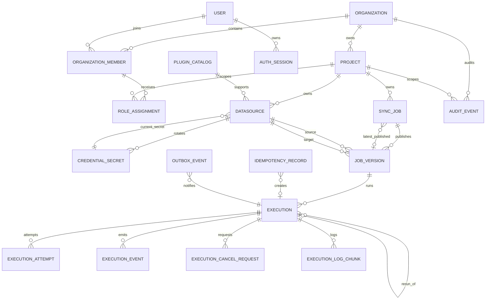

# DataX Enterprise Studio 数据库与领域模型设计

> 文档状态：V1 实施基线
>
> 模型版本：1.0
>
> 数据库：PostgreSQL 15
> 机器契约：[`contracts/job-spec.v1.schema.json`](./contracts/job-spec.v1.schema.json)、[`contracts/plugin-manifest.v1.schema.json`](./contracts/plugin-manifest.v1.schema.json)、[`contracts/audit-event.v1.schema.json`](./contracts/audit-event.v1.schema.json)

## 1. 设计目标

本模型保证以下事实可以被稳定追溯：

- 哪个用户在什么项目中，以哪些角色完成了什么操作；
- 一个任务当前草稿、校验状态和每个已发布版本的区别；
- 一次执行精确绑定的 JobVersion、Datasource 修订、Credential 版本、插件和 DataX Runtime；
- Worker 如何领取、推进、取消和终结 Execution；
- 日志、状态事件、幂等结果和审计事件如何关联；
- 任何历史执行都不因后续编辑任务或轮换凭证而被改写。

SQLite 不属于 V1 支持路径。开发、测试和生产均以 PostgreSQL 15 的约束与事务语义为准。

## 2. 全局数据约定

| 主题 | 约定 |
|---|---|
| 主键 | UUID v4，数据库类型 `uuid` |
| 时间 | `timestamptz`，持久化 UTC，API 输出 RFC 3339 |
| 命名 | 表和字段使用 `snake_case`，枚举值使用大写 |
| 文本 | 业务名称先去首尾空格；空字符串不等于 `NULL` |
| 版本 | 可变聚合使用 `row_version bigint` 乐观锁；不可变版本使用单调 `version_no` |
| JSON | 仅在结构由 JSON Schema 或字段字典明确约束时使用 `jsonb` |
| 删除 | 项目、数据源、任务优先软删除；存在历史引用时禁止物理删除 |
| 金额/精度 | 不以 `float` 保存需要精确比较的数值 |
| 凭证 | 明文永不持久化；仅保存 AEAD 密文和外部主密钥版本 |
| 审计 | 追加写，不提供更新和删除业务接口 |

所有业务表都包含 `created_at`；可变业务表另含 `updated_at` 和 `row_version`。所有外键必须显式定义删除策略，不使用隐式级联删除历史事实。

## 3. 聚合与关系

### 3.1 聚合边界

- **Identity 聚合**：Organization、User、OrganizationMember、RoleAssignment、AuthSession。
- **Project 聚合**：Project 及项目级授权范围。
- **Datasource 聚合**：Datasource 和 CredentialSecret；密码轮换不改写历史密文版本。
- **Job 聚合**：SyncJob 的可变草稿和不可变 JobVersion。
- **Execution 聚合**：Execution、Attempt、Event、CancelRequest、LogChunk。
- **Audit 聚合**：追加式 AuditEvent 哈希链。

跨聚合引用使用 UUID；跨聚合状态变更必须经应用服务和事务完成。

## 4. 身份、组织与项目

### 4.1 `organizations`

V1 只能存在一个 `ACTIVE` 组织。

| 字段 | 类型 | 必填 | 说明 |
|---|---|---:|---|
| `id` | uuid | 是 | 主键 |
| `name` | varchar(128) | 是 | 组织显示名 |
| `status` | enum | 是 | `ACTIVE`、`SUSPENDED` |
| `created_at` | timestamptz | 是 | 创建时间 |
| `updated_at` | timestamptz | 是 | 修改时间 |
| `row_version` | bigint | 是 | 初始 1 |

约束：部分唯一索引保证最多一个 `status='ACTIVE'` 的组织。

### 4.2 `users`

| 字段 | 类型 | 必填 | 说明 |
|---|---|---:|---|
| `id` | uuid | 是 | 主键 |
| `email` | citext | 是 | 登录名，组织内唯一 |
| `display_name` | varchar(128) | 是 | 显示名 |
| `password_hash` | text | 是 | Argon2id 哈希 |
| `must_change_password` | boolean | 是 | 初始/重置密码后为 true |
| `password_changed_at` | timestamptz | 是 | 最近改密时间 |
| `status` | enum | 是 | `ACTIVE`、`LOCKED`、`DISABLED` |
| `failed_login_count` | integer | 是 | 默认 0，不小于 0 |
| `locked_until` | timestamptz | 否 | 临时锁定截止时间 |
| `last_login_at` | timestamptz | 否 | 最近成功登录 |
| `created_at` | timestamptz | 是 | 创建时间 |
| `updated_at` | timestamptz | 是 | 修改时间 |
| `row_version` | bigint | 是 | 乐观锁 |

禁止保存可逆密码、密码提示或 refresh token 明文。

本人改密、Admin 重置密码或停用用户时必须撤销该用户的其他 AuthSession；Admin 解锁时原子清零 `failed_login_count` 并清空 `locked_until`。Admin 设置的临时密码只出现在 write-only 请求体，响应不回显。

唯一约束：`lower(email)` 全局唯一；V1 只有一个 Organization，因此它同时满足组织内唯一语义。

### 4.3 `organization_members`

| 字段 | 类型 | 必填 | 说明 |
|---|---|---:|---|
| `id` | uuid | 是 | 主键 |
| `organization_id` | uuid | 是 | FK → organizations |
| `user_id` | uuid | 是 | FK → users |
| `status` | enum | 是 | `ACTIVE`、`SUSPENDED` |
| `joined_at` | timestamptz | 是 | 加入时间 |

唯一约束：`(organization_id, user_id)`。

### 4.4 `role_assignments`

一个用户可以同时拥有多个角色，授权结果取并集。

| 字段 | 类型 | 必填 | 说明 |
|---|---|---:|---|
| `id` | uuid | 是 | 主键 |
| `organization_member_id` | uuid | 是 | FK → organization_members |
| `scope_type` | enum | 是 | `ORGANIZATION`、`PROJECT` |
| `scope_id` | uuid | 是 | 对应 Organization 或 Project ID |
| `role` | enum | 是 | `ADMIN`、`DEVELOPER`、`OPERATOR`、`VIEWER` |
| `granted_by` | uuid | 是 | FK → users |
| `created_at` | timestamptz | 是 | 授权时间 |

约束：

- `(organization_member_id, scope_type, scope_id, role)` 唯一。
- `ORGANIZATION` 作用域在 V1 仅允许 `ADMIN`。
- `DEVELOPER`、`OPERATOR`、`VIEWER` 必须为 `PROJECT` 作用域。
- 项目必须属于成员所在组织。
- 用户在项目中的有效权限为组织级 Admin 与项目级角色的并集。

### 4.5 `auth_sessions`

| 字段 | 类型 | 必填 | 说明 |
|---|---|---:|---|
| `id` | uuid | 是 | refresh session ID |
| `user_id` | uuid | 是 | FK → users |
| `token_hash` | bytea | 是 | refresh token 的 HMAC/SHA-256，不保存 token |
| `family_id` | uuid | 是 | 旋转 token 家族 |
| `rotated_from_id` | uuid | 否 | FK → auth_sessions |
| `issued_at` | timestamptz | 是 | 签发时间 |
| `expires_at` | timestamptz | 是 | 到期时间 |
| `last_used_at` | timestamptz | 否 | 最近使用 |
| `revoked_at` | timestamptz | 否 | 撤销时间 |
| `revoke_reason` | varchar(64) | 否 | 撤销原因代码 |
| `ip_hash` | bytea | 否 | 可选隐私化来源标识 |

同一家族出现已轮换 token 重放时，撤销整个 family。

### 4.6 `projects`

| 字段 | 类型 | 必填 | 说明 |
|---|---|---:|---|
| `id` | uuid | 是 | 主键 |
| `organization_id` | uuid | 是 | FK → organizations |
| `name` | varchar(128) | 是 | 项目名 |
| `slug` | varchar(64) | 是 | URL/检索稳定标识 |
| `description` | varchar(1000) | 否 | 描述 |
| `status` | enum | 是 | `ACTIVE`、`ARCHIVED` |
| `created_by` | uuid | 是 | FK → users |
| `archived_by` | uuid | 否 | FK → users |
| `archived_at` | timestamptz | 否 | 归档时间 |
| `created_at` | timestamptz | 是 | 创建时间 |
| `updated_at` | timestamptz | 是 | 修改时间 |
| `row_version` | bigint | 是 | 乐观锁 |

唯一约束：`(organization_id, lower(slug))`、`(organization_id, lower(name))`。归档项目禁止创建或修改数据源、任务和执行，但保留只读历史。

`slug` 创建后不可修改，格式为 `^[a-z][a-z0-9-]{2,63}$`。

## 5. 数据源、凭证与插件

### 5.1 `credential_secrets`

| 字段 | 类型 | 必填 | 说明 |
|---|---|---:|---|
| `id` | uuid | 是 | Secret 版本 ID |
| `datasource_id` | uuid | 是 | FK → datasources |
| `secret_version` | integer | 是 | 从 1 单调增加 |
| `ciphertext` | bytea | 是 | AEAD 密文 |
| `nonce` | bytea | 是 | 唯一 nonce |
| `encrypted_dek` | bytea | 是 | 被外部主密钥包裹的数据密钥 |
| `key_version` | varchar(64) | 是 | 外部主密钥版本 |
| `algorithm` | varchar(32) | 是 | V1 固定 `AES-256-GCM` |
| `created_by` | uuid | 是 | FK → users |
| `created_at` | timestamptz | 是 | 创建时间 |
| `retired_at` | timestamptz | 否 | 不再用于新运行 |

唯一约束：`(datasource_id, secret_version)`。密文、nonce、DEK 不进入普通业务日志和审计变化详情。

### 5.2 `plugin_catalog`

V1 为只读种子表，仅四条记录。

| 字段 | 类型 | 必填 | 说明 |
|---|---|---:|---|
| `id` | uuid | 是 | 主键 |
| `manifest_name` | varchar(64) | 是 | 平台 manifest 名 |
| `manifest_version` | varchar(32) | 是 | V1 固定 `1.0` |
| `engine` | enum | 是 | `MYSQL_8`、`POSTGRESQL_15` |
| `direction` | enum | 是 | `READER`、`WRITER` |
| `datax_plugin_name` | varchar(64) | 是 | 四个白名单插件之一 |
| `datax_release` | varchar(32) | 是 | `datax_v202309` |
| `artifact_sha256` | char(64) | 是 | 插件制品哈希 |
| `manifest_json` | jsonb | 是 | 符合 plugin manifest schema |
| `enabled` | boolean | 是 | 默认 true |
| `created_at` | timestamptz | 是 | 安装镜像构建时间 |

唯一约束：`(datax_plugin_name, datax_release)`。生产运行时启动自检必须比较 manifest 和实际 JAR SHA-256。

### 5.3 `datasources`

| 字段 | 类型 | 必填 | 说明 |
|---|---|---:|---|
| `id` | uuid | 是 | 主键 |
| `project_id` | uuid | 是 | FK → projects |
| `name` | varchar(128) | 是 | 项目内显示名 |
| `description` | varchar(1000) | 否 | 用途说明 |
| `engine` | enum | 是 | `MYSQL_8`、`POSTGRESQL_15` |
| `host` | varchar(253) | 是 | 主机名或受允许 IP，不接受 URL |
| `port` | integer | 是 | 1..65535；默认由引擎提供 |
| `database_name` | varchar(128) | 是 | 数据库名 |
| `default_schema` | varchar(128) | 是 | PostgreSQL 默认 `public`；MySQL 归一为 database_name |
| `username` | varchar(128) | 是 | 数据库用户；响应可见 |
| `ssl_mode` | enum | 是 | `DISABLE`、`REQUIRE`、`VERIFY_CA`、`VERIFY_FULL` |
| `connection_options` | jsonb | 是 | 仅允许 manifest 明确定义的非敏感键 |
| `current_secret_id` | uuid | 是 | FK → credential_secrets |
| `status` | enum | 是 | `ACTIVE`、`DISABLED`、`DELETED` |
| `last_test_status` | enum | 否 | `SUCCEEDED`、`FAILED` |
| `last_tested_at` | timestamptz | 否 | 最近测试时间 |
| `last_test_error_code` | varchar(64) | 否 | 脱敏稳定错误码 |
| `created_by` | uuid | 是 | FK → users |
| `deleted_at` | timestamptz | 否 | 软删除时间 |
| `created_at` | timestamptz | 是 | 创建时间 |
| `updated_at` | timestamptz | 是 | 修改时间 |
| `row_version` | bigint | 是 | 数据源修订号 |

约束：

- 活跃记录中 `(project_id, lower(name))` 唯一。
- `host`、`database_name`、`username` 不允许控制字符、路径分隔或 URL scheme。
- `connection_options` 不允许 password、完整 JDBC URL、SQL、文件路径或 JVM 参数。
- 更新密码时新增 CredentialSecret 并原子切换 `current_secret_id`，不覆盖旧密文。
- 被 JobVersion 或 Execution 引用的数据源不得物理删除。

## 6. 同步任务与版本

### 6.1 `sync_jobs`

SyncJob 是可编辑任务身份，不直接执行。

| 字段 | 类型 | 必填 | 说明 |
|---|---|---:|---|
| `id` | uuid | 是 | 主键 |
| `project_id` | uuid | 是 | FK → projects |
| `name` | varchar(128) | 是 | 项目内唯一 |
| `description` | varchar(1000) | 否 | 描述 |
| `status` | enum | 是 | `DRAFT`、`VALID`、`PUBLISHED`、`ARCHIVED` |
| `draft_spec_json` | jsonb | 是 | 当前可编辑 JobSpec |
| `draft_spec_hash` | char(64) | 是 | 规范化草稿 SHA-256 |
| `validated_spec_hash` | char(64) | 否 | 最近通过校验的草稿哈希 |
| `validation_report` | jsonb | 否 | 稳定错误码/警告，不含凭证 |
| `latest_published_version_id` | uuid | 否 | FK → job_versions |
| `created_by` | uuid | 是 | FK → users |
| `archived_by` | uuid | 否 | FK → users |
| `archived_at` | timestamptz | 否 | 归档时间 |
| `created_at` | timestamptz | 是 | 创建时间 |
| `updated_at` | timestamptz | 是 | 修改时间 |
| `row_version` | bigint | 是 | 草稿乐观锁 |

状态规则：

- 新建或修改草稿后为 `DRAFT`，并清空 `validated_spec_hash`。
- 当前草稿通过结构、权限、Schema 和类型兼容校验后为 `VALID`。
- 仅 `VALID` 且 `validated_spec_hash=draft_spec_hash` 时可发布。
- 发布创建不可变 JobVersion 并进入 `PUBLISHED`。
- 已发布任务再次编辑后回到 `DRAFT`，旧 JobVersion 仍保留；只有显式指定的已发布版本可运行。
- `ARCHIVED` 禁止创建新 Execution。

### 6.2 `job_versions`

| 字段 | 类型 | 必填 | 说明 |
|---|---|---:|---|
| `id` | uuid | 是 | 主键 |
| `job_id` | uuid | 是 | FK → sync_jobs |
| `version_no` | integer | 是 | 从 1 单调增加 |
| `job_spec_schema_version` | varchar(16) | 是 | V1 固定 `1.0` |
| `spec_json` | jsonb | 是 | 规范化、符合 JobSpec schema |
| `spec_hash` | char(64) | 是 | 规范化 JSON SHA-256 |
| `source_datasource_id` | uuid | 是 | 冗余 FK，便于完整性校验 |
| `target_datasource_id` | uuid | 是 | 冗余 FK |
| `source_schema_snapshot` | jsonb | 是 | 发布时表/列/类型/顺序指纹 |
| `target_schema_snapshot` | jsonb | 是 | 发布时表/列/类型/顺序指纹 |
| `source_schema_hash` | char(64) | 是 | 规范化 Schema SHA-256 |
| `target_schema_hash` | char(64) | 是 | 规范化 Schema SHA-256 |
| `reader_plugin_id` | uuid | 是 | FK → plugin_catalog |
| `writer_plugin_id` | uuid | 是 | FK → plugin_catalog |
| `datax_release` | varchar(32) | 是 | `datax_v202309` |
| `published_by` | uuid | 是 | FK → users |
| `published_at` | timestamptz | 是 | 发布时间 |

唯一约束：`(job_id, version_no)`、`(job_id, spec_hash)`。该表禁止 UPDATE 和 DELETE；数据库触发器需拒绝变更。

## 7. JobSpec 语义和字段兼容

机器格式以 `contracts/job-spec.v1.schema.json` 为准。数据库层还必须执行 JSON Schema 无法表达的语义校验：

1. 单源、单目标、单表。
2. source/target 数据源属于同一项目且为 `ACTIVE`。
3. source 与 target 的 `datasource_id + 规范化 schema_name + 规范化 table_name` 不得全部相同；V1 阻断 insert-only 自同步。
4. `selection_mode=ALL_COLUMNS` 时，发布前仍需解析成显式 mappings，避免运行时 Schema 漂移。
5. source/target 列在 mappings 中分别唯一，映射顺序即 DataX column 顺序。
6. Writer 模式固定 `INSERT`，目标表已存在。
7. `channel` 默认 1，范围 1..16。
8. 脏数据条数和比例任一超过阈值即失败；比例在 JobSpec 中使用 `0..1`，规范化到最多 6 位小数后再计算哈希。
9. 不允许未知字段，以结构缺失的方式拒绝 SQL、Transformer、调度和插件扩展。

### 7.1 V1 类型兼容策略

校验结果分为 `EXACT`、`WIDENING`、`REJECTED`。只有前两者可发布；平台不做隐式截断、时区猜测或字符串脚本转换。

| Source 类型族 | 可接受 Target | 附加条件 |
|---|---|---|
| small integer | 相同或更宽的有符号整数、足够精度 numeric | 无符号 MySQL 类型必须证明目标上界足够 |
| integer / bigint | 相同或更宽整数、足够精度 numeric/decimal | PostgreSQL bigint → MySQL bigint 仅限有符号范围 |
| decimal / numeric | numeric/decimal | 目标 precision、scale 均不得缩窄 |
| real / float / double | real/double precision | 不承诺逐位相等；验收按定义误差 |
| char / varchar | char/varchar/text | 固定长度目标不得更短 |
| text 系列 | text 或足够长度的 MySQL text 系列 | 禁止映射到更小容量 |
| boolean / MySQL tinyint(1) | boolean 或 MySQL tinyint(1) | 仅接受 0/1/true/false 语义 |
| date | date | 精确 |
| time without time zone | 同语义 time | 精度不得缩窄 |
| MySQL datetime / PostgreSQL timestamp without time zone | 同语义 timestamp/datetime | 两端会话时区固定 UTC，精度不得缩窄 |
| binary / varbinary / blob / bytea | 足够容量的二进制类型 | 目标容量不得缩窄 |

V1 拒绝：

- PostgreSQL `timestamp with time zone`、`time with time zone`；
- JSON/JSONB、array、range、composite、domain、geometry/geography；
- MySQL `enum`、`set`、geometry；
- UUID 与字符串之间的隐式转换；
- bit 串、interval、money、网络地址及驱动专有类型；
- source 可为 NULL 而 target 为 NOT NULL；
- 任何需要截断、舍入、时区推断、表达式或脚本的映射。

发布后若实时 Schema 与快照哈希不同，执行在启动前进入 `FAILED`，错误码为 `SCHEMA_DRIFT_DETECTED`；V1 不自动适配 Schema 漂移。

## 8. 执行、尝试与日志

### 8.1 `executions`

| 字段 | 类型 | 必填 | 说明 |
|---|---|---:|---|
| `id` | uuid | 是 | 主键 |
| `project_id` | uuid | 是 | FK → projects |
| `job_id` | uuid | 是 | FK → sync_jobs |
| `job_version_id` | uuid | 是 | FK → job_versions |
| `rerun_of_execution_id` | uuid | 否 | FK → executions |
| `trigger_type` | enum | 是 | V1 仅 `MANUAL` |
| `requested_by` | uuid | 是 | FK → users |
| `state` | enum | 是 | 执行状态机枚举 |
| `state_version` | bigint | 是 | Worker CAS 乐观锁 |
| `queued_at` | timestamptz | 是 | 创建时间 |
| `started_at` | timestamptz | 否 | 首个进程启动时间 |
| `finished_at` | timestamptz | 否 | 终态时间 |
| `timeout_seconds` | integer | 是 | 从 JobSpec 快照 |
| `source_datasource_version` | bigint | 否 | 实际运行使用的修订 |
| `target_datasource_version` | bigint | 否 | 实际运行使用的修订 |
| `source_secret_version` | integer | 否 | 实际使用版本，不含密文 |
| `target_secret_version` | integer | 否 | 实际使用版本 |
| `runtime_snapshot` | jsonb | 否 | DataX/JDK/Python/插件哈希 |
| `resolved_config_hash` | char(64) | 否 | 不含 secret 的规范化配置哈希 |
| `attempt_count` | integer | 是 | 默认 0 |
| `exit_code` | integer | 否 | DataX 进程退出码 |
| `failure_code` | varchar(64) | 否 | 稳定错误码 |
| `failure_message` | varchar(2000) | 否 | 已脱敏摘要 |
| `summary_parse_status` | enum | 是 | `PENDING`、`SUCCEEDED`、`FAILED` |
| `run_summary` | jsonb | 否 | 记录数、失败数、字节、速度等 |
| `created_at` | timestamptz | 是 | 创建时间 |

状态枚举：

`QUEUED`、`STARTING`、`RUNNING`、`CANCEL_REQUESTED`、`SUCCEEDED`、`FAILED`、`TIMED_OUT`、`CANCELED`、`LOST`。

只有 Worker 进程及其内置 reconciler 数据库角色可以更新 `state`。API 数据库角色只允许 INSERT `QUEUED` Execution 和 INSERT CancelRequest。

### 8.2 `execution_attempts`

V1 不自动重试，正常每个 Execution 只有一个 Attempt；该模型用于区分“投递唤醒”和“实际进程启动”，并为未来恢复保留明确边界。

| 字段 | 类型 | 必填 | 说明 |
|---|---|---:|---|
| `id` | uuid | 是 | 主键 |
| `execution_id` | uuid | 是 | FK → executions |
| `attempt_no` | integer | 是 | 从 1 开始 |
| `worker_id` | varchar(128) | 是 | Worker 实例标识 |
| `lease_token_hash` | char(64) | 是 | lease token 哈希 |
| `lease_expires_at` | timestamptz | 是 | 心跳续租截止 |
| `heartbeat_at` | timestamptz | 是 | 最近心跳 |
| `pid` | integer | 否 | Python/DataX launcher PID |
| `process_group_id` | integer | 否 | 用于终止进程树 |
| `workspace_path_hash` | char(64) | 否 | 不持久化用户可控路径 |
| `started_at` | timestamptz | 否 | Attempt 开始 |
| `finished_at` | timestamptz | 否 | Attempt 结束 |
| `exit_code` | integer | 否 | 退出码 |
| `termination_reason` | varchar(64) | 否 | `EXITED`、`CANCELED`、`TIMED_OUT`、`LEASE_LOST` 等 |
| `workspace_deleted_at` | timestamptz | 否 | 临时明文配置清理证据 |

唯一约束：`(execution_id, attempt_no)`。同一 Execution 同时最多一个未过期 lease。

### 8.3 `execution_events`

| 字段 | 类型 | 必填 | 说明 |
|---|---|---:|---|
| `id` | uuid | 是 | 主键 |
| `execution_id` | uuid | 是 | FK → executions |
| `sequence_no` | bigint | 是 | 每个 Execution 单调递增 |
| `event_type` | varchar(64) | 是 | 稳定事件类型 |
| `from_state` | enum | 否 | 原状态 |
| `to_state` | enum | 否 | 新状态 |
| `attempt_id` | uuid | 否 | FK → execution_attempts |
| `payload` | jsonb | 是 | 已脱敏结构化信息 |
| `occurred_at` | timestamptz | 是 | 事件时间 |

唯一约束：`(execution_id, sequence_no)`。只追加，不更新。

### 8.4 `execution_cancel_requests`

API 创建取消请求，但不直接推进 Execution 状态。

| 字段 | 类型 | 必填 | 说明 |
|---|---|---:|---|
| `id` | uuid | 是 | 主键 |
| `execution_id` | uuid | 是 | FK → executions |
| `requested_by` | uuid | 是 | FK → users |
| `reason` | varchar(500) | 否 | 已脱敏用户原因 |
| `status` | enum | 是 | `PENDING`、`ACKNOWLEDGED`、`COMPLETED`、`REJECTED` |
| `requested_at` | timestamptz | 是 | 请求时间 |
| `acknowledged_at` | timestamptz | 否 | Worker 接收时间 |
| `completed_at` | timestamptz | 否 | 终止完成时间 |

同一 Execution 只允许一个活动的 `PENDING/ACKNOWLEDGED` 请求。

### 8.5 `execution_log_chunks`

日志正文保存在持久化日志卷；PostgreSQL 保存可验证索引。

| 字段 | 类型 | 必填 | 说明 |
|---|---|---:|---|
| `id` | uuid | 是 | 主键 |
| `execution_id` | uuid | 是 | FK → executions |
| `attempt_id` | uuid | 是 | FK → execution_attempts |
| `chunk_no` | integer | 是 | 从 1 递增 |
| `first_sequence` | bigint | 是 | 首行 sequence |
| `last_sequence` | bigint | 是 | 末行 sequence |
| `storage_key` | varchar(500) | 是 | 服务端生成的相对对象键 |
| `byte_size` | bigint | 是 | 脱敏后字节数 |
| `sha256` | char(64) | 是 | 脱敏正文哈希 |
| `redaction_rules_version` | varchar(32) | 是 | 脱敏规则版本 |
| `created_at` | timestamptz | 是 | 完成写入时间 |
| `expires_at` | timestamptz | 是 | 计划删除时间 |

唯一约束：`(execution_id, attempt_id, chunk_no)`；sequence 区间不得重叠。`storage_key` 必须由服务端生成并在固定根目录内解析，禁止路径穿越。

## 9. 审计、幂等与可靠投递

### 9.1 `audit_events`

| 字段 | 类型 | 必填 | 说明 |
|---|---|---:|---|
| `id` | uuid | 是 | 事件 ID |
| `organization_id` | uuid | 是 | FK → organizations |
| `organization_sequence` | bigint | 是 | 组织内单调递增 |
| `project_id` | uuid | 否 | 项目作用域 |
| `event_json` | jsonb | 是 | 符合 audit event schema |
| `previous_hash` | char(64) | 否 | 前一事件哈希 |
| `event_hash` | char(64) | 是 | 规范化事件与 previous_hash 的 SHA-256 |
| `occurred_at` | timestamptz | 是 | 事件时间 |
| `expires_at` | timestamptz | 是 | 默认 730 天后 |

唯一约束：`(organization_id, organization_sequence)`、`event_hash`。插入时以组织级序列锁串行生成哈希链。业务接口不提供更新或删除。

一次性的 `bootstrap-admin` 初始化必须写 `SYSTEM_BOOTSTRAP_ADMIN`，其 `actor.kind=SYSTEM`、`actor.user_id=null`，target 指向创建出的 User；普通用户操作使用 `actor.kind=USER`。初始化事件同样进入组织哈希链，不得绕过审计。

### 9.2 `idempotency_records`

| 字段 | 类型 | 必填 | 说明 |
|---|---|---:|---|
| `id` | uuid | 是 | 主键 |
| `actor_id` | uuid | 是 | FK → users |
| `scope` | varchar(128) | 是 | HTTP 方法 + 路由模板 |
| `idempotency_key` | varchar(128) | 是 | 客户端不透明键 |
| `request_hash` | char(64) | 是 | 规范化请求哈希 |
| `response_status` | integer | 否 | 首次完成响应码 |
| `response_body` | jsonb | 否 | 安全、可重放的响应 |
| `resource_type` | varchar(64) | 否 | 例如 `EXECUTION` |
| `resource_id` | uuid | 否 | 生成资源 |
| `created_at` | timestamptz | 是 | 创建时间 |
| `expires_at` | timestamptz | 是 | 默认 24 小时 |

唯一约束：`(actor_id, scope, idempotency_key)`。同 key 不同 request hash 返回 `409`。

### 9.3 `outbox_events`

| 字段 | 类型 | 必填 | 说明 |
|---|---|---:|---|
| `id` | uuid | 是 | 事件 ID |
| `aggregate_type` | varchar(64) | 是 | V1 主要为 `EXECUTION` |
| `aggregate_id` | uuid | 是 | Execution ID |
| `event_type` | varchar(64) | 是 | `EXECUTION_QUEUED`、`CANCEL_REQUESTED` |
| `payload` | jsonb | 是 | 只允许资源 ID 和安全元数据 |
| `status` | enum | 是 | `PENDING`、`DISPATCHED`、`FAILED` |
| `attempt_count` | integer | 是 | 默认 0 |
| `available_at` | timestamptz | 是 | 下次投递时间 |
| `dispatched_at` | timestamptz | 否 | 最近成功投递 |
| `last_error_code` | varchar(64) | 否 | 脱敏错误码 |
| `created_at` | timestamptz | 是 | 创建时间 |

Execution/CancelRequest、AuditEvent 和 OutboxEvent 必须在同一 PostgreSQL 事务提交。

## 10. 状态转换和事务约束

### 10.1 SyncJob

允许转换：

- `DRAFT → VALID`
- `VALID → DRAFT`
- `VALID → PUBLISHED`
- `PUBLISHED → DRAFT`
- `DRAFT | VALID | PUBLISHED → ARCHIVED`

不允许从 `ARCHIVED` 恢复。若未来需要恢复，必须通过新 ADR 和迁移。

### 10.2 Execution

允许转换以 `03_技术架构设计.md` 状态机为准。数据库通过状态转换函数或触发器校验：

- 终态不可变；
- `started_at` 仅在进入 RUNNING 时首次写入；
- 终态必须有 `finished_at`；
- `SUCCEEDED/FAILED` 应有 exit code；
- API 数据库角色无 UPDATE state 权限；
- Worker 使用 `(id, state_version, expected_state)` 做 CAS。

### 10.3 关键事务

1. **执行创建**：幂等记录占位、Execution(QUEUED)、ExecutionEvent、AuditEvent、OutboxEvent 同事务。
2. **取消请求**：CancelRequest、AuditEvent、OutboxEvent 同事务；不修改 Execution state。
3. **发布**：校验当前 draft hash、插入 JobVersion、更新 latest version 和 SyncJob 状态、写 AuditEvent 同事务。
4. **凭证轮换**：插入 CredentialSecret、切换 Datasource current secret、增加 row_version、写 AuditEvent 同事务。

## 11. 索引

至少建立：

- `projects(organization_id, status, lower(name))`
- `role_assignments(organization_member_id, scope_type, scope_id)`
- `datasources(project_id, status, lower(name))`
- `sync_jobs(project_id, status, updated_at desc, id)`
- `job_versions(job_id, version_no desc)`
- `executions(project_id, state, queued_at desc, id)`
- `executions(job_id, queued_at desc, id)`
- `execution_attempts(execution_id, attempt_no desc)`
- `execution_events(execution_id, sequence_no)`
- `execution_log_chunks(execution_id, first_sequence)`
- `audit_events(organization_id, organization_sequence desc)`
- `audit_events(project_id, occurred_at desc, id)`
- `outbox_events(status, available_at)`
- `idempotency_records(actor_id, scope, idempotency_key)`

所有游标分页排序都必须包含 UUID 作为最后稳定排序键。

## 12. 数据保留与删除

以下为 V1 默认值，可通过部署配置延长；缩短必须由 Admin 和安全/合规评审批准。

| 数据 | 默认保留 | 删除规则 |
|---|---:|---|
| User、Project、Datasource、SyncJob 元数据 | 组织生命周期 | 软删除；有历史引用不物理删除 |
| JobVersion、Schema 快照 | 组织生命周期 | 不可更新、不可删除 |
| Execution、Attempt、Event、RunSummary | 365 天 | 仅终态且无调查保全标记时归档/删除 |
| 脱敏运行日志正文与 LogChunk | 30 天 | 先删正文，再在事务中标记/删除索引 |
| AuditEvent | 730 天 | 到期批量归档；保全事件不得删除 |
| AuthSession | 到期或撤销后 30 天 | 仅保留 token hash |
| IdempotencyRecord | 24 小时 | 到期删除 |
| 已投递 OutboxEvent | 7 天 | 仅 `DISPATCHED` 可清理 |
| 退役 CredentialSecret | 无活动运行引用后至少 30 天 | 需保留轮换审计；密钥销毁可使密文不可恢复 |

清理任务是平台内部维护任务，不等于用户可配置调度，不创建业务 Execution。

## 13. 数据库迁移与版本

- 使用 Alembic，迁移文件必须提交仓库并具唯一 revision。
- 应用启动不得调用 `create_all` 自动改表。
- 每个迁移需说明前向、恢复/回滚、锁表风险、数据回填和预计时长。
- 生产升级先备份，再执行迁移；失败时停止应用并按迁移说明恢复。
- 采用 expand → migrate/backfill → contract，避免同一版本直接删除仍被旧代码读取的字段。
- 应用只保证与当前数据库 schema revision 匹配；不匹配时 readiness 失败。
- JSON 契约以独立 `schema_version` 演进；旧 JobVersion 永远按原 schema 读取，禁止静默重写。
- 数据库备份必须同时包含外部主密钥版本元数据；没有对应主密钥的凭证密文不可恢复。

## 14. 模型验收

1. 数据库约束能拒绝非法状态转换、重复任务版本和重复幂等键。
2. 任一 Execution 可追溯到 JobVersion、两个数据源修订、两个 CredentialSecret 版本和 Runtime/插件哈希。
3. 修改 SyncJob 草稿不会改变任何 JobVersion 或历史 Execution。
4. API 数据库角色不能更新 Execution 运行态，也不能读取 CredentialSecret 明文字段。
5. 数据源密码轮换不会覆盖旧 secret 版本，响应和审计不出现密文或明文。
6. 角色可多选，权限并集与项目/组织作用域可由数据模型唯一计算。
7. JobSpec schema 校验与数据库语义校验均失败时，任务不能进入 VALID/PUBLISHED。
8. 日志正文删除后不存在悬空可访问链接；审计哈希链仍能验证。
9. Alembic 从空库升级到最新版本、从上一发布升级、备份恢复均有自动化证据。
10. 同一 Datasource、同一规范化 schema 和同一 table 的 source/target 组合在校验、发布和运行前均被拒绝。
