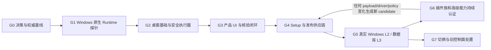

# Windows 直连 DataX 桌面版开发执行任务书

| 项 | 内容 |
|---|---|
| 文档版本 | 1.0 |
| 编制日期 | 2026-08-03 |
| 状态 | `EXECUTION_PLAN_READY`；代码实施仍受 `DXD-000` 架构基线门禁阻断 |
| 目标执行者 | GPT-5.6 Luna 或后续编码 Agent |
| 上游方案 | [`15_Windows直连DataX桌面版重构方案.md`](./15_Windows直连DataX桌面版重构方案.md) |
| 当前源码基线 | Alibaba DataX `datax_v202309` / commit `9a1f88751e24314b083a74f1b83ef56d69ce98bd` |
| 任务规模 | 25 个主任务；其中 `DXD-060` 从清单生成 83 个逐项子任务；`DXD-000` 至 `DXD-052` 完成安全基础版，`DXD-060/061` 扩展完整能力，`DXD-070` 最终切换 |
| 最终目标 | 在真实 Windows 11 x64 上安装并稳定运行的 `Setup.exe`，桌面应用直接驱动随包 JRE/DataX，把数据从源端写入目标端 |
| 不代表 | 本文存在不代表桌面版已经开发、安装、签名或在 Windows/真实数据库上验收通过 |

## 0. 给编码 Agent 的执行指令

当仓库所有者明确说“按 `16_` 开发”“继续桌面直连重构”或同义指令时，按以下规则执行：

1. 从 `DXD-000` 开始，严格按依赖顺序推进；所有者的上述指令允许把已经确定的产品方向写入
   ADR-0016，但不允许跳过 ADR、契约、威胁模型和测试门禁。
2. 开始前依次完整阅读 `AGENTS.md`、`README.md`、`00_`、`15_`、本文、`adr/README.md`、
   相关 Accepted ADR、`contracts/README.md` 和当前工作树状态。
3. 新桌面版只在平行目录 `desktop/direct/` 开发。`backend/`、`desktop/windows/`、
   `deploy/windows/`、旧安装器和旧 Compose 路径先冻结为历史候选，不在替代物通过 L3 前删除或
   半改造。
4. 每次只把一个任务标为 `IN_PROGRESS`。一个任务一个可审查提交；提交必须同时包含实现、测试、
   契约、文档和证据索引，不做“先写完代码以后再补文档”的大提交。
5. 每个任务结束都要报告：修改文件、执行命令、实际结果、证据等级、真实 Windows/真实数据库
   是否参与、未验证项、回滚方法。测试未运行就写 `NOT_RUN`，外部环境缺失就写
   `BLOCKED_EXTERNAL`。
6. 不得用 Mock、固定日志、构建成功、macOS 交叉编译或 GitHub-hosted Windows 编译冒充真实
   Windows 安装或真实 DataX 复制。
7. `DXD-010` 是硬停止门：没有在干净 Windows 上证明随包 `java.exe` 能无 Python、无 PATH、
   无 shell 地启动 DataX Engine，就不得进入完整 UI、安装器或“原生 Windows 可用”宣传。
8. 任何任务发现本文与 Accepted ADR、PRD、机器契约语义冲突时，先登记冲突并修正责任文档；
   不得自行选择最省事的解释。
9. `DXD-041/042/050/051/052` 是按 `candidate_id` 可重复执行的发布闭环，不是一生只跑一次的全局
   checkbox。任何进入 Setup 的代码、Runtime、driver、policy 或能力变化都创建新 candidate，并让旧
   PASS 只读历史化；禁止把不同 candidate 的任务状态拼成一次发布。

建议工作分支为 `codex/windows-direct`。执行前至少运行：

```bash
git status --short --branch
git diff --check
```

工作树有用户改动时必须保留并绕开；只暂存当前任务文件。

## 1. 最终产品和最小闭环

最终用户拿到的不是“需要服务器的网页”，也不是字面意义上只含一个文件的便携程序，而是一个
Windows 安装包：

```text
DataXStudio-Setup-<version>-win-x64.exe
  └─ 安装后：DataX Studio.exe + WebView2 策略 + 随包 JRE + 随包 DataX Runtime + 许可证
```

用户闭环固定为：

```text
安装 Setup.exe
  → 双击桌面图标
  → 新建源/目标数据源并安全保存凭据
  → 创建完整表或选列复制任务
  → 校验连接、目标为空和任务策略
  → 手动运行/取消
  → 查看脱敏日志
  → 查看进程结果、数据影响、独立核验结果
  → 导出不含秘密的任务或诊断包
```

实际数据流是：

```text
源数据库 ──JDBC/网络──> Windows 上的 DataX Java 进程 ──JDBC/网络──> 目标数据库
```

应用内部只保存程序、任务元数据、凭据引用、受限脱敏日志和临时 Job 文件，不建立本地业务数据仓库。
如果用户未来使用 HDFS/file/FTP 等 DataX 插件，写入用户明确选择的本地文件属于该插件的源/目标
业务行为；应用仍不得把数据静默复制到自己的缓存目录。

## 2. 第一性原理后的范围拆分

### 2.1 第一版稳定闭环

第一版只承诺 MySQL 8/PostgreSQL 15 的四个方向：

- MySQL → MySQL；
- MySQL → PostgreSQL；
- PostgreSQL → MySQL；
- PostgreSQL → PostgreSQL。

默认“安全向导”只生成完整表或选列、目标预存在且为空、`insert-only` 的白名单 Job。禁止
`querySql`、`preSql`、`postSql`、Groovy、外部 Transformer/JAR、用户控制插件路径、自动建表、
自动清表、覆盖写入、脚本和自动重试。

### 2.2 “DataX 所有功能”的真实口径

“源码中存在”“能进入安装包”“能在 Windows 启动”“在真实外部系统通过”“可向普通用户稳定开放”
是五件不同的事。仓库已有 `runtime/capability-target-set.v1.json`，其中 83 项当前不能整体被称为
Windows 可用。

本项目用两条路线覆盖“所有功能”诉求：

1. 桌面端必须提供完整能力目录，逐项用**独立维度**显示 `source_state`、`bundle_state`、
   `license_state`、`driver_state`、`windows_runtime_state`、`real_system_state`、`oracle_state`、
   `execution_authorization` 和 `release_promotion_state`，不能用单一状态丢失
   “已打包但缺驱动/许可受阻/未核验”等组合事实，也不能静默遗漏。
2. 每个插件族按 `DXD-060` 的重复模板独立打包、许可审查和真实认证；危险原生 JSON 能力按
   `DXD-061` 单独裁决。在没有证据前，它们不能借“高级模式”绕过安全门禁。

第一版稳定闭环的工作量不能冒充“83 项全部认证完成”。后者依赖各类数据库、云账号、驱动许可和
Windows 兼容性，是持续认证计划。**本项目已记录的最终目标仍包含完整 DataX 能力**：安全四数据库
版只是第一个可交付里程碑；`runtime/capability-target-set.v1.json` 的 83 项必须按 `DXD-060/<id>`
逐项形成子任务，其中 `CORE_ARBITRARY_JOB_JSON` 及危险字段转入 `DXD-061`。只有全部目标项达到其
Accepted ADR 规定的真实认证结论，才可声称“完整 DataX 目标已完成”；`BLOCKED_*` 是诚实进度，
不是完成。

## 3. 已发现的硬风险

### 3.1 上游 Windows 分支仍不能直接作为安全 Launcher

`third_party/alibaba-datax/core/src/main/bin/datax.py` 虽然有 Windows classpath 分支，但它：

- 依赖外部 Python；
- 通过 PATH 查找 `java`；
- 把 JVM、参数和 Job 路径拼成一个字符串；
- 在第 237 行使用 `subprocess.Popen(startCommand, shell=True)`；
- Windows 分支不注册取消信号处理。

因此桌面应用不得调用该脚本作为正式运行路径。`DXD-010` 必须证明用随包绝对路径
`jre\\bin\\java.exe` 和参数数组直接启动 `com.alibaba.datax.core.Engine`，再用 Windows Job Object
管理完整进程树。

### 3.2 原生 Job JSON 不是普通配置文件

上游 Job 能触发任意 SQL、Groovy、外部 Transformer/JAR 和插件路径加载。弹一次风险提示不是安全
控制。默认安全模式必须在读取秘密和创建 Java 进程前解析并拒绝危险字段；高级执行只能在单独
ADR、威胁模型、能力授权和真实负向测试全部通过后逐项开放。

### 3.3 JRE、驱动和插件都是发行制品

源码仓库中的 Apache-2.0 不自动覆盖所有第三方 JRE/JDBC/插件依赖。最终 staging 目录中的每个
EXE、DLL、JAR、配置和许可证文件都必须有来源、版本、SHA-256、许可/NOTICE、再分发状态和 SBOM。
未知许可默认阻断；“用户自带驱动”也不能等同于从任意路径加载代码。

### 3.4 本地桌面不等于没有安全边界

本产品以当前 Windows 用户为身份边界，不再模拟多角色服务器。凭据仍必须进入 Windows Credential
Manager；SQLite、WAL/SHM、日志、诊断、任务导出、命令行和环境变量均不得出现秘密。因为 V1 不
引入管理员常驻网络守卫，默认安全模式只允许受清单保护的 Runtime 和白名单任务；若未来允许任意
第三方代码或任意 Job，则必须先新增可证明的 JVM 出口隔离方案，不能仅靠 UI 的 DNS 检查。

## 4. 已固定的实现默认值

除非 `DXD-000` 以证据证明不可行并新增替代 ADR，否则编码 Agent 不再反复询问以下选择：

| 关注点 | 固定默认值 |
|---|---|
| 目标平台 | Windows 11 x64；其他平台只开发，不做发布认证 |
| 产品形态 | 单用户、单工作站、单应用实例、同一时刻最多一个 DataX Execution |
| Windows 身份 | 首次启动原子绑定一个 owner SID；其他 Windows 用户只能看到“不属于当前用户”的阻断页，不能创建数据源/任务/Execution |
| 桌面技术 | Tauri 2 + Rust + Vue 3 + TypeScript + Vite + Element Plus |
| 前后端边界 | 仅 typed Tauri command/event IPC；无 FastAPI、无浏览器入口、无本机 HTTP listener |
| 本地事实源 | `rusqlite` + bundled SQLite；版本化迁移，只存任务/执行/设置元数据 |
| 凭据 | Windows Credential Manager；SQLite 只存不可逆 credential reference，无明文 fallback |
| 运行时 | 可再分发的 Windows x64 OpenJDK 8 JRE + 固定 DataX `datax_v202309`；精确发行者/版本在 `DXD-010/011` 锁定，禁止 Oracle JRE 的未经审查再分发 |
| DataX 启动 | 绝对路径 `java.exe` + 参数数组直接启动 Engine；禁止 `datax.py`、Python、PATH 和 shell |
| 安装模式 | `Setup.exe` 经 UAC 按机器安装到 `%ProgramFiles%\\DataXStudio`；安装/升级/卸载需要管理员，日常应用不提权、不安装服务 |
| 用户数据 | `%LOCALAPPDATA%\\DataXStudio`；ACL 只允许当前用户和必要的 SYSTEM 访问 |
| 更新 | V1 不做应用内在线自动更新；用户安装签名的新版本，支持升级、失败回退和降级阻断 |
| 发布签名 | Setup/PE 用 Authenticode + 可信时间戳；manifest/attestation 用 RFC 8785 canonical JSON + domain-separated Ed25519 detached signature，验证 keyring 固定在应用/仓库且支持显式轮换 |
| WebView2 | Tauri `bundle.windows.webviewInstallMode.type="offlineInstaller"`；安装器先检测已有 Runtime，离线 payload 的来源、hash 和许可进入候选清单，安装时不联网下载 |
| 遥测 | 默认完全关闭；V1 不上传日志、崩溃、任务或数据源元数据 |
| 默认任务 | MySQL/PostgreSQL 安全向导；目标预存在且为空，手动触发，`insert-only` |
| 高级能力 | 默认关闭；逐插件/逐能力认证。原始 JSON 可先导入、检查和保存为非秘密模板，不自动获得执行权 |

## 5. 新旧目录边界

### 5.1 新建目录

```text
desktop/direct/
  package.json
  index.html
  vite.config.ts
  tsconfig*.json
  src/
    main.ts
    App.vue
    bridge.ts                  # 唯一 IPC 入口，UI 不直接访问文件/进程/网络
    features/
      home/
      datasources/
      jobs/
      executions/
      logs/
      plugins/
      settings/
    components/
    stores/
    lib/
  src-tauri/
    Cargo.toml
    Cargo.lock
    tauri.conf.json
    capabilities/default.json
    build.rs
    migrations/
    windows/
      installer-hooks.nsh
    src/
      main.rs
      lib.rs
      commands/
      domain/
      store/
      security/
      runtime/
      validation/
      verification/
      diagnostics.rs
    tests/

runtime/windows-direct/
  README.md
  build_bundle.ps1
  verify_bundle.py
  engine-launch.v1.json
  smoke-job.stream-to-stream.json
  config/logback-desktop.xml
  jre.lock.json
  datax-bundle.lock.json
  licenses/
  runner-core/
    Cargo.toml
    src/
  probe/
    Cargo.toml
    Cargo.lock
    src/

installer/windows-direct/
  README.md

scripts/windows-direct/
  build-installer.ps1
  build-capability-backlog.py
  validate-release.ps1
  validate-evidence.py
  test-validate-evidence.py
  test-runtime.ps1
  test-installer.ps1
  test-security.ps1
  test-real-db-e2e.ps1
  test-plugin-certification.ps1
  build-final-attestation.ps1

docs/contracts/
  desktop-requirements-catalog.v1.schema.json
  desktop-requirements-catalog.v1.json
  desktop-runtime-bundle.v1.schema.json
  desktop-candidate-manifest.v1.schema.json
  desktop-candidate-root.v1.schema.json
  desktop-build-provenance.v1.schema.json
  desktop-release-attestation.v1.schema.json
  desktop-engine-launch.v1.schema.json
  desktop-datasource.v1.schema.json
  desktop-credential-reference.v1.schema.json
  desktop-job-envelope.v1.schema.json
  desktop-execution-record.v1.schema.json
  desktop-local-state-backup.v1.schema.json
  desktop-plugin-capability.v1.schema.json
  desktop-capability-backlog.v1.schema.json
  desktop-capability-backlog.v1.json
  desktop-diagnostic-manifest.v1.schema.json
  desktop-copy-safety.v1.schema.json
  desktop-machine-owner.v1.schema.json
  desktop-release-keyring.v1.schema.json
  desktop-release-revocations.v1.schema.json
  desktop-l2-environment.v1.schema.json
  desktop-l2-result.v1.schema.json
  desktop-l3-result.v1.schema.json
  desktop-oracle-evidence.v1.schema.json

docs/17_Windows直连DataX需求追踪矩阵.md

scripts/acceptance/
  build_desktop_requirements_catalog.py
  test_desktop_requirements_catalog.py

docs/evidence/windows-direct/
  STATUS.md
  <candidate-id>/README.md
```

构建生成的大型 JRE/DataX/Setup/原始日志放在被 `.gitignore` 排除的
`artifacts/windows-direct/` 或 CI artifact 中，不提交 Git。

### 5.2 冻结但保留

以下路径属于旧 Docker/PostgreSQL 企业控制面，只能复用经验或测试夹具，不能从新桌面运行时
导入：

- `backend/**`；
- `deploy/windows/**`；
- `desktop/windows/**`；
- `frontend/src/api/**`、认证/health/API polling 路径；
- `installer/windows/DataXEnterpriseStudio.nsi`；
- Docker/Compose、PostgreSQL queue/fence、Phase-A、egress-guard、system-backup 运行契约。

可审计复用项包括锁定的 `third_party/alibaba-datax/`、Runtime source/hash/patch、许可证资料、
能力 inventory、独立 oracle 规范、安装器路径防护经验及纯视觉 Vue 组件。复制代码前必须说明来源，
不得把旧 HTTP/多角色语义一并带入。

## 6. 需求与验收 ID

现有 `docs/12_需求追踪矩阵.md` 与 `requirements-catalog.v1.json` 的 ID 正则和 81/107 冻结计数只适用
旧 Docker 控制面，不能接收 `DXD-*`，也不能被桌面证据误绿。`DXD-000` 必须新建
`docs/17_Windows直连DataX需求追踪矩阵.md`、`desktop-requirements-catalog.v1.schema.json`、独立 builder/
validator，并在旧矩阵建立 supersession link。新 catalog 接受精确 `DXD-RQ-*` 与 `DXD-<类别>-*`，
禁止 `001..006` 这类范围 ID；每个 requirement/test pair 都要有 oracle、最低证据等级和 evidence 字段。
下列是不能删减的最低集：

| 需求 ID | 必须结果 | 最低测试 |
|---|---|---|
| `DXD-RQ-001` | Windows 11 x64 桌面应用，无 Docker/WSL/Linux server/browser/HTTP | `DXD-WIN-001`, `DXD-SEC-010` |
| `DXD-RQ-002` | `Setup.exe` 安装、桌面快捷方式、首次启动、修复、代际安全升级/回退、卸载 | `DXD-WIN-002`, `DXD-WIN-003`, `DXD-WIN-004`, `DXD-WIN-005`, `DXD-WIN-006`, `DXD-WIN-017`, `DXD-WIN-018`, `DXD-WIN-019`, `DXD-WIN-020`, `DXD-WIN-021`, `DXD-WIN-022`, `DXD-WIN-023`, `DXD-WIN-024`, `DXD-WIN-025`, `DXD-WIN-026` |
| `DXD-RQ-003` | 随包 JRE/DataX/插件逐文件清单、哈希、许可；篡改前置阻断 | `DXD-RT-001`, `DXD-RT-002`, `DXD-RT-003`, `DXD-RT-004`, `DXD-RT-005`, `DXD-RT-006` |
| `DXD-RQ-004` | 无 Python/PATH/shell，参数数组直接启动 Engine | `DXD-RT-007`, `DXD-RT-008`, `DXD-RT-009`, `DXD-RT-010`, `DXD-RT-011`, `DXD-RT-012` |
| `DXD-RQ-005` | 应用内部不持久化源/目标业务数据 | `DXD-SEC-001`, `DXD-WIN-007` |
| `DXD-RQ-006` | 凭据仅存 Credential Manager；全部输出面零泄露 | `DXD-SEC-002`, `DXD-SEC-003`, `DXD-SEC-004`, `DXD-SEC-005`, `DXD-SEC-006`, `DXD-SEC-007`, `DXD-SEC-008`, `DXD-SEC-009` |
| `DXD-RQ-007` | 单实例、单 Execution、取消完整进程树 | `DXD-RUN-001`, `DXD-RUN-002`, `DXD-RUN-003`, `DXD-RUN-004`, `DXD-RUN-005`, `DXD-RUN-006`, `DXD-RUN-007`, `DXD-RUN-008` |
| `DXD-RQ-008` | 崩溃/睡眠/断电后诚实进入 `UNKNOWN/RECOVERY_REQUIRED`，不自动重跑 | `DXD-REC-001`, `DXD-REC-002`, `DXD-REC-003`, `DXD-REC-004`, `DXD-REC-005`, `DXD-REC-006`, `DXD-REC-007` |
| `DXD-RQ-009` | 分离 `process_state/data_effect/verification_state` | `DXD-DOM-001`, `DXD-DOM-002`, `DXD-DOM-003`, `DXD-DOM-004`, `DXD-DOM-005`, `DXD-DOM-006` |
| `DXD-RQ-010` | SQLite 可迁移、损坏失败关闭、无秘密、导出可恢复 | `DXD-DB-001`, `DXD-DB-002`, `DXD-DB-003`, `DXD-DB-004`, `DXD-DB-005`, `DXD-DB-006`, `DXD-DB-007`, `DXD-DB-008` |
| `DXD-RQ-011` | 日志写入前脱敏、有界、截断可见、纯文本安全渲染 | `DXD-LOG-001`, `DXD-LOG-002`, `DXD-LOG-003`, `DXD-LOG-004`, `DXD-LOG-005`, `DXD-LOG-006`, `DXD-LOG-007`, `DXD-LOG-008`, `DXD-LOG-009` |
| `DXD-RQ-012` | MySQL/PostgreSQL 安全向导只生成白名单 Job | `DXD-JOB-001`, `DXD-JOB-002`, `DXD-JOB-003`, `DXD-JOB-004`, `DXD-JOB-005`, `DXD-JOB-006`, `DXD-JOB-007`, `DXD-JOB-008`, `DXD-JOB-009`, `DXD-JOB-010`, `DXD-JOB-011`, `DXD-JOB-012` |
| `DXD-RQ-013` | 危险 JSON 在解密/创建子进程前拒绝 | `DXD-JOB-013`, `DXD-JOB-014`, `DXD-JOB-015`, `DXD-JOB-016`, `DXD-JOB-017`, `DXD-JOB-018`, `DXD-JOB-019`, `DXD-JOB-020`, `DXD-JOB-021`, `DXD-JOB-022`, `DXD-JOB-023`, `DXD-JOB-024` |
| `DXD-RQ-014` | 插件逐项显示真实打包、许可、驱动和验证状态；版本变化后单调新建并使受影响证据失效 | `DXD-PLG-001`, `DXD-PLG-002`, `DXD-PLG-003`, `DXD-PLG-004`, `DXD-PLG-005`, `DXD-PLG-006`, `DXD-PLG-007`, `DXD-PLG-008`, `DXD-PLG-009`, `DXD-PLG-010`, `DXD-PLG-011`, `DXD-PLG-012` |
| `DXD-RQ-015` | 四个数据库方向的完整表/选列真实闭环 | `DXD-E2E-001`, `DXD-E2E-002`, `DXD-E2E-003`, `DXD-E2E-004`, `DXD-E2E-005`, `DXD-E2E-006`, `DXD-E2E-007`, `DXD-E2E-008` |
| `DXD-RQ-016` | NULL/Unicode/Decimal/时区/重复行/二进制/大字段正确性 | `DXD-ORA-001`, `DXD-ORA-002`, `DXD-ORA-003`, `DXD-ORA-004`, `DXD-ORA-005`, `DXD-ORA-006`, `DXD-ORA-007`, `DXD-ORA-008` |
| `DXD-RQ-017` | 非零、取消、超时、Java/App 崩溃和部分写入不显示成功 | `DXD-E2E-009`, `DXD-E2E-010`, `DXD-E2E-011`, `DXD-E2E-012`, `DXD-E2E-013`, `DXD-E2E-014`, `DXD-E2E-015`, `DXD-E2E-016` |
| `DXD-RQ-018` | 安装路径、ACL、reparse point、低磁盘、AV 锁文件失败关闭 | `DXD-WIN-008`, `DXD-WIN-009`, `DXD-WIN-010`, `DXD-WIN-011`, `DXD-WIN-012`, `DXD-WIN-013`, `DXD-WIN-014`, `DXD-WIN-015`, `DXD-WIN-016` |
| `DXD-RQ-019` | 诊断包字段白名单、无秘密、无默认遥测 | `DXD-DIAG-001`, `DXD-DIAG-002`, `DXD-DIAG-003`, `DXD-DIAG-004`, `DXD-DIAG-005`, `DXD-DIAG-006` |
| `DXD-RQ-020` | 键盘、读屏、高对比度和三维状态无障碍表达 | `DXD-UI-001`, `DXD-UI-002`, `DXD-UI-003`, `DXD-UI-004`, `DXD-UI-005`, `DXD-UI-006`, `DXD-UI-007`, `DXD-UI-008` |
| `DXD-RQ-021` | 源静默、目标空表/有限期独占、同机锁、恢复处置和脏数据 `0/0` | `DXD-SAFE-001`, `DXD-SAFE-002`, `DXD-SAFE-003`, `DXD-SAFE-004`, `DXD-SAFE-005`, `DXD-SAFE-006`, `DXD-SAFE-007`, `DXD-SAFE-008`, `DXD-SAFE-009`, `DXD-SAFE-010`, `DXD-SAFE-011`, `DXD-SAFE-012` |

## 7. 依赖顺序与停止门



| 门 | 进入条件 | 失败动作 |
|---|---|---|
| `G0` | 所有者已明确 Windows 直连方向 | 完成 ADR-0016 和全套同步；不得直接写代码 |
| `G1` | `G0` 无冲突 | 原生 Runtime 探针失败就记录 `BLOCKED_TECHNICAL`，停止 UI/安装器承诺 |
| `G2` | 干净 Windows Runtime smoke 通过 | 任一秘密、shell、进程树或 bundle 完整性问题均回到 G1 |
| `G3` | Runner 状态机与安全边界通过 L1 | UI 不得掩盖底层未实现或用模拟日志替代 |
| `G4` | 四方向候选功能和负向测试通过 L1 | 不生成对外可发布结论 |
| `G5` | 有真实 Windows、真实 DB、必要证书/许可 | 缺任何外部条件就 `BLOCKED_EXTERNAL`，保留复现命令 |
| `G6` | 基础版 L3 通过 | 每个插件/危险能力独立推进；任何 payload/driver/policy 变化使旧资格失效，并以新 candidate 重走 G4/G5，不能批量继承认证 |
| `G7` | 精确最终 Setup 的 L2/L3 通过 | 旧代码继续冻结，不删除 |

## 8. 具体执行任务

### DXD-000：接受 ADR-0016 并同步权威基线

| 属性 | 值 |
|---|---|
| 优先级 | P0，所有代码的前置 |
| 依赖 | 无 |
| 估算 | 2–4 人日 |
| 主要产物 | Accepted ADR-0016、无冲突的 AGENTS/PRD/架构/契约/测试基线 |

实施文件：

- 新增 `docs/adr/0016-Windows直连DataX桌面运行时.md`；
- 修改 `AGENTS.md`、`README.md`、`docs/00_` 至 `12_` 中受影响文档、`docs/14_`、`docs/15_`、
  `docs/security/THREAT_MODEL.md`；
- 修改 `docs/adr/README.md`、`docs/contracts/README.md`；
- 新增本任务书第 5.1 节列出的桌面机器契约骨架；
- 新增 `docs/17_Windows直连DataX需求追踪矩阵.md`、独立 desktop catalog/schema/builder/tests；在
  `docs/12_需求追踪矩阵.md` 只增加历史/替代链接，不改变旧 catalog 的冻结 ID/计数。

实施步骤：

1. ADR-0016 明确“新桌面版替代当前用户交付，不删除旧企业候选”，并固定第 4 节默认值。
2. 对 ADR-0001..0015 逐项标 `RETAIN / ADAPTED / SUPERSEDED / HISTORICAL`，至少明确
   0002、0006、0008、0013、0015 被桌面运行时替代；0009 的能力分级保留并适配；0010/0011 的
   旧容器候选链不得静默复用，ADR-0016 要明确 direct candidate builder、独立 L2/L3 attestor、release
   promoter、key custodian 和 validator 的职责分离，并明确保留或以同等强度替代 ADR-0011 的
   candidate root、受保护构建身份/OIDC provenance 和独立晋级门；commit 字符串不能单独证明 Setup
   来源。
3. 对 OpenAPI、Compose、Phase-A、系统备份、旧 Windows E4 等契约建立 supersession map；保留历史
   文件，不静默删除。
4. 把 AGENTS 改成新 V1 规则：单用户、Tauri IPC、SQLite、Credential Manager、Java Engine、
   Job Object、无 HTTP、真实 Windows L2/L3。单独标明 legacy 路径冻结规则。
5. 在威胁模型中固定本地 Windows 用户信任边界，并明确：V1 没有管理员级 JVM 出口守卫，因此只
   允许签名/哈希 Runtime + 安全白名单 Job；任意第三方代码和危险 JSON 不属于基础版。
6. 把本节每一个需求/测试 ID 展开写入 `docs/17_`；独立 desktop builder 禁止范围、重复 ID、缺
   oracle、缺 evidence level 和缺证据字段。为桌面 schema 建立唯一 owner，禁止旧 OpenAPI/旧 catalog
   覆盖或误绿它。
7. 创建 `docs/evidence/windows-direct/STATUS.md`，所有任务初始为 `NOT_STARTED`，仅把本任务在证据
   完成后改为 `PASSED_L0`。

验证命令：

```bash
git diff --check
python3 scripts/acceptance/build_requirements_catalog.py \
  --matrix docs/12_需求追踪矩阵.md \
  --output docs/contracts/requirements-catalog.v1.json \
  --check
python3 scripts/acceptance/build_desktop_requirements_catalog.py \
  --matrix docs/17_Windows直连DataX需求追踪矩阵.md \
  --output docs/contracts/desktop-requirements-catalog.v1.json \
  --check
python3 -m unittest scripts.acceptance.test_desktop_requirements_catalog -v
```

DoD：没有任何权威文档再把 Docker/WSL/PostgreSQL/browser 说成新 V1 前置；新旧两个 catalog 都能
独立生成/校验且互不接受对方的证据；ADR/契约替代关系可
机器或人工逐项复核；旧实现仍可从 Git 历史和冻结目录找到。`DXD-000` 为 `PASSED_L0` 前只允许
文档工作和只读技术调查，不得创建 Runtime probe 或桌面实现；通过后才允许编写 `DXD-010`，而
`DXD-010` 未通过时禁止开始 `DXD-011` 及后续任务。

### DXD-010：Windows 原生 DataX 可行性探针

| 属性 | 值 |
|---|---|
| 优先级 | P0 硬门 |
| 依赖 | `DXD-000` |
| 估算 | 3–5 人日 |
| 主要产物 | 在干净 Windows 上无 Python/无 shell 的真实 Engine smoke 证据 |

实施文件：

- `runtime/windows-direct/build_bundle.ps1`；
- `runtime/windows-direct/verify_bundle.py`；
- `runtime/windows-direct/engine-launch.v1.json`；
- `runtime/windows-direct/smoke-job.stream-to-stream.json`；
- `runtime/windows-direct/runner-core/`（不依赖 Tauri 的 manifest/Engine launch/Job Object library）；
- `runtime/windows-direct/probe/`（只调用 `runner-core` 的最小命令行验收 harness）；
- `docs/contracts/desktop-engine-launch.v1.schema.json`；
- `runtime/windows-direct/jre.lock.json`；
- `runtime/windows-direct/datax-bundle.lock.json`；
- `scripts/windows-direct/test-runtime.ps1`；
- `docs/evidence/windows-direct/<candidate>/runtime-spike.md`。

实施步骤：

1. 从官方发行源选定可再分发 OpenJDK 8 Windows x64 JRE，记录发行者、精确版本、原始下载 URL、
   SHA-256、签名验证方式、许可证/NOTICE 和 CPU/CVE 更新策略；不得使用未经审查的 Oracle JRE。
2. 从现有 locked upstream、source manifest 和 patch 构建精确 DataX Runtime；记录全部实际文件。
3. 先固化 canonical `engine-launch.v1`：主类、classpath 组成与排序、固定/可配置 JVM 参数、
   `datax.home`、logback、工作目录、Job 路径、环境 allowlist、stdout/stderr 编码、退出码和取消规则
   都进入 schema、实例和 hash。Rust probe 只从该契约生成参数数组，不允许每个实现自行从
   `datax.py` 猜命令；`datax.py` 仅作为被审查的上游语义参考，正式路径不执行它。
4. 使用 manifest 保护的 `logback-desktop.xml`，只输出 stdout/stderr，不创建 DataX FILE/PERF log。
   Engine contract 明确拒绝上游默认的 heap dump、JDWP、`-javaagent/-agentlib`、
   `OnError/OnOutOfMemoryError`；环境 allowlist 必须清除 `JAVA_TOOL_OPTIONS`、`_JAVA_OPTIONS`、
   `JDK_JAVA_OPTIONS`、`CLASSPATH` 和代理注入变量，不继承系统 JVM 参数；`TEMP/TMP` 与
   `-Djava.io.tmpdir` 固定到当前 Execution 的 ACL 目录并纳入清理/扫描。
5. 先运行 `streamreader → streamwriter`，再运行最小 MySQL/PostgreSQL smoke。机器 PATH 中移除
   Python/Java 后仍必须通过。
6. 覆盖安装/工作/Job 路径含空格、中文、长度边界；验证 UTF-8、日志路径、退出码、超时、OOM 和
   JVM 崩溃；扫描 DataX `log/log_perf`、工作目录和产品诊断，不能出现未预期 raw log/heap dump。
7. 把进程放入 Windows Job Object，测试取消、杀桌面父进程和重启；不得残留 `java.exe`。
8. 用 `Get-NetTCPConnection` 证明 probe 没有启动本机 listener；数据库出站连接不算 listener。
9. 篡改 `java.exe`、核心 JAR、插件 JAR、`plugin.json`、manifest 各一次，必须在 Java 启动前拒绝。

构建主机验证入口（允许构建工具使用 Python，但 Python 不进入 Runtime/Setup）：

```powershell
powershell -NoProfile -File runtime/windows-direct/build_bundle.ps1
python runtime/windows-direct/verify_bundle.py --bundle artifacts/windows-direct/runtime
cargo build --locked --release --manifest-path runtime/windows-direct/probe/Cargo.toml
```

干净 Windows 验收主机只接收候选 bundle、编译后的 Rust probe 和 PowerShell harness，不安装或调用
Python/系统 Java：

```powershell
powershell -NoProfile -File scripts/windows-direct/test-runtime.ps1 `
  -Bundle artifacts/windows-direct/runtime `
  -Probe artifacts/windows-direct/datax-runtime-probe.exe `
  -Scenario All
```

DoD：真实干净 Windows 记录必须绑定 OS build、CPU、JRE/DataX manifest SHA、commit、命令摘要、
测试 ID 和原始日志摘要。Mac、Wine、cross compile 或 hosted compile 只能记 L1。直接 Engine 路径任一
核心场景失败时，状态为 `BLOCKED_TECHNICAL`；不得用随包 Python 偷换方案，除非另立 ADR 并重新
估算安装、安全和进程树成本。该干净 Windows probe 是进入开发的运行时事实门，但尚未绑定精确
Setup，因此任务状态最高仍为 `PASSED_L1`，不能提前登记 L2。

### DXD-011：生产化 Runtime bundle、许可与能力清单

| 属性 | 值 |
|---|---|
| 优先级 | P0 |
| 依赖 | `DXD-010` 通过 |
| 估算 | 2–4 人日 |

实施步骤：

1. 实现 `desktop-runtime-bundle.v1`，逐文件绑定路径、大小、SHA-256、组件、版本、来源、许可、
   NOTICE、能力 ID 和签名状态。
2. 从最终 staging 生成 SPDX/CycloneDX；源码 SBOM 或旧五个 Linux 镜像 SBOM 不能替代。
3. 默认 bundle 只进入许可已审查、Windows spike 已通过的核心与四个数据库插件；未知、专有或缺
   驱动项保持 `BLOCKED_LICENSE/NEEDS_DRIVER`。
4. `streamreader/streamwriter` 随正式 bundle 保留为 `PROBE_ONLY`，仍进入 hash/SBOM/license
   manifest；只允许固定 readiness smoke，不出现在普通任务选择器，也不继承业务插件认证。
5. `plugin.json`、JAR、JRE、配置和 manifest 均只从只读安装目录加载；拒绝 UNC、`..`、symlink、
   junction/reparse point 和用户可写插件路径。
6. App 每次启动、每次 Execution 启动前复核 bundle；验证结果缓存必须绑定 manifest 和文件元数据，
   不能跨升级复用。

DoD：任一 payload 文件增删改均在子进程创建前失败；LICENSE/NOTICE 与最终 payload 一致；生成器
可重复运行且相同输入得到相同 canonical manifest。证据为 L1，仍不等于 Windows 安装或真实 DB L3。

### DXD-020：建立独立 Tauri/Vue 桌面工程

| 属性 | 值 |
|---|---|
| 优先级 | P0 |
| 依赖 | `DXD-011` |
| 估算 | 2–3 人日 |

实施步骤：

1. 新建标准 `desktop/direct/` Tauri 2 工程，包名固定 `@datax-studio/direct`；更新
   `pnpm-workspace.yaml` 和根 scripts，但保留旧 `frontend` scripts 的显式入口。新增
   `.node-version`/等价 Node LTS 锁和 `rust-toolchain.toml`，Tauri/Rust/Node/pnpm 与依赖均锁精确版本；
   版本选择只依据官方 Tauri/Rust/Node 支持矩阵并记录许可/升级触发条件。
2. Tauri capability deny-by-default；禁用 shell、任意 URL、任意文件系统和不需要的插件权限。
3. `bridge.ts` 是唯一 UI IPC 边界；所有 command 使用 versioned typed DTO 和稳定错误码。凭据只有
   `credential_upsert(SecretInput)` 一个 ingress command；Rust `SecretInput` 不实现可泄露的
   `Debug/Serialize/Clone`，使用后 zeroize，任何 response/event/error/panic 都禁止包含它。
4. CSP 默认 `default-src 'self'`，日志只按文本节点渲染，禁止 `v-html`/ANSI 控制序列影响 UI。
5. 使用带显式 DACL 的 Windows named mutex + activation channel 实现单实例；名称绑定 product、
   Windows SID、session 和 integrity boundary。只接受同 SID/session 的无 payload “focus”消息，拒绝
   命令行/JSON/路径转发，防止跨用户 DoS 或 IPC 注入；第二次启动不创建第二个 SQLite/Runner。
   首次启动还要在 installer 创建的 `%ProgramData%\\DataXStudio\\control` 中原子写入
   `desktop-machine-owner.v1` owner SID；已有不同 SID 时只显示阻断页，不能访问 SQLite/Credential/
   Runner。owner 重置是显式管理员恢复操作，不能由第二用户自动接管。
6. 不启动 sidecar HTTP server；代码与测试扫描 `listen/bind/localhost/fetch/axios` 的非测试使用。
7. 根 `package.json` 提供稳定入口 `direct:typecheck`、`direct:test`、`direct:build`、`direct:check`，
   后续任务和 CI 不直接拼接漂移命令。

验证命令：

```bash
pnpm install --frozen-lockfile
pnpm --filter @datax-studio/direct typecheck
pnpm --filter @datax-studio/direct test:unit
pnpm --filter @datax-studio/direct build
cargo fmt --check --manifest-path desktop/direct/src-tauri/Cargo.toml
cargo clippy --locked --manifest-path desktop/direct/src-tauri/Cargo.toml --all-targets -- -D warnings
cargo test --locked --manifest-path desktop/direct/src-tauri/Cargo.toml
```

DoD：窗口、typed IPC、单实例和无 listener 有 L1 测试；此时仍只能显示 Runtime readiness，不得用
模拟执行按钮表示 DataX 已闭环。

### DXD-021：本地领域模型、SQLite 与迁移

| 属性 | 值 |
|---|---|
| 优先级 | P0 |
| 依赖 | `DXD-020` |
| 估算 | 3–4 人日 |

SQLite 最低实体：

- `schema_migrations`；
- `settings`；
- `datasources` 与不可变 `datasource_revisions`；
- `credential_references`，仅保存 opaque ID/类型，不保存 secret；
- `jobs` 与不可变 `job_versions`；
- `executions` 与 append-only `execution_events`；
- 规范化 `target_namespaces`、`target_copy_locks` 与 `recovery_dispositions`；
- `source_quiet_acknowledgements`、`target_exclusivity_acknowledgements` 和运行紧前
  `target_preflight_snapshots`；
- `plugin_capabilities` 的 manifest 投影；
- `diagnostic_exports` 的非秘密摘要。

实施规则：

1. UTC/RFC3339；稳定 UUID；外键开启；写事务有界；单实例下仍设置 busy timeout。
2. 任务每次运行绑定不可变 JobVersion、DatasourceRevision、Runtime manifest hash 和 policy hash。
   TargetNamespace 至少绑定 engine、规范化 host/port/database/schema/table 与 datasource revision；
   同目标别名无法证明相同时失败关闭或要求人工确认，不能悄然并发。
3. 状态至少拆为：
   - `process_state = PREPARING/RUNNING/COMPLETED/FAILED/CANCELLED/TIMED_OUT/CRASHED/UNKNOWN`；
   - `data_effect = NOT_STARTED/NO_WRITE_OBSERVED/WRITE_MAY_HAVE_OCCURRED/DATAX_REPORTED_WRITES/UNKNOWN`；
   - `verification_state = NOT_RUN/RUNNING/PASSED/FAILED/INCONCLUSIVE`。
   TargetCopyLock 独立为 `RESERVED/ACTIVE/RECOVERY_REQUIRED/RELEASED`，并带每次预留单调递增的
   `lock_epoch`；所有运行状态写入必须匹配 epoch，崩溃不能自动 RELEASE。
   本地 event/history 是可恢复运行事实，不宣传为防当前 Windows 用户篡改的 WORM 审计。

允许转换和跨字段不变量固定为：

| 维度 | 允许转换 | 禁止事项 |
|---|---|---|
| process | `PREPARING → RUNNING/FAILED/CANCELLED/UNKNOWN`；`RUNNING → COMPLETED/FAILED/CANCELLED/TIMED_OUT/CRASHED/UNKNOWN` | 任一终态回到 RUNNING；启动恢复时把非终态猜成 COMPLETED |
| data effect | `NOT_STARTED → NO_WRITE_OBSERVED/WRITE_MAY_HAVE_OCCURRED/UNKNOWN`；Java 成功创建后至少为 `WRITE_MAY_HAVE_OCCURRED`；仅解析到可信 DataX 完成事实可写 `DATAX_REPORTED_WRITES` | 用 exit 0 写“数据正确”；取消/崩溃后写 `NO_WRITE_OBSERVED` |
| verification | `NOT_RUN → RUNNING → PASSED/FAILED/INCONCLUSIVE`；核验中断为 `INCONCLUSIVE` | 无独立 oracle 写 PASSED；PASSED 后覆盖成另一次运行结果 |
| lock | `RESERVED → ACTIVE → RELEASED`，或任一未释放状态 → `RECOVERY_REQUIRED → RELEASED` | 崩溃/取消自动 RELEASE；陈旧 `lock_epoch` 写状态 |

Execution 终态、event 和已发布 JobVersion 不可原地重写；处置和重新运行都创建新事实。任何
`process_state=UNKNOWN/CRASHED/CANCELLED/TIMED_OUT` 且 Java 可能已创建的记录必须配
`data_effect=WRITE_MAY_HAVE_OCCURRED/UNKNOWN` 与 `TargetCopyLock=RECOVERY_REQUIRED`。
4. 迁移只能执行版本化 SQL/Rust migration，失败保留旧库并失败关闭；禁止运行时根据模型自动改表。
   本任务只证明 fresh DB 与 migration transaction，面向升级的原子 snapshot/回退由 `DXD-027` 闭合。
5. 数据库损坏、版本过新或手工篡改时进入只读恢复页，不创建 Execution。
6. 用 sentinel secret 扫描 DB、WAL、SHM、备份和 SQL trace，结果必须为零。

DoD：fresh DB、正向 migration transaction、重复启动、迁移中断和损坏 fixture 通过；schema 与
`desktop-execution-record` 契约一致。`DXD-027` 前不得宣称升级回退或本地状态恢复完成。

### DXD-022：Credential Manager、目录 ACL 与秘密生命周期

| 属性 | 值 |
|---|---|
| 优先级 | P0 |
| 依赖 | `DXD-021` |
| 估算 | 3–5 人日 |

实施步骤：

1. Credential target 命名固定为 `DataXStudio/<installation-id>/<credential-id>`；UI/SQLite 只见
   opaque `credential-id`。`installation-id` 保存在 per-user ACL 数据目录，升级和保留数据的重装必须
   复用；显式清空数据才轮换。设置页可枚举该固定 prefix 下的孤儿引用，只有原用户确认后删除。
   每次 secret 更新生成独立随机 `credential_revision_id`，不得用 secret 的普通 hash 充当版本。
2. 创建、更新、读取、删除凭据均产生日志安全的本地事件；错误不得包含用户名、密码或完整 DSN。
3. `%LOCALAPPDATA%\\DataXStudio`、`data/`、`logs/`、`runs/`、`diagnostics/` 使用显式 ACL；
   第二个 Windows 用户不可读取，拒绝 reparse point/junction/UNC 和安装根逃逸。
4. 每次运行在 `runs/<execution-id>-<nonce>/` 生成临时 Job JSON；先写非秘密模板，进程创建紧前
   注入 secret，使用后 best-effort secure cleanup，并在下次启动清理遗留。
5. secret 不进入命令行、环境变量、panic、telemetry、clipboard history、导出或测试 snapshot。
   本保证只覆盖产品创建、持久化、导出或上传的载体；应用禁止创建 heap/crash dump，并在威胁模型
   明确 Windows pagefile、hibernation、WER 和物理存储残留属于 OS/管理员边界，不能承诺全盘擦除。
6. 导出任务只含 `credential_requirement`，导入后必须重新绑定本机凭据。
7. 提供原用户上下文的“清除本地数据与本用户凭据”命令：先确认无运行任务，再枚举/删除本
   installation-id 的 Credential Manager 项和本地目录，逐项报告成功/失败；该动作不交给 elevated
   NSIS 代执行，也不能访问其他 Windows profile。

必测场景：成功、认证失败、DataX 打印连接错误、取消、超时、Java 崩溃、App 强杀、磁盘满、AV
锁住临时文件、清理失败、第二用户读取。每个场景把唯一 sentinel 放入所有**产品可控载体**并扫描
零泄露，同时检查产品没有创建 heap/crash dump；不得宣称已经擦除 pagefile/hiberfil/SSD 残留。

DoD：任何临时秘密清理失败都在 UI 显示明确错误并记录待清理路径的非秘密标识；不能吞错后显示
完成。无法设置预期 ACL 时应用不保存凭据、不运行任务。

### DXD-023：数据源、网络与 TLS 安全边界

| 属性 | 值 |
|---|---|
| 优先级 | P0 |
| 依赖 | `DXD-022` |
| 估算 | 3–5 人日 |

实施步骤：

1. 安全向导使用 typed `engine/host/port/database/schema/username/tls_mode`，不接收任意 JDBC URL。
   JDBC properties 由版本化 allowlist 生成，拒绝用户传入 `socketFactory/sslfactory`、本地文件加载、
   自定义 logger/output path、代理、反序列化、插件 class/path 和其他会加载代码或绕开 TLS 的属性。
2. Rust 侧使用锁定版本的 MySQL/PostgreSQL 客户端做连接测试、目标空表检查和只读 metadata；所有
   I/O 有 DNS、connect、query 和总 deadline。
3. 标识符通过数据库方言引用；值只用参数绑定；不执行用户 SQL。
4. 解析所有 DNS 结果并记录安全摘要；拒绝空主机、URL userinfo、代理注入、NUL/控制字符、非法
   端口；连接测试与运行紧前解析不一致时阻断。TLS 模式、CA、hostname 验证失败必须显式阻断。
   但 Java/JDBC 启动后的再次解析无法由这个预检强制固定，证据只能表述为“预检观察”，不能写成
   已实现宿主级 DNS rebinding/endpoint pinning。
5. D0 威胁模型必须诚实说明：无管理员级 WFP 守卫时，应用不能声称对任意恶意 JVM 插件做宿主
   出口隔离，也不能保证 JVM 永远使用预检 IP；因此基础版只运行受清单保护插件和生成的白名单
   Job，并把剩余 DNS 风险显示在连接与运行证据中。若未来要承诺强制固定端点，必须先实现并实测
   WFP/等价系统级策略，不能只修改文案。
6. metadata/list 接口分页且稳定排序；大 schema 不一次加载到内存。
7. 安全测试不能只验证 Rust probe：同一 typed 配置必须进入真实 DataX Java/JDBC，覆盖正确/错误 CA、
   正确/错误 hostname、TLS 降级、代理/JVM 环境、IPv4/IPv6 和恶意 JDBC property 被编译器拒绝。

DoD：认证失败、黑洞端点、预检 DNS 变化、IPv4/IPv6、TLS 失败、超时、取消、恶意标识符和并发
点击均有确定错误码；密码和 DSN 不出错误。测试报告必须区分“预检阻断”与“宿主级强制”，不得把
前者外推成 JVM endpoint pinning；Java 侧 TLS/属性测试和 Rust 预检必须引用同一 datasource revision。

### DXD-024：安全 Job 契约、编译器与导入策略

| 属性 | 值 |
|---|---|
| 优先级 | P0 |
| 依赖 | `DXD-023` |
| 估算 | 4–6 人日 |

实施步骤：

1. `desktop-job-envelope.v1` 只保存非秘密业务字段、credential references、policy version 和 hash；
   `desktop-credential-reference.v1` 固定引用形状、用途、目标字段和生命周期。
2. 非秘密模板中的唯一凭据占位符固定为
   `{"$credential_ref":{"id":"<uuid>","field":"password"}}`；禁止 `${PASSWORD}`、环境变量、任意
   字符串插值或 literal password。JobVersion hash 覆盖 placeholder/ref/policy，不覆盖会轮换的秘密
   字节；每次实际运行另记录随机 `credential_revision_id` 和排除 secret byte 的 ephemeral config hash。
3. 安全向导只允许一 reader + 一 writer、完整表/选列直连映射、`insert-only`、目标预存在且为空；
   无自动建表/清表/回滚/重试，并强制 DataX `errorLimit.record=0`、`errorLimit.percentage=0.0`；任何
   脏记录都不能成为已核验成功。
4. Job compiler 由 typed domain 生成 DataX JSON，禁止 UI 直接拼 JSON；生成后再按 schema/policy验证。
5. JSON import 使用 UTF-8、大小/深度/数组长度限制，拒绝重复 key、NaN/Infinity、NUL、UNC、路径
   逃逸、未知插件路径和 secret 字段。查看器只接受已知 schema 中明确标为 non-secret 的字段；未知、
   大小写变体、嵌套扩展或可能含 secret 的字段整体失败关闭，不能先猜测式脱敏再保存。
6. 基础版解析期拒绝 `querySql/preSql/postSql`、Groovy、external transformer、任意 JAR/path、
   用户可控 JVM 参数、远程 Job URL 和破坏性 writer mode；拒绝发生在 Credential resolve 和 Java
   进程创建之前。
7. 原始 JSON 第一阶段只允许“导入 → 检查 → 规范化预览 → 保存非秘密模板/导出”，执行按钮按
   capability 状态失败关闭。
8. 任务版本发布后不可变；任何修改产生新版本和新 hash。resolve 错误固定为
   `CREDENTIAL_REFERENCE_INVALID/NOT_FOUND/FIELD_MISMATCH/ACCESS_DENIED`，且必须发生在创建
   `java.exe` 前。

DoD：至少覆盖 12 类恶意 JSON，证明 `java.exe` 启动计数为 0；合法 MySQL/PostgreSQL Job 与固定
golden fixture 语义一致，但 golden JSON 不能冒充真实执行。

### DXD-025：受控 DataX Runner 与 Windows 进程树

| 属性 | 值 |
|---|---|
| 优先级 | P0 |
| 依赖 | `DXD-011`, `DXD-021`, `DXD-022`, `DXD-024` |
| 估算 | 5–7 人日 |

实施步骤：

1. `runtime/bundle.rs` 在运行前重验 manifest、ACL、路径和 reparse point。
2. `desktop/direct/src-tauri` 以 path dependency 复用 `runtime/windows-direct/runner-core`；不得复制
   一份与 `DXD-010` probe 漂移的启动逻辑。conformance test 必须证明桌面 Runner 与 probe 产生同一
   launch contract hash 和参数数组。
3. `runtime/launch.rs` 仅用绝对 `java.exe` 和参数数组；环境变量采用第 `DXD-010` 节固定的最小
   allowlist，显式清除 JVM/agent/proxy/classpath 注入变量；工作目录属于本 Execution；命令记录只
   保存非秘密参数摘要。
4. 用 `CREATE_SUSPENDED → AssignProcessToJobObject → ResumeThread`（或经同等测试的
   `PROC_THREAD_ATTRIBUTE_JOB_LIST`）消除 Java 在纳入 Job 前的逃逸窗口；禁止 breakaway，handle
   inheritance 默认关闭，只向子进程显式继承 stdout/stderr pipe。
5. Windows Job Object 固定 `KILL_ON_JOB_CLOSE`、内存、活跃进程数和受控终止；Runner 另设 wall-clock、
   stdout/stderr、工作目录磁盘、句柄/线程异常阈值。记录 PID、创建时间、run nonce、runtime hash，
   防 PID 复用误杀；低磁盘或限制触发进入明确失败/未知状态。
6. 状态顺序为持久化 PREPARING → 写临时 Job → 紧前安全重验 → 创建进程 → RUNNING；进程创建
   失败时不伪造 RUNNING。
7. stdout/stderr 使用有界异步管道；不能因 UI 慢或关闭造成 DataX 死锁。
8. 取消先记录请求，再终止整个 Job Object，等待有界时间并确认无子孙；超时仍标
   `WRITE_MAY_HAVE_OCCURRED/UNKNOWN`。
9. 退出码 0 只写 `process_state=COMPLETED` 与 `DATAX_REPORTED_WRITES`，不自动写 verification PASS。
10. 内存 semaphore 之外，使用带 DACL 的 machine-wide `Global\\DataXStudio.Execution` mutex，保证
   owner SID 的多个 session 同时最多一个 DataX；非 owner 在进入 Runner 前已被阻断。先在 SQLite 持久化
   `TargetCopyLock=RESERVED`，运行紧前重验 acknowledgement/目标为空并转 `ACTIVE`。第二次运行请求
   返回稳定 `EXECUTION_ALREADY_RUNNING`。Runner 每次状态写入校验当前 `lock_epoch`，陈旧进程不得
   推进状态。该锁不能证明其他电脑、DBA 或外部程序未写目标。

DoD：成功、非零、进程创建失败、stdout 洪泛、资源限制、超时、取消、breakaway、杀 JVM、杀 App、
PID 复用 fixture、manifest 运行前被换均通过；Java 第一条指令执行前已属于目标 Job，无 shell、无
Python、无残留子进程、无秘密命令行，也不按进程名粗暴清理其他 Java。

### DXD-026：脱敏日志、崩溃恢复与人工处置

| 属性 | 值 |
|---|---|
| 优先级 | P0 |
| 依赖 | `DXD-025` |
| 估算 | 3–5 人日 |

实施步骤：

1. 日志在写入磁盘和发往 UI **之前**脱敏；覆盖明文密码、URL 编码、常见 JDBC userinfo、secret
   key/value 和控制字符。原始 Runtime 日志不持久化。
2. 默认每 Execution 20 MiB、全局 200 MiB、30 天；达到限制时记录原始字节数、保留/丢弃字节数、
   原因和时间，不静默截断。
3. UI 只渲染纯文本，剥离 ANSI/OSC/HTML；恶意表名或日志不能注入界面。
4. App 启动扫描非终态 Execution。不能用 PID+创建时间+nonce+manifest hash 证明仍由当前实例控制
   时，一律转 `UNKNOWN/RECOVERY_REQUIRED`，`data_effect=WRITE_MAY_HAVE_OCCURRED`。
5. 不自动重跑、不自动清目标、不自动释放“结果未知”处置；用户必须查看说明并确认已人工检查目标，
   完成 RecoveryProbe、写 `recovery_disposition`、释放旧锁，并为新运行提交全新确认后，才能创建
   全新 Execution ID。
6. 休眠/恢复、关机、断电、杀进程、SQLite commit 中断和临时文件残留都进入恢复测试。

DoD：日志限制和恢复状态有持久事实；任何未知/部分写入状态不能共享绿色成功徽标；诊断包只有
白名单字段。

### DXD-027：本地状态备份、迁移回退与凭据重绑定

| 属性 | 值 |
|---|---|
| 优先级 | P0 |
| 依赖 | `DXD-021`, `DXD-022`, `DXD-026` |
| 估算 | 2–4 人日 |

实施步骤：

1. 新增 `desktop-local-state-backup.v1`，绑定 app/schema version、创建时间、SQLite snapshot hash、
   installation/profile identity、credential reference 清单和明确的 `contains_secret=false`。
2. 只用 SQLite online backup API 在一致性点创建 snapshot；不得直接复制活跃的 `.db/.wal/.shm`。
3. 自动迁移回退包放 `%LOCALAPPDATA%\\DataXStudio\\backups`，ACL 与主数据相同，默认保留最近 3 份
   且最多 30 天；清理失败显式记录。
4. snapshot 只含元数据和 opaque credential ref，不含 Credential Manager secret。原机恢复后重验
   ref；换 Windows profile/机器导入时全部标 `CREDENTIAL_REBIND_REQUIRED`，禁止把旧引用当可用密码。
5. 迁移采用“备份 → 校验备份 → 迁移 → integrity check → 提交版本”；任一步失败恢复旧 DB，不能
   留下高版本 schema + 旧程序的混合状态。
6. 便携任务导出继续使用非秘密 JSON，而不是把整个 SQLite 文件交给用户；内部 snapshot 不是业务
   数据备份或跨机凭据迁移。

验证覆盖 WAL 未 checkpoint、并发只读、磁盘满、备份损坏、迁移中断、旧/未来 schema、原机恢复和
异机 credential rebind。DoD：恢复命令、保留规则和证据 hash 可复核；任何备份用 sentinel 扫描秘密
为零。

### DXD-030：桌面信息架构与基础 UI

| 属性 | 值 |
|---|---|
| 优先级 | P1 |
| 依赖 | `DXD-026` |
| 估算 | 3–4 人日 |

页面固定为：首页、数据源、任务、执行历史、插件能力、设置/诊断。删除登录、组织、项目、用户、
远程服务 health 和浏览器跳转语义。

实施步骤：

1. 首页显示 Runtime/凭据库/本地 DB readiness、当前执行和最近失败；readiness 不伪造真实 DB 能力。
2. 所有页面覆盖 loading/empty/error/permission/recovery 状态；错误包含 stable code 和可复制 request
   correlation ID，不暴露秘密。
3. 三维结果分别展示，不用一个“成功”吞掉未核验或可能部分写入。
4. 键盘导航、焦点、读屏标签、高对比度、200% 缩放和中文错误说明进入组件测试。

DoD：组件测试和 Tauri command integration 通过；页面不能通过前端 local state 越过 Rust policy。

### DXD-031：数据源与 MySQL/PostgreSQL 安全任务向导

| 属性 | 值 |
|---|---|
| 优先级 | P1 |
| 依赖 | `DXD-023`, `DXD-024`, `DXD-030` |
| 估算 | 4–6 人日 |

向导步骤固定为：选择源/目标 → 连接检查 → 表/字段 → 映射 → 目标安全检查 → 预览非秘密 Job 摘要 →
发布不可变版本。运行时另要求：

- `SourceQuietAcknowledgement` 绑定 Execution、`statement_version=1.0`、确认时间、当前 Windows SID 和
  “从 preflight 到 oracle 完成保持静默”的声明；源前后指纹是必要观察，不是数据库一致性快照证明；
- `TargetExclusivityAcknowledgement` 绑定 TargetNamespace、Execution、`statement_version=1.0`、
  `confirmed_at/valid_until/responsible_windows_sid` 和 `ACTIVE/REVOKED/EXPIRED`；
- Worker 等价 Runner 在 Java 启动紧前用独立事务取得目标 empty/count snapshot，并记录时间/hash；
- 用户发现外部写入时可立即 revoke。平台本地锁只串行同机任务，无法证明其他电脑/DBA 未报告 DML。

UI 必须把人工承诺、技术观察和无法证明的外部行为分开表达。

DoD：四方向都能生成合法版本；缺确认、确认过期/撤回、目标非空、同目标别名冲突、字段不兼容、
凭据失效、网络超时、源变化和重复点击均失败关闭。UI preview 永不展示密码或完整含密 Job JSON。

### DXD-032：运行、取消、日志和历史 UI

| 属性 | 值 |
|---|---|
| 优先级 | P1 |
| 依赖 | `DXD-025`, `DXD-026`, `DXD-030` |
| 估算 | 3–4 人日 |

实施步骤：

1. 运行前再次显示固定 JobVersion、两端 revision、Runtime hash、目标为空检查和风险确认。
2. 实时日志使用有界 event cursor；窗口重开从脱敏文件/索引恢复，不依赖内存定时器。
3. 取消按钮展示“目标可能已部分写入”，重复取消幂等。V1 不做托盘/隐藏后台运行：Execution 期间
   拦截正常关闭，只允许“返回运行窗口”或“请求取消并等待进程树终止/状态持久化后退出”；强杀 App
   走 `UNKNOWN/RECOVERY_REQUIRED`，不能让用户误以为关闭窗口后仍可靠后台复制。
4. 历史详情显示三个状态、exit code、时间、配置 hash、Runtime、日志截断和处置记录。

DoD：真实 Runner integration（不是固定日志）驱动 UI；失败、取消、超时、崩溃、UNKNOWN 有独立视觉和
可访问性断言。

### DXD-033：独立核验与诚实结果

| 属性 | 值 |
|---|---|
| 优先级 | P0 发布门 |
| 依赖 | `DXD-032`（其传递依赖已包含 `DXD-023`, `DXD-025`, `DXD-030`） |
| 估算 | 4–7 人日 |

实施步骤：

1. 复用现有 oracle 规范，不把现有 Python 脚本作为桌面运行依赖；用 Rust 独立连接实现版本化
   MySQL/PostgreSQL oracle。
2. 规范覆盖 NULL、Unicode、Decimal、时区、重复行、多重集摘要、二进制和大字段；按流式分页处理，
   不把全表加载或持久化到本地。
3. 目标 count 与摘要来自同一一致性读事务；记录 snapshot/transaction 边界。源在执行前后指纹变化
   则 `INCONCLUSIVE`，不能 PASS。
4. Oracle 与 DataX Runner 分离代码路径、连接和证据；DataX 自报行数不能当 oracle。
5. 对没有已实现 oracle 的插件固定 `verification_state=NOT_RUN`，即使 exit 0 也不变。
6. Oracle core 先以 Rust integration test 独立通过，再把 typed 结果接入 `DXD-032` 的历史/结果 UI；
   UI 只消费结果，不能计算或改写 PASS。
7. `PASSED` 还要求：源静默确认绑定当前 Execution、源前后指纹未变、目标独占确认仍 ACTIVE、目标
   oracle snapshot `finished_at <= valid_until`、未 revoke、脏数据 `0/0`、TargetCopyLock/fence 身份一致。
   任一条件缺失只能 `FAILED/INCONCLUSIVE`，不能用 count/hash 相等覆盖。

DoD：篡改目标一行、增删重复行、改变 NULL/时区/Decimal 后必须 FAIL；源变化必须 INCONCLUSIVE；
大数据测试证明有界内存。产品核验通过仍不能代替外部 L3 acceptance oracle。

### DXD-034：插件能力页与驱动策略

| 属性 | 值 |
|---|---|
| 优先级 | P1 |
| 依赖 | `DXD-011`, `DXD-030` |
| 估算 | 2–4 人日 |

实施步骤：

1. 从最终 bundle manifest + capability target set 生成能力页，不能从源码目录猜“已安装”。旧 target
   set 只作不可变范围/source 输入；旧 E3/E4 状态不得复制为 direct L2/L3 或执行授权。
2. 每项显示源码、bundle、许可、驱动、Windows Runtime、真实系统、oracle、
   `execution_authorization`、最终 Setup promotion 状态和阻塞原因。
3. 基础版禁止从任意用户路径加载 JDBC/JAR。`NEEDS_DRIVER` 只是状态，不提供隐式复制/加载按钮。
4. 未来 BYO driver 必须有独立隔离设计、hash vault、许可确认和非认证标签；在 `DXD-060` 前不实现。
5. 能力不是一个可手工改绿的总枚举。`desktop-plugin-capability.v1` 必须让每一维证据绑定不可变
   `qualification_key`，至少包含：`target_set_item_id`、`candidate_id`、candidate root/manifest/Setup
   hash、desktop requirements catalog/backlog hash、source evidence/license review hash、Runtime manifest
   hash、JRE 文件集 hash、Windows environment hash、Job policy hash、oracle contract hash，以及完整
   `participants[]`。每个 participant 固定 Reader/Writer/Transformer 的 capability ID、kind、module/
   plugin hash 和全部 driver `{name, version, sha256, license_ref}`；不能用单个 driver/plugin hash 代表
   一组参与方。不适用字段只能用 Schema 允许的显式 `NOT_APPLICABLE`，不能省略或填空字符串。
6. `execution_authorization` 不是人工存储的绿色开关，而是 Java 创建前重新计算的
   `DENIED / QUALIFICATION_ONLY / AUTHORIZED`。普通执行只有在当前 Job 的全部参与方来自同一
   qualification key、所有必需维度 PASS、oracle 或 Accepted ADR 批准的等价独立 validator 有效、
   同一 candidate 的 release attestation/promotion 有效、keyring/revocation/有效期仍通过时才为
   `AUTHORIZED`；受保护 L3 harness 只能得到 `QUALIFICATION_ONLY`，不得进入普通 UI 路径。
7. 任一 qualification key 字段、参与方集合、签名/撤销事实变化都创建新 capability record，禁止
   原地覆盖旧记录。Setup、Runtime、JRE、driver、plugin、Windows build、policy 或 oracle 变化，至少
   使受影响的 `windows_runtime_state`、`real_system_state`、`oracle_state`、
   `execution_authorization` 和 `release_promotion_state` 回到 `NOT_RUN/STALE/DENIED`；只有源码、许可
   及其精确 hash/文本均未变化时，对应独立维度证据才可复用。
8. UI 只从当前记录和运行前 predicate 派生“本候选可执行/不可执行”，不得保存第二份总状态；历史
   记录只读并显示失效原因、替代记录 ID 和时间。

DoD：删/改 bundle 插件会导致 capability 降级且运行拒绝；83 项全部可见，没有证据的项不显示绿色
可用；改变 qualification key 任一字段的回归测试会生成新记录并使受影响证据失效，不能继续沿用
旧 PASS；不同候选或不完整 Reader/Writer/Transformer/driver 记录不能拼接成可运行 Job，缺当前有效
oracle、promotion 或 attestation 时在秘密解析和 Java 创建前拒绝。

### DXD-040：Windows Setup、升级、修复和卸载

| 属性 | 值 |
|---|---|
| 优先级 | P0 发布门 |
| 依赖 | `DXD-027`, `DXD-030`, `DXD-031`, `DXD-032`, `DXD-033`, `DXD-034` |
| 估算 | 4–7 人日 |

实施步骤：

1. 使用 Tauri 2 NSIS 作为唯一安装主链。在 `tauri.conf.json` 固定
   `bundle.windows.nsis.installMode="perMachine"` 和
   `bundle.windows.nsis.installerHooks="./windows/installer-hooks.nsh"`，hook 唯一位置为
   `desktop/direct/src-tauri/windows/installer-hooks.nsh`；这是 Tauri 2 官方支持的扩展点，见
   [Tauri Windows Installer](https://v2.tauri.app/distribute/windows-installer/)。按机器安装到
   `%ProgramFiles%\\DataXStudio`，只在安装/升级/卸载时请求 UAC；不要改旧 Docker NSIS 成混合安装器。
2. 先做最小 installer feasibility test，证明官方 pre/post install/uninstall hook、资源打包、
   `perMachine`、repair/upgrade 和错误码足以实现合同。若不够，`DXD-040` 标
   `BLOCKED_TECHNICAL`，经 ADR 改用同一配置项支持的 `bundle.windows.nsis.template`；不得另造一个
   与 Tauri bundle 并存的第二 Setup 主链。
3. 生成 `DataXStudio-Setup-<version>-win-x64.exe`；安装应用、JRE、DataX、manifest、NOTICE、
   WebView2 `offlineInstaller` 和快捷方式，不安装 Docker/WSL/服务/端口；覆盖已有 Evergreen
   WebView2、完全离线安装、离线安装失败和未来升级行为，不能把 WebView2 payload 排除在
   hash/license/SBOM 外。
   Installer 还创建 `%ProgramData%\\DataXStudio\\control` 的最小 DACL；首次启动 owner SID 记录只含
   schema/version/SID/installation identity，不含数据源、任务、凭据或表名。
4. 安装前验证 OS/arch/磁盘/路径/签名；安装目录拒绝 reparse point，普通用户不可改 Runtime。
5. 升级使用已验证 staging 后原子切换；运行中 Execution 阻断升级/卸载。失败升级回到旧版本，不能
   留半套 JRE/JAR。
6. 阻止未授权降级。NSIS 卸载只删除机器级 Program Files/shortcut/registry 对象，默认保留所有
   per-user 数据；它不得宣称能删除原标准用户或其他 profile 的 Credential Manager 条目。需要清空
   时，用户必须先在原用户上下文执行 `DXD-022` 的应用内清理，并由卸载页明确提示仍可能存在的
   per-user 数据路径。
7. Setup 与主 EXE 使用 Authenticode 和可信时间戳；candidate manifest 使用 RFC 8785 canonical JSON
   + domain-separated Ed25519 detached signature，并由应用/仓库锁定 keyring 验证。签名固定覆盖
   candidate identity、Setup/payload hash、key ID 和有效期；拒绝文档自带公钥、旧 manifest 配新
   Setup 和未知/过期 key。无代码签名证书的包只能标 `UNSIGNED_TEST_CANDIDATE`。
8. 安装后启动前再验 Runtime；签名 Setup 不等于安装目录未被篡改。

升级兼容性矩阵是实现和测试的强制输入，任何未覆盖分支都按失败关闭处理：

| 场景 | 必须行为 | 最低测试 |
|---|---|---|
| 旧 App 读取新 schema | 启动前拒绝写入，显示 `LOCAL_SCHEMA_TOO_NEW`；不得尝试降级迁移 | `DXD-WIN-017` |
| 新 App 读取旧 schema | 先按 `DXD-027` 创建并验证一致性 snapshot，再事务迁移；成功后才切换程序版本 | `DXD-WIN-018` |
| staging/切换前升级失败 | 删除已认证的 staging 临时对象，继续使用未改动旧 App/旧 schema | `DXD-WIN-019` |
| 程序切换后、schema 提交前后失败 | 用 journal 判定提交点；只恢复匹配的 App+schema 组合，不能拼接代际 | `DXD-WIN-020` |
| 存在 RUNNING/取消中/恢复待处置 Execution | 阻断 upgrade/uninstall，保留锁和恢复事实；不得替用户终止或放弃 | `DXD-WIN-021` |
| snapshot 损坏或磁盘不足 | 在修改程序/schema 前失败；原版本仍可启动 | `DXD-WIN-022` |
| Credential ref 在当前 profile/机器不存在 | 数据源进入 `CREDENTIAL_REBIND_REQUIRED`，不探测、不运行 | `DXD-WIN-023` |
| Runtime/JRE/driver/plugin/policy/oracle 版本或 hash 变化 | 按 `DXD-034` 新建资格记录并使相关认证 `STALE/NOT_RUN`；不得继承绿色 | `DXD-WIN-024` |
| 用户请求回滚到不支持当前 schema 的旧 App | 拒绝直接回滚；仅允许使用切换前已验证 snapshot 恢复成匹配代际 | `DXD-WIN-025` |
| same-version repair | 仅恢复签名/manifest 指定的机器级 payload；不覆盖 per-user DB/凭据/执行事实 | `DXD-WIN-026` |

DoD：干净 Windows 的交互安装、repair、same-version、upgrade、失败 upgrade、uninstall、reinstall、
保留数据均有可重复 harness；另覆盖“管理员安装 → 标准用户运行 → 不同管理员卸载 → 原用户重装/
清理”，并逐项执行上述 `DXD-WIN-017` 至 `DXD-WIN-026`，不误删其他用户凭据，也不把未删除项
显示成功。macOS 上产生文件或 GitHub-hosted 构建只算 L1。

### DXD-041：CI、SBOM、发布清单与交付压缩包

| 属性 | 值 |
|---|---|
| 优先级 | P0 发布门 |
| 依赖 | `DXD-040` |
| 估算 | 3–5 人日 |

CI 至少分为：Linux/macOS 文档与纯测试、GitHub-hosted Windows L1 build、受保护真实 Windows L2/L3。
旧 Docker jobs 在 `DXD-070` 前保留但标 legacy，不让其 green 代表 direct app。
Authenticode/Ed25519 私钥只在受保护发布环境可用，不进入仓库、开发机配置、Setup 或诊断；普通 PR
只能生成明确的 unsigned candidate，不能伪造 release signature。
`desktop-release-keyring.v1` 固定 key ID、算法、用途、有效期和轮换重叠；
`desktop-release-revocations.v1` 由独立受保护来源提供单调版本、撤销时间/原因和签名。candidate
builder 不能签 L2/L3 result，L2/L3 harness 不能提升 release，promoter 必须用仓库锁定 schema/keyring
和候选外 evidence 独立验证；candidate 自带 key/schema/evidence 一律不可信。
`desktop-candidate-root.v1` 对 source commit/submodule、锁文件、受信 workflow/ref、工具链、全部构建
materials 和最终 payload 建立不可变 root；`desktop-build-provenance.v1` 绑定该 root、受保护构建身份、
workflow/run、时间和签名/证明。发布策略固定允许的 builder identity；同一 commit 字符串、本地复制
文件或 candidate 自带 provenance 都不能自证来源。

candidate manifest 还必须固定 desktop requirements catalog digest、target-set/backlog bridge digest、
本候选 `capability_scope[]` 和由受信 catalog+scope 计算出的 `required_test_closure[]`。closure 必须逐项
列出 test ID、最低等级、oracle kind 和所需参与方/pair；builder 不能删减，validator 从仓库锁定
Schema/catalog/算法反向重建并比对。

本任务只生成不可变测试候选，目录固定包含：

```text
DataXStudio-<version>-windows-x64-candidate/
  DataXStudio-Setup-<version>-win-x64.exe
  SHA256SUMS
  candidate-root.json
  candidate-root.sig
  build-provenance.json
  candidate-manifest.json
  candidate-manifest.sig
  sbom.spdx.json
  THIRD_PARTY_NOTICES.txt
  WINDOWS_候选验收说明.md
```

DoD：candidate root/provenance/manifest 共同绑定受保护来源、commit、Setup、EXE、JRE、DataX、插件、
licenses、SBOM、catalog/scope 和 required-test closure；manifest 固定 `release_approved=false`、L2/L3
为 `NOT_RUN`。它可以放入/随附签名 Setup，之后字节不得再改。本任务不生成最终发布 ZIP，不要求
尚未发生的 L2/L3 evidence，避免候选 hash 与后验验收循环依赖；错误 builder identity、同 commit
替换 payload、缺任一 required test 或 candidate 自带信任根均由负例失败关闭。

### DXD-042：桌面版对抗式安全验证

| 属性 | 值 |
|---|---|
| 优先级 | P0 发布门 |
| 依赖 | `DXD-041` |
| 估算 | 3–6 人日 |

最低负向矩阵：

- Runtime/JAR/plugin/manifest/Setup 篡改；
- UNC、`..`、junction/reparse point、硬链接、大小写碰撞和安装路径替换；
- SQLite/WAL 损坏/替换/旧版本/未来版本；
- 恶意 Job JSON 的重复 key、深度炸弹、超大文件、编码、路径、SQL、Groovy、JAR、JVM 参数；
- sentinel secret 对 UI/DB/WAL/log/diagnostic/export/process command/environment/crash 的零泄露；
- 唯一业务行 sentinel 对 SQLite、日志、PERF、错误、诊断和应用内部目录的扫描，证明产品没有静默
  持久化源/目标行内容；用户明确选择的 file 插件目标另按其能力合同验收；
- 低磁盘、权限不足、AV 锁文件、日志洪泛、UI 关闭、休眠/恢复、强杀、断电恢复；
- IPC 越权、CSP、HTML/ANSI/log injection；
- 无本机 HTTP listener、无默认 telemetry、无隐式网络下载。

DoD：每个测试有稳定 ID、预期失败阶段和“Java 子进程是否创建”断言；发现一个 P0 泄露、任意代码
加载或假成功就阻断候选。

### DXD-050：干净 Windows 11 x64 L2 验收

| 属性 | 值 |
|---|---|
| 优先级 | P0 发布门 |
| 依赖 | `DXD-042` |
| 估算 | 2–4 人日，不含等待硬件/证书 |

环境必须是独立、可重置的 Windows 11 x64，不预装 Python/Java/DataX/Docker/WSL；记录 OS build、
补丁、硬件、磁盘、用户权限、WebView2 和网络基线。

必须实际执行：安装、快捷方式、首次启动、第二次启动、离线启动、repair、升级、失败升级、降级
拒绝、卸载、重装、数据保留/删除、低磁盘、权限/AV 锁、Runtime 篡改、无 listener、第二用户阻断、
同 SID 多 session 全局 Execution mutex、owner 丢失后的管理员恢复失败关闭。

DoD：desktop catalog 中 `DXD-WIN-001` 至 `DXD-WIN-026` 的每个精确测试条目都有机器结果、manifest、
日志摘要和人工 UI 观察，并绑定同一精确 Setup hash；范围在文档中仅用于概括，catalog/result 内仍须
逐个列出 26 个 ID，禁止写范围占位符。`desktop-l2-result.v1` 还绑定受保护 harness identity、环境
证明、attestor role/key、keyring/revocation version 和 detached signature；candidate builder 身份不能
充当 L2 attestor。
Hosted runner 只能补充，不能替代该 L2。

### DXD-051：四方向真实数据库 L3 验收

| 属性 | 值 |
|---|---|
| 优先级 | P0 发布门 |
| 依赖 | `DXD-050` |
| 估算 | 3–6 人日，不含外部数据库准备 |

对同一个精确 Setup，在 Windows 桌面 UI 内分别执行 MySQL→MySQL、MySQL→PostgreSQL、
PostgreSQL→MySQL、PostgreSQL→PostgreSQL。每个方向覆盖完整表和选列。

固定数据集包含 NULL、Unicode/中文/emoji、Decimal 边界、UTC/带时区时间、重复行、空字符串、二进制、
大字段和至少足以观察流式/取消的数据量。

每个方向至少执行：成功、认证失败、网络失败、目标非空、源变化、用户取消、超时、Java 崩溃、App
崩溃、oracle 前后篡改目标、确认过期/撤回、外部目标写入、同目标别名、第二 Windows 用户并发、
脏记录与恢复后重跑。独立 acceptance oracle 与产品内 oracle 不能共用“DataX exit 0”作为事实源。

DoD：成功场景的外部 oracle PASS；负向场景状态诚实且无自动重试；所有证据绑定 Setup、Runtime、
JobVersion、两端版本和测试 ID。`desktop-l3-result.v1` 绑定受保护 harness identity、完整
qualification key、attestor role/key、keyring/revocation version 和 detached signature；builder/L2
attestor 不能签 L3 或提升 release。缺一方向就不能声称“四方向完成”。

### DXD-052：后验发布证明与最终交付包

| 属性 | 值 |
|---|---|
| 优先级 | P0 最终发布门 |
| 依赖 | `DXD-050`, `DXD-051` |
| 估算 | 1–3 人日 |

实施步骤：

1. 保持 `DXD-041` 的 Setup、candidate manifest 和所有候选字节不变；重新计算并比对 SHA-256，任何
   漂移都废弃证据并回到 `DXD-041` 生成新 candidate ID。
2. 生成包外 `release-attestation.json`，绑定 candidate root、受保护 build provenance、Setup/Runtime/
   SBOM hash、commit、desktop catalog/backlog/scope/required-test-closure digest、L2/L3 environment、
   qualification key、artifact URI/hash、各 attestor identity、keyring/revocation version、未验证能力和
   最终 `release_approved`。
3. 用 RFC 8785 canonical JSON + domain-separated Ed25519 release attestation key 生成 detached
   signature；验证器只信仓库/应用锁定的 keyring，不接受 attestation 自带公钥，并验证 key 有效期、
   candidate/Setup binding 和防重放域。
4. final validator 不只检查“被引用文件存在”，还必须从仓库锁定的 desktop catalog、backlog、
   capability scope 和算法反向重建 required-test closure，并逐项要求：同一 candidate/root/Setup/
   qualification key、期望 L2/L3 等级、`PASS`、有效时间、独立 harness signer、受保护来源和未撤销
   key。缺项、重复/未知 test ID、外来或旧 candidate、Reader/Writer/Transformer/pair 不完整、
   `NOT_RUN/BLOCKED/FAILED`、tuple mismatch 或角色重叠时，`release_approved` 必须为 false。
5. 在不修改 Setup 的前提下组装架构专用最终 ZIP：

```text
DataXStudio-<version>-windows-x64/
  DataXStudio-Setup-<version>-win-x64.exe
  SHA256SUMS
  candidate-root.json
  candidate-root.sig
  build-provenance.json
  candidate-manifest.json
  candidate-manifest.sig
  release-attestation.json
  release-attestation.sig
  sbom.spdx.json
  THIRD_PARTY_NOTICES.txt
  WINDOWS_安装与验收说明.md
```

DoD：全新验证目录可以只用锁定公钥、仓库 catalog/schema/policy 和 validator 复核 candidate root、
provenance、后验 attestation、L2/L3 证据与 Setup 字节；删除任一 required test、用旧 candidate 结果、
遗漏方向/能力 pair、同 commit 替换 Setup、未知/失效/撤销 key、candidate 自证、证据错绑和 signer
role 重叠均失败；final ZIP 的生成不会改变 Setup hash。

### DXD-060：新增插件族的重复认证模板

| 属性 | 值 |
|---|---|
| 优先级 | P1 持续计划 |
| 依赖 | `DXD-052` |
| 估算 | 每能力项 1–5+ 人日；同插件族可共享准备，外部系统/许可等待另计，完整 83 项不作无证据固定总量 |

先运行 `build-capability-backlog.py`，从 `runtime/capability-target-set.v1.json` 生成并校验
`desktop-capability-backlog.v1.json`。它必须逐字绑定 target-set hash、83 个唯一 ID、kind/module/plugin、
source evidence、risk、原旧 E3/E4 test 引用、当前 direct 子任务 ID、负责人、依赖、状态和阻塞原因；
数量、集合或 hash 漂移就失败，禁止人工漏项。每项生成唯一子任务 `DXD-060/<capability-id>`，一个
子任务一个提交/证据目录；`CORE_ARBITRARY_JOB_JSON` 只路由到 `DXD-061`，不能按普通插件放行。

对清单中每个 Reader/Writer/Transformer 子任务逐项执行：

1. 冻结 source file/hash 和上游参数模板；
2. 构建成功并将实际 JAR/依赖列入 bundle；
3. 完成许可证、NOTICE、驱动再分发和 CVE 审查；
4. 建立 versioned Job schema/policy，识别网络、文件、SQL、代码执行和数据破坏边界；
5. 在精确 Windows/JRE/DataX 上做 Runtime test；
6. 在真实对应系统做完整/失败/取消测试；
7. 提供独立 oracle 或经单独 Accepted ADR 批准的等价独立 validator；若只能得到
   `NOT_INDEPENDENTLY_VERIFIABLE`，该项固定为 `BLOCKED/VIEW_ONLY`，不能产生普通
   `execution_authorization=AUTHORIZED`、能力 PASS、release promotion 或“全部已认证”计数。
8. 任一 JAR、driver、Runtime、policy、高级字段或 UI 执行面变更都创建新 `candidate_id`，旧 L2/L3/
   capability/attestation 立即只读历史化。子任务必须以新 scope 重走 `DXD-041 → DXD-042 → DXD-050
   → DXD-051 → DXD-052`：L2 重验新 Setup，L3 验证新增能力及受影响基础方向，final validator 反推新
   required-test closure。未取得新 attestation 前，子任务保持 `IN_PROGRESS/BLOCKED`，不得“在旧最终
   Setup 上晋级”。
9. 更新 UI、追踪矩阵、SBOM、backlog 和证据，不让其他插件或旧候选继承结果。

用户自带驱动如要支持，必须复制到 ACL 受限、hash-pinned driver vault，记录来源/许可确认，使用独立
`USER_SUPPLIED_UNCERTIFIED` profile；不得从原路径动态加载，也不得宣传为官方认证。若无法隔离其对
凭据和网络的权限，该能力保持 `UNSUPPORTED`。

DoD：backlog 必须精确覆盖 83/83 项且无重复/范围/聚合占位；只有 target set 中所有非明确
`UNSUPPORTED_BY_ADR` 项都在同一最终 Setup 达到要求时，才能说“DataX 全部目标已认证”。外部账号/
驱动缺失时逐项 `BLOCKED_EXTERNAL`，不能批量写 PASS，也不能把整个 `DXD-060` 标完成。新增/替换
任一 plugin/driver/policy 后，旧 candidate 的 capability、L2/L3 和 attestation 必须被 validator 拒绝给
新 Setup 使用；只有新 candidate 完成整条闭环才可授权。

### DXD-061：高级原生 Job JSON 的独立安全阶段

| 属性 | 值 |
|---|---|
| 优先级 | P1/P0 取决于开放能力 |
| 依赖 | `DXD-052` 基础候选；对应插件已完成 `DXD-060`，任何实现变化随后重走 `DXD-041 → 042 → 050 → 051 → 052` |
| 估算 | 5–10+ 人日，不含每项能力认证 |

分两步交付：

1. **安全查看器**：导入、严格解析、秘密剥离、规范化、能力分析、风险报告和非秘密导出；不执行。
2. **受控执行 profile**：仅允许 manifest 中已认证插件和已认证字段；每项 SQL、Transformer、文件、
   网络或写入语义必须有 Accepted ADR、policy ID、负向测试和最终 Windows/真实系统证据。

`querySql/preSql/postSql`、Groovy、external transformer/JAR、远程 Job URL、用户 JVM 参数默认永远
失败关闭，不能靠 checkbox/弹窗解除。若所有者确实要求开放任一项，先单独更新威胁模型并设计能
限制第三方代码凭据、文件和网络权限的执行隔离；没有可验证隔离就记录 `BLOCKED_SECURITY`。

DoD：恶意 JSON 在 secret resolve/Java process 前拒绝；UI 清楚区分“能查看”“能执行”“已真实认证”。
查看器或受控执行 profile 进入 Setup 时必须生成新 candidate 并完成新闭环；旧 candidate/attestation 不得
授权新增字段，`NOT_INDEPENDENTLY_VERIFIABLE` 不得显示稳定可用。

### DXD-070：切换发布合同并处置旧控制面

| 属性 | 值 |
|---|---|
| 优先级 | P1，最后执行 |
| 依赖 | `DXD-052` 对精确最终 Setup 生成通过的后验 release attestation；若发布声明包含“完整 DataX”，还必须完成全部 `DXD-060/<id>` 及 `DXD-061` 所需 profile |
| 估算 | 2–4 人日 |

实施步骤：

1. 将 README/编号文档的“当前交付”切到 direct desktop，并明确第一个真实认证范围。
2. 给旧 Docker/Compose/Launcher/Backend 打历史 tag 或独立归档分支；默认不在同一提交删除。
3. CI 和导航将 legacy tests 标为 historical，不再影响 direct release 结论；保留可追溯证据。
4. 生成最终安装说明、架构专用 ZIP、SHA-256、已认证/未认证能力表和已知限制。
5. 只有包外 release attestation 的 L2/L3 门禁均 PASS 且签名可验证，才能把 draft release/PR 标 ready。

DoD：新用户只会被引导到 Windows 桌面安装包；旧文档不会再让人误装 Docker；历史仍可恢复。是否
物理删除旧目录必须另获所有者明确授权。

### 8.1 每个任务的稳定验证入口与证据落点

下列命令是任务必须创建并长期保持的稳定入口。实现可在内部增加测试，但不能让交接者重新猜命令；
所有命令非零即任务未通过。

| 任务 | 最低验证命令 | 最低证据索引 |
|---|---|---|
| `DXD-000` | `git diff --check`；legacy 与 desktop requirements catalog 各自 `--check` | `docs/evidence/windows-direct/STATUS.md` |
| `DXD-010` | build host `verify_bundle.py`；clean host `test-runtime.ps1 -Scenario All` | `<candidate>/runtime-spike.md` |
| `DXD-011` | `python runtime/windows-direct/verify_bundle.py --bundle artifacts/windows-direct/runtime`；`cargo test --locked --manifest-path runtime/windows-direct/runner-core/Cargo.toml`；`cargo test --locked --manifest-path runtime/windows-direct/probe/Cargo.toml` | `<candidate>/runtime-bundle.md` |
| `DXD-020` | `pnpm direct:check`；`cargo test --locked --manifest-path desktop/direct/src-tauri/Cargo.toml` | `<candidate>/desktop-scaffold.md` |
| `DXD-021` | `cargo test --locked --manifest-path desktop/direct/src-tauri/Cargo.toml store::` | `<candidate>/local-store.md` |
| `DXD-022` | `cargo test --locked --manifest-path desktop/direct/src-tauri/Cargo.toml security::`；`powershell -File scripts/windows-direct/test-security.ps1 -Scenario SecretsAndAcl` | `<candidate>/credentials-acl.md` |
| `DXD-023` | `cargo test --locked --manifest-path desktop/direct/src-tauri/Cargo.toml validation::network` | `<candidate>/datasource-network.md` |
| `DXD-024` | `cargo test --locked --manifest-path desktop/direct/src-tauri/Cargo.toml validation::job_policy` | `<candidate>/job-policy.md` |
| `DXD-025` | `cargo test --locked --manifest-path desktop/direct/src-tauri/Cargo.toml runtime::`；`powershell -File scripts/windows-direct/test-runtime.ps1 -Scenario ProcessTree` | `<candidate>/runner.md` |
| `DXD-026` | `cargo test --locked --manifest-path desktop/direct/src-tauri/Cargo.toml logging::`；`powershell -File scripts/windows-direct/test-security.ps1 -Scenario LogAndRecovery` | `<candidate>/log-recovery.md` |
| `DXD-027` | `cargo test --locked --manifest-path desktop/direct/src-tauri/Cargo.toml store::backup`；`powershell -File scripts/windows-direct/test-security.ps1 -Scenario LocalBackup` | `<candidate>/local-backup.md` |
| `DXD-030` | `pnpm --filter @datax-studio/direct test:unit -- ui-shell` | `<candidate>/ui-shell.md` |
| `DXD-031` | `pnpm --filter @datax-studio/direct test:unit -- safe-wizard`；Rust command tests | `<candidate>/safe-wizard.md` |
| `DXD-032` | `pnpm --filter @datax-studio/direct test:unit -- execution-flow`；Runner integration | `<candidate>/execution-ui.md` |
| `DXD-033` | `cargo test --locked --manifest-path desktop/direct/src-tauri/Cargo.toml verification::`；`python3 scripts/windows-direct/validate-evidence.py --kind oracle --input <oracle.json>` | `<candidate>/product-oracle.md` + `oracle/*.json` |
| `DXD-034` | `cargo test --locked --manifest-path desktop/direct/src-tauri/Cargo.toml capability::`；`pnpm --filter @datax-studio/direct test:unit -- plugin-catalog` | `<candidate>/plugin-catalog.md` |
| `DXD-040` | `build-installer.ps1`；`test-installer.ps1 -Scenario BuildContract` | `<candidate>/installer-build.md` |
| `DXD-041` | `validate-release.ps1 -Phase Candidate`；`python3 scripts/windows-direct/validate-evidence.py --kind candidate --input <candidate-manifest.json>`；`python3 scripts/windows-direct/test-validate-evidence.py --suite candidate` | `<candidate>/candidate-release.md` + root/provenance/manifest |
| `DXD-042` | `test-security.ps1 -Scenario All` | `<candidate>/security-adversarial.md` |
| `DXD-050` | `test-installer.ps1 -Scenario All -Candidate <path>`；`python3 scripts/windows-direct/validate-evidence.py --kind l2 --input <l2-result.json>` | `<candidate>/windows-l2.md` + `l2/*.json` |
| `DXD-051` | `test-real-db-e2e.ps1 -Scenario All -Candidate <path>`；`python3 scripts/windows-direct/validate-evidence.py --kind l3 --input <l3-result.json>` | `<candidate>/real-db-l3.md` + `l3/*.json` |
| `DXD-052` | `build-final-attestation.ps1`；`validate-release.ps1 -Phase Final`；`python3 scripts/windows-direct/validate-evidence.py --kind final --input <release-attestation.json>`；`python3 scripts/windows-direct/test-validate-evidence.py --suite final-closure` | `<candidate>/final-release.md` + 包外 `release-attestation.json` |
| `DXD-060` | `python3 scripts/windows-direct/build-capability-backlog.py --target-set runtime/capability-target-set.v1.json --output docs/contracts/desktop-capability-backlog.v1.json --check`；`test-plugin-certification.ps1 -CapabilityId <id>` | `<candidate>/capabilities/<id>/README.md` + `capability-result.json` |
| `DXD-061` | `cargo test --locked --manifest-path desktop/direct/src-tauri/Cargo.toml validation::advanced_job`；对应 Windows/外部系统 harness | `<candidate>/advanced-job.md` |
| `DXD-070` | 全量 docs/catalog check；`validate-release.ps1 -Phase Final` | `<candidate>/cutover.md` |

任务必须给 Cargo/PowerShell/package scripts 提供表中同名、可过滤的稳定测试目标；正式提交报告要
展开实际 candidate/bundle 路径、退出码和结果，不能只引用本表。`validate-evidence.py` 是构建/CI/
attestor 工作站上的 Schema、引用完整性、哈希、候选绑定和签名语义校验入口，不是安装到干净目标机
上的 Python 依赖；干净 Windows App/Runtime 仍必须在没有 Python/PATH 的条件下运行。Markdown
`README.md` 只是人类索引，不能替代上述结构化 JSON、Schema 校验或 detached signature。

## 9. 工期和并行策略

以下是有效开发量，不是日历承诺，也不包含等待 Windows 机器、签名证书、真实数据库、云账号或
第三方许可：

| 阶段 | 任务 | 估算 |
|---|---|---:|
| G0 | `DXD-000` | 2–4 人日 |
| G1 | `DXD-010..011` | 5–9 人日 |
| G2 | `DXD-020..027` | 25–39 人日 |
| G3 | `DXD-030..034` | 16–25 人日 |
| G4 | `DXD-040..042` | 10–18 人日 |
| G5 | `DXD-050..052` | 6–13 人日 |
| G7 | `DXD-070` | 2–4 人日 |

安全 MySQL/PostgreSQL 基础候选、L2/L3 和后验发布证明合计约 **64–108 人日**；再执行
`DXD-070` 切换当前交付需 **2–4 人日**，因此默认交付总量约 **66–112 人日**。其中很多测试、UI
和文档可在任务依赖允许时并行；一名 Agent 顺序执行会更慢。先前 15–24 人日只适合“桌面壳 +
基础 Runner 演示”，不足以覆盖凭据、恢复、四方向 oracle、安装升级和真实 Windows 发布门禁。

`DXD-060/061` 不计入基础版固定总量。每个插件的真实系统、许可、驱动和 Windows 兼容性不同，
“全部 DataX 功能”不能给出一个不诚实的统一短工期。

允许并行的只有：

- `DXD-011` 的法律/SBOM盘点与 `DXD-020` 的只读技术准备；
- Runner 单测与 UI 纯组件设计；
- 四方向测试数据准备与安装器自动化。

禁止并行绕门：`DXD-010` 未通过时开发完整 UI/Setup；Runner 状态机未定时让 UI 自创状态；精确
Setup 未生成时提前写 L2/L3 PASS。

## 10. 证据等级和目录

| 等级 | 允许证据 | 可以说明 | 不能说明 |
|---|---|---|---|
| L0 | ADR、契约、威胁模型、静态审查 | 决策完整 | 程序可运行 |
| L1 | 单元/集成测试、Rust/Vue build、bundle/Setup 构建 | 源码和构建候选成立 | 真 Windows 安装、真数据库复制 |
| L2 | 干净 Windows 11 x64 上精确 Setup 的安装/运行/恢复证据 | 对应 Windows 操作通过 | 未测试数据库/插件正确 |
| L3 | 精确 Setup + 真源/目标 + 独立 oracle/诚实未核验结果 | 对应方向/插件真实闭环 | 其他插件自动通过 |

这是 Windows 直连产品的独立证据命名空间，禁止把旧控制面的 E0–E4 标签直接写入 desktop catalog、
desktop result 或 release attestation。两套等级只能按下表解释，**不是等号，也不能自动迁移 PASS**：

| 新等级 | 与旧等级的关系 | 复用规则 |
|---|---|---|
| L0 | 覆盖旧 E0 的静态存在，并增加本架构 ADR/契约/威胁模型审查；与旧 E1 不等价 | 旧文档只能作为引用输入；经 ADR-0016 适配并重新校验后才产生新 L0 |
| L1 | 与旧 E1 的单元/契约层部分重叠，并增加 Windows direct bundle/EXE/Setup 构建 | 旧测试不涉及新 Tauri/SQLite/Credential Manager/direct JVM 边界时不得计入；旧 E2 也不会自动变成 L2 |
| L2 | 是“精确 direct Setup 在干净 Windows 上”的交付证据；与旧 Docker/WSL/browser E4 仅有测试意图重叠 | 必须用新 L2 schema 对精确 Setup 重跑；任何旧 E4、hosted runner 或跨平台构建均不可导入为 PASS |
| L3 | 与旧 E3 的真实 DataX+真实数据库+独立 oracle 目标相近，但产品路径、状态源和候选绑定已改变 | 必须从 direct App 发起，并绑定同一精确 Setup/Runtime/driver/policy/oracle；旧 E3 只可作 fixture 设计参考 |

最终发布同时要求该候选的 L2 和基础 target set 的 L3；L3 不能包含 L2，L2 也不能推导 L3。旧 E4
包含 Docker/WSL/browser 等已被替代的历史拓扑要求，因此不能用“旧等级数字更高”覆盖新产品证据。

结构化证据至少包括：

- `desktop-l2-environment.v1`：目标 Windows build/edition/arch、VM 或机器身份哈希、干净基线、用户/
  管理员边界、网络和时间源；
- `desktop-l2-result.v1`：逐个 Windows test ID、精确 candidate/Setup hash、开始结束时间、退出码、结果、
  artifact URI/hash、失败原因、受保护 harness provenance 和独立 attestor signature；
- `desktop-l3-result.v1`：逐个方向/能力/test ID、精确资格元组、真实但非秘密的数据库版本、执行 ID、
  三维终态、oracle evidence、受保护 harness provenance 和独立 attestor signature；
- `desktop-oracle-evidence.v1`：版本化摘要算法、snapshot/transaction 边界、源前后指纹、目标 count/hash、
  NULL/Unicode/Decimal/时区/重复行语义和 artifact hash；
- `desktop-candidate-root.v1` + `desktop-build-provenance.v1`：绑定受信 source/materials/workflow/build
  identity 与最终 payload，拒绝仅凭 commit 字符串或候选自证来源；
- `desktop-candidate-manifest.v1`：描述不可变候选、catalog/backlog/scope/required-test closure 和
  `release_approved=false`，不内嵌后验 L2/L3 PASS；
- `desktop-plugin-capability.v1`：保存不可变 qualification key、九个独立维度、参与方集合、失效链和
  派生 authorization 输入，不保存可手改的总绿色状态；
- `desktop-release-attestation.v1`：包外引用并验证候选、L2、L3、keyring/revocation 和 promotion 角色，
  最终给出批准或拒绝。

所有 JSON 都必须先过 `validate-evidence.py` 的 Schema、唯一 ID、引用闭包、hash、时间边界、候选绑定、
角色分离、受保护 provenance 和签名语义校验。`--kind final` 还必须从受信 catalog+scope 反向重建
required-test closure，验证完整集合/参与方/pair/qualification key 和每项独立 harness 签名，而不是只
验证已提交引用。任何缺字段/缺测试、未知或重复 ID、`NOT_RUN` 冒充 `PASS`、旧/外来 candidate、
candidate hash/tuple 不一致、被撤销 key、builder 冒充 L2/L3 attestor 或 Markdown 自报结论都失败关闭。

原始大日志、数据库 fixture 和 Setup 放 `artifacts/windows-direct/`/CI artifact，不入 Git。仓库只提交
不含秘密的证据索引：

```text
docs/evidence/windows-direct/<candidate-id>/README.md
  - commit
  - Setup SHA-256
  - Runtime manifest SHA-256
  - environment ID/hash
  - test ID -> result -> artifact URI/hash
  - NOT_RUN/BLOCKED 原因
  - 已知限制
```

截图只能补充 UI 观察，不能单独证明进程、凭据、数据库正确性或安装回滚。

## 11. 每个任务的交付报告模板

```markdown
## DXD-xxx 交付报告

- 状态：PASSED_L0 / PASSED_L1 / PASSED_L2 / PASSED_L3 / BLOCKED_EXTERNAL / BLOCKED_TECHNICAL
- commit：<full sha>
- 修改文件：<paths>
- 实现行为：<facts>
- 运行命令：<exact commands>
- 结果：<pass count / exit code / failure>
- 真实 Windows：YES/NO；environment=<id>
- 真实数据库：YES/NO；source/target=<non-secret versions>
- 证据：<path + sha256>
- 未验证：<explicit list>
- 安全/兼容/迁移影响：<facts>
- 回滚：<safe steps>
- 下一任务：<one task id>
```

禁止写“基本完成”“应该可用”“理论上通过”。状态必须能被证据复核。

## 12. 可直接交给 GPT-5.6 Luna 的启动 Prompt

```text
请严格按仓库 AGENTS.md 和 docs/16_Windows直连DataX桌面版开发执行任务书.md 开发。
从 DXD-000 开始，不跳过 ADR-0016、契约、威胁模型和 Windows Runtime 硬门。
新实现只放 desktop/direct 等任务书规定的新目录；冻结旧 Docker/PostgreSQL 控制面，
未到 DXD-070 不删除旧代码。每次只执行一个 task ID，一个任务一个提交，并同步实现、
测试、文档和证据索引。没有真实 Windows/真实数据库时明确 BLOCKED_EXTERNAL，绝不把
Mock、构建或 hosted runner 写成 L2/L3。DXD-010 失败就停止 UI/Setup 承诺并报告根因。
请先输出你读到的当前 task ID、依赖是否满足、将修改的精确文件和验收命令，然后直接执行。
```

## 13. 最终完成定义

基础 Windows 桌面版只有同时满足以下条件才可称“该认证范围已完成”：

- ADR-0016 与所有责任文档无冲突；
- `DXD-RQ-001` 至 `DXD-RQ-021` 全部有精确测试和证据；
- 随包 JRE/DataX 无 Python/PATH/shell，Runtime 逐文件完整性和许可可复核；
- 凭据、临时 Job、日志、诊断和进程树通过负向测试；
- 干净 Windows 的 Setup 安装/修复/升级/卸载达到 L2；
- 四个 MySQL/PostgreSQL 方向在同一精确 Setup 上达到 L3；
- 任何取消、崩溃、超时或部分写入都没有假成功和自动重跑；
- 输出可下载的 Windows x64 ZIP、Setup、SHA-256、安装说明、SBOM/NOTICE 和已知限制；
- 包外 release attestation 对同一未变 Setup 的 L2/L3 evidence 和最终批准结论签名绑定；
- 插件页如实列出未认证项，不使用“DataX 全部功能完成”概括未通过的能力。

本项目已记录的最终目标包含 83 项完整能力目录，因此基础版验收后继续执行 `DXD-060/<id>` 和
`DXD-061`，直到 target set 中每一项有真实认证结论。缺少第三方系统、驱动许可或可验证隔离时，
正确结果是逐项 `BLOCKED_EXTERNAL/BLOCKED_SECURITY`；此时基础版可按其准确范围交付，但“DataX
全部目标已认证”仍未完成，不能伪造完成。
